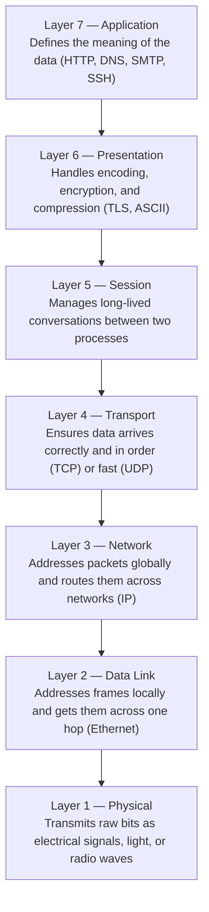

# Understand the OSI Model

> The OSI model is not a description of how networks actually work — it is a language for talking about which part of the stack is responsible for a given problem.

**Type:** Learn
**Languages:** Bash
**Prerequisites:** Phase 0, Lesson 02 — Capture Your First Packet
**Time:** ~30 minutes

## Learning Objectives
- Name all seven OSI layers and state the one-sentence job of each
- Map a real captured ping packet to the correct OSI layers
- Explain what "encapsulation" and "decapsulation" mean concretely
- Use the OSI model to narrow down where a networking problem is occurring
- Identify which tools (tcpdump, ip, curl) operate at which layers

## The Problem

When a network connection fails, the first question is always: *at which layer is the failure?* Is the cable unplugged (Layer 1)? Is the ARP table wrong (Layer 2)? Is the route missing (Layer 3)? Is the firewall blocking the port (Layer 4)? Is the TLS certificate invalid (Layer 6)?

Without a mental model that separates these concerns, troubleshooting becomes guesswork. You end up trying random fixes — restarting services, rebooting machines — because you have no systematic way to isolate the problem.

The OSI model gives you that systematic approach. It divides the network stack into seven layers, each with a clearly defined responsibility. When something breaks, you start at Layer 1 and work your way up until you find the layer where the behavior diverges from what you expect.

A common misconception: "The OSI model is how TCP/IP works." It is not. TCP/IP predates the OSI model and does not map perfectly to it. The OSI model is a *conceptual framework* — a vocabulary — not an implementation specification. This distinction matters because many people get confused when real protocols do not fit neatly into one layer.

## The Concept

### The Seven Layers

```
Layer  Name            Job (one sentence)
-----  --------------  ----------------------------------------------------------
  7    Application     Defines the meaning of the data (HTTP, DNS, SMTP, SSH).
  6    Presentation    Handles encoding, encryption, and compression (TLS, ASCII).
  5    Session         Manages long-lived conversations between two processes.
  4    Transport       Ensures data arrives correctly, in order (TCP), or fast (UDP).
  3    Network         Addresses packets globally and routes them across networks (IP).
  2    Data Link       Addresses frames locally and gets them across one hop (Ethernet).
  1    Physical        Transmits raw bits as electrical signals, light, or radio waves.
```

A memory trick: **Please Do Not Throw Sausage Pizza Away** (Physical, Data Link, Network, Transport, Session, Presentation, Application). Or going top-down: **All People Seem To Need Data Processing**.



### Encapsulation — Building the Packet from the Top Down

When your browser sends an HTTP request, each layer wraps the data from the layer above in its own header (and sometimes trailer):

```
Layer 7  HTTP GET /index.html
         |
         v
Layer 4  [TCP header] [HTTP GET /index.html]
         |
         v
Layer 3  [IP header] [TCP header] [HTTP GET /index.html]
         |
         v
Layer 2  [Ethernet header] [IP header] [TCP header] [HTTP GET /index.html] [Ethernet FCS]
         |
         v
Layer 1  10101010110101010... (bits on the wire)
```

Each header contains the information that layer needs to do its job:
- IP header: source and destination IP addresses
- TCP header: source and destination port numbers, sequence numbers
- Ethernet header: source and destination MAC addresses

### Decapsulation — Receiving End Strips Layers

The receiving machine does the reverse. The NIC handles Layer 1, the driver handles Layer 2, the kernel's IP stack handles Layer 3, the TCP stack handles Layer 4, and the application receives clean Layer 7 data.

```
Physical bits arrive at NIC
         |
         v Layer 1 → 2 transition
NIC driver reads Ethernet frame, checks destination MAC
"Is this for me? Yes." → strips Ethernet header
         |
         v Layer 2 → 3 transition
Kernel IP stack reads IP header, checks destination IP
"Is this for me? Yes." → strips IP header
         |
         v Layer 3 → 4 transition
TCP stack reads TCP header, finds port 80 is open
"Deliver to process listening on port 80." → strips TCP header
         |
         v Layer 4 → 7 transition
Application receives: "GET /index.html HTTP/1.1..."
```

### Mapping a Ping Packet to OSI Layers

The ping packet you captured in Lesson 02 only uses layers 1–3:

```
Layer 7  (Application)  → Not used by ping
Layer 6  (Presentation) → Not used by ping
Layer 5  (Session)      → Not used by ping
Layer 4  (Transport)    → Not used; ICMP goes directly in IP (no TCP/UDP)
Layer 3  (Network)      → IP header (TTL, source IP, dest IP, protocol=ICMP)
Layer 2  (Data Link)    → Ethernet header (MACs, EtherType=0x0800)
Layer 1  (Physical)     → Loopback "transmits" the bits (no real wire)
```

ICMP is technically a Layer 3 protocol — it rides directly inside IP packets and is used to report network-layer conditions (unreachable destinations, TTL expired, etc.).

### Which Tools Operate at Which Layer?

```
Tool       Primary Layer  What it touches
---------  -------------  ----------------------------------------
ping       L3             Sends ICMP echo requests, uses IP
tcpdump    L1–L7          Reads raw frames, can show any layer
ip addr    L2–L3          Interface MACs (L2) and IP addresses (L3)
ip route   L3             Kernel routing table
ss/netstat L4             TCP/UDP socket state
curl/wget  L7             HTTP, HTTPS (Application layer)
nmap       L3–L7          IP scanning through application fingerprinting
```

### The Layer Isolation Principle

This is the practical payoff of the OSI model: **each layer should be independently testable**.

If ping works (L3 is good) but a TCP connection fails (L4 problem), you know the issue is not routing — it is either a firewall, a missing service, or a TCP-level problem. You have just eliminated four layers of investigation with a single test.

```
Test                  What it proves (and what it rules out)
--------------------  -----------------------------------------
Cable link light on   Layer 1 is probably OK
ping gateway          Layer 1, 2, and 3 to the gateway are OK
ping remote host      Layer 1–3 end-to-end are OK
telnet host port      Layer 1–4 are OK (port is open and accepting)
curl http://host      Layer 1–7 (HTTP) are OK
curl https://host     Layer 1–7 including TLS negotiation are OK
```

## Build It

### Step 1 — Capture packets at each layer

Start a capture that shows verbose output:

```bash
sudo tcpdump -i lo -n -vv -c 4 &
ping -c 2 127.0.0.1
wait
```

The `-vv` flag makes tcpdump print details for all visible layers.

### Step 2 — Identify Layer 2 information

In the tcpdump output, Layer 2 information is shown for Ethernet captures. For loopback, the link type is `EN10MB (Ethernet)` even though there is no real wire:

```bash
sudo tcpdump -i lo -n -e -c 4 &
ping -c 2 127.0.0.1
wait
```

The `-e` flag adds the Ethernet source and destination MAC addresses to the output line. On loopback you will see `00:00:00:00:00:00` for both — confirming this is a software-only interface.

### Step 3 — Observe Layer 3 information

Layer 3 (IP) info is always visible in standard tcpdump output: source IP, destination IP, TTL, protocol. The `-v` flag shows TTL explicitly:

```bash
sudo tcpdump -i lo -n -v -c 2 &
ping -c 1 127.0.0.1
wait
```

Look for the line `ttl 64, proto ICMP (1)` — TTL is a Layer 3 concept, protocol number tells you what Layer 4 (or pseudo-layer-4) protocol is inside.

### Step 4 — Observe Layer 4 (TCP) by generating TCP traffic

```bash
# Start a simple listener
ncat -l 8765 &

# Generate a TCP connection — this shows Layer 4 (TCP) headers
sudo tcpdump -i lo -n -v -c 6 port 8765 &

echo "hello" | ncat 127.0.0.1 8765
wait
```

In the output you will see TCP-specific fields: flags `[S]` (SYN), `[S.]` (SYN-ACK), `[.]` (ACK), `[P.]` (Push+ACK), `[F.]` (FIN). These are Layer 4 constructs — connection state machine signals.

### Step 5 — Map what you saw to the OSI model

For the TCP capture, write out each layer and what you observed:

```
Layer 7 Application : the string "hello\n" sent as raw bytes
Layer 6 Presentation: no encoding/encryption (plain text)
Layer 5 Session     : ncat maintained the connection (one session)
Layer 4 Transport   : TCP SYN → SYN-ACK → ACK → PSH → FIN sequence
Layer 3 Network     : IP src=127.0.0.1 dst=127.0.0.1 ttl=64
Layer 2 Data Link   : Ethernet MAC 00:00:00:00:00:00 → 00:00:00:00:00:00
Layer 1 Physical    : loopback, no real wire
```

### Step 6 — Use the OSI model to isolate a problem

Simulate a problem: connect to a port that is not listening.

```bash
# Do NOT start a listener this time
sudo tcpdump -i lo -n -v -c 4 port 8766 &
ncat 127.0.0.1 8766
wait
```

You will see a TCP RST (reset) packet — `[R]` flag in tcpdump. This is a Layer 4 response meaning "no process is listening on that port." Layer 3 worked fine (the packet arrived), but Layer 4 rejected it.

## Exercises

1. **Layer mapping exercise** — Capture an HTTP request with `curl http://example.com` (requires internet). List every layer from 1 to 7 and what specific protocol or action occurs at each one for this request.

2. **Layer 1 simulation** — Bring down the loopback interface with `sudo ip link set lo down`, then try `ping 127.0.0.1`. Observe the error. Bring it back up with `sudo ip link set lo up`. What layer failed?

3. **Layer 3 routing failure** — Run `ip route show`. Delete the default route with `sudo ip route del default` (write it down first!). Try pinging an external IP. Restore the route. What OSI layer was responsible for the failure?

4. **OSI troubleshooting script** — Write a Bash script that runs one test per layer (1–4) and prints PASS or FAIL for each. For example: Layer 1 = check if interface is UP, Layer 2 = check if MAC is assigned, Layer 3 = ping, Layer 4 = TCP connect to port 80.

5. **Session vs Connection** — Research why Layer 5 (Session) and Layer 4 (Transport) seem to overlap in practice. Why does TCP's connection establishment feel like a session? What is the theoretical distinction the OSI model makes?

## Key Terms

| Term | What people say | What it actually means |
|------|----------------|------------------------|
| OSI model | "the 7-layer model" | A 1984 ISO standard that divides network communication into 7 abstract layers. It is a reference model, not an implementation — no real protocol perfectly follows it. |
| encapsulation | "wrapping" | The process of adding a header (and sometimes trailer) around data as it passes down the stack. Each layer adds its own control information without modifying the payload. |
| decapsulation | "unwrapping" | The reverse: each layer on the receiving side strips its header and passes the payload up to the next layer. |
| PDU | "the unit of data at a layer" | Protocol Data Unit. The specific name for data at each layer: bits (L1), frames (L2), packets (L3), segments (L4), data (L5–L7). |
| protocol stack | "the network stack" | The set of protocols that cooperate to implement all OSI layers on a real system. Linux's TCP/IP stack implements L1–L4; applications implement L5–L7. |
