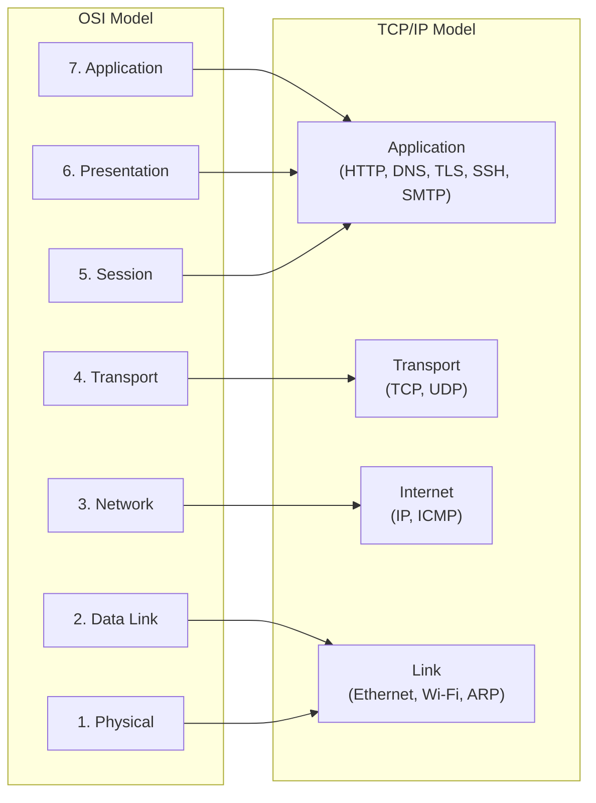

# Compare OSI vs TCP/IP

> The internet does not run on the OSI model — it runs on TCP/IP, which was designed a decade earlier and has different priorities.

**Type:** Learn
**Languages:** Bash
**Prerequisites:** Phase 0, Lesson 03 — Understand the OSI Model
**Time:** ~25 minutes

## Learning Objectives
- Draw the TCP/IP four-layer model and name each layer
- Place real protocols (Ethernet, IP, TCP, UDP, HTTP, DNS, TLS) in the correct TCP/IP layer
- Explain why the TCP/IP model and OSI model differ in layer count
- Identify where each model is used in practice
- Analyze a packet capture and label layers using both models

## The Problem

Most networking documentation uses the OSI model for explaining concepts, but most networking code, RFCs, and production systems use TCP/IP terminology. When an engineer says "it is a Layer 3 problem," they might mean OSI Layer 3 (Network/IP), but when they talk to a developer, the developer might be thinking about TCP/IP's Internet layer.

This vocabulary confusion causes real miscommunication. Someone says "this is a transport problem" — do they mean TCP/UDP (OSI L4 = TCP/IP Transport), or do they mean something at the IP level (OSI L3 = TCP/IP Internet)?

There is no "correct" model. Both are valid. The OSI model is better for educational purposes because it separates concerns more finely. The TCP/IP model is better for implementation because it maps directly to real protocols and the Linux kernel's actual architecture.

This lesson teaches you both models and — crucially — shows you where they agree and where they diverge.

## The Concept

### The TCP/IP Four-Layer Model

```
TCP/IP Layer     OSI Equivalent     Protocols
---------------  -----------------  ----------------------------------------
Application      L5 + L6 + L7       HTTP, HTTPS, DNS, SSH, SMTP, FTP, NTP,
                                    TLS, IMAP, DHCP, SNMP, WebSocket
Transport        L4                 TCP, UDP, SCTP
Internet         L3                 IP (v4 and v6), ICMP, IGMP
Link             L1 + L2            Ethernet, Wi-Fi (802.11), ARP, PPP
```

Notice: TCP/IP squashes seven OSI layers into four. The big collapses are:
- OSI L1 (Physical) + L2 (Data Link) → TCP/IP Link layer
- OSI L5 (Session) + L6 (Presentation) + L7 (Application) → TCP/IP Application layer

### Side-by-Side Comparison

```
OSI Model              TCP/IP Model         Real Protocols
---------------------  -------------------  --------------------------
7. Application    ─┐
6. Presentation    ├─> Application          HTTP, DNS, TLS, SSH, SMTP
5. Session        ─┘
4. Transport      ────> Transport           TCP, UDP
3. Network        ────> Internet            IP, ICMP, OSPF, BGP
2. Data Link      ─┐
1. Physical       ─┴─> Link                Ethernet, Wi-Fi, ARP
```



### Where Does Each Protocol Live?

Let's place specific protocols precisely:

**Link layer (TCP/IP) / L1+L2 (OSI)**
- Ethernet: defines frame format, MAC addressing, CSMA/CD
- Wi-Fi (802.11): wireless frame format, SSID, channels
- ARP (Address Resolution Protocol): translates IP addresses to MAC addresses
- PPP: point-to-point protocol for dial-up / WAN links
- MPLS: label-switched paths in carrier networks

**Internet layer (TCP/IP) / L3 (OSI)**
- IPv4: 32-bit addressing, fragmentation, TTL, routing
- IPv6: 128-bit addressing, flow labels, extension headers
- ICMP: error reporting (ping, traceroute, destination unreachable)
- OSPF, BGP, RIP: routing protocols (technically run over IP but are considered L3)

**Transport layer (TCP/IP) / L4 (OSI)**
- TCP: connection-oriented, reliable, ordered, flow-controlled
- UDP: connectionless, unreliable, fast, low-overhead
- SCTP: stream control transmission (used in telecom)
- QUIC: runs over UDP but adds reliability (used by HTTP/3)

**Application layer (TCP/IP) / L5–L7 (OSI)**
- HTTP/1.1, HTTP/2, HTTP/3: web content transfer
- TLS (Transport Layer Security): encryption (OSI would call this L6)
- DNS: domain name resolution
- SSH: secure shell, encrypted remote access
- SMTP/IMAP/POP3: email transfer and retrieval
- DHCP: automatic IP address assignment
- NTP: network time synchronization

### A Common Source of Confusion: Where is TLS?

TLS is a classic example of the OSI model's imperfection. In OSI terms, TLS is "Layer 6" (Presentation) because it handles encryption and format transformation. But in TCP/IP terms, TLS runs inside the Application layer — there is no dedicated Presentation layer.

In practice, you will hear TLS called both "Layer 6" and "Application layer security" depending on who you ask. Both are acceptable. What matters is understanding what TLS actually does: it wraps any application protocol (HTTP becomes HTTPS, SMTP becomes SMTPS) in an encrypted tunnel that sits between TCP and the application.

```
Without TLS:
[Ethernet][IP][TCP][HTTP data]

With TLS:
[Ethernet][IP][TCP][TLS record][HTTP data encrypted]
```

### Why Does Any of This Matter?

The layer boundaries define where responsibility ends and begins:

- An IP router operates at the Internet layer — it reads IP headers but does not look inside TCP or HTTP. This is why a router can forward packets without understanding the applications that use them.
- A firewall that inspects TCP ports operates at the Transport layer. A "deep packet inspection" firewall that reads HTTP operates at the Application layer.
- A load balancer that distributes based on HTTP Host headers operates at the Application layer (Layer 7 load balancer). One that distributes based on TCP ports is a Layer 4 load balancer.

These distinctions affect performance, cost, and capability. Layer 4 load balancers are faster (less parsing). Layer 7 load balancers are smarter (can route based on URL paths).

## Build It

### Step 1 — Identify protocols at each TCP/IP layer in a capture

Run a capture that generates all four TCP/IP layers:

```bash
# Terminal 1: start capture
sudo tcpdump -i lo -n -vv -c 10 &

# Terminal 2: generate HTTP-ish traffic
ncat -l 8080 &
curl -s http://127.0.0.1:8080/ &

# Wait for packets
sleep 2
sudo pkill tcpdump
sudo pkill ncat
```

In the output, identify:
- **Link layer**: the `EN10MB (Ethernet)` link type header
- **Internet layer**: the `IP (tos ..., ttl 64, id ..., proto TCP)` line
- **Transport layer**: the TCP flags `[S]`, `[S.]`, `[.]`, `[P.]`
- **Application layer**: the HTTP GET request bytes (visible after the TCP handshake)

### Step 2 — Check where specific tools operate

Run each tool and observe which layers it touches:

```bash
# Layer 3 tool: ping uses ICMP (Internet layer)
ping -c 1 127.0.0.1

# Layer 4 tool: ss shows TCP/UDP socket state (Transport layer)
ss -tnp

# Layer 3-4 tool: traceroute uses UDP + ICMP TTL expired
traceroute 127.0.0.1 2>/dev/null || echo "(traceroute not installed)"

# Layer 7 tool: curl speaks HTTP (Application layer)
curl -I http://example.com 2>/dev/null | head -5
```

### Step 3 — Observe TCP's three-way handshake (Transport layer)

The TCP handshake is a pure Layer 4 (Transport) operation:

```bash
# Start listener
ncat -l 9090 &

# Capture the handshake
sudo tcpdump -i lo -n -v port 9090 -c 6 &

# Connect (send "quit" immediately to end cleanly)
echo quit | ncat 127.0.0.1 9090

# Wait and kill
sleep 1
sudo pkill tcpdump
wait 2>/dev/null
```

In the output you should see:
```
SYN     →     (client initiates: "I want to connect")
SYN-ACK ←     (server responds: "OK, I acknowledge")
ACK     →     (client confirms: "Connection established")
```

This is purely Layer 4 work. The IP layer (Layer 3) delivered the packets — it does not know or care that a connection is being established.

### Step 4 — Identify QUIC as a cross-layer example

QUIC is a modern protocol that blurs the TCP/IP model boundaries:

```bash
# Install curl with HTTP/3 support (if available) or just check headers
curl -sv https://www.google.com 2>&1 | grep -i "alt-svc\|h3\|quic" | head -5
```

If you see `alt-svc: h3=":443"` in the response headers, that server supports HTTP/3 over QUIC. QUIC runs over UDP (Transport layer) but re-implements connection reliability internally (Application layer concern). This violates the OSI model's clean separation — which is fine. The OSI model is a guide, not a constraint.

## Exercises

1. **Protocol placement quiz** — For each protocol, state which TCP/IP layer it belongs to and which OSI layer(s) it maps to: DNS, ARP, ICMP, TLS, SSH, DHCP, VLAN tagging (802.1Q), QUIC.

2. **Layer 4 vs Layer 7 load balancing** — Research what an "L4 load balancer" and "L7 load balancer" actually do differently. Which one can route requests based on the URL path `/api/` vs `/static/`? Why?

3. **Capture and annotate** — Capture 10 packets from any network activity. For each unique protocol seen in the output, write which TCP/IP layer it operates at.

4. **RFC archaeology** — Look up RFC 793 (TCP) and RFC 791 (IP). In the introduction of each RFC, find where the protocol places itself relative to other protocols. What does TCP call the layer below it?

5. **Where does NAT fit?** — NAT (Network Address Translation) modifies IP addresses and port numbers in transit. It touches both IP headers (Internet layer) and TCP/UDP headers (Transport layer). Research what problem this causes for end-to-end connectivity and which protocols are broken by NAT.

## Key Terms

| Term | What people say | What it actually means |
|------|----------------|------------------------|
| TCP/IP model | "the internet model" | A four-layer reference model (Link, Internet, Transport, Application) that describes how the internet actually works. Less granular than OSI but more accurate to real implementations. |
| Internet layer | "Layer 3 in TCP/IP" | The TCP/IP layer responsible for end-to-end packet delivery across networks. IP is the primary protocol. Roughly equivalent to OSI Layer 3 (Network). |
| Link layer | "Layer 1+2 in TCP/IP" | The TCP/IP layer responsible for getting a frame from one node to the next on a single network segment. Includes both the physical medium and the framing protocol (e.g., Ethernet). |
| QUIC | "HTTP/3's transport" | A transport protocol developed by Google that runs over UDP and implements reliable, ordered, multiplexed streams with built-in TLS. Used by HTTP/3. Shows that modern protocols do not fit neatly into classic layer models. |
| deep packet inspection | "DPI" | Firewall/router technique that reads beyond Layer 3/4 headers into application-layer content. Can detect HTTP methods, DNS queries, TLS SNI hostnames, etc. Operates at the Application layer. |
