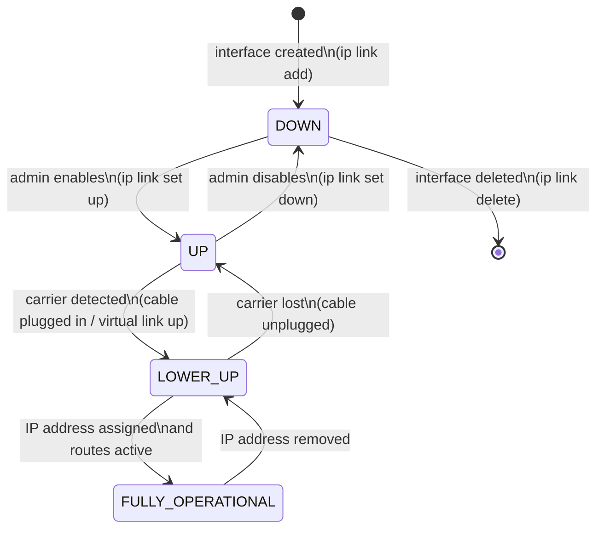

# Explore Network Interfaces

> Every packet that enters or leaves your machine passes through a network interface — and the kernel tracks the state of each interface with a data structure you can read and modify in real time.

**Type:** Build
**Languages:** Bash
**Prerequisites:** Phase 0, Lesson 01 — Set Up a Linux Networking Lab
**Time:** ~35 minutes

## Learning Objectives
- Use `ip addr` and `ip link` to list all network interfaces and their properties
- Interpret the output: UP/DOWN state, MAC address, IP address, flags
- Create and delete a virtual (dummy) network interface
- Bring an interface up and down and observe the kernel state change
- Understand why the kernel tracks interfaces separately from IP addresses

## The Problem

When a packet arrives at your machine, the kernel needs to know: which interface did it come from, is that interface active, what is the IP address associated with it, and which routing table entry should handle the packet's destination?

All of this is tracked per interface. An interface is not just a physical NIC — it is an abstraction. The kernel can have dozens of interfaces: physical Ethernet cards, Wi-Fi adapters, loopback, virtual bridges, VPN tunnels, VLAN subinterfaces, Docker network interfaces, and more.

Misconfigured interfaces cause silent failures. If you assign an IP address to the wrong interface, or if the interface is in the DOWN state, packets will be dropped with no error message. The `ip` command is your window into the kernel's interface database — you need to be fluent in reading its output.

The older tool for this job was `ifconfig` (from the `net-tools` package). It still works, but `ifconfig` has been deprecated since 2009. It cannot show all the information the kernel tracks, and it does not support modern Linux networking features like network namespaces and VRFs. This course uses `iproute2` exclusively.

## The Concept

### What Is a Network Interface?

A network interface is a kernel object that represents a point where packets enter or leave the system. It has:

```
Property           Example             Where it lives
-----------------  ------------------  --------------------------------
Name               eth0, lo, wlan0     Kernel interface table
Index              1, 2, 3...          Unique integer ID in kernel
MAC address        aa:bb:cc:dd:ee:ff   L2 address of this interface
MTU                1500 bytes          Maximum Transmission Unit
Flags/state        UP, LOWER_UP, etc.  Current operational state
IP address(es)     192.168.1.10/24     Assigned to the interface
```

One interface can have multiple IP addresses. Multiple interfaces can be on the same machine. The kernel routes packets to the correct interface based on the destination IP and the routing table.

### Reading `ip link show`

The `ip link` command shows Layer 2 information — the link layer (Ethernet, MAC, MTU, state):

```
2: eth0: <BROADCAST,MULTICAST,UP,LOWER_UP> mtu 1500 qdisc fq_codel state UP
    link/ether aa:bb:cc:dd:ee:ff brd ff:ff:ff:ff:ff:ff
```

Breaking this down:

```
2:                     Interface index (unique kernel ID)
eth0:                  Interface name
<BROADCAST,MULTICAST,  Capability flags:
 UP,LOWER_UP>            BROADCAST: can send broadcast frames
                          MULTICAST: can send multicast frames
                          UP: administratively enabled (you set this)
                          LOWER_UP: physical link is detected (cable is in)
mtu 1500               Maximum Transmission Unit (bytes per frame)
qdisc fq_codel         Queuing discipline (traffic shaping)
state UP               Operational state
link/ether             Link type = Ethernet
aa:bb:cc:dd:ee:ff      MAC address
brd ff:ff:ff:ff:ff:ff  Broadcast address for this link type
```

### Reading `ip addr show`

`ip addr` shows Layer 3 information on top of Layer 2 — IP addresses assigned to each interface:

```
2: eth0: <BROADCAST,MULTICAST,UP,LOWER_UP> mtu 1500 ...
    link/ether aa:bb:cc:dd:ee:ff brd ff:ff:ff:ff:ff:ff
    inet 192.168.1.10/24 brd 192.168.1.255 scope global dynamic eth0
       valid_lft 86312sec preferred_lft 86312sec
    inet6 fe80::a8bb:ccdd:eeff:1234/64 scope link
       valid_lft forever preferred_lft forever
```

New fields:
```
inet                   IPv4 address family
192.168.1.10/24        IP address / prefix length (subnet mask)
brd 192.168.1.255      Broadcast address for this subnet
scope global           This address is reachable globally
scope link             This address is only valid on this link (link-local)
dynamic                Address assigned by DHCP (will expire)
valid_lft 86312sec     How long until the address expires
inet6 fe80::.../64     IPv6 link-local address (always present on UP interfaces)
```

### Interface State: UP vs DOWN vs LOWER_UP

The state of an interface involves two independent bits:

```
Flag          Controlled by      Meaning
-----------   ----------------   -----------------------------------------
UP            Administrator      "I want this interface active"
              (you, or dhcpd)    Set with: sudo ip link set eth0 up
                                 Cleared with: sudo ip link set eth0 down

LOWER_UP      Physical layer     "The cable is plugged in and carrier is detected"
              (kernel, NIC)      Cannot be set manually — reflects hardware state
```

An interface can be UP but not LOWER_UP (administratively enabled but no cable connected). Or LOWER_UP but not UP (cable is in but you have not enabled it). Only when both are set is the interface fully operational.



### Dummy Interfaces — Virtual NICs for Testing

The Linux kernel includes a `dummy` driver that creates a virtual interface with no physical backing. A dummy interface behaves like a normal NIC but discards all outgoing traffic. It is useful for:
- Testing network configuration without hardware
- Adding secondary IP addresses for services
- Simulating multiple network hosts on one machine

## Build It

### Step 1 — List all interfaces

```bash
ip link show
```

On a typical Linux machine you will see:
```
1: lo: <LOOPBACK,UP,LOWER_UP> mtu 65536 qdisc noqueue state UNKNOWN
    link/loopback 00:00:00:00:00:00 brd 00:00:00:00:00:00
2: eth0: <BROADCAST,MULTICAST,UP,LOWER_UP> mtu 1500 qdisc fq_codel state UP
    link/ether aa:bb:cc:dd:ee:ff brd ff:ff:ff:ff:ff:ff
```

Note the loopback MTU is 65536 — loopback does not have the 1500-byte Ethernet limit because it is not real hardware. You can send 64KB packets to yourself.

### Step 2 — Show IP addresses on all interfaces

```bash
ip addr show
```

To show only a specific interface:
```bash
ip addr show lo
ip addr show eth0
```

### Step 3 — Show brief one-line status

```bash
ip -brief link show
```

Output format: `INTERFACE    STATE    MAC-ADDRESS`
```
lo               UNKNOWN        00:00:00:00:00:00
eth0             UP             aa:bb:cc:dd:ee:ff
```

```bash
ip -brief addr show
```

Output: `INTERFACE    STATE    IPv4-ADDRESS   IPv6-ADDRESS`

### Step 4 — Load the dummy kernel module

```bash
sudo modprobe dummy
```

This loads the kernel module that provides the dummy interface driver. Verify it loaded:

```bash
lsmod | grep dummy
# Expected: dummy    16384  0
```

### Step 5 — Create a dummy interface

```bash
sudo ip link add dev dummy0 type dummy
```

Verify it was created:
```bash
ip link show dummy0
```

Expected output:
```
3: dummy0: <BROADCAST,NOARP> mtu 1500 qdisc noop state DOWN
    link/ether 6a:7b:8c:9d:ae:bf brd ff:ff:ff:ff:ff:ff
```

The interface is DOWN (not yet brought up) and has a random MAC address assigned by the kernel.

### Step 6 — Bring the interface UP

```bash
sudo ip link set dummy0 up
```

Verify the state change:
```bash
ip link show dummy0
```

The flags should now include `UP` and the state line should show `UNKNOWN` (because there is no real physical carrier — no cable — but it is administratively up).

### Step 7 — Assign an IP address

```bash
sudo ip addr add 10.99.0.1/24 dev dummy0
```

Verify the assignment:
```bash
ip addr show dummy0
```

Expected:
```
3: dummy0: <BROADCAST,NOARP,UP,LOWER_UP> mtu 1500 qdisc noqueue state UNKNOWN
    link/ether 6a:7b:8c:9d:ae:bf brd ff:ff:ff:ff:ff:ff
    inet 10.99.0.1/24 scope global dummy0
       valid_lft forever preferred_lft forever
```

### Step 8 — Test the interface

```bash
ping -c 2 10.99.0.1
```

The kernel routes packets to `10.99.0.1` through the `dummy0` interface, which loops them back. You should get replies.

Also check that the route was automatically added:
```bash
ip route show
# Should include: 10.99.0.0/24 dev dummy0 proto kernel scope link src 10.99.0.1
```

The kernel automatically adds a route for the subnet when you assign an IP address.

### Step 9 — Bring the interface DOWN and observe

```bash
sudo ip link set dummy0 down
```

Now try to ping:
```bash
ping -c 2 10.99.0.1
```

You should get `Network is unreachable` or the ping will fail. Check the route table:
```bash
ip route show
```

The route for `10.99.0.0/24` has disappeared — the kernel removes routes associated with a DOWN interface.

### Step 10 — Clean up: delete the interface

```bash
sudo ip link delete dummy0
```

Verify it is gone:
```bash
ip link show dummy0
# Expected: Device "dummy0" does not exist.
```

## Exercises

1. **Interface inventory** — Run `ip -brief link show` and `ip -brief addr show`. For each interface, explain: what type is it (physical, loopback, virtual), what state is it in, and what IP address is assigned.

2. **Multiple addresses on one interface** — Create a dummy interface and add three different IP addresses to it (`10.1.0.1/24`, `10.1.0.2/24`, `10.1.0.3/24`). Ping all three. Check the routing table. Delete the interface when done.

3. **MTU experiment** — The default MTU is 1500 bytes. Set a custom MTU on a dummy interface: `sudo ip link set dummy0 mtu 9000`. This is called "jumbo frames." Check the new MTU with `ip link show dummy0`. Try sending a large ping: `ping -s 8972 10.99.0.1` (the `-s` flag sets data size). Does it work?

4. **MAC address change** — Change the MAC address of a dummy interface:
   ```bash
   sudo ip link set dummy0 address aa:bb:cc:11:22:33
   ```
   Why would you ever want to change a MAC address? (Research: DHCP fingerprinting, VM migrations, privacy MAC addresses in modern OS).

5. **Scripted setup** — Write a Bash script that creates a dummy interface named `lab0`, assigns it `192.168.99.1/24`, brings it up, pings it once, and then tears everything down. The script should print PASS or FAIL for the ping test.

## Key Terms

| Term | What people say | What it actually means |
|------|----------------|------------------------|
| network interface | "NIC", "network card" | A kernel object representing a point where packets enter or leave the system. Can be a physical NIC, virtual interface, tunnel, bridge, or loopback. |
| MTU | "max packet size" | Maximum Transmission Unit. The largest L2 frame (payload bytes) that can be sent on an interface without fragmentation. Standard Ethernet MTU is 1500 bytes. |
| UP flag | "interface is on" | An administrative bit the operator sets to enable an interface. Does not mean the physical link is working — for that, you need LOWER_UP as well. |
| LOWER_UP flag | "cable is plugged in" | A flag the kernel sets automatically when the physical layer detects a carrier (electrical signal on the wire). Cannot be set manually. |
| dummy interface | "fake NIC" | A Linux kernel virtual interface that accepts configuration (IP addresses, routes) but discards all outgoing traffic. Useful for testing and as a stable address anchor. |
| iproute2 | "the ip command suite" | A set of Linux utilities (`ip`, `ss`, `tc`, `bridge`) that replaced the deprecated `net-tools` package (`ifconfig`, `route`, `netstat`). Directly interfaces with the kernel's Netlink socket API. |
