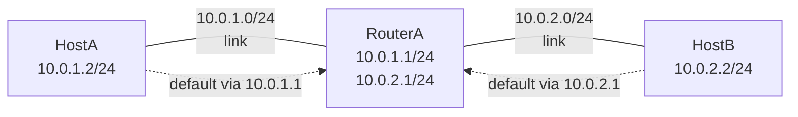

# Configure Static Routes

> Two machines on different subnets cannot talk — not because of a firewall, but because neither knows how to reach the other's network. A single route entry fixes that.

**Type:** Build
**Languages:** Bash
**Prerequisites:** Phase 2, Lesson 02 — Subnet a Network by Hand
**Time:** ~45 minutes

## Learning Objectives
- Explain what a routing table entry contains and how a router selects the best match
- Use Linux network namespaces to create isolated virtual routers without hardware
- Configure IP addresses on virtual interfaces with `ip addr`
- Add and inspect static routes with `ip route`
- Verify connectivity end-to-end with `ping` and diagnose failures with `ip route get`

## The Problem

You have two subnets: `10.0.1.0/24` (the server network) and `10.0.2.0/24` (the workstation network). A host on the workstation network tries to reach a server. The packet leaves the workstation, goes to the gateway, but then what? Without a route entry telling the gateway "10.0.2.0/24 is reachable via this interface", the packets go nowhere.

Static routing is the foundation of all routing. Dynamic protocols (OSPF, BGP) are just automated ways to insert the same route entries that you will add by hand in this lesson. Every time you `ip route add` you are doing exactly what BGP or OSPF would do, just manually.

## The Concept



### What is a routing table?

A routing table is a list of rules. Each rule says: "to reach network X, send packets to next-hop Y via interface Z". When a packet arrives, the kernel looks up the destination address in the routing table and picks the most specific match (longest prefix match).

```
Routing table on a typical Linux host:

Destination     Gateway         Mask            Interface
10.0.1.0        -               255.255.255.0   eth0      (directly connected)
10.0.2.0        10.0.1.254      255.255.255.0   eth0      (via router)
0.0.0.0         192.168.1.1     0.0.0.0         eth1      (default route)
```

"Directly connected" means the kernel does not need a gateway — it can send an ARP request on that interface and reach any host in the network directly.

### Longest prefix match

When multiple routes could match a destination, the router picks the one with the **longest prefix** (most specific match):

```
Destination:  10.0.1.55

Routing table:
  10.0.0.0/8    → gateway A   (matches — 8 bits)
  10.0.1.0/24   → gateway B   (matches — 24 bits, more specific)
  0.0.0.0/0     → gateway C   (matches everything — 0 bits)

Winner: 10.0.1.0/24 (longest match = most specific)
```

### Network namespaces

Linux **network namespaces** are isolated copies of the kernel's network stack — each has its own interfaces, routing table, firewall rules, and sockets. Processes inside a namespace can only communicate through interfaces visible in that namespace.

This lets us build a multi-router topology on a single laptop with no hardware:

```
Topology:
                       
  [host-A]          [router-R]          [host-B]
  ns: hostA         ns: router          ns: hostB
  10.0.1.2/24       10.0.1.1/24         10.0.2.2/24
        |           10.0.2.1/24               |
        |                |                    |
        +--- veth-a1 ----+--- veth-b1 --------+
             veth-r1          veth-r2
```

A **veth pair** is a virtual Ethernet cable: packets sent into one end come out the other. We create one veth pair per link and move each end into the appropriate namespace.

### The `ip` command

The `ip` command is the Swiss Army knife of Linux networking. Key subcommands:

```bash
ip netns add NAME           # create a namespace
ip netns exec NAME CMD      # run CMD inside namespace NAME
ip link add NAME type veth peer name PEER  # create a veth pair
ip link set NAME netns NS   # move interface into namespace
ip addr add A.B.C.D/N dev IF   # assign an IP address
ip link set IF up           # bring interface up
ip route add NET/PREFIX via GW # add a static route
ip route show               # show the routing table
ip route get A.B.C.D        # show which route would be used for an IP
```

### IP forwarding

By default, Linux does **not forward packets** between interfaces. A host receiving a packet not addressed to itself will drop it. To act as a router, you must enable IP forwarding:

```bash
sysctl -w net.ipv4.ip_forward=1
# or inside a namespace:
ip netns exec router sysctl -w net.ipv4.ip_forward=1
```

## Build It

We will build this topology entirely with shell commands. Run as root (or with `sudo`).

```bash
#!/usr/bin/env bash
# static_route_lab.sh — two-subnet topology with a router namespace
#
# Topology:
#
#   hostA (10.0.1.2/24) ---- router (10.0.1.1/24 | 10.0.2.1/24) ---- hostB (10.0.2.2/24)
#
# After setup, hostA can ping hostB across the router.
#
# Usage: sudo bash static_route_lab.sh [setup|teardown|test]

set -euo pipefail

ACTION="${1:-setup}"

# ── namespace and interface names ─────────────────────────────────────────────
NS_A="hostA"
NS_R="router"
NS_B="hostB"

VETH_A="veth-a"     # hostA end of A–router link
VETH_R1="veth-r1"  # router end of A–router link
VETH_B="veth-b"    # hostB end of B–router link
VETH_R2="veth-r2"  # router end of B–router link

IP_A="10.0.1.2"
IP_R1="10.0.1.1"
IP_R2="10.0.2.1"
IP_B="10.0.2.2"
PREFIX=24


teardown() {
    echo "=== Tearing down namespaces and interfaces ==="
    # Delete namespaces (this also deletes all interfaces inside them)
    for ns in "$NS_A" "$NS_R" "$NS_B"; do
        ip netns del "$ns" 2>/dev/null && echo "  Deleted namespace: $ns" || true
    done
    # veth pairs in the root namespace (if teardown was partial)
    ip link del "$VETH_A"  2>/dev/null || true
    ip link del "$VETH_B"  2>/dev/null || true
    echo "=== Done ==="
}


setup() {
    echo "=== Creating network namespaces ==="
    ip netns add "$NS_A"
    ip netns add "$NS_R"
    ip netns add "$NS_B"
    echo "  Created: $NS_A, $NS_R, $NS_B"


    echo "=== Creating veth pairs ==="
    # Pair 1: hostA <-> router
    # Both ends start in the root namespace; we move one end to each target namespace.
    ip link add "$VETH_A" type veth peer name "$VETH_R1"
    ip link set "$VETH_A"  netns "$NS_A"   # move hostA end into hostA namespace
    ip link set "$VETH_R1" netns "$NS_R"   # move router end into router namespace

    # Pair 2: hostB <-> router
    ip link add "$VETH_B" type veth peer name "$VETH_R2"
    ip link set "$VETH_B"  netns "$NS_B"
    ip link set "$VETH_R2" netns "$NS_R"
    echo "  Created veth pairs and moved into namespaces"


    echo "=== Configuring hostA ($NS_A) ==="
    ip netns exec "$NS_A" ip link set lo up
    ip netns exec "$NS_A" ip link set "$VETH_A" up
    ip netns exec "$NS_A" ip addr add "${IP_A}/${PREFIX}" dev "$VETH_A"
    # Default route via the router (10.0.1.1)
    ip netns exec "$NS_A" ip route add default via "$IP_R1"
    echo "  $NS_A: $VETH_A → ${IP_A}/${PREFIX}, default via $IP_R1"


    echo "=== Configuring router ($NS_R) ==="
    ip netns exec "$NS_R" ip link set lo up
    ip netns exec "$NS_R" ip link set "$VETH_R1" up
    ip netns exec "$NS_R" ip link set "$VETH_R2" up
    ip netns exec "$NS_R" ip addr add "${IP_R1}/${PREFIX}" dev "$VETH_R1"
    ip netns exec "$NS_R" ip addr add "${IP_R2}/${PREFIX}" dev "$VETH_R2"
    # Enable IP forwarding in the router namespace — THIS IS THE CRITICAL STEP
    ip netns exec "$NS_R" sysctl -qw net.ipv4.ip_forward=1
    echo "  $NS_R: $VETH_R1 → ${IP_R1}/${PREFIX}, $VETH_R2 → ${IP_R2}/${PREFIX}"
    echo "  $NS_R: IP forwarding ENABLED"


    echo "=== Configuring hostB ($NS_B) ==="
    ip netns exec "$NS_B" ip link set lo up
    ip netns exec "$NS_B" ip link set "$VETH_B" up
    ip netns exec "$NS_B" ip addr add "${IP_B}/${PREFIX}" dev "$VETH_B"
    # Default route via the router (10.0.2.1)
    ip netns exec "$NS_B" ip route add default via "$IP_R2"
    echo "  $NS_B: $VETH_B → ${IP_B}/${PREFIX}, default via $IP_R2"


    echo ""
    echo "=== Setup complete! ==="
    echo ""
    echo "Run: sudo bash static_route_lab.sh test"
}


test_connectivity() {
    echo "=== Routing tables ==="
    echo "--- $NS_A ---"
    ip netns exec "$NS_A" ip route show

    echo "--- $NS_R ---"
    ip netns exec "$NS_R" ip route show

    echo "--- $NS_B ---"
    ip netns exec "$NS_B" ip route show

    echo ""
    echo "=== Connectivity tests ==="

    echo -n "hostA → router (${IP_R1}): "
    if ip netns exec "$NS_A" ping -c 1 -W 1 "$IP_R1" > /dev/null 2>&1; then
        echo "OK"
    else
        echo "FAILED"
    fi

    echo -n "hostB → router (${IP_R2}): "
    if ip netns exec "$NS_B" ping -c 1 -W 1 "$IP_R2" > /dev/null 2>&1; then
        echo "OK"
    else
        echo "FAILED"
    fi

    echo -n "hostA → hostB (${IP_B}) via router: "
    if ip netns exec "$NS_A" ping -c 1 -W 2 "$IP_B" > /dev/null 2>&1; then
        echo "OK"
    else
        echo "FAILED"
    fi

    echo -n "hostB → hostA (${IP_A}) via router: "
    if ip netns exec "$NS_B" ping -c 1 -W 2 "$IP_A" > /dev/null 2>&1; then
        echo "OK"
    else
        echo "FAILED"
    fi

    echo ""
    echo "=== Route lookup ==="
    echo -n "hostA route to ${IP_B}: "
    ip netns exec "$NS_A" ip route get "$IP_B"
}


case "$ACTION" in
    setup)    setup ;;
    teardown) teardown ;;
    test)     test_connectivity ;;
    *)
        echo "Usage: sudo bash static_route_lab.sh [setup|teardown|test]"
        exit 1
        ;;
esac
```

Run the lab:

```bash
sudo bash static_route_lab.sh setup
sudo bash static_route_lab.sh test
```

Expected test output:

```
=== Routing tables ===
--- hostA ---
10.0.1.0/24 dev veth-a proto kernel scope link src 10.0.1.2
default via 10.0.1.1 dev veth-a

--- router ---
10.0.1.0/24 dev veth-r1 proto kernel scope link src 10.0.1.1
10.0.2.0/24 dev veth-r2 proto kernel scope link src 10.0.2.1

--- hostB ---
10.0.2.0/24 dev veth-b proto kernel scope link src 10.0.2.2
default via 10.0.2.1 dev veth-b

=== Connectivity tests ===
hostA → router (10.0.1.1): OK
hostB → router (10.0.2.1): OK
hostA → hostB (10.0.2.2) via router: OK
hostB → hostA (10.0.1.2) via router: OK

=== Route lookup ===
hostA route to 10.0.2.2:
10.0.2.2 via 10.0.1.1 dev veth-a src 10.0.1.2
```

Clean up:

```bash
sudo bash static_route_lab.sh teardown
```

### What would happen without IP forwarding?

If you remove the `ip_forward=1` line and re-run the setup, the `hostA → hostB` ping fails even though the routes are correct. The packet reaches the router, but the router's kernel drops it because forwarding is disabled. Run:

```bash
# After setup, temporarily disable forwarding in the router namespace
sudo ip netns exec router sysctl -qw net.ipv4.ip_forward=0
sudo bash static_route_lab.sh test
# hostA → hostB will now fail
sudo ip netns exec router sysctl -qw net.ipv4.ip_forward=1
```

This is a very common mistake in real environments: the routing table is correct but packets are still dropped because forwarding is disabled.

## Exercises

1. **Add a third subnet.** Extend the lab with a third namespace `hostC` on `10.0.3.0/24`. Add a third veth pair to the router. Add the appropriate routes so all three hosts can ping each other.

2. **Asymmetric routing.** Remove the default route from `hostB`. What happens when `hostA` pings `hostB`? The ping reaches `hostB` (via the router), but the reply from `hostB` has no route back to `hostA`. Observe the behaviour with `ping -c 3` and explain why some packets may succeed or fail.

3. **Route metrics.** Add a second path between hostA and hostB (a second veth pair via a second router namespace). Add both routes with different metrics (`ip route add ... metric 100` and `metric 200`). Verify that the lower-metric route is preferred, and that traffic falls back to the higher-metric route if the primary link goes down (`ip link set IF down`).

4. **Inspect with traceroute.** After setup, run `ip netns exec hostA traceroute -n 10.0.2.2`. You should see one hop (the router at 10.0.1.1) before the destination. Does that match what you expect?

5. **Blackhole route.** Add `ip netns exec hostA ip route add 10.99.0.0/24 blackhole`. Ping `10.99.0.1` from hostA. What ICMP error do you get? This is how network operators block specific prefixes.

## Key Terms

| Term | What people say | What it actually means |
|------|----------------|------------------------|
| Routing table | "The route table" | An ordered list of (network, prefix, next-hop, interface) entries; the kernel consults it for every forwarded packet |
| Next hop | "The gateway" | The IP address of the next router to send a packet to when the destination is not directly connected |
| Default route | "The 0.0.0.0/0 route" | A catch-all route (prefix length 0) that matches any destination; used when no more specific route exists |
| Longest prefix match | "Most specific route wins" | The routing algorithm that selects the matching entry with the most network bits specified |
| Network namespace | "A virtual network stack" | A Linux kernel feature that provides an isolated copy of routing table, interfaces, and firewall rules per namespace |
| veth pair | "Virtual cable" | A pair of virtual Ethernet interfaces connected back-to-back; packets entering one end emerge from the other |
| IP forwarding | "Routing enabled" | A kernel parameter (net.ipv4.ip_forward) that must be set to 1 for a Linux host to forward packets between interfaces |
