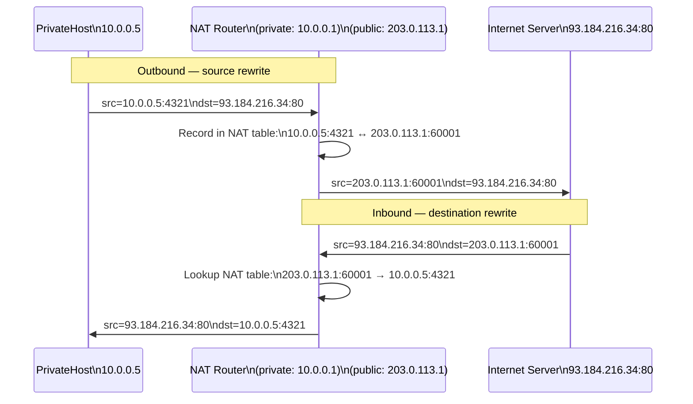

# Understand NAT and Private Addresses

> Your home has one public IP but ten devices. NAT is the trick that makes that possible — and once you see how it rewrites addresses, every "connection refused" and "NAT hole-punching" problem becomes obvious.

**Type:** Build
**Languages:** Bash
**Prerequisites:** Phase 2, Lesson 05 — Configure Static Routes
**Time:** ~40 minutes

## Learning Objectives
- Explain why RFC 1918 private addresses exist and why they cannot be routed on the public internet
- Describe how NAPT (NAT with port translation) allows many private hosts to share one public IP
- Configure `iptables MASQUERADE` to implement outbound NAT in a Linux namespace topology
- Observe address translation in action using `conntrack` and `tcpdump`
- Identify the limitations of NAT and why it breaks certain protocols

## The Problem

IPv4 has roughly 4.3 billion addresses. The internet has more than 4.3 billion devices. The solution deployed in the 1990s was **Network Address Translation**: private addresses that many networks can reuse internally, mapped to a smaller pool of public addresses at the edge.

Without understanding NAT, you cannot explain:
- Why a server cannot initiate a connection to your laptop without special configuration
- Why VoIP, gaming, and P2P applications often fail behind NAT
- How NAT traversal (STUN, TURN, ICE) and UPnP work
- Why port forwarding exists and what it actually does

## The Concept

### RFC 1918 private address ranges

Three address blocks are reserved for private use. They are **not routed on the public internet** — any router on the internet that receives a packet with a private destination address will drop it:

```
Range              CIDR            Addresses    Typical use
10.0.0.0–10.255.255.255   10.0.0.0/8     16.7 million  Large orgs, cloud VPCs
172.16.0.0–172.31.255.255 172.16.0.0/12  1 million     Medium orgs, Docker
192.168.0.0–192.168.255.255 192.168.0.0/16 65,536      Home networks, small offices
```

Private addresses are reusable: 100,000 different home routers can all use `192.168.1.0/24`. They never appear on the public internet, so there is no conflict.

### How NAPT works

Plain NAT maps one private IP to one public IP (1:1). That does not help with address scarcity. **NAPT** (Network Address and Port Translation) maps many private (IP, port) pairs to one public IP, using different source port numbers to distinguish them:

```
Private network          NAT gateway              Public internet
                         (public: 203.0.113.5)

192.168.1.10:54321  ──→  203.0.113.5:40001  ──→  93.184.216.34:80
192.168.1.11:54321  ──→  203.0.113.5:40002  ──→  93.184.216.34:80
192.168.1.12:33445  ──→  203.0.113.5:40003  ──→  8.8.8.8:53
```

The gateway maintains a **NAT table** (connection tracking table):

```
Private src             Public src              Destination
192.168.1.10:54321  <-> 203.0.113.5:40001  <-> 93.184.216.34:80
192.168.1.11:54321  <-> 203.0.113.5:40002  <-> 93.184.216.34:80
```

When a reply comes back from `93.184.216.34:80` to `203.0.113.5:40001`, the gateway looks up the table, rewrites the destination to `192.168.1.10:54321`, and forwards it to the private network.



### What NAT actually modifies

For each outbound packet, NAT rewrites:
- Source IP address: `192.168.1.10` → `203.0.113.5`
- Source port: `54321` → `40001` (chosen by the gateway)

For each inbound (reply) packet, NAT rewrites:
- Destination IP: `203.0.113.5` → `192.168.1.10`
- Destination port: `40001` → `54321`

Both TCP and UDP checksums depend on the IP addresses, so NAT must also recompute them.

### Why NAT breaks connection initiation from outside

There is no NAT table entry for connections that originate from the internet — there is no private host waiting for that port. So the gateway does not know where to send it. Solutions:

- **Port forwarding**: Manually add a rule "incoming TCP port 8080 → 192.168.1.50:80". This is a static NAT table entry.
- **NAT traversal (hole-punching)**: Two NATted hosts simultaneously "open a hole" by sending to each other's public (IP:port), creating symmetric table entries.
- **UPnP / PCP**: The private host asks the gateway to create a port forwarding rule automatically.

### iptables MASQUERADE vs SNAT

`iptables` implements NAT in the Linux kernel. Two rules are relevant:

- **SNAT (Source NAT)**: Replace source address with a specific static public IP. Use when the public IP is fixed.
- **MASQUERADE**: Like SNAT but automatically uses the current IP of the outbound interface. Use when the public IP is dynamic (DHCP). Slightly slower because it looks up the interface IP on every packet.

In this lab our "public" IP is a static namespace interface, so either would work. We use MASQUERADE for realism.

### The netfilter hooks

iptables rules are attached to hooks in the packet path:

```
     Inbound               Routing               Outbound
Packets arrive → PREROUTING → decision → FORWARD → POSTROUTING → Packets leave
                                    ↓
                                  INPUT  (for locally-destined packets)
                                    ↑
                                 OUTPUT  (for locally-generated packets)
```

NAT rules live in the `nat` table. MASQUERADE belongs in `POSTROUTING` — applied after the routing decision, just before the packet leaves the gateway interface.

## Build It

We extend the namespace topology from Lesson 05 to add a "public internet" network and configure NAT.

```bash
#!/usr/bin/env bash
# nat_lab.sh — NAT with iptables MASQUERADE
#
# Topology:
#
#  [private-host]          [gateway]                 [public-server]
#  ns: private             ns: gw                    ns: public
#  10.0.1.2/24         10.0.1.1/24 | 203.0.113.1/30  203.0.113.2/30
#       |                   |               |               |
#       +----veth-priv -----+               +--- veth-pub --+
#
#  private-host has only private (RFC1918) address.
#  gateway has one private and one "public" interface.
#  gateway performs MASQUERADE: private-host appears as 203.0.113.1 to public-server.
#
# Usage: sudo bash nat_lab.sh [setup|teardown|test|sniff]

set -euo pipefail
ACTION="${1:-setup}"

NS_PRIV="private"
NS_GW="gw"
NS_PUB="public"

VETH_PRIV="veth-priv"   # private-host end
VETH_GW1="veth-gw1"    # gateway end (private side)
VETH_PUB="veth-pub"    # public-server end
VETH_GW2="veth-gw2"   # gateway end (public side)

IP_PRIV="10.0.1.2"
IP_GW_PRIV="10.0.1.1"
IP_GW_PUB="203.0.113.1"
IP_PUB="203.0.113.2"
PRIV_PREFIX=24
PUB_PREFIX=30


teardown() {
    echo "=== Teardown ==="
    for ns in "$NS_PRIV" "$NS_GW" "$NS_PUB"; do
        ip netns del "$ns" 2>/dev/null && echo "  Deleted: $ns" || true
    done
    echo "=== Done ==="
}


setup() {
    echo "=== Creating namespaces ==="
    ip netns add "$NS_PRIV"
    ip netns add "$NS_GW"
    ip netns add "$NS_PUB"

    echo "=== Creating veth pairs ==="
    ip link add "$VETH_PRIV" type veth peer name "$VETH_GW1"
    ip link set "$VETH_PRIV" netns "$NS_PRIV"
    ip link set "$VETH_GW1"  netns "$NS_GW"

    ip link add "$VETH_PUB" type veth peer name "$VETH_GW2"
    ip link set "$VETH_PUB"  netns "$NS_PUB"
    ip link set "$VETH_GW2"  netns "$NS_GW"

    echo "=== Configuring private host ==="
    ip netns exec "$NS_PRIV" ip link set lo up
    ip netns exec "$NS_PRIV" ip link set "$VETH_PRIV" up
    ip netns exec "$NS_PRIV" ip addr add "${IP_PRIV}/${PRIV_PREFIX}" dev "$VETH_PRIV"
    ip netns exec "$NS_PRIV" ip route add default via "$IP_GW_PRIV"
    echo "  private: ${IP_PRIV}/${PRIV_PREFIX}, default via $IP_GW_PRIV"

    echo "=== Configuring gateway ==="
    ip netns exec "$NS_GW" ip link set lo up
    ip netns exec "$NS_GW" ip link set "$VETH_GW1" up
    ip netns exec "$NS_GW" ip link set "$VETH_GW2" up
    ip netns exec "$NS_GW" ip addr add "${IP_GW_PRIV}/${PRIV_PREFIX}" dev "$VETH_GW1"
    ip netns exec "$NS_GW" ip addr add "${IP_GW_PUB}/${PUB_PREFIX}" dev "$VETH_GW2"
    ip netns exec "$NS_GW" sysctl -qw net.ipv4.ip_forward=1

    # THE KEY NAT RULE:
    # In the nat table, POSTROUTING chain:
    # For packets leaving via the public interface (veth-gw2),
    # masquerade the source address as the gateway's public IP.
    ip netns exec "$NS_GW" iptables -t nat -A POSTROUTING \
        -o "$VETH_GW2" -j MASQUERADE
    echo "  gw: NAT rule added — MASQUERADE on $VETH_GW2"
    echo "  gw: private=${IP_GW_PRIV}/${PRIV_PREFIX}, public=${IP_GW_PUB}/${PUB_PREFIX}"

    echo "=== Configuring public server ==="
    ip netns exec "$NS_PUB" ip link set lo up
    ip netns exec "$NS_PUB" ip link set "$VETH_PUB" up
    ip netns exec "$NS_PUB" ip addr add "${IP_PUB}/${PUB_PREFIX}" dev "$VETH_PUB"
    # Public server routes private addresses back through the gateway
    ip netns exec "$NS_PUB" ip route add default via "$IP_GW_PUB"
    echo "  public: ${IP_PUB}/${PUB_PREFIX}, default via $IP_GW_PUB"

    echo ""
    echo "=== Setup complete! Try: sudo bash nat_lab.sh test ==="
}


test_nat() {
    echo "=== Test 1: Can private-host reach public-server? ==="
    if ip netns exec "$NS_PRIV" ping -c 3 "$IP_PUB" 2>&1; then
        echo "PING: OK"
    else
        echo "PING: FAILED"
    fi

    echo ""
    echo "=== Test 2: NAT table (connection tracking) ==="
    echo "Sending a ping from private to public..."
    ip netns exec "$NS_PRIV" ping -c 1 "$IP_PUB" > /dev/null 2>&1 || true
    echo "conntrack entries in gateway:"
    ip netns exec "$NS_GW" conntrack -L 2>/dev/null || \
        echo "  (conntrack not available — try: apt-get install conntrack)"

    echo ""
    echo "=== Test 3: What IP does public-server see? ==="
    # Start a simple UDP listener on public, send from private
    ip netns exec "$NS_PUB" bash -c \
        'timeout 3 nc -ulp 9999 > /tmp/nat_test_recv.txt 2>&1' &
    sleep 0.2
    echo "hello from private" | ip netns exec "$NS_PRIV" \
        nc -u -w1 "$IP_PUB" 9999 2>/dev/null || true
    sleep 0.5
    echo "  public-server received from (check with tcpdump — see sniff mode)"

    echo ""
    echo "=== Test 4: Can public-server initiate to private-host? ==="
    echo -n "  ping from public to private (${IP_PRIV}): "
    if ip netns exec "$NS_PUB" ping -c 1 -W 2 "$IP_PRIV" > /dev/null 2>&1; then
        echo "OK (unexpected — private address is routable here)"
    else
        echo "FAILED (expected — no NAT entry for unsolicited inbound)"
    fi
}


sniff() {
    echo "=== Starting tcpdump on gateway public interface ==="
    echo "    (In another terminal, run: sudo bash nat_lab.sh test)"
    echo "    Press Ctrl-C to stop"
    ip netns exec "$NS_GW" tcpdump -n -i "$VETH_GW2" icmp or udp 2>/dev/null
}


case "$ACTION" in
    setup)    setup ;;
    teardown) teardown ;;
    test)     test_nat ;;
    sniff)    sniff ;;
    *)
        echo "Usage: sudo bash nat_lab.sh [setup|teardown|test|sniff]"
        exit 1 ;;
esac
```

Run the lab:

```bash
sudo bash nat_lab.sh setup
sudo bash nat_lab.sh test
```

To observe the address translation in real time, open two terminals:

```bash
# Terminal 1 — watch traffic on the public interface (you will see 203.0.113.1, NOT 10.0.1.2)
sudo bash nat_lab.sh sniff

# Terminal 2 — generate traffic from the private host
sudo ip netns exec private ping -c 5 203.0.113.2
```

You will see that the source IP in the public capture is `203.0.113.1` (the gateway's public interface) — not `10.0.1.2`. The NAT is working.

### Verifying the iptables rule

```bash
# Show all NAT rules in the gateway namespace
sudo ip netns exec gw iptables -t nat -L -n -v

# Output:
# Chain POSTROUTING (policy ACCEPT)
#  pkts bytes target     prot opt in     out       source         destination
#    12  1008 MASQUERADE  all  --  *      veth-gw2  0.0.0.0/0      0.0.0.0/0
```

The `pkts` counter increments each time a packet is masqueraded.

Clean up:

```bash
sudo bash nat_lab.sh teardown
```

## Exercises

1. **Port forwarding.** Add a rule so that connections to `203.0.113.1:8080` are forwarded to `10.0.1.2:80`. The iptables rule goes in `PREROUTING` using `-j DNAT --to-destination 10.0.1.2:80`. Start `nc -lp 80` in the private namespace and connect from the public namespace.

2. **TCP NAT.** Replace the ping test with a TCP connection. In the private namespace, run `curl http://203.0.113.2`. Set up a simple Python HTTP server in the public namespace first. Use `conntrack -L` to see the TCP state entries.

3. **NAT table exhaustion.** NAPT has ~64,000 ports per public IP. Write a script that opens 100 simultaneous UDP sockets from the private namespace to the public server. Run `conntrack -L | wc -l` before and after. How many entries are created?

4. **Double NAT.** Add a second gateway namespace and a second layer of NAT so the topology is: private → gw1 (NAT) → gw2 (NAT) → public. This simulates "carrier-grade NAT" (CGNAT). Does ping still work? What makes double NAT harder to traverse?

5. **SNAT vs MASQUERADE.** Replace `MASQUERADE` with `SNAT --to-source 203.0.113.1` in the iptables rule. Test that it still works. Then time 1000 pings under both rules. Is SNAT measurably faster?

## Key Terms

| Term | What people say | What it actually means |
|------|----------------|------------------------|
| NAT | "Network Address Translation" | Rewriting the source or destination IP address (and port) as packets pass through a router |
| NAPT | "Port NAT" or just "NAT" | NAT that also translates ports, allowing many private (IP, port) pairs to share a single public IP |
| MASQUERADE | "Dynamic SNAT" | An iptables target that replaces the source address with the current IP of the outgoing interface; suitable for dynamic public IPs |
| RFC 1918 | "Private addresses" | The standard defining three IP ranges (10/8, 172.16/12, 192.168/16) reserved for private use and not routed on the public internet |
| Connection tracking | "conntrack" | The kernel subsystem that remembers active connections so that reply packets can be matched back to the original session |
| POSTROUTING | "After routing" | The netfilter hook where SNAT/MASQUERADE rules live; packets are modified here just before leaving the outgoing interface |
| Port forwarding | "Inbound NAT" | A static DNAT rule that maps an inbound public (IP, port) to a private (IP, port), allowing external hosts to reach an internal server |
