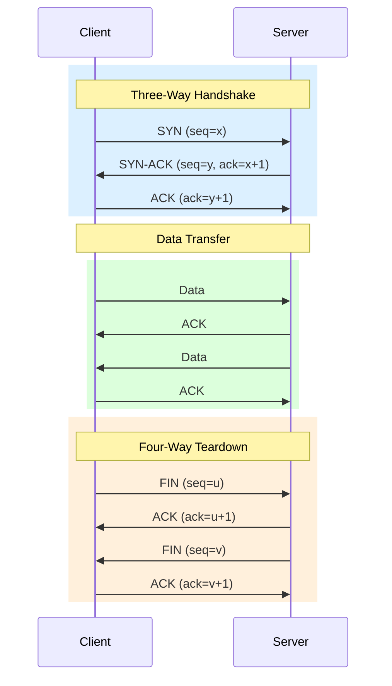

# Dissect a TCP Three-Way Handshake

> Every TCP connection begins with three packets. If any one of them fails or is lost, the connection never opens — and knowing exactly which one failed tells you immediately whether the problem is routing, firewalls, or the application.

**Type:** Learn
**Languages:** Python
**Prerequisites:** Phase 2, Lesson 03 — Parse an IPv4 Header
**Time:** ~30 minutes

## Learning Objectives
- Name the three packets in a TCP handshake and the exact flags each carries
- Explain what sequence numbers are initialised to and why randomisation matters
- Identify the SYN, SYN-ACK, and ACK packets in a tcpdump capture
- Parse the TCP header fields from raw bytes using Python's struct module
- Describe what happens when a SYN packet is dropped vs. when a RST is returned

## The Problem

A developer reports: "My service can't connect to the database." You SSH to the server and run `telnet db-host 5432`. It hangs. You run `curl api-host:8080`. It immediately returns "Connection refused."

These two symptoms have completely different causes. "Hangs" means the SYN packet went out but no SYN-ACK came back — the packet is probably being dropped by a firewall. "Connection refused" means the SYN arrived at the destination but nothing is listening on that port, so the OS sent a RST.

Without understanding the three-way handshake, these error messages are meaningless noise.

## The Concept

### Why three packets?

TCP is a reliable, bidirectional byte stream. Before any data flows, both sides must:
1. Agree to communicate.
2. Exchange Initial Sequence Numbers (ISNs) so each side can track which bytes have been received.
3. Confirm that both sides' ISNs were received.

Three packets accomplish all of this:

```
Client                          Server
  |                                |
  |--- SYN, seq=C ---------------→|   "I want to connect, my first seq# is C"
  |                                |
  |←-- SYN-ACK, seq=S, ack=C+1 ---|   "OK, my first seq# is S, I got your C"
  |                                |
  |--- ACK, ack=S+1 -------------→|   "Got it. I'm ready. Let's talk."
  |                                |
  |=== Connection established ====|
```



**SYN (Synchronize):** Client picks a random Initial Sequence Number (ISN) `C`. The SYN packet has the SYN flag set. No payload.

**SYN-ACK (Synchronize-Acknowledge):** Server picks its own ISN `S`. The SYN-ACK has both the SYN and ACK flags set. The ACK number is `C+1` — "I received byte C and expect the next byte to be C+1."

**ACK (Acknowledge):** Client sends ACK with `ack=S+1` — confirming it received the server's ISN. The connection is now established.

### TCP header layout

```
 0                   1                   2                   3
 0 1 2 3 4 5 6 7 8 9 0 1 2 3 4 5 6 7 8 9 0 1 2 3 4 5 6 7 8 9 0 1
+-+-+-+-+-+-+-+-+-+-+-+-+-+-+-+-+-+-+-+-+-+-+-+-+-+-+-+-+-+-+-+-+
|          Source Port          |       Destination Port        |
+-+-+-+-+-+-+-+-+-+-+-+-+-+-+-+-+-+-+-+-+-+-+-+-+-+-+-+-+-+-+-+-+
|                        Sequence Number                        |
+-+-+-+-+-+-+-+-+-+-+-+-+-+-+-+-+-+-+-+-+-+-+-+-+-+-+-+-+-+-+-+-+
|                    Acknowledgment Number                      |
+-+-+-+-+-+-+-+-+-+-+-+-+-+-+-+-+-+-+-+-+-+-+-+-+-+-+-+-+-+-+-+-+
| Data  |           |U|A|P|R|S|F|                               |
| Offset| Reserved  |R|C|S|S|Y|I|            Window             |
|       |           |G|K|H|T|N|N|                               |
+-+-+-+-+-+-+-+-+-+-+-+-+-+-+-+-+-+-+-+-+-+-+-+-+-+-+-+-+-+-+-+-+
|           Checksum            |         Urgent Pointer        |
+-+-+-+-+-+-+-+-+-+-+-+-+-+-+-+-+-+-+-+-+-+-+-+-+-+-+-+-+-+-+-+-+
|                    Options (if Data Offset > 5)               |
+-+-+-+-+-+-+-+-+-+-+-+-+-+-+-+-+-+-+-+-+-+-+-+-+-+-+-+-+-+-+-+-+
```

Key fields:

**Source/Destination Port (2 bytes each):** Identifies which application on each host. Well-known ports: 80 (HTTP), 443 (HTTPS), 22 (SSH), 5432 (PostgreSQL).

**Sequence Number (4 bytes):** The position of the first byte of this segment in the sender's byte stream. For SYN packets, this is the ISN.

**Acknowledgment Number (4 bytes):** The next sequence number the sender of this segment expects to receive. Only valid when the ACK flag is set.

**Data Offset (4 bits):** Length of the TCP header in 32-bit words (like IPv4's IHL). Minimum 5 (= 20 bytes). Multiply by 4 to get bytes.

**Flags (6 bits, historically; 9 bits in modern TCP):**
```
URG — Urgent pointer field is significant
ACK — Acknowledgment number is valid
PSH — Push: deliver data to the application immediately (don't buffer)
RST — Reset: abort the connection
SYN — Synchronize sequence numbers (connection request)
FIN — No more data to send (graceful close)
```

**Window Size (2 bytes):** How many bytes the sender of this segment is willing to receive without acknowledgment. This is the flow control mechanism.

**Checksum (2 bytes):** Covers a "pseudo-header" (source IP, dest IP, protocol, TCP length) plus the TCP header and data.

### What the flags mean in English

```
SYN=1, ACK=0:  "Please connect to me. My ISN is X."
SYN=1, ACK=1:  "OK, connecting. My ISN is Y. I received your X."
SYN=0, ACK=1:  "Acknowledged. Ready to talk." (or regular data ack)
RST=1:         "Something is wrong. Abort immediately."
FIN=1, ACK=1:  "I'm done sending data. Please acknowledge."
```

### Why ISNs are random

If sequence numbers started at 0 every time, an attacker who could observe traffic could predict the next sequence number and inject packets into a TCP stream. Random ISNs make this infeasible. Modern kernels add per-connection salt to make ISNs unpredictable.

### SYN dropped vs. RST received

```
Scenario 1: Firewall drops the SYN
  Client sends SYN → firewall silently drops it
  Client retransmits SYN after timeout (≈ 1 second)
  Client retransmits again (≈ 3 seconds)
  Eventually gives up: "Connection timed out"

Scenario 2: Port not listening (RST)
  Client sends SYN → server OS sends RST immediately
  Client gets RST: "Connection refused"

Scenario 3: Host unreachable
  Client sends SYN → router sends ICMP "Host unreachable"
  Client gets ICMP: "No route to host"
```

Understanding these three scenarios lets you diagnose connectivity problems in seconds.

### Capturing a handshake with tcpdump

```bash
# In terminal 1 — capture to a file and also print to screen
sudo tcpdump -i any -n -S 'tcp port 80 and host example.com' \
    -w /tmp/handshake.pcap

# In terminal 2 — initiate a connection
curl -v http://example.com/ 2>&1 | head -20

# Then Ctrl-C the tcpdump
```

The `-S` flag tells tcpdump to print absolute sequence numbers (not relative). This is critical for matching the numbers you see to the protocol description above.

### Sample tcpdump output (annotated)

```
# SYN — client to server
14:23:01.123456 IP 192.168.1.5.52341 > 93.184.216.34.80:
  Flags [S], seq 3847291846, win 64240, length 0

# SYN-ACK — server to client
14:23:01.187234 IP 93.184.216.34.80 > 192.168.1.5.52341:
  Flags [S.], seq 2901847362, ack 3847291847, win 65535, length 0
  #           ^^^^ S. means SYN+ACK

# ACK — client to server (connection established)
14:23:01.187389 IP 192.168.1.5.52341 > 93.184.216.34.80:
  Flags [.], ack 2901847363, win 502, length 0
  #    ^ . means ACK only, no other flags
```

Notice: ack = seq + 1 in each case. `3847291847 = 3847291846 + 1`. This confirms the ISN exchange worked correctly.

## Build It

Parse a pcap and identify the handshake packets:

```python
#!/usr/bin/env python3
"""
tcp_handshake.py — identify TCP three-way handshake packets in a pcap file.

Usage:
    python3 tcp_handshake.py /tmp/handshake.pcap
"""

import struct
import socket
import sys


# ── pcap reader (minimal, reused from previous lesson) ────────────────────────

PCAP_MAGIC     = 0xA1B2C3D4
ETHERNET_HDR   = 14
ETHERTYPE_IPV4 = 0x0800


def read_pcap_packets(path: str):
    """Yield (packet_number, raw_bytes) from a pcap file."""
    with open(path, "rb") as f:
        hdr = f.read(24)
        magic = struct.unpack("<I", hdr[:4])[0]
        endian = "<" if magic == PCAP_MAGIC else ">"
        pkt_num = 0
        while True:
            rec = f.read(16)
            if not rec:
                break
            _, _, incl_len, _ = struct.unpack(f"{endian}IIII", rec)
            data = f.read(incl_len)
            pkt_num += 1
            yield pkt_num, data


# ── TCP flag bitmasks ─────────────────────────────────────────────────────────

FLAG_FIN = 0x01
FLAG_SYN = 0x02
FLAG_RST = 0x04
FLAG_PSH = 0x08
FLAG_ACK = 0x10
FLAG_URG = 0x20


def flags_to_str(flags: int) -> str:
    names = []
    if flags & FLAG_URG: names.append("URG")
    if flags & FLAG_ACK: names.append("ACK")
    if flags & FLAG_PSH: names.append("PSH")
    if flags & FLAG_RST: names.append("RST")
    if flags & FLAG_SYN: names.append("SYN")
    if flags & FLAG_FIN: names.append("FIN")
    return "|".join(names) if names else "(none)"


def parse_tcp_header(raw: bytes, offset: int) -> dict | None:
    """
    Parse a TCP header starting at `offset` bytes into `raw`.

    struct "!HHIIBBHHH":
      H  src_port     (2 bytes)
      H  dst_port     (2 bytes)
      I  seq          (4 bytes)
      I  ack_num      (4 bytes)
      B  data_offset_reserved  (1 byte: upper 4 bits = data offset in words)
      B  flags        (1 byte: lower 6 bits = flags)
      H  window       (2 bytes)
      H  checksum     (2 bytes)
      H  urgent_ptr   (2 bytes)
    Total: 2+2+4+4+1+1+2+2+2 = 20 bytes
    """
    if len(raw) - offset < 20:
        return None

    (src_port, dst_port, seq, ack_num,
     data_offset_byte, flags_byte,
     window, checksum, urgent_ptr) = struct.unpack(
        "!HHIIBBHHH", raw[offset : offset + 20]
    )

    data_offset = (data_offset_byte >> 4) * 4  # in bytes

    return {
        "src_port":    src_port,
        "dst_port":    dst_port,
        "seq":         seq,
        "ack_num":     ack_num,
        "data_offset": data_offset,
        "flags":       flags_byte,
        "window":      window,
        "checksum":    checksum,
        "flags_str":   flags_to_str(flags_byte),
    }


def parse_ip_tcp(raw: bytes) -> tuple | None:
    """
    Parse Ethernet + IPv4 + TCP from raw packet bytes.
    Returns (src_ip, dst_ip, tcp_dict) or None if not TCP/IPv4.
    """
    if len(raw) < ETHERNET_HDR + 20:
        return None

    ethertype = struct.unpack("!H", raw[12:14])[0]
    if ethertype != ETHERTYPE_IPV4:
        return None

    ip_start = ETHERNET_HDR
    ihl = (raw[ip_start] & 0x0F) * 4
    protocol = raw[ip_start + 9]

    if protocol != 6:  # 6 = TCP
        return None

    src_ip = socket.inet_ntoa(raw[ip_start + 12 : ip_start + 16])
    dst_ip = socket.inet_ntoa(raw[ip_start + 16 : ip_start + 20])

    tcp_start = ip_start + ihl
    tcp = parse_tcp_header(raw, tcp_start)
    if tcp is None:
        return None

    return src_ip, dst_ip, tcp


def classify_handshake(tcp: dict) -> str:
    """Return a human label for this packet's role in the handshake."""
    f = tcp["flags"]
    syn = bool(f & FLAG_SYN)
    ack = bool(f & FLAG_ACK)
    rst = bool(f & FLAG_RST)
    fin = bool(f & FLAG_FIN)

    if syn and not ack:
        return "SYN         ← connection request"
    if syn and ack:
        return "SYN-ACK     ← connection accepted"
    if ack and not syn and not rst and not fin and tcp.get("payload_len", 0) == 0:
        return "ACK         ← handshake complete"
    if rst:
        return "RST         ← connection refused/aborted"
    if fin:
        return "FIN/FIN-ACK ← graceful close"
    return ""


def main():
    if len(sys.argv) != 2:
        print("Usage: python3 tcp_handshake.py <file.pcap>")
        sys.exit(1)

    path = sys.argv[1]
    print(f"\nParsing: {path}\n")
    print(f"{'#':>4}  {'Source':>21}  {'Destination':>21}  {'Flags':<18} {'Seq':>12} {'Ack':>12}  {'Notes'}")
    print("-" * 110)

    handshake_found = False

    for pkt_num, raw in read_pcap_packets(path):
        result = parse_ip_tcp(raw)
        if result is None:
            continue

        src_ip, dst_ip, tcp = result
        src = f"{src_ip}:{tcp['src_port']}"
        dst = f"{dst_ip}:{tcp['dst_port']}"
        notes = classify_handshake(tcp)

        if notes:  # only print handshake-relevant packets
            handshake_found = True
            print(
                f"{pkt_num:>4}  {src:>21}  {dst:>21}  "
                f"{tcp['flags_str']:<18} {tcp['seq']:>12} {tcp['ack_num']:>12}  {notes}"
            )

    if not handshake_found:
        print("  (no TCP handshake packets found — try filtering for the right host/port)")
    print()


if __name__ == "__main__":
    main()
```

Capture a handshake and run the parser:

```bash
# 1. Start capture
sudo tcpdump -i any -n -S tcp port 80 -w /tmp/handshake.pcap &
TCPDUMP_PID=$!

# 2. Trigger a connection
curl -s http://neverssl.com > /dev/null

# 3. Stop capture
sleep 1 && kill $TCPDUMP_PID 2>/dev/null

# 4. Parse
python3 tcp_handshake.py /tmp/handshake.pcap
```

Expected output (sequence numbers will differ):

```
Parsing: /tmp/handshake.pcap

   #              Source         Destination  Flags              Seq          Ack  Notes
--------------------------------------------------------------------------------------------------------------
   1  192.168.1.5:52341  34.223.124.45:80  SYN                  3847291846            0  SYN         ← connection request
   2  34.223.124.45:80  192.168.1.5:52341  SYN|ACK              2901847362   3847291847  SYN-ACK     ← connection accepted
   3  192.168.1.5:52341  34.223.124.45:80  ACK                  3847291847   2901847363  ACK         ← handshake complete
```

## Exercises

1. **Verify ISN+1.** Confirm from your output that each ACK number equals the previous SYN's sequence number + 1. This is the mathematical proof that the handshake succeeded.

2. **Find a RST.** Connect to a closed port: `nc -zv localhost 9999` (with nothing listening). Capture with tcpdump and parse the result. You should see SYN then RST. What is the RST's sequence number?

3. **SYN timeout.** Use `iptables -A INPUT -p tcp --dport 9999 -j DROP` to silently drop SYNs, then try to connect. Time how long it takes for the OS to give up. How many retransmissions do you see in the capture?

4. **Graceful close.** After a successful HTTP request, find the FIN and FIN-ACK packets in your capture. Trace the four-way close: FIN → ACK → FIN → ACK. (Sometimes combined into FIN-ACK → FIN-ACK.)

5. **Window size.** Look at the window field across multiple packets in a single connection. Does it stay constant or change? What would decreasing window mean for the sender's behaviour?

## Key Terms

| Term | What people say | What it actually means |
|------|----------------|------------------------|
| SYN | "Sync packet" | A TCP segment with the SYN flag set; used to initiate a connection and communicate the sender's Initial Sequence Number |
| ISN | "Initial sequence number" | A randomly chosen 32-bit number that a TCP peer uses as the starting point for its byte stream; exchanged during the handshake |
| ACK number | "Acknowledgment" | The sequence number the sender expects next from the peer; implicitly acknowledges all bytes up to ACK - 1 |
| RST | "Reset" | A TCP flag that immediately terminates a connection; sent when a connection attempt reaches a port with nothing listening |
| Three-way handshake | "TCP connection setup" | The SYN → SYN-ACK → ACK exchange that establishes a TCP connection and synchronises sequence numbers in both directions |
| Data offset | "TCP header length" | The length of the TCP header in 32-bit words; minimum 5 (=20 bytes); like IHL in IP headers |
| Window size | "Receive buffer size" | How many bytes a host is willing to receive without sending an ACK; the basis of TCP flow control |
