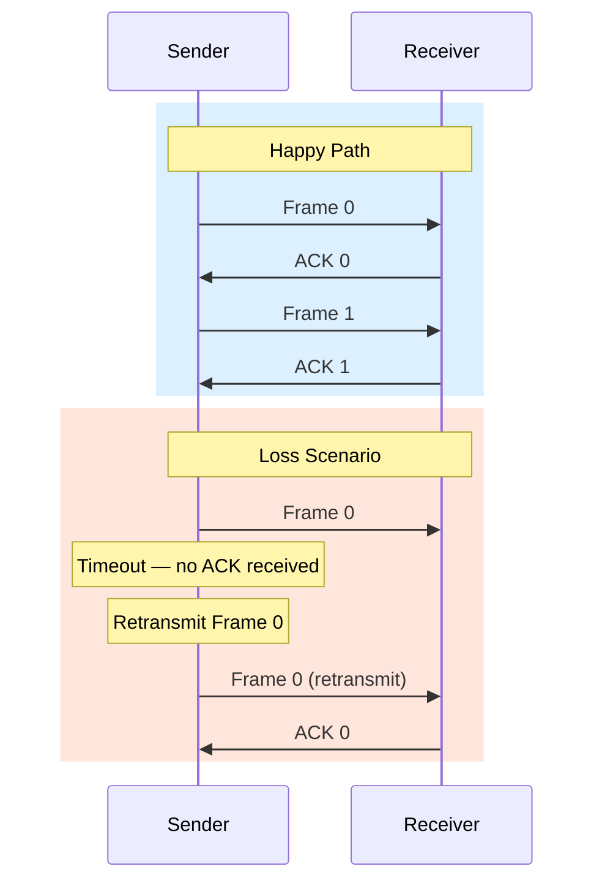

# Implement Stop-and-Wait ARQ

> UDP is fast but unreliable. TCP is reliable but complex. This lesson builds the simplest possible reliable protocol on top of UDP — and by doing so, shows you exactly which pieces TCP adds over raw datagrams.

**Type:** Build
**Languages:** Python
**Prerequisites:** Phase 3, Lesson 02 — Build a TCP Echo Server
**Time:** ~50 minutes

## Learning Objectives
- Explain why UDP alone cannot provide reliable delivery
- Implement stop-and-wait ARQ with sequence numbers, ACKs, and timeouts
- Describe the alternating-bit protocol and why it prevents duplicate acceptance
- Simulate packet loss and verify retransmission behaviour
- Measure the throughput cost of stop-and-wait versus unacknowledged sending

## The Problem

You are building a file transfer tool. You could use TCP — but you want to understand what makes it reliable. You decide to build reliability yourself on top of UDP.

The naive approach: send a packet, trust it arrived. But networks drop packets. A packet can be lost by an overloaded queue, a faulty cable, a WiFi collision, or a bug in any device it passes through. With pure UDP, you never know.

The first step toward reliability is acknowledgment: the receiver sends back a small "I got it" message. But ACKs can also be lost. And if you retransmit a packet, the receiver might get it twice. Stop-and-wait ARQ solves all of this in the simplest possible way.

## The Concept

### What ARQ means

ARQ stands for **Automatic Repeat reQuest**. The sender transmits a packet and then waits for an acknowledgment. If the ACK doesn't arrive within a timeout, the sender retransmits.

```
Sender                                Receiver
  |                                       |
  |------ DATA seq=0 -----------------→  |
  |       (received OK)                   |
  |←----- ACK  seq=0 --------------------|
  |                                       |
  |------ DATA seq=1 -----------------→  |
  |       (packet LOST)                   |
  |                                       |
  |... timeout ...                        |
  |------ DATA seq=1 (retransmit) ──────→|
  |       (received OK)                   |
  |←----- ACK  seq=1 --------------------|
  |                                       |
```



### Why sequence numbers are necessary

Without sequence numbers, the receiver cannot tell whether a packet is:
- A new packet it hasn't seen yet
- A retransmission of the previous packet (because the ACK was lost)

```
Lost ACK scenario WITHOUT sequence numbers:

Sender                       Receiver
  |-- DATA "hello" ──────→  |
  |   (ACK lost)            |   app gets "hello" ← correct
  |... timeout ...          |
  |-- DATA "hello" ──────→  |
                             |   app gets "hello" ← DUPLICATE! Wrong!
```

With a 1-bit sequence number (alternating 0 and 1), the receiver can detect duplicates:

```
Lost ACK scenario WITH sequence numbers:

Sender                       Receiver
  |-- DATA seq=0 ─────────→|   buffer[0] = data → deliver to app ✓
  |   (ACK lost)            |
  |... timeout ...          |
  |-- DATA seq=0 (rexmit) →|   already saw seq=0 → DISCARD, re-send ACK 0
  |←-- ACK seq=0 ──────────|
  |-- DATA seq=1 ─────────→|   buffer[1] = data → deliver to app ✓
```

### The alternating-bit protocol

Stop-and-wait with a 1-bit sequence number is also called the **alternating-bit protocol**. The sender alternates between seq=0 and seq=1. The receiver expects the sequence to alternate — any repeat is a retransmit.

This is not very efficient: the sender can only have one unacknowledged packet at a time. But it is correct, simple, and forms the conceptual base for sliding window protocols (Lesson 04).

### Measuring inefficiency

If the round-trip time (RTT) between sender and receiver is 100ms and each packet is 1500 bytes:

```
Time per packet = RTT + transmission time
Throughput = packet_size / time_per_packet
           = 1500 bytes / 0.100 seconds
           = 15,000 bytes/second
           = 120 Kbps

Compare to the link capacity of, say, 100 Mbps:
Utilisation = 120 Kbps / 100 Mbps = 0.12%
```

Stop-and-wait wastes 99.88% of the link capacity when RTT is significant. Sliding window (Lesson 04) fixes this.

### Packet format for our ARQ protocol

We define a simple format:

```
Byte 0:   type (0 = DATA, 1 = ACK)
Byte 1:   seq  (0 or 1, the alternating bit)
Bytes 2+: payload (DATA packets only)

Total header: 2 bytes
```

This is enough to implement correct stop-and-wait.

## Build It

Create `arq.py`:

```python
#!/usr/bin/env python3
"""
arq.py — Stop-and-wait ARQ over UDP.

Run the receiver first, then the sender.

Usage:
    python3 arq.py receiver [port]       # default port 9000
    python3 arq.py sender <host> [port] [loss_rate]

    loss_rate: 0.0 - 1.0, probability of artificially dropping each packet
               Useful for testing retransmission (both sender-side and ACK-side)

Example (two terminals, same machine):
    python3 arq.py receiver 9000
    python3 arq.py sender localhost 9000 0.3
"""

import socket
import sys
import time
import random
import struct
import os


# ── protocol constants ────────────────────────────────────────────────────────

TYPE_DATA = 0
TYPE_ACK  = 1
HEADER_SIZE = 2        # type (1 byte) + seq (1 byte)
MAX_PAYLOAD = 512      # bytes per packet
TIMEOUT = 1.0          # seconds before retransmission
MAX_RETRIES = 10       # give up after this many consecutive timeouts


# ── packet encode / decode ────────────────────────────────────────────────────

def make_data_packet(seq: int, payload: bytes) -> bytes:
    """Build a DATA packet: [type=0][seq][payload]"""
    header = struct.pack("BB", TYPE_DATA, seq & 1)
    return header + payload


def make_ack_packet(seq: int) -> bytes:
    """Build an ACK packet: [type=1][seq]"""
    return struct.pack("BB", TYPE_ACK, seq & 1)


def parse_packet(raw: bytes) -> tuple[int, int, bytes]:
    """
    Parse a received packet.
    Returns (pkt_type, seq, payload).
    payload is empty for ACK packets.
    """
    if len(raw) < HEADER_SIZE:
        raise ValueError(f"Packet too short: {len(raw)} bytes")
    pkt_type, seq = struct.unpack("BB", raw[:HEADER_SIZE])
    payload = raw[HEADER_SIZE:] if pkt_type == TYPE_DATA else b""
    return pkt_type, seq & 1, payload


# ── sender ────────────────────────────────────────────────────────────────────

def sender(host: str, port: int, loss_rate: float = 0.0):
    """
    Split a hardcoded message into chunks and send reliably using stop-and-wait ARQ.
    """
    # The message to send (in a real system, this would be a file or stream)
    full_message = (
        b"This is a reliable message sent over unreliable UDP using stop-and-wait ARQ. "
        b"Each chunk is sent and acknowledged before the next is sent. "
        b"Lost packets are retransmitted automatically. "
        b"Duplicate packets (caused by lost ACKs) are detected and discarded by the receiver. "
        * 3  # repeat to make it longer
    )

    # Split message into chunks
    chunks = [full_message[i:i+MAX_PAYLOAD]
              for i in range(0, len(full_message), MAX_PAYLOAD)]

    sock = socket.socket(socket.AF_INET, socket.SOCK_DGRAM)
    sock.settimeout(TIMEOUT)

    print(f"Sender: connecting to {host}:{port}")
    print(f"  Total data: {len(full_message)} bytes in {len(chunks)} packets")
    if loss_rate > 0:
        print(f"  Artificial loss rate: {loss_rate:.0%}")
    print()

    seq = 0               # alternating bit: 0 or 1
    total_sent = 0        # total transmissions (including retransmits)
    total_retransmits = 0

    start_time = time.time()

    for chunk_idx, chunk in enumerate(chunks):
        packet = make_data_packet(seq, chunk)
        retries = 0
        delivered = False

        while not delivered:
            # Simulate packet loss on the sender side
            if random.random() < loss_rate:
                print(f"  [SIM] Dropped DATA seq={seq} chunk={chunk_idx} (simulated loss)")
            else:
                sock.sendto(packet, (host, port))
                total_sent += 1

            if retries > 0:
                total_retransmits += 1
                print(f"  [RTX] Retransmit seq={seq} chunk={chunk_idx} "
                      f"(attempt {retries+1})")

            # Wait for ACK
            try:
                ack_raw, _ = sock.recvfrom(HEADER_SIZE + 16)
                pkt_type, ack_seq, _ = parse_packet(ack_raw)

                if pkt_type == TYPE_ACK and ack_seq == seq:
                    # Correct ACK received
                    print(f"  [OK]  seq={seq} chunk={chunk_idx}/{len(chunks)-1} "
                          f"({len(chunk)} bytes)")
                    seq = 1 - seq   # flip bit: 0→1 or 1→0
                    delivered = True
                else:
                    print(f"  [???] Wrong ACK: expected seq={seq}, got seq={ack_seq}")

            except socket.timeout:
                print(f"  [TO]  Timeout waiting for ACK seq={seq} chunk={chunk_idx}")
                retries += 1
                if retries >= MAX_RETRIES:
                    print(f"  [ERR] Max retries exceeded for chunk {chunk_idx}. Giving up.")
                    sock.close()
                    return

    elapsed = time.time() - start_time
    throughput = len(full_message) / elapsed / 1024

    # Send a special END packet (seq doesn't matter for this simple protocol)
    sock.sendto(make_data_packet(seq, b"__END__"), (host, port))
    sock.close()

    print()
    print("=== Sender statistics ===")
    print(f"  Data sent:      {len(full_message):,} bytes")
    print(f"  Packets:        {len(chunks)}")
    print(f"  Transmissions:  {total_sent} ({total_retransmits} retransmits)")
    print(f"  Retransmit rate:{total_retransmits/total_sent:.1%}")
    print(f"  Elapsed:        {elapsed:.2f}s")
    print(f"  Throughput:     {throughput:.1f} KB/s")


# ── receiver ──────────────────────────────────────────────────────────────────

def receiver(port: int, loss_rate: float = 0.0):
    """
    Receive packets using stop-and-wait ARQ.
    Send ACK for each correctly received packet.
    Discard and re-ACK duplicate packets (detected by seq number mismatch).
    """
    sock = socket.socket(socket.AF_INET, socket.SOCK_DGRAM)
    sock.bind(("0.0.0.0", port))
    sock.settimeout(30.0)   # wait up to 30s for sender to start

    print(f"Receiver: listening on port {port}")
    if loss_rate > 0:
        print(f"  Artificial ACK loss rate: {loss_rate:.0%}")
    print()

    expected_seq = 0       # we expect this seq next
    received_data = b""    # reassemble the full message
    packets_received = 0
    duplicates = 0

    try:
        while True:
            try:
                raw, sender_addr = sock.recvfrom(HEADER_SIZE + MAX_PAYLOAD + 64)
            except socket.timeout:
                print("Receiver: timed out waiting for data.")
                break

            pkt_type, seq, payload = parse_packet(raw)

            if pkt_type != TYPE_DATA:
                continue   # ignore stray ACKs

            # Check for END signal
            if payload == b"__END__":
                print(f"  [END] Transfer complete signal received.")
                break

            if seq == expected_seq:
                # New packet — accept it
                received_data += payload
                packets_received += 1
                print(f"  [RCV] seq={seq} ({len(payload)} bytes) — accepted, "
                      f"total={len(received_data)} bytes")

                # Simulate ACK loss
                if random.random() < loss_rate:
                    print(f"  [SIM] Dropped ACK seq={seq} (simulated loss)")
                else:
                    ack = make_ack_packet(seq)
                    sock.sendto(ack, sender_addr)

                expected_seq = 1 - expected_seq   # flip expected bit
            else:
                # Duplicate — seq == 1 - expected_seq
                duplicates += 1
                print(f"  [DUP] seq={seq} — duplicate, discarding. Re-sending ACK.")
                # Re-send the ACK for the packet we already acknowledged
                ack = make_ack_packet(seq)
                sock.sendto(ack, sender_addr)

    except KeyboardInterrupt:
        pass
    finally:
        sock.close()

    print()
    print("=== Receiver statistics ===")
    print(f"  Data received:  {len(received_data):,} bytes")
    print(f"  Packets:        {packets_received}")
    print(f"  Duplicates:     {duplicates}")
    print()
    print("=== Received message preview ===")
    preview = received_data[:200].decode("utf-8", errors="replace")
    print(f"  {preview!r}...")


# ── main ──────────────────────────────────────────────────────────────────────

def main():
    if len(sys.argv) < 2:
        print(__doc__)
        sys.exit(1)

    mode = sys.argv[1].lower()

    if mode == "receiver":
        port = int(sys.argv[2]) if len(sys.argv) > 2 else 9000
        loss_rate = float(sys.argv[3]) if len(sys.argv) > 3 else 0.0
        receiver(port, loss_rate)

    elif mode == "sender":
        if len(sys.argv) < 3:
            print("Usage: python3 arq.py sender <host> [port] [loss_rate]")
            sys.exit(1)
        host = sys.argv[2]
        port = int(sys.argv[3]) if len(sys.argv) > 3 else 9000
        loss_rate = float(sys.argv[4]) if len(sys.argv) > 4 else 0.0
        sender(host, port, loss_rate)

    else:
        print(f"Unknown mode: {mode!r}. Use 'sender' or 'receiver'.")
        sys.exit(1)


if __name__ == "__main__":
    main()
```

Run it:

```bash
# Terminal 1 — start receiver
python3 arq.py receiver 9000

# Terminal 2 — send with no loss (should be perfect)
python3 arq.py sender localhost 9000 0.0

# Terminal 2 — send with 30% packet loss (lots of retransmissions)
python3 arq.py sender localhost 9000 0.3

# Terminal 2 — simulate ACK loss on receiver side
python3 arq.py receiver 9000 0.4
python3 arq.py sender localhost 9000 0.0
```

With 30% loss you will see output like:

```
  [OK]  seq=0 chunk=0/7 (512 bytes)
  [TO]  Timeout waiting for ACK seq=1 chunk=1
  [RTX] Retransmit seq=1 chunk=1 (attempt 2)
  [OK]  seq=1 chunk=1/7 (512 bytes)
  [SIM] Dropped DATA seq=0 chunk=2 (simulated loss)
  [TO]  Timeout waiting for ACK seq=0 chunk=2
  [RTX] Retransmit seq=0 chunk=2 (attempt 2)
  [OK]  seq=0 chunk=2/7 (512 bytes)
```

## Exercises

1. **Measure throughput vs. loss rate.** Run the sender with loss rates 0, 0.1, 0.2, 0.3, 0.4, 0.5. Plot throughput (KB/s) vs. loss rate. At what loss rate does throughput become unusably low?

2. **Timeout tuning.** Set the timeout to 0.01 seconds (too aggressive) and 10 seconds (too conservative). What is the effect? How would you adaptively choose a timeout (hint: measure RTT and add slack)?

3. **Two-bit sequence number.** Our protocol uses a 1-bit (alternating) sequence number. Extend it to a 2-bit sequence number (values 0, 1, 2, 3). Does this change anything for stop-and-wait? What if you want to pipeline two packets at once?

4. **Checksum.** Add a CRC32 checksum to the DATA packet header. On the receiver, verify the checksum and discard packets that fail. Simulate bit errors (randomly flip a bit in the payload after sending) and confirm the checksum catches them.

5. **Bidirectional ARQ.** The current protocol is one-way (sender to receiver). Extend it so the sender also receives data from the receiver — implementing full-duplex ARQ. This is closer to how TCP works (with piggybacked ACKs).

## Key Terms

| Term | What people say | What it actually means |
|------|----------------|------------------------|
| ARQ | "Automatic repeat" | Automatic Repeat reQuest — a family of protocols that achieve reliability by retransmitting unacknowledged packets |
| Stop-and-wait | "One packet at a time" | An ARQ variant where the sender can have at most one unacknowledged packet at a time; simple but inefficient |
| Alternating-bit protocol | "1-bit sequence number" | Stop-and-wait with a 1-bit sequence number that alternates between 0 and 1; detects duplicates caused by lost ACKs |
| Sequence number | "Packet ID" | A number in each packet that allows the receiver to distinguish new data from retransmissions and to detect missing packets |
| ACK | "Acknowledgment" | A small packet sent from receiver to sender confirming receipt of a specific sequence number |
| Timeout | "Give up and retry" | A timer started when a packet is sent; if it expires before an ACK arrives, the packet is retransmitted |
| Retransmission | "Sending again" | Resending a packet whose ACK has not been received within the timeout period |
