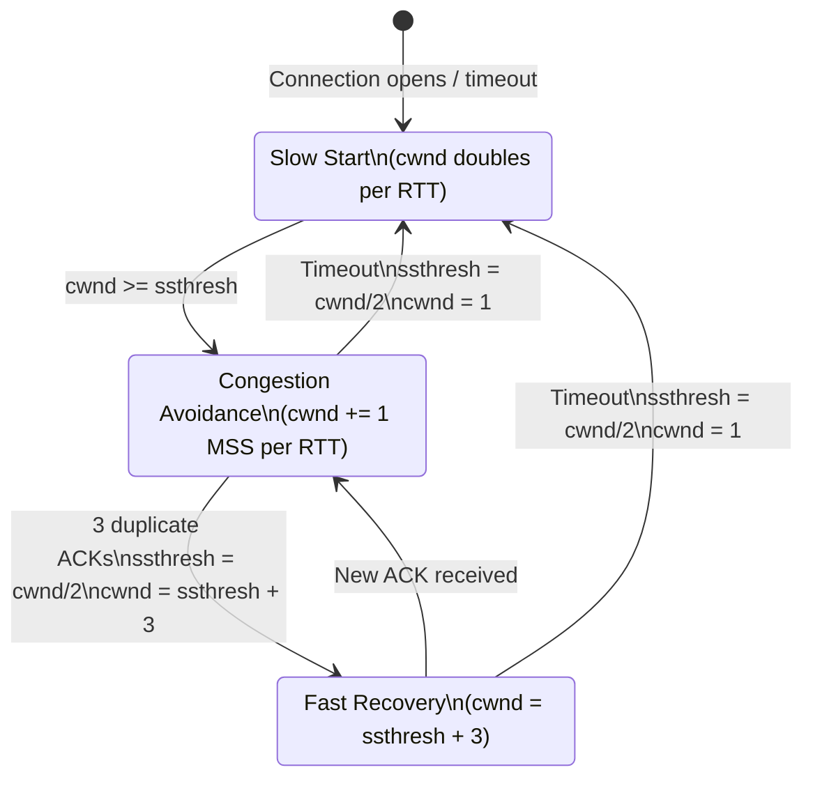

# Observe TCP Congestion Control

> Your connection starts fast, slows down, then recovers. That is not a bug — it is TCP probing the network's capacity and backing off when it causes congestion. You can watch every phase of this in real time.

**Type:** Learn
**Languages:** Python, Bash
**Prerequisites:** Phase 3, Lesson 04 — Visualize TCP Sliding Window
**Time:** ~40 minutes

## Learning Objectives
- Describe the four phases of TCP congestion control: slow start, congestion avoidance, fast retransmit, and fast recovery
- Explain the difference between cwnd (congestion window) and rwnd (receiver window)
- Use `tc netem` to inject artificial packet loss and delay on a Linux network interface
- Capture cwnd values from `ss` output during a transfer to trace slow start and AIMD
- Interpret a cwnd-over-time graph and identify the congestion events

## The Problem

A file transfer starts fast, then seems to slow down, then speeds up again, then slows. Users complain the connection is "unstable". In reality, TCP is doing exactly what it is supposed to: it found the network's capacity by incrementally increasing its send rate until packets were dropped, then backed off.

Without understanding congestion control you will:
- Misinterpret slow start as a bug when transfers start slowly
- Not understand why parallel TCP streams (5 simultaneous downloads) can outperform a single stream on a congested link
- Be unable to explain why VoIP jitter increases when someone starts a large download on the same network

## The Concept

### Why congestion control exists

TCP's sliding window could send as fast as the receiver accepts data. But the network between sender and receiver has limited capacity. If everyone sent at maximum rate, router queues would overflow and most packets would be dropped. The result would be worse throughput than if everyone slowed down cooperatively.

TCP congestion control is a distributed algorithm: every TCP sender independently measures packet loss as a signal of congestion and backs off. This is TCP's "social contract" — each flow yields fairly.



### The congestion window (cwnd)

The **congestion window** (`cwnd`) is the sender's estimate of how much data the network can absorb. The effective in-flight limit is:

```
in_flight ≤ min(cwnd, rwnd)
```

Where `rwnd` is the receiver's window. Most of the time, the bottleneck is `cwnd`, not `rwnd`.

### The four phases

**1. Slow Start**

When a connection opens (or after a timeout), cwnd starts at 1 or a few segments (typically 10 MSS in modern TCP — RFC 6928). Cwnd doubles every RTT:

```
Start:   cwnd = 10 MSS (Initial Window)
RTT 1:   cwnd = 20 MSS (one ACK per segment → +1 per ACK → doubles per RTT)
RTT 2:   cwnd = 40 MSS
RTT 3:   cwnd = 80 MSS
...
Until: cwnd reaches ssthresh (slow start threshold)
```

Despite the name, slow start is exponential growth — it is "slow" only compared to the theoretical maximum.

**2. Congestion Avoidance (AIMD)**

Once cwnd reaches `ssthresh`, TCP switches to **Additive Increase / Multiplicative Decrease (AIMD)**:

```
Per RTT (no loss):  cwnd += 1 MSS  (additive increase)
On loss (packet drop):  cwnd = cwnd / 2  (multiplicative decrease)
                         ssthresh = cwnd / 2
```

The additive increase probes for more bandwidth slowly; the multiplicative decrease responds sharply to congestion. This asymmetry ensures the network stabilises quickly after congestion.

```
cwnd
 ^
 |     /\
 |    /  \      /\
 |   /    \    /  \
 |  /      \  /    \
 | /        \/      \
 |/                  \___
 +-----------------------------→ time
  ↑         ↑
  slow start  loss event
```

**3. Fast Retransmit**

When the receiver gets an out-of-order segment, it immediately ACKs the last in-order segment again (duplicate ACK). Three duplicate ACKs indicate a specific packet was lost. The sender retransmits without waiting for timeout:

```
Sender receives:  ACK 100, ACK 100, ACK 100  ← 3 dupack for seq 100
                  Retransmit segment starting at 100 immediately
```

**4. Fast Recovery (TCP Reno / CUBIC)**

After fast retransmit, instead of dropping to cwnd=1 (as after a full timeout), TCP Reno halves cwnd and continues congestion avoidance:

```
Loss detected via 3 dupACK:
  ssthresh = cwnd / 2
  cwnd = ssthresh + 3 MSS  (the 3 dupACKs represent 3 received segments)
  → enter fast recovery → congestion avoidance
```

This is more efficient than full slow-start restart.

### TCP CUBIC (Linux default)

Modern Linux kernels use CUBIC instead of Reno. CUBIC uses a cubic function to grow cwnd more aggressively while being fair to Reno flows. For this lesson's purposes, the key difference is: CUBIC grows faster after a loss event, reclaiming bandwidth more quickly.

### Simulating congestion with tc netem

`tc netem` (Traffic Control - Network Emulator) is a Linux tool that adds artificial delay, loss, and jitter to a network interface. This lets you test TCP behaviour under controlled conditions without a slow internet connection:

```bash
# Add 100ms delay and 5% packet loss to eth0
sudo tc qdisc add dev eth0 root netem delay 100ms loss 5%

# Show current settings
tc qdisc show dev eth0

# Remove the netem settings
sudo tc qdisc del dev eth0 root
```

### Tracing cwnd with ss

`ss` (socket statistics) shows per-connection TCP internals. The `-t` flag shows TCP, `-i` shows detailed info:

```bash
ss -tin dst <ip>
```

Output includes:

```
ESTAB 0 0 10.0.0.1:54321 93.184.216.34:80
  cubic wscale:8,7 rto:204 rtt:3.5/2.1 ato:40 mss:1448 pmtu:1500
  rcvmss:1448 advmss:1448 cwnd:10 ssthresh:19 bytes_acked:139254
  segs_out:97 segs_in:5 send 33.1Mbps lastsnd:308 lastrcv:308
  snd_wnd:262144 rcv_rtt:1 rcv_space:43690 rcv_ssthresh:87380
```

The fields we care about:
- `cwnd`: current congestion window in MSS units
- `ssthresh`: slow-start threshold
- `rtt`: smoothed RTT estimate

## Build It

### Step 1: Set up netem on loopback

We will run a file transfer on localhost with artificial loss:

```bash
# Check if tc is available
which tc || sudo apt-get install iproute2

# Add 20ms delay and 3% loss to loopback interface
# Note: on loopback, netem affects both send and receive paths
sudo tc qdisc add dev lo root netem delay 20ms loss 3%

# Verify
tc qdisc show dev lo
```

### Step 2: Start a transfer

We need a large file transfer to observe cwnd growth. Use Python to serve and download:

```bash
# Terminal 1 — create a 50 MB file and serve it
dd if=/dev/urandom of=/tmp/bigfile.bin bs=1M count=50
python3 -m http.server 8888 --directory /tmp &

# Terminal 2 — start download in the background
curl -s http://localhost:8888/bigfile.bin -o /dev/null &
CURL_PID=$!
echo "curl PID: $CURL_PID"
```

### Step 3: Trace cwnd

```python
#!/usr/bin/env python3
"""
trace_cwnd.py — sample cwnd from ss output during a TCP transfer.

Usage:
    python3 trace_cwnd.py [port] [interval_ms]

Example:
    python3 trace_cwnd.py 8888 100
"""

import subprocess
import re
import time
import sys


def get_cwnd_for_port(port: int) -> list[dict]:
    """
    Run 'ss -tin' and extract cwnd values for connections to the given port.
    Returns a list of dicts with {src, dst, cwnd, ssthresh, rtt}.
    """
    try:
        result = subprocess.run(
            ["ss", "-tin", f"dport = :{port}"],
            capture_output=True, text=True, timeout=2
        )
    except (subprocess.TimeoutExpired, FileNotFoundError):
        return []

    output = result.stdout
    connections = []

    # ss outputs pairs of lines: socket info + detail line
    lines = output.strip().split("\n")
    i = 0
    while i < len(lines) - 1:
        line1 = lines[i]
        line2 = lines[i + 1] if i + 1 < len(lines) else ""

        # First line format: State Recv-Q Send-Q Local:Port Remote:Port
        if "ESTAB" in line1 or "SYN" in line1:
            # Parse src and dst
            parts = line1.split()
            if len(parts) >= 5:
                src = parts[3]
                dst = parts[4]
            else:
                src = dst = "?"

            # Second line contains cwnd, ssthresh, rtt
            cwnd_match = re.search(r'cwnd:(\d+)', line2)
            ssth_match = re.search(r'ssthresh:(\d+)', line2)
            rtt_match  = re.search(r'rtt:([\d.]+)', line2)

            cwnd    = int(cwnd_match.group(1))    if cwnd_match else None
            ssthresh = int(ssth_match.group(1))   if ssth_match else None
            rtt      = float(rtt_match.group(1))  if rtt_match  else None

            if cwnd is not None:
                connections.append({
                    "src": src, "dst": dst,
                    "cwnd": cwnd, "ssthresh": ssthresh, "rtt": rtt
                })
        i += 2

    return connections


def draw_bar(value: int, max_value: int, width: int = 40) -> str:
    """Draw a simple ASCII bar."""
    if max_value == 0:
        return " " * width
    filled = min(width, int(value / max_value * width))
    return "#" * filled + "." * (width - filled)


def main():
    port = int(sys.argv[1]) if len(sys.argv) > 1 else 8888
    interval = float(sys.argv[2]) / 1000.0 if len(sys.argv) > 2 else 0.1  # ms → s

    print(f"Tracing cwnd for connections to port {port}")
    print(f"Sampling every {interval*1000:.0f}ms")
    print(f"{'Time(ms)':>10} {'cwnd':>6} {'ssthresh':>10} {'rtt(ms)':>8}  Bar")
    print("-" * 70)

    start = time.time()
    samples = []

    try:
        while True:
            conns = get_cwnd_for_port(port)
            elapsed_ms = (time.time() - start) * 1000

            if conns:
                c = conns[0]  # show first connection
                cwnd = c["cwnd"]
                ssth = c["ssthresh"] or 0
                rtt  = c["rtt"] or 0

                samples.append((elapsed_ms, cwnd))
                bar = draw_bar(cwnd, 200)

                print(f"{elapsed_ms:10.0f} {cwnd:6d} {ssth:10d} {rtt:8.1f}  [{bar}]")
            else:
                # Connection may have finished or not started yet
                print(f"{elapsed_ms:10.0f}   (no matching connection)")

            time.sleep(interval)

    except KeyboardInterrupt:
        pass

    # Summary
    if samples:
        times, cwnds = zip(*samples)
        print(f"\n=== cwnd summary ===")
        print(f"  Max:     {max(cwnds)} MSS")
        print(f"  Min:     {min(cwnds)} MSS")
        print(f"  Final:   {cwnds[-1]} MSS")
        print(f"  Samples: {len(samples)}")

        # Print a simple histogram
        print("\n  cwnd distribution:")
        buckets = [0] * 20
        for c in cwnds:
            bucket = min(19, int(c / (max(cwnds) + 1) * 20))
            buckets[bucket] += 1
        for i, count in enumerate(buckets):
            lo = i * (max(cwnds) + 1) // 20
            hi = (i + 1) * (max(cwnds) + 1) // 20
            print(f"    {lo:4d}-{hi:4d}: {'#' * count}")


if __name__ == "__main__":
    main()
```

Run the full experiment:

```bash
# Terminal 1: Add network conditions
sudo tc qdisc add dev lo root netem delay 20ms loss 3%

# Terminal 2: Start server and download
python3 -m http.server 8888 --directory /tmp &
curl -s http://localhost:8888/bigfile.bin -o /dev/null &

# Terminal 3: Trace cwnd
python3 trace_cwnd.py 8888 200

# After transfer completes:
sudo tc qdisc del dev lo root
```

You should see cwnd grow exponentially from ~10, reach ssthresh, then grow linearly, then drop sharply at a loss event, then grow again. This is the sawtooth pattern characteristic of AIMD.

### Reading the output

```
  Time(ms)   cwnd   ssthresh   rtt(ms)  Bar
  ──────────────────────────────────────────
       0       10        inf      0.1  [####..................................]
     200       20        inf      0.5  [########..............................]
     400       40        inf      1.0  [################......................]
     600       80        inf      2.0  [################################......]
     800      160       inf       4.0  [########################################]
    1000      161       inf       4.1  [########################################]  ← congestion avoidance
    1200      162       inf       4.1  [########################################]  ← +1 per RTT
    1600       82       160       4.2  [#######################................]  ← loss! halved
    1800       83       160       4.2  [#######################................]  ← recovery
    2000       85       160       4.2  [########################...............]
```

## Exercises

1. **No loss baseline.** Run the experiment without netem (or with `loss 0%`). How quickly does cwnd grow? How long before it plateaus? What limits it?

2. **High loss.** Set `loss 20%`. Observe how frequently cwnd drops. Calculate the average throughput. Compare to the theoretical maximum from the TCP throughput formula: `throughput ≈ MSS / (RTT × √p)` where p is loss probability.

3. **Parallelism.** Run 4 simultaneous curl downloads of the same file. Does the combined throughput exceed a single connection? Why or why not? (Hint: each connection independently runs AIMD; they compete for the same bottleneck.)

4. **RTT sensitivity.** Keep loss constant at 1% and vary delay: 5ms, 20ms, 50ms, 100ms. How does RTT affect the time to reach peak cwnd? How does it affect peak throughput?

5. **ss deep dive.** During a transfer with no loss, run `ss -tin dst localhost` every 500ms and record `snd_wnd`, `cwnd`, `rcv_space`, and `bytes_acked`. Which of `snd_wnd` and `cwnd` is smaller? What does that tell you about which is limiting?

## Key Terms

| Term | What people say | What it actually means |
|------|----------------|------------------------|
| cwnd | "Congestion window" | The sender's estimate of how much data the network can absorb; adjusted by congestion control algorithms |
| ssthresh | "Slow-start threshold" | The cwnd value below which TCP uses exponential slow start; above it, TCP uses linear congestion avoidance |
| AIMD | "Additive increase, multiplicative decrease" | The congestion avoidance algorithm: cwnd grows by 1 MSS per RTT (additive) and halves on loss (multiplicative) |
| Slow start | "Exponential growth" | The initial phase of TCP where cwnd doubles per RTT, quickly probing for available bandwidth |
| tc netem | "Network emulator" | A Linux traffic control module that injects artificial delay, loss, and jitter into a network interface |
| Fast retransmit | "Three dupacks" | Retransmitting a lost segment immediately after receiving three duplicate ACKs, without waiting for timeout |
| CUBIC | "Modern TCP" | The default congestion control algorithm in Linux; grows cwnd using a cubic function for faster recovery after loss |
