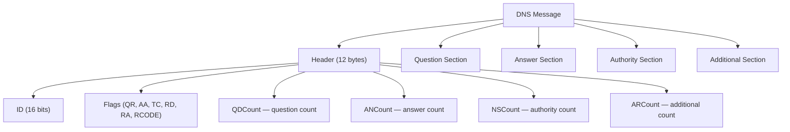

# Parse a DNS Wire-Format Message

> DNS packets are just bytes — once you decode them by hand, no network protocol will ever feel like magic again.

**Type:** Build
**Languages:** Python
**Prerequisites:** Phase 4, Lesson 01 — Trace a DNS Resolution
**Time:** ~45 minutes

## Learning Objectives
- Describe the structure of a DNS message: header, question section, answer section
- Use Python's `struct` module to unpack fixed-width binary fields
- Decode DNS label encoding (length-prefixed labels) including message compression pointers
- Extract resource record fields: name, type, class, TTL, RDATA
- Capture a real DNS response with Python sockets and feed it to your parser

## The Problem

You've watched `dig +trace` walk the resolution chain. But what is actually flying across the network? A DNS response is a sequence of bytes — and if you don't know the encoding, you're flying blind.

This matters more than you might think. DNS wire format is used directly in:
- Low-level network libraries that can't depend on the OS resolver
- Security tools that inspect DNS traffic for exfiltration or poisoning attempts
- DNS-over-HTTPS clients that receive raw DNS responses embedded in HTTP responses
- Performance-sensitive systems that avoid the overhead of subprocess-calling `dig`

The DNS wire format has been stable since RFC 1035 in 1987. Every DNS packet — billions per second across the internet — uses this exact structure. Learning to read it directly gives you a mental model that applies everywhere.

## The Concept

### The DNS Message Structure

A DNS message has four sections. The header is always 12 bytes. The other sections follow immediately after.

```
 0                   1                   2                   3
 0 1 2 3 4 5 6 7 8 9 0 1 2 3 4 5 6 7 8 9 0 1 2 3 4 5 6 7 8 9 0 1
+-+-+-+-+-+-+-+-+-+-+-+-+-+-+-+-+-+-+-+-+-+-+-+-+-+-+-+-+-+-+-+-+
|                  Transaction ID (16 bits)                     |
+-+-+-+-+-+-+-+-+-+-+-+-+-+-+-+-+-+-+-+-+-+-+-+-+-+-+-+-+-+-+-+-+
|QR|Opcode |AA|TC|RD|RA| Z |   RCODE   |                        |
+-+-+-+-+-+-+-+-+-+-+-+-+-+-+-+-+-+-+-+-+-+-+-+-+-+-+-+-+-+-+-+-+
|           QDCOUNT (number of questions)                       |
+-+-+-+-+-+-+-+-+-+-+-+-+-+-+-+-+-+-+-+-+-+-+-+-+-+-+-+-+-+-+-+-+
|           ANCOUNT (number of answers)                         |
+-+-+-+-+-+-+-+-+-+-+-+-+-+-+-+-+-+-+-+-+-+-+-+-+-+-+-+-+-+-+-+-+
|           NSCOUNT (number of authority records)               |
+-+-+-+-+-+-+-+-+-+-+-+-+-+-+-+-+-+-+-+-+-+-+-+-+-+-+-+-+-+-+-+-+
|           ARCOUNT (number of additional records)              |
+-+-+-+-+-+-+-+-+-+-+-+-+-+-+-+-+-+-+-+-+-+-+-+-+-+-+-+-+-+-+-+-+
|                  QUESTION SECTION                             |
|          (QDCOUNT question entries)                           |
+-+-+-+-+-+-+-+-+-+-+-+-+-+-+-+-+-+-+-+-+-+-+-+-+-+-+-+-+-+-+-+-+
|                  ANSWER SECTION                               |
|          (ANCOUNT resource records)                           |
+-+-+-+-+-+-+-+-+-+-+-+-+-+-+-+-+-+-+-+-+-+-+-+-+-+-+-+-+-+-+-+-+
```



### Label Encoding

Domain names are not stored as plain ASCII strings. They use **label encoding**: each part of the name is prefixed by its length as a single byte.

`www.example.com` becomes:

```
\x03 w w w \x07 e x a m p l e \x03 c o m \x00
 ↑          ↑                   ↑          ↑
 len=3      len=7               len=3      null terminator
```

Each label is preceded by its length byte. The name ends with a null byte `\x00`.

### Message Compression

A DNS response often contains the same domain name multiple times (in questions, answers, authority records). To save space, DNS uses **pointer compression**: instead of repeating the full name, a two-byte pointer references an earlier occurrence.

A compression pointer is identified by the top two bits being `11`:

```
  1 1 x x x x x x  x x x x x x x x
  ↑                 ↑
  top bits = 0xC0   6-bit + 8-bit offset into message
```

If you see a byte with value `0xC0` or higher (in the context of a label length), it's a pointer. The offset is the lower 14 bits, counting from the start of the entire DNS message.

### Resource Record (RR) Structure

After the question section, each answer is a Resource Record:

```
+--+--+--+--+--+--+--+--+--+--+--+--+--+--+--+--+
|                      NAME                       |  variable length
+--+--+--+--+--+--+--+--+--+--+--+--+--+--+--+--+
|                      TYPE                       |  2 bytes
+--+--+--+--+--+--+--+--+--+--+--+--+--+--+--+--+
|                      CLASS                      |  2 bytes
+--+--+--+--+--+--+--+--+--+--+--+--+--+--+--+--+
|                       TTL                       |  4 bytes
+--+--+--+--+--+--+--+--+--+--+--+--+--+--+--+--+
|                    RDLENGTH                      |  2 bytes
+--+--+--+--+--+--+--+--+--+--+--+--+--+--+--+--+
|                     RDATA                        |  RDLENGTH bytes
+--+--+--+--+--+--+--+--+--+--+--+--+--+--+--+--+
```

For an A record (IPv4 address), RDATA is exactly 4 bytes — the raw IP address. For a CNAME, RDATA is another encoded domain name.

## Build It

### Step 1: Capture a Real DNS Response

We'll use Python's `socket` module to send a DNS query and capture the raw response bytes.

```python
# capture_dns.py
import socket
import struct

def build_query(domain: str) -> bytes:
    """Build a minimal DNS query packet for an A record."""
    # Transaction ID: random 16-bit number to match request/response
    transaction_id = 0x1234

    # Flags: standard query, recursion desired
    # QR=0 (query), OPCODE=0 (standard), AA=0, TC=0, RD=1
    flags = 0x0100

    # Counts: 1 question, 0 answers, 0 authority, 0 additional
    qdcount = 1
    ancount = 0
    nscount = 0
    arcount = 0

    # Pack the 12-byte header: all fields are unsigned shorts (2 bytes each)
    header = struct.pack('>HHHHHH',
        transaction_id, flags, qdcount, ancount, nscount, arcount)

    # Encode the domain name as DNS labels
    question_name = encode_domain(domain)

    # QTYPE=1 (A record), QCLASS=1 (IN = Internet)
    question_suffix = struct.pack('>HH', 1, 1)

    return header + question_name + question_suffix


def encode_domain(domain: str) -> bytes:
    """Convert 'www.example.com' to DNS label format."""
    result = b''
    for label in domain.split('.'):
        # Each label: length byte + label bytes
        encoded = label.encode('ascii')
        result += bytes([len(encoded)]) + encoded
    result += b'\x00'  # Null byte terminates the name
    return result


def send_query(domain: str, server: str = '8.8.8.8', port: int = 53) -> bytes:
    """Send a DNS query over UDP and return the raw response bytes."""
    query = build_query(domain)

    # AF_INET = IPv4, SOCK_DGRAM = UDP
    sock = socket.socket(socket.AF_INET, socket.SOCK_DGRAM)
    sock.settimeout(5.0)  # 5-second timeout

    try:
        sock.sendto(query, (server, port))
        # DNS responses fit in 512 bytes for UDP (per RFC 1035)
        response, _ = sock.recvfrom(512)
    finally:
        sock.close()

    return response


if __name__ == '__main__':
    raw = send_query('example.com')
    print(f"Received {len(raw)} bytes")
    print("Hex dump:")
    # Print 16 bytes per line for readability
    for i in range(0, len(raw), 16):
        chunk = raw[i:i+16]
        hex_str = ' '.join(f'{b:02x}' for b in chunk)
        print(f"  {i:04x}: {hex_str}")
```

Run it:

```bash
python3 capture_dns.py
```

You'll see a hex dump of the raw response. Keep this file — we'll use `send_query` in the parser.

### Step 2: Parse the Header

```python
# dns_parser.py
import struct
import socket as socket_module

def parse_header(data: bytes) -> dict:
    """Parse the 12-byte DNS header."""
    if len(data) < 12:
        raise ValueError(f"Packet too short: {len(data)} bytes, need 12")

    # Unpack 6 unsigned shorts (2 bytes each) = 12 bytes total
    # '>' means big-endian (network byte order)
    txid, flags, qdcount, ancount, nscount, arcount = struct.unpack('>HHHHHH', data[:12])

    # Decode the flags field bit by bit
    qr     = (flags >> 15) & 0x1   # bit 15: 0=query, 1=response
    opcode = (flags >> 11) & 0xF   # bits 11-14: query type
    aa     = (flags >> 10) & 0x1   # bit 10: authoritative answer
    tc     = (flags >>  9) & 0x1   # bit 9:  truncated
    rd     = (flags >>  8) & 0x1   # bit 8:  recursion desired
    ra     = (flags >>  7) & 0x1   # bit 7:  recursion available
    rcode  = flags & 0xF           # bits 0-3: response code

    rcode_names = {0: 'NOERROR', 1: 'FORMERR', 2: 'SERVFAIL',
                   3: 'NXDOMAIN', 4: 'NOTIMP', 5: 'REFUSED'}

    return {
        'transaction_id': txid,
        'is_response': bool(qr),
        'authoritative': bool(aa),
        'truncated': bool(tc),
        'recursion_desired': bool(rd),
        'recursion_available': bool(ra),
        'rcode': rcode_names.get(rcode, f'UNKNOWN({rcode})'),
        'qdcount': qdcount,
        'ancount': ancount,
        'nscount': nscount,
        'arcount': arcount,
    }
```

### Step 3: Parse Domain Names (With Compression)

This is the trickiest part. The parser must handle both regular labels and compression pointers.

```python
def parse_name(data: bytes, offset: int) -> tuple[str, int]:
    """
    Parse a DNS encoded name starting at 'offset' in 'data'.
    Returns (name_string, new_offset).
    'new_offset' points to the byte AFTER this name field.
    """
    labels = []
    # We track the 'return offset' separately because a pointer jumps
    # us to another part of the message, but we must continue parsing
    # from AFTER the pointer (not from where the pointer points to).
    return_offset = None

    while True:
        if offset >= len(data):
            raise ValueError(f"Name parsing ran off end of packet at offset {offset}")

        length = data[offset]

        if length == 0:
            # Null byte: end of name
            offset += 1
            break
        elif (length & 0xC0) == 0xC0:
            # Compression pointer: top two bits are 11
            # The pointer is a 14-bit offset into the DNS message
            if offset + 1 >= len(data):
                raise ValueError("Truncated compression pointer")

            # Combine lower 6 bits of this byte with all 8 bits of next byte
            pointer = ((length & 0x3F) << 8) | data[offset + 1]

            # Save where we are in the original stream (we'll return here)
            if return_offset is None:
                return_offset = offset + 2

            # Jump to the pointer location and keep reading
            offset = pointer
        else:
            # Regular label: next 'length' bytes are the label
            label_start = offset + 1
            label_end = label_start + length
            if label_end > len(data):
                raise ValueError(f"Label extends past end of packet")

            label = data[label_start:label_end].decode('ascii', errors='replace')
            labels.append(label)
            offset = label_end

    # If we followed a pointer, resume after the pointer bytes
    final_offset = return_offset if return_offset is not None else offset
    return '.'.join(labels), final_offset
```

### Step 4: Parse the Question Section

```python
def parse_question(data: bytes, offset: int) -> tuple[dict, int]:
    """Parse one question entry. Returns (question_dict, new_offset)."""
    name, offset = parse_name(data, offset)

    # QTYPE and QCLASS are each 2 bytes
    if offset + 4 > len(data):
        raise ValueError("Question section truncated")

    qtype, qclass = struct.unpack('>HH', data[offset:offset+4])
    offset += 4

    type_names = {1: 'A', 2: 'NS', 5: 'CNAME', 15: 'MX',
                  16: 'TXT', 28: 'AAAA', 255: 'ANY'}

    return {
        'name': name,
        'type': type_names.get(qtype, f'TYPE{qtype}'),
        'class': 'IN' if qclass == 1 else f'CLASS{qclass}',
    }, offset
```

### Step 5: Parse Resource Records

```python
def parse_rdata(rtype: int, rdata: bytes, full_message: bytes, rdata_offset: int) -> str:
    """Decode the RDATA field based on record type."""
    if rtype == 1:
        # A record: 4 bytes = IPv4 address
        if len(rdata) != 4:
            return f"<malformed A record: {len(rdata)} bytes>"
        return socket_module.inet_ntoa(rdata)

    elif rtype == 28:
        # AAAA record: 16 bytes = IPv6 address
        if len(rdata) != 16:
            return f"<malformed AAAA record: {len(rdata)} bytes>"
        return socket_module.inet_ntop(socket_module.AF_INET6, rdata)

    elif rtype == 5:
        # CNAME: encoded domain name (may use compression pointing into full message)
        name, _ = parse_name(full_message, rdata_offset)
        return name

    elif rtype == 15:
        # MX: 2-byte preference + encoded domain name
        if len(rdata) < 3:
            return f"<malformed MX record>"
        preference = struct.unpack('>H', rdata[:2])[0]
        name, _ = parse_name(full_message, rdata_offset + 2)
        return f"priority={preference} exchange={name}"

    elif rtype == 16:
        # TXT: one or more length-prefixed strings
        strings = []
        pos = 0
        while pos < len(rdata):
            length = rdata[pos]
            pos += 1
            strings.append(rdata[pos:pos+length].decode('utf-8', errors='replace'))
            pos += length
        return ' '.join(f'"{s}"' for s in strings)

    elif rtype == 2:
        # NS record: encoded domain name
        name, _ = parse_name(full_message, rdata_offset)
        return name

    else:
        # Unknown type: show hex
        return rdata.hex()


def parse_rr(data: bytes, offset: int) -> tuple[dict, int]:
    """Parse one Resource Record. Returns (rr_dict, new_offset)."""
    name, offset = parse_name(data, offset)

    # Fixed fields: TYPE(2) + CLASS(2) + TTL(4) + RDLENGTH(2) = 10 bytes
    if offset + 10 > len(data):
        raise ValueError(f"RR fixed fields truncated at offset {offset}")

    rtype, rclass, ttl, rdlength = struct.unpack('>HHIH', data[offset:offset+10])
    offset += 10

    # The RDATA offset within the full message (needed for compression)
    rdata_offset = offset
    rdata = data[offset:offset+rdlength]
    offset += rdlength

    type_names = {1: 'A', 2: 'NS', 5: 'CNAME', 15: 'MX',
                  16: 'TXT', 28: 'AAAA', 255: 'ANY'}
    type_str = type_names.get(rtype, f'TYPE{rtype}')

    return {
        'name': name,
        'type': type_str,
        'class': 'IN' if rclass == 1 else f'CLASS{rclass}',
        'ttl': ttl,
        'rdata': parse_rdata(rtype, rdata, data, rdata_offset),
    }, offset
```

### Step 6: The Full Parser

```python
def parse_dns_message(data: bytes) -> dict:
    """Parse a complete DNS message from raw bytes."""
    header = parse_header(data)
    offset = 12  # Header is always 12 bytes

    questions = []
    for _ in range(header['qdcount']):
        question, offset = parse_question(data, offset)
        questions.append(question)

    answers = []
    for _ in range(header['ancount']):
        rr, offset = parse_rr(data, offset)
        answers.append(rr)

    # We skip authority and additional sections for now
    # (they use the same RR format as answers)

    return {
        'header': header,
        'questions': questions,
        'answers': answers,
    }


def print_dns_message(msg: dict) -> None:
    """Pretty-print a parsed DNS message."""
    h = msg['header']
    print(f"Transaction ID: 0x{h['transaction_id']:04x}")
    print(f"Type: {'Response' if h['is_response'] else 'Query'}")
    print(f"RCODE: {h['rcode']}")
    print(f"Authoritative: {h['authoritative']}")
    print()

    print("QUESTION SECTION:")
    for q in msg['questions']:
        print(f"  {q['name']}  {q['class']}  {q['type']}")
    print()

    print("ANSWER SECTION:")
    if not msg['answers']:
        print("  (no answers)")
    for rr in msg['answers']:
        print(f"  {rr['name']:<30} {rr['ttl']:<8} {rr['class']}  {rr['type']:<8} {rr['rdata']}")
```

### Step 7: Wire It Together

```python
# Add this to dns_parser.py

import socket as socket_module
import struct

# (paste all functions above here)

def send_and_parse(domain: str, server: str = '8.8.8.8') -> dict:
    """Send a DNS query and parse the response."""
    # Build and send query (same code as capture_dns.py)
    transaction_id = 0xABCD
    flags = 0x0100
    header_bytes = struct.pack('>HHHHHH', transaction_id, flags, 1, 0, 0, 0)

    name_bytes = b''
    for label in domain.split('.'):
        encoded = label.encode('ascii')
        name_bytes += bytes([len(encoded)]) + encoded
    name_bytes += b'\x00'

    qtype_qclass = struct.pack('>HH', 1, 1)  # A record, IN class
    query = header_bytes + name_bytes + qtype_qclass

    sock = socket_module.socket(socket_module.AF_INET, socket_module.SOCK_DGRAM)
    sock.settimeout(5.0)
    try:
        sock.sendto(query, (server, 53))
        response, _ = sock.recvfrom(512)
    finally:
        sock.close()

    return parse_dns_message(response)


if __name__ == '__main__':
    import sys
    domain = sys.argv[1] if len(sys.argv) > 1 else 'example.com'
    print(f"Querying A record for: {domain}\n")
    result = send_and_parse(domain)
    print_dns_message(result)
```

Run it:

```bash
python3 dns_parser.py example.com
python3 dns_parser.py google.com
python3 dns_parser.py github.com
```

Expected output for `example.com`:

```
Querying A record for: example.com

Transaction ID: 0xabcd
Type: Response
RCODE: NOERROR
Authoritative: False

QUESTION SECTION:
  example.com  IN  A

ANSWER SECTION:
  example.com                    86400    IN  A        93.184.216.34
```

## Exercises

1. **Try a CNAME domain**: Change `qtype` from `1` (A) to `5` (CNAME) in the query and query `www.github.com`. Does the response contain a CNAME record? Modify `parse_rdata` to follow the chain and return the final A record IP.

2. **Parse authority and additional sections**: The current parser skips `nscount` and `arcount` records. Add loops to parse them using the same `parse_rr` function. Print all four sections.

3. **Hex dump with annotations**: Modify `parse_dns_message` to record the byte offset of each parsed field. Print the raw hex dump alongside labels showing what each byte region means.

4. **Handle NXDOMAIN**: Query a nonexistent domain like `thisdomaindoesnotexist99999.com`. What does the header `rcode` field contain? What does the ANSWER section look like?

5. **Compression stress test**: Query `mail.google.com` for MX records (qtype=15). The response likely has multiple RRs that all use compression pointers. Verify your `parse_name` function handles all of them correctly.

## Key Terms

| Term | What people say | What it actually means |
|------|----------------|------------------------|
| Wire format | "the raw bytes" | The exact byte layout defined by RFC 1035 that every DNS implementation must produce and consume |
| Label encoding | "DNS name format" | A domain name encoded as length-prefixed segments: `\x03www\x07example\x03com\x00` |
| Compression pointer | "DNS compression" | A two-byte sequence (top bits = 11) that references an earlier occurrence of a name in the same message to avoid repetition |
| RDATA | "the record value" | The payload of a resource record; its meaning depends entirely on the record TYPE (4 bytes for A, encoded name for CNAME, etc.) |
| RDLENGTH | "record data length" | A 2-byte field immediately before RDATA specifying how many bytes of RDATA follow |
| TTL | "time to live" | A 4-byte unsigned integer in the RR header; seconds for which caches may keep this record |
| Transaction ID | "DNS query ID" | A 16-bit value chosen by the querier to match responses to requests; the response must echo the same ID |
