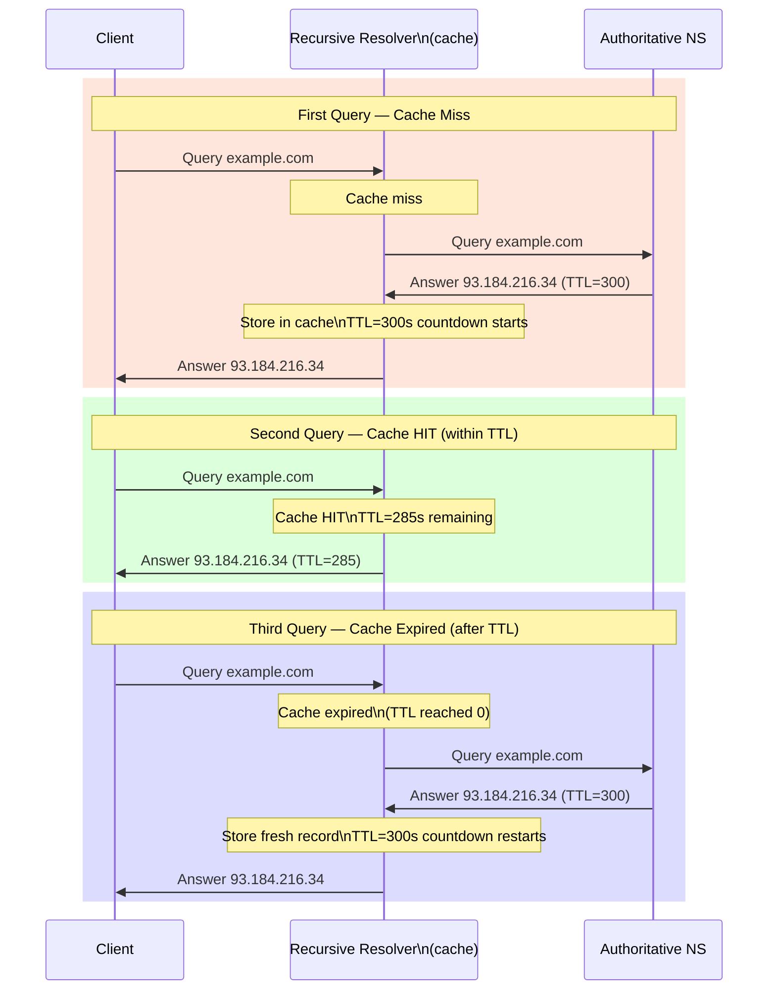

# Understand DNS Caching and TTL

> DNS propagation delays are caused by caches — once you can see the TTL countdown, you can predict exactly when a change will take effect.

**Type:** Learn
**Languages:** Bash
**Prerequisites:** Phase 4, Lesson 01 — Trace a DNS Resolution
**Time:** ~25 minutes

## Learning Objectives
- Observe TTL decrement across repeated `dig` queries and explain what it means
- Describe how DNS caching improves performance and where caches live
- Explain negative caching (NXDOMAIN caching) and why it matters
- Demonstrate how a stale cache causes failures after a DNS record change
- Calculate the maximum propagation delay for a DNS change given a TTL value

## The Problem

You updated your website's DNS — changed the A record from the old IP to the new one. You're staring at your screen. The site still shows the old IP. Why?

The answer is always the same: caching. Every level of the DNS resolution chain caches answers according to the TTL (Time-To-Live) field in the response. Your browser caches, the OS caches, the recursive resolver caches. Until every cache expires, some users will still get the old IP.

This is not a bug. It's a fundamental design choice: without caching, every DNS lookup would require a round-trip to the authoritative nameserver, adding dozens of milliseconds to every network request. With caching, most DNS queries resolve in under 1 ms from a local cache.

Understanding caching lets you predict propagation times, plan DNS migrations without downtime, and diagnose intermittent DNS failures.

## The Concept

### Where Caches Live

```
Browser Cache
      │  ~60s (hard-coded in browsers)
      ▼
OS Stub Resolver Cache
      │  honours TTL
      ▼
Recursive Resolver Cache  (e.g., 8.8.8.8 or your ISP)
      │  honours TTL
      ▼
Authoritative Nameserver  (no cache — the source of truth)
```

Each cache is independent. When you flush your OS DNS cache (`sudo dscacheutil -flushcache` on macOS), you only affect the OS layer — the recursive resolver at 8.8.8.8 still has its own cached copy.



### TTL: The Cache Expiry Timer

The TTL field in every DNS resource record is a 32-bit unsigned integer measured in seconds. It is set by the zone owner (you or your DNS provider) in the zone file.

```
example.com.  86400  IN  A  93.184.216.34
              ^^^^^
              TTL = 86400 seconds = 24 hours
```

When a recursive resolver caches this record, it starts a countdown. The TTL in the cached copy decrements each second (conceptually). When a client queries the recursive resolver, the response includes the REMAINING TTL — not the original TTL. This is how you can observe the countdown in `dig` output.

**Common TTL values:**
- 300 (5 minutes) — used during migrations when you expect changes
- 3600 (1 hour) — common for stable records
- 86400 (24 hours) — stable production records
- 300–900 — email-related records (MX, SPF) since email can't wait a day to recover

### The Propagation Delay Formula

When you change a DNS record, the maximum time for all resolvers to see the new value is:

```
Propagation delay = old TTL
```

Because any resolver that just freshly cached the old record will hold it for the full remaining TTL. After that time has passed, every new query will fetch the fresh record.

**Best practice for migrations**: Lower the TTL to 300 seconds several days before the change. Wait for that lower TTL to propagate (takes time equal to the OLD high TTL). Then make the change — worst case 5-minute propagation. After the change, raise the TTL back.

```
Before migration:
  example.com  A  1.2.3.4  TTL=86400  (1 day cached everywhere)

  Step 1: Lower TTL to 300 — wait 24 hours for old cached copies to expire
  example.com  A  1.2.3.4  TTL=300

  Step 2: Change the IP — worst case 5-minute propagation
  example.com  A  5.6.7.8  TTL=300

  Step 3: Raise TTL back after migration
  example.com  A  5.6.7.8  TTL=3600
```

### Negative Caching

What happens when a domain does NOT exist? The authoritative nameserver returns NXDOMAIN. Resolvers cache this negative result too, for a duration specified in the zone's SOA record (the `minimum` field, or the NXDOMAIN TTL from the response).

This means: if a resolver cached `NXDOMAIN` for `api.example.com`, your application will keep getting "domain not found" errors even after you CREATE the DNS record — until the negative cache expires.

```bash
# The SOA record's last field is the negative TTL
dig example.com SOA
# example.com.  3600  IN  SOA  ns1.example.com. admin.example.com.
#               (serial) (refresh) (retry) (expire) (minimum/negative-TTL)
```

### Browser DNS Cache

Browsers cache DNS independently of the OS. Chrome and Firefox have their own built-in DNS caches with hard-coded limits (often 60 seconds minimum, up to 1 minute regardless of TTL). To inspect Chrome's DNS cache, visit `chrome://net-internals/#dns`.

## Build It

### Step 1: Observe TTL Countdown

```bash
# First query — cache is cold, TTL is the original value
dig example.com A

# Wait 10 seconds, then query again
sleep 10
dig example.com A
```

Look at the TTL in the ANSWER section. It should be approximately 10 seconds lower in the second query. If it stays exactly the same, your recursive resolver may have re-fetched the record (unlikely) or your OS cache behavior differs.

To be precise, capture just the TTL:

```bash
dig +short +noquestion example.com A
dig example.com A | grep -A1 "ANSWER SECTION" | tail -1
```

### Step 2: Script the Countdown

```bash
#!/bin/bash
# watch_ttl.sh — observe TTL decrement over time

DOMAIN=${1:-example.com}
echo "Watching TTL for $DOMAIN (every 15 seconds, press Ctrl+C to stop)"
echo ""
printf "%-10s %-8s %s\n" "TIME" "TTL" "IP"
echo "-----------------------------------"

while true; do
    RESULT=$(dig +short +ttl "$DOMAIN" A 2>/dev/null | head -1)
    TTL=$(dig "$DOMAIN" A 2>/dev/null | awk '/ANSWER SECTION/{found=1; next} found{print $2; exit}')
    IP=$(dig +short "$DOMAIN" A 2>/dev/null | head -1)
    TIMESTAMP=$(date +%H:%M:%S)
    printf "%-10s %-8s %s\n" "$TIMESTAMP" "${TTL:-N/A}" "${IP:-N/A}"
    sleep 15
done
```

```bash
chmod +x watch_ttl.sh
./watch_ttl.sh example.com
```

Let it run for a few iterations. You'll see the TTL decrease by ~15 with each poll.

### Step 3: Choose a Low-TTL Domain

Not all domains cache for a long time. Find one with a short TTL:

```bash
# Check various domains for their TTL
for domain in example.com google.com cloudflare.com github.com; do
    ttl=$(dig "$domain" A 2>/dev/null | awk '/ANSWER SECTION/{found=1; next} found{print $2; exit}')
    echo "$domain: TTL=$ttl"
done
```

Domains with TTL=300 (5 minutes) are easier to observe countdown for. Ones with TTL=86400 (24 hours) would take a day.

### Step 4: Observe Negative Caching

```bash
# Query a nonexistent domain
dig nonexistentdomain12345678.com A

# Look at the authority section for the SOA record
dig nonexistentdomain12345678.com A | grep -A5 "AUTHORITY SECTION"
```

The SOA record in the authority section contains the negative TTL (the last number). Query the same nonexistent domain again immediately:

```bash
# Should get the same NXDOMAIN from cache
dig nonexistentdomain12345678.com A
```

Note the TTL on the SOA record in the second response — it should be slightly lower, showing the negative cache is also counting down.

### Step 5: Bypass the Cache

To see the "live" (uncached) TTL, bypass your recursive resolver's cache and query the authoritative nameserver directly:

```bash
# Find the authoritative nameserver
AUTH_NS=$(dig +short example.com NS | head -1)
echo "Authoritative NS: $AUTH_NS"

# Query it directly — response comes directly from source, no cache
dig @"$AUTH_NS" example.com A
```

The TTL from the authoritative nameserver is the configured TTL from the zone file — the "real" value. Compare it to what you get from a recursive resolver (which decrements based on cache age).

### Step 6: Simulate a Stale Cache Failure

This simulates what happens when you change DNS and some clients still hit the old IP.

```bash
# 1. Record the current IP of a domain
CURRENT_IP=$(dig +short example.com A | head -1)
echo "Current IP: $CURRENT_IP"

# 2. Record the TTL
TTL=$(dig example.com A | awk '/ANSWER SECTION/{found=1; next} found{print $2; exit}')
echo "Current TTL: ${TTL}s"
echo "If this IP changed NOW, max propagation delay: ${TTL} seconds"

# 3. Calculate when your cached copy expires
echo "Your cached copy expires in ${TTL}s (approximately $(( TTL / 60 )) minutes)"
```

## Exercises

1. **TTL measurement**: Write a bash script that queries `google.com A` every 5 seconds for 60 seconds and logs `timestamp,ttl,ip` to a CSV file. Open it in a spreadsheet and plot TTL vs. time. What does the curve look like?

2. **Find a low-TTL record**: Use the for-loop from Step 3 to check 10 popular websites. Which one has the shortest TTL? Look up why that domain might want a short TTL (hint: CDN? failover?).

3. **Negative TTL extraction**: Write a bash one-liner that queries a nonexistent subdomain of `example.com` and prints only the negative TTL from the SOA record in the authority section.

4. **Cache comparison**: Query `example.com A` using `dig @8.8.8.8` (Google) and `dig @1.1.1.1` (Cloudflare) and compare the TTLs returned. If one returns a lower TTL, what does that tell you about when each resolver last refreshed its cache?

5. **Pre-migration checklist**: Imagine you're migrating `myapp.example.com` from IP 1.2.3.4 to 5.6.7.8. Write out the exact sequence of DNS changes you'd make (with TTL values and wait times) to minimize the window where some users get the old IP and others get the new one.

## Key Terms

| Term | What people say | What it actually means |
|------|----------------|------------------------|
| TTL | "how long DNS is cached" | Time-To-Live in seconds set by the zone owner; resolvers cache the record for this duration, decrementing the value as time passes; the remaining TTL is returned to clients |
| DNS propagation | "DNS spreading across the internet" | The process of old cached records expiring across all resolvers worldwide; the maximum delay equals the TTL of the old record at the time of the change |
| Negative caching | "caching that something doesn't exist" | Resolvers cache NXDOMAIN responses too; the cache duration comes from the SOA record's minimum field; prevents repeated queries for nonexistent names |
| SOA record | "start of authority" | A record type containing zone metadata: primary nameserver, admin email, serial number, and timing parameters including the negative TTL |
| Cache flush | "clearing DNS cache" | Removing cached entries from the OS or browser DNS cache; does NOT affect the recursive resolver's cache, which has its own independent copy |
| Recursive resolver cache | "the ISP's DNS cache" | The cache maintained by the full-service resolver (8.8.8.8, your ISP, etc.); independent from your OS cache; must wait for TTL expiry before fetching fresh records |
