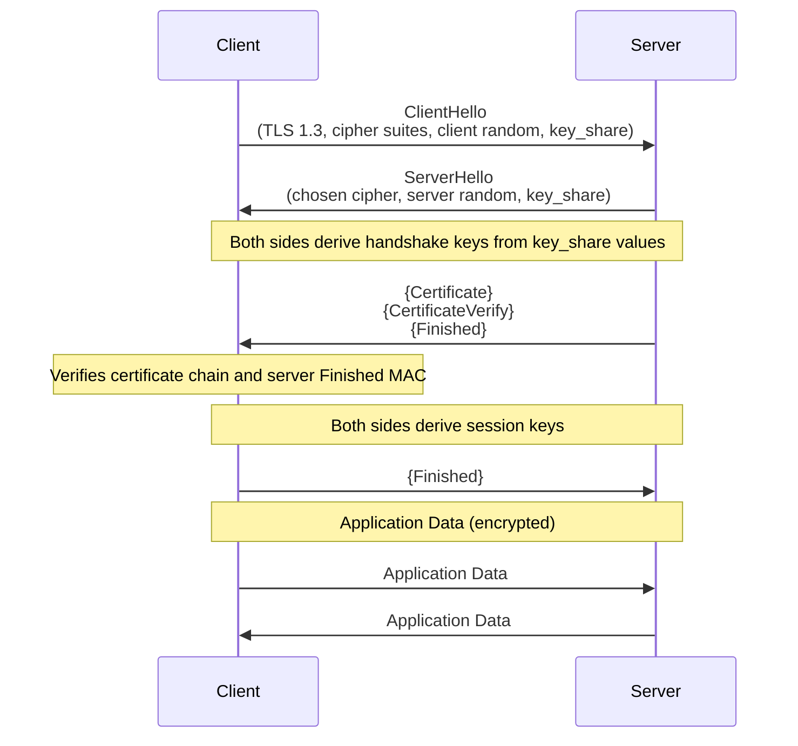

# Trace a TLS Handshake

> Before a single byte of HTTPS data travels, client and server exchange five messages to establish a shared secret — understanding those messages means you'll never be confused by a TLS error again.

**Type:** Learn
**Languages:** Bash
**Prerequisites:** Phase 0, Lesson 02 — Install Wireshark and Capture Your First Packet
**Time:** ~35 minutes

## Learning Objectives
- Capture a TLS 1.3 handshake using Wireshark and label each message
- Describe the purpose of ClientHello, ServerHello, Certificate, and Finished messages
- Explain how TLS establishes a shared secret without ever transmitting it
- Distinguish between the handshake and the record layer
- Read a server's certificate chain and identify the certificate authority

## The Problem

Every HTTPS connection begins with a TLS handshake. It takes ~1 extra round trip (TLS 1.3) or 2 round trips (TLS 1.2) before any data flows. If the handshake fails, you get a browser warning, a `curl: (60) SSL certificate problem`, or a silent connection timeout.

Developers who don't understand the handshake:
- Can't diagnose certificate errors ("What does 'certificate not trusted' actually mean?")
- Don't know what SNI is or why it matters for virtual hosting
- Can't debug TLS misconfigurations in production (cipher suite mismatch, expired cert, HSTS issues)
- Don't understand why TLS 1.3 is faster than TLS 1.2

## The Concept

### TLS 1.3 Handshake Overview



### The TLS Record Layer

TLS sits on top of TCP. TCP provides a reliable byte stream; TLS adds confidentiality, integrity, and authentication. Every byte transmitted after the TCP connection is established is wrapped in a TLS record:

```
TCP byte stream contains TLS records:
┌─────────────────────────────────────────────────────────┐
│ TLS Record                                              │
│  Content Type (1 byte): 20=change_cipher 21=alert       │
│                         22=handshake   23=application   │
│  Version (2 bytes):     TLS 1.0–1.3 version number      │
│  Length (2 bytes):      length of the payload below     │
│  Payload (variable):    the actual data                  │
└─────────────────────────────────────────────────────────┘
```

### TLS 1.3 Handshake Sequence

TLS 1.3 completes in 1 round trip (compared to TLS 1.2's 2 round trips):

```
Client                                          Server
  │                                               │
  │─── ClientHello ──────────────────────────────▶│
  │    (TLS version, cipher suites, key share,    │
  │     extensions: SNI, ALPN, etc.)              │
  │                                               │
  │◀── ServerHello ──────────────────────────────│
  │    (selected cipher, key share)               │
  │◀── {EncryptedExtensions} ────────────────────│
  │◀── {Certificate} ────────────────────────────│
  │◀── {CertificateVerify} ──────────────────────│
  │◀── {Finished} ───────────────────────────────│
  │                 ← encrypted from here →      │
  │─── {Finished} ──────────────────────────────▶│
  │                                               │
  │═══════════ Application Data ═════════════════│
  │            (HTTP/1.1, HTTP/2, etc.)           │
```

Messages in `{curly braces}` are encrypted.

### The Key Exchange Problem

The fundamental challenge: client and server must agree on an encryption key, but they can only communicate over a network that attackers can read. How do you share a secret over a public channel?

The answer is **Diffie-Hellman key exchange**. Here's the intuition:

```
1. Client and server publicly agree on a large prime p and base g.
   (These are in the ClientHello and ServerHello "key_share" extension.)

2. Client picks a secret number 'a', computes A = g^a mod p, sends A.
3. Server picks a secret number 'b', computes B = g^b mod p, sends B.

4. Client computes: B^a mod p = (g^b)^a mod p = g^(ab) mod p
5. Server computes: A^b mod p = (g^a)^b mod p = g^(ab) mod p

Both arrive at g^(ab) mod p — the shared secret.
An attacker who sees A and B cannot easily compute 'ab' (discrete log problem).
```

In TLS 1.3, this is done with Elliptic Curve Diffie-Hellman (ECDH) — same concept, faster math.

### What the Certificate Proves

After the key exchange, the client needs to verify it's talking to the REAL server, not a man-in-the-middle who intercepted the connection and is doing their own key exchange.

The certificate proves identity:
1. The server sends its certificate (contains the server's public key + domain name + CA signature)
2. The client verifies the certificate was signed by a Certificate Authority (CA) it trusts
3. The server proves it owns the private key corresponding to the public key in the certificate
4. The client now knows: this is the real server for that domain

```
Certificate Chain:
  Server Cert   (signed by →) Intermediate CA
  Intermediate CA (signed by →) Root CA
  Root CA   (self-signed, pre-installed in your OS/browser)
```

### SNI — Server Name Indication

Like the HTTP `Host` header, TLS needs to know which certificate to present before the handshake is complete (since multiple HTTPS sites may share one IP). The client sends the target hostname in the ClientHello's **Server Name Indication (SNI) extension** — in plaintext, before any encryption.

This is why TLS 1.3's "Encrypted Client Hello" (ECH) is being developed — to encrypt the SNI.

## Build It

### Step 1: Capture the Handshake with Wireshark

Open Wireshark and start a capture on your main network interface (Wi-Fi or Ethernet).

Apply a capture filter to reduce noise:

```
host example.com and port 443
```

Or leave the capture running and use a display filter afterward.

In a terminal:

```bash
curl -v https://example.com > /dev/null
```

Stop the capture. Now apply the display filter:

```
ssl or tls
```

### Step 2: Label the Wireshark Packets

Find and click on each packet type:

**Client Hello** — first TLS packet from client to server
- In the detail pane, expand: `Transport Layer Security → TLSv1.3 Record Layer → Handshake Protocol: Client Hello`
- Find: `Handshake Type: Client Hello (1)`
- Expand `Extension: server_name` → see the SNI (should say `example.com`)
- Expand `Extension: supported_versions` → see `TLS 1.3`
- Expand `Extension: key_share` → see the client's ECDH public key

**Server Hello** — first TLS packet from server to client
- `Handshake Type: Server Hello (2)`
- `Cipher Suite` — the negotiated cipher (e.g., `TLS_AES_256_GCM_SHA384`)
- `Extension: key_share` → server's ECDH public key

**Certificate** — server's certificate (encrypted in TLS 1.3)
- In TLS 1.3, this appears as `Application Data` in Wireshark because it's encrypted
- To view it unencrypted, see Step 5 (decryption with SSLKEYLOGFILE)

**Finished** — confirms the handshake is complete
- Also encrypted in TLS 1.3

### Step 3: Use OpenSSL to See the Handshake in Detail

`openssl s_client` is a command-line tool that connects via TLS and shows every handshake detail:

```bash
# Connect and show full certificate chain
openssl s_client -connect example.com:443 -showcerts

# Specify TLS 1.3 only
openssl s_client -connect example.com:443 -tls1_3

# Show the full handshake debug output
openssl s_client -connect example.com:443 -tlsextdebug -msg
```

The output shows:

```
CONNECTED(00000003)
depth=2 C = US, O = DigiCert Inc, OU = www.digicert.com, CN = DigiCert Global Root CA
verify return:1
depth=1 C = US, O = DigiCert Inc, CN = DigiCert TLS RSA SHA256 2020 CA1
verify return:1
depth=0 C = US, ST = California, L = Los Angeles, O = Internet Corporation for Assigned Names and Numbers, CN = www.example.org
verify return:1
---
Certificate chain
 0 s:CN = www.example.org
   i:CN = DigiCert TLS RSA SHA256 2020 CA1
 1 s:CN = DigiCert TLS RSA SHA256 2020 CA1
   i:CN = DigiCert Global Root CA
```

This shows the certificate chain: server cert → intermediate CA → root CA.

### Step 4: Read the Certificate Details

```bash
# Get the server's certificate and decode it
echo | openssl s_client -connect example.com:443 2>/dev/null | \
  openssl x509 -noout -text

# Show just key fields
echo | openssl s_client -connect example.com:443 2>/dev/null | \
  openssl x509 -noout -subject -issuer -dates -fingerprint

# Check certificate validity period
echo | openssl s_client -connect example.com:443 2>/dev/null | \
  openssl x509 -noout -dates
```

Identify these fields:
- `Subject`: who the certificate was issued to (includes `CN = example.com`)
- `Issuer`: which CA signed it
- `Not Before` / `Not After`: validity period
- `Subject Alternative Names`: other domains this cert covers

### Step 5: Decrypt TLS Traffic in Wireshark (Optional — Firefox/Chrome)

Modern browsers can log TLS session keys to a file, which Wireshark uses to decrypt captured traffic:

```bash
# Set the environment variable before launching the browser
export SSLKEYLOGFILE=~/tls_keys.log

# On macOS
/Applications/Firefox.app/Contents/MacOS/firefox &
# Or Chrome: /Applications/Google\ Chrome.app/Contents/MacOS/Google\ Chrome &

# Now visit https://example.com in the browser
# Close the browser
```

In Wireshark:
1. Go to `Edit → Preferences → Protocols → TLS`
2. Set `(Pre)-Master-Secret log filename` to `~/tls_keys.log`
3. Re-open your pcap (or re-capture)
4. Now you can see the decrypted `Certificate`, `CertificateVerify`, and `Finished` messages

### Step 6: Compare TLS 1.2 vs TLS 1.3 Round Trips

```bash
# Force TLS 1.2 (if server supports it)
curl -v --tlsv1.2 --tls-max 1.2 https://example.com 2>&1 | grep "SSL connection"

# TLS 1.3 (default)
curl -v https://example.com 2>&1 | grep "SSL connection"

# Time both
time curl -o /dev/null -s --tlsv1.2 --tls-max 1.2 https://cloudflare.com
time curl -o /dev/null -s --tlsv1.3 https://cloudflare.com
```

TLS 1.3 should be measurably faster due to fewer round trips.

## Exercises

1. **Certificate expiry monitoring**: Write a bash script that checks the certificate expiry date for 5 domains and prints a warning if any expire within 30 days. Use `openssl s_client` + `openssl x509 -dates` + `date` arithmetic.

2. **SNI without TLS**: Connect with `openssl s_client -noservername` to see what happens when you don't send SNI. Does the server use a default certificate? Does it fail?

3. **Capture and compare**: Capture TLS traffic to two different sites in Wireshark. Compare the cipher suites offered in each ClientHello and selected in each ServerHello. Which site uses a stronger cipher?

4. **Certificate chain validation**: Use `openssl verify` to manually verify a downloaded certificate against its CA chain. Download the cert with `openssl s_client -showcerts`, save the chain to files, and run `openssl verify -CAfile chain.pem server.pem`.

5. **TLS 1.3 0-RTT**: Research TLS 1.3's 0-RTT (Zero Round Trip Time Resumption) feature. What does it allow? What are its security tradeoffs? When would you disable it?

## Key Terms

| Term | What people say | What it actually means |
|------|----------------|------------------------|
| TLS handshake | "SSL negotiation" | The initial exchange of messages (ClientHello, ServerHello, Certificate, Finished) that establishes encryption keys and authenticates the server before any application data flows |
| ClientHello | "connection start" | The first TLS message from client to server; contains supported TLS versions, cipher suites, extensions (SNI, ALPN), and the client's key share for Diffie-Hellman |
| ServerHello | "server responds" | The server's selection of TLS version and cipher suite, plus its own key share; after this, both sides can derive the session keys |
| Certificate | "TLS cert" | A file containing a public key, the domain name it applies to, and a digital signature from a Certificate Authority; proves the server's identity |
| Certificate Authority (CA) | "who signed the cert" | A trusted third party whose root certificates are pre-installed in operating systems and browsers; a CA's signature on a certificate vouches for the domain-to-key binding |
| SNI | "Server Name Indication" | A TLS ClientHello extension that sends the target hostname in plaintext so the server can choose the right certificate for virtual hosting |
| ECDH | "key exchange" | Elliptic Curve Diffie-Hellman; the math that lets two parties establish a shared secret over a public channel without transmitting the secret itself |
| Forward secrecy | "perfect forward secrecy" | The property that compromise of long-term keys (server private key) does not compromise past session keys; ECDH provides this because session keys are generated fresh each connection |
