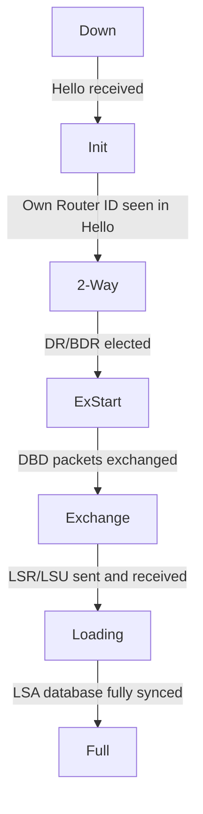

# Configure OSPF with FRRouting

> Three Linux routers, zero static routes — OSPF learns the topology and fills the routing table automatically.

**Type:** Build
**Languages:** Bash
**Prerequisites:** Phase 2, Lesson 03 — IP Routing Fundamentals
**Time:** ~55 minutes

## Learning Objectives
- Explain the difference between link-state and distance-vector routing protocols
- Create isolated router namespaces connected by virtual Ethernet pairs
- Install and configure FRRouting (FRR) to run OSPF on each router
- Verify that OSPF-learned routes appear in `ip route` on every router
- Read the Link State Database (LSDB) output and identify each LSA type

## The Problem

Imagine you are running a company with three offices. Each office has its own router. You manually typed a static route on each router telling it how to reach the other two. That worked fine — until you added a fourth office, then a fifth. Every change meant touching every router by hand. One typo and half the network went dark.

Static routes also have no concept of failure. If the link between Office A and Office B goes down, your static routes still point at the dead link. Traffic silently drops. Nobody knows until the CEO calls.

Real networks use routing protocols to solve this. A routing protocol is software that runs on every router, exchanges topology information with neighbors, and automatically computes the best path to every destination. When a link fails, the protocol detects it and re-computes. No human intervention needed.

OSPF (Open Shortest Path First) is the dominant interior gateway protocol in enterprise and service-provider networks. It is "link-state," meaning every router learns the complete map of the network and independently runs Dijkstra's shortest path algorithm. This lesson builds a three-router OSPF lab entirely inside Linux network namespaces — no physical hardware, no VMs.

## The Concept

### OSPF Neighbor State Machine



### Link-State vs Distance-Vector

There are two main families of routing protocol:

**Distance-vector** (RIP, older): Each router only tells its direct neighbors what it knows. Information spreads hop by hop, like a game of telephone. Routers never see the full map — they just see distances and directions. Convergence is slow.

**Link-state** (OSPF, IS-IS): Each router floods a description of its own local links to every other router in the network. After flooding, every router has an identical copy of the full topology. Each router then runs Dijkstra locally. Convergence is fast.

```
Distance-Vector                Link-State
──────────────                 ──────────
R1 tells R2:                   R1 floods to everyone:
  "I can reach 10.0.3.0        "I have links to R2 (cost 1)
   in 2 hops"                   and R3 (cost 10)"

R2 trusts R1's claim.          R2 now has full map,
R2 never sees the map.         runs Dijkstra itself.
```

### OSPF Key Concepts

**Router ID**: A 32-bit number (written as an IPv4 address) that uniquely identifies a router in the OSPF domain. Usually the highest IP on a loopback.

**Hello packets**: Sent every 10 seconds on each interface. Discovers and maintains neighbor relationships. If you miss 4 hellos (40 seconds = Dead Interval), the neighbor is declared down.

**Adjacency**: Two routers that have completed the full OSPF handshake and synchronised their LSDBs. Not every neighbor becomes adjacent — on broadcast networks there is a Designated Router (DR) election.

**LSA (Link State Advertisement)**: The fundamental unit of OSPF information. A router LSA describes a router's interfaces and their costs. A network LSA describes a multi-access segment. LSAs are flooded network-wide.

**LSDB (Link State Database)**: The collection of all LSAs a router has received. Every router in the same OSPF area has an identical LSDB (that's the invariant OSPF maintains).

**SPF (Shortest Path First)**: After the LSDB is complete, each router runs Dijkstra's algorithm, treating the LSDB as a weighted graph, to compute the shortest path tree rooted at itself.

**Area**: OSPF scales by dividing the network into areas. All basic deployments use Area 0 (the backbone area). We will use a single Area 0 in this lab.

### The Lab Topology

```
        10.0.12.0/30          10.0.23.0/30
  R1 ──────────────── R2 ──────────────── R3
 .1                .2/.1               .2

Loopbacks:
  R1: 192.168.1.1/32
  R2: 192.168.2.2/32
  R3: 192.168.3.3/32

OSPF Area 0 everywhere.
Goal: R1 can ping R3's loopback 192.168.3.3 via OSPF-learned route.
```

Three routers, two point-to-point links. R1 and R3 are not directly connected. OSPF must learn the path R1 → R2 → R3.

### Linux Network Namespaces as Routers

A Linux network namespace is an isolated copy of the kernel networking stack: its own interfaces, routing table, iptables, etc. We use three namespaces as three routers, connected by `veth` (virtual Ethernet) pairs. A veth pair is like a patch cable: packets in one end come out the other.

## Build It

### Step 1: Install FRRouting

FRRouting is an open-source routing suite that implements OSPF, BGP, RIP, and others. Install it on a Linux system (Ubuntu/Debian):

```bash
# Add FRR repository
curl -s https://deb.frrouting.org/frr/keys.gpg | sudo tee /usr/share/keyrings/frrouting.gpg > /dev/null
echo "deb [signed-by=/usr/share/keyrings/frrouting.gpg] https://deb.frrouting.org/frr $(lsb_release -s -c) frr-stable" | \
  sudo tee /etc/apt/sources.list.d/frr.list

sudo apt update && sudo apt install -y frr frr-pythontools
```

Enable the OSPF daemon:

```bash
# Tell FRR to start the OSPF daemon
sudo sed -i 's/^ospfd=no/ospfd=yes/' /etc/frr/daemons
```

### Step 2: Create the Namespace Topology

Run this entire script as root. Save it as `setup-ospf-lab.sh`:

```bash
#!/usr/bin/env bash
set -euo pipefail

# ── Clean up any previous run ──────────────────────────────────────────────
for ns in r1 r2 r3; do
  ip netns del "$ns" 2>/dev/null || true
done

# ── Create three router namespaces ─────────────────────────────────────────
ip netns add r1
ip netns add r2
ip netns add r3

# ── Create veth pairs (virtual patch cables) ───────────────────────────────
# r1-r2 link: veth12 (in r1) <---> veth21 (in r2)
ip link add veth12 type veth peer name veth21
ip link set veth12 netns r1
ip link set veth21 netns r2

# r2-r3 link: veth23 (in r2) <---> veth32 (in r3)
ip link add veth23 type veth peer name veth32
ip link set veth23 netns r2
ip link set veth32 netns r3

# ── Add loopback interfaces ─────────────────────────────────────────────────
ip netns exec r1 ip link set lo up
ip netns exec r2 ip link set lo up
ip netns exec r3 ip link set lo up

# ── Assign IP addresses ─────────────────────────────────────────────────────
# R1
ip netns exec r1 ip addr add 192.168.1.1/32 dev lo        # loopback = router ID
ip netns exec r1 ip addr add 10.0.12.1/30  dev veth12
ip netns exec r1 ip link set veth12 up

# R2
ip netns exec r2 ip addr add 192.168.2.2/32 dev lo
ip netns exec r2 ip addr add 10.0.12.2/30  dev veth21
ip netns exec r2 ip addr add 10.0.23.1/30  dev veth23
ip netns exec r2 ip link set veth21 up
ip netns exec r2 ip link set veth23 up

# R3
ip netns exec r3 ip addr add 192.168.3.3/32 dev lo
ip netns exec r3 ip addr add 10.0.23.2/30  dev veth32
ip netns exec r3 ip link set veth32 up

# ── Enable IP forwarding in each namespace ──────────────────────────────────
ip netns exec r1 sysctl -qw net.ipv4.ip_forward=1
ip netns exec r2 sysctl -qw net.ipv4.ip_forward=1
ip netns exec r3 sysctl -qw net.ipv4.ip_forward=1

echo "Namespaces and links are up."
ip netns exec r1 ip addr
ip netns exec r2 ip addr
ip netns exec r3 ip addr
```

Run it:

```bash
sudo bash setup-ospf-lab.sh
```

Verify connectivity across the first link:

```bash
# R1 should be able to ping R2's interface
sudo ip netns exec r1 ping -c2 10.0.12.2
```

### Step 3: Write FRR Configuration for Each Router

FRR reads per-router config from `/etc/frr/`. In a namespace lab we keep config in separate files and point FRR at them. The easiest approach for a lab is to use `vtysh` (FRR's CLI) after starting FRR inside each namespace.

However, the simplest self-contained approach is to write config files and start `zebra` + `ospfd` directly inside each namespace. Save these three files:

**`/tmp/frr-r1.conf`**

```
! FRR config for R1
frr version 8.5
frr defaults traditional
hostname r1
!
interface lo
 ip address 192.168.1.1/32
!
interface veth12
 ip ospf network point-to-point
 ip ospf cost 1
!
router ospf
 ospf router-id 192.168.1.1
 network 192.168.1.1/32 area 0
 network 10.0.12.0/30   area 0
!
```

**`/tmp/frr-r2.conf`**

```
! FRR config for R2
frr version 8.5
frr defaults traditional
hostname r2
!
interface lo
 ip address 192.168.2.2/32
!
interface veth21
 ip ospf network point-to-point
 ip ospf cost 1
!
interface veth23
 ip ospf network point-to-point
 ip ospf cost 1
!
router ospf
 ospf router-id 192.168.2.2
 network 192.168.2.2/32 area 0
 network 10.0.12.0/30   area 0
 network 10.0.23.0/30   area 0
!
```

**`/tmp/frr-r3.conf`**

```
! FRR config for R3
frr version 8.5
frr defaults traditional
hostname r3
!
interface lo
 ip address 192.168.3.3/32
!
interface veth32
 ip ospf network point-to-point
 ip ospf cost 1
!
router ospf
 ospf router-id 192.168.3.3
 network 192.168.3.3/32 area 0
 network 10.0.23.0/30   area 0
!
```

### Step 4: Start FRR Inside Each Namespace

```bash
#!/usr/bin/env bash
# start-frr-lab.sh — run as root

# FRR needs its own run directories per namespace
for ns in r1 r2 r3; do
  mkdir -p /var/run/frr-$ns
  mkdir -p /var/log/frr-$ns
done

start_router() {
  local ns=$1
  local conf=/tmp/frr-${ns}.conf

  # Start zebra (kernel routing integration) inside namespace
  ip netns exec "$ns" /usr/lib/frr/zebra \
    --config_file "$conf" \
    --pid_file /var/run/frr-${ns}/zebra.pid \
    --log file:/var/log/frr-${ns}/zebra.log \
    --vty_socket /var/run/frr-${ns}/zebra.vty \
    --daemon

  sleep 1   # zebra must be ready before ospfd connects

  # Start ospfd
  ip netns exec "$ns" /usr/lib/frr/ospfd \
    --config_file "$conf" \
    --pid_file /var/run/frr-${ns}/ospfd.pid \
    --log file:/var/log/frr-${ns}/ospfd.log \
    --vty_socket /var/run/frr-${ns}/ospfd.vty \
    --daemon
}

start_router r1
start_router r2
start_router r3

echo "FRR started in all namespaces. Waiting 15s for OSPF to converge..."
sleep 15
echo "Done."
```

```bash
sudo bash start-frr-lab.sh
```

### Step 5: Verify OSPF Convergence

Check the routing table on R1. You should see routes to R3's loopback and to the 10.0.23.0/30 segment:

```bash
sudo ip netns exec r1 ip route show

# Expected output (OSPF routes have proto ospf):
# 10.0.12.0/30 dev veth12 proto kernel scope link src 10.0.12.1
# 10.0.23.0/30 nhid 2 via 10.0.12.2 dev veth12 proto ospf metric 20
# 192.168.2.2 nhid 2 via 10.0.12.2 dev veth12 proto ospf metric 20
# 192.168.3.3 nhid 2 via 10.0.12.2 dev veth12 proto ospf metric 20
```

Ping R3's loopback from R1:

```bash
sudo ip netns exec r1 ping -c3 192.168.3.3
# Should succeed — OSPF provided the path
```

Inspect the LSDB using vtysh (FRR's interactive shell):

```bash
sudo ip netns exec r1 vtysh \
  --vty_socket /var/run/frr-r1/ospfd.vty \
  -c "show ip ospf database"
```

You will see Router LSAs for each of the three routers. Each LSA lists that router's links and their costs.

Check neighbor state:

```bash
sudo ip netns exec r2 vtysh \
  --vty_socket /var/run/frr-r2/ospfd.vty \
  -c "show ip ospf neighbor"
# R2 should show FULL adjacency with both R1 and R3
```

`FULL` means both routers have exchanged and synchronised their LSDBs. Any other state (EXSTART, EXCHANGE, LOADING) means negotiation is still in progress.

### Step 6: Tear Down

```bash
sudo ip netns del r1
sudo ip netns del r2
sudo ip netns del r3
# FRR processes inside namespaces die automatically when the namespace is deleted
```

## Exercises

1. **Verify the LSDB is identical** on all three routers. Run `show ip ospf database` on each and compare. They should list the same set of LSAs.

2. **Change a link cost** on R1's veth12 interface to 100 (via `ip ospf cost 100` in the FRR config) and restart ospfd on R1. Verify that `ip route` on R1 still shows R3's loopback as reachable and that the metric has changed.

3. **Add a fourth router R4** connected only to R3. Write the namespace, veth pair, and FRR config. Verify R1 can ping R4's loopback.

4. **Inspect a specific LSA** with `show ip ospf database router 192.168.2.2`. Decode what each field means using the OSPF RFC 2328 as reference.

5. **Watch OSPF packets** with `ip netns exec r1 tcpdump -i veth12 -n proto ospf`. You will see Hello packets every 10 seconds and LSU (Link State Update) packets during convergence. Identify each packet type.

## Key Terms

| Term | What people say | What it actually means |
|------|----------------|------------------------|
| OSPF | "OSPF is a routing protocol" | A link-state IGP that floods LSAs and runs Dijkstra to find shortest paths |
| FRRouting | "FRR" | An open-source fork of Quagga that implements OSPF, BGP, RIP, IS-IS, and others on Linux |
| LSA | "Link State Advertisement" | A data structure describing one router's local links, flooded to every router in the area |
| LSDB | "Link State Database" | The complete collection of LSAs; every router in an area has an identical copy |
| Adjacency | "neighbors are adjacent" | Two OSPF routers that have fully exchanged and synchronised their LSDBs (state = FULL) |
| Router ID | "RID" | A 32-bit identifier, written as an IP address, that uniquely names a router in the OSPF domain |
| Area 0 | "backbone area" | The mandatory central area in OSPF; all other areas must connect to it |
| veth pair | "virtual ethernet" | A Linux kernel construct: two virtual NICs wired together — what goes in one end comes out the other |
