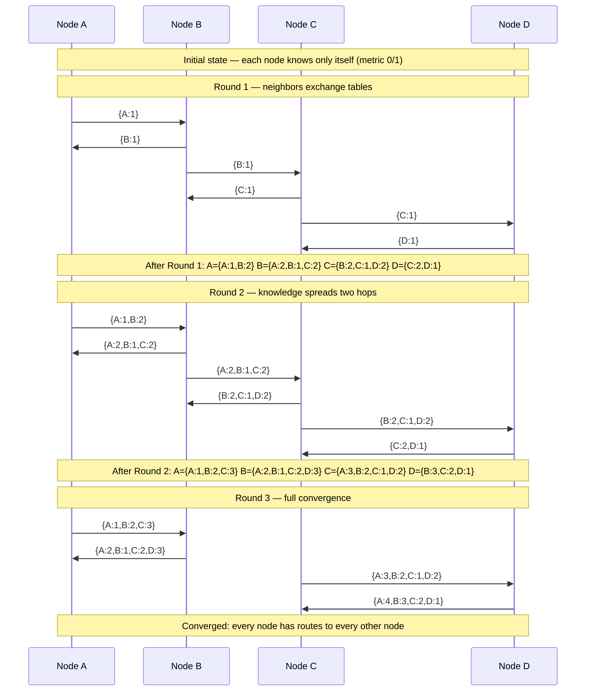

# Implement RIP in Python

> Distance-vector routing in 200 lines of Python: no FRRouting, no kernel magic — just UDP packets and a routing table dictionary.

**Type:** Build
**Languages:** Python
**Prerequisites:** Phase 3, Lesson 06 — UDP Sockets
**Time:** ~55 minutes

## Learning Objectives
- Describe how distance-vector routing works and where it breaks down
- Implement a RIP v2 message encoder and decoder in Python
- Exchange routing updates over UDP between four Python processes
- Apply split horizon to prevent simple routing loops
- Verify convergence by inspecting each node's routing table after startup

## The Problem

Understanding a routing protocol means nothing until you implement one. OSPF and BGP are too complex to implement from scratch in a single lesson — they have thousands of lines of specification. But RIP (Routing Information Protocol) is deliberately simple. Version 2 fits in a single RFC (2453) and the wire format is a flat binary structure.

More importantly, building RIP exposes the fundamental problems of distance-vector routing: slow convergence, counting to infinity, and the need for split horizon. You will see these problems arise naturally as you test your implementation.

## The Concept

### RIP Convergence: Bellman-Ford Over 3 Rounds



### Distance-Vector Routing

Each router maintains a routing table: a mapping from destination prefix to (next-hop, distance). Initially a router only knows about its directly connected networks (distance 0).

Every 30 seconds (in standard RIP), each router sends its entire routing table to all directly connected neighbors. A neighbor receives the table, adds 1 to each distance (the cost of the link), and updates its own table with any routes that are better (lower distance) or new.

```
Initial state (4 nodes in a line: A-B-C-D):

A knows: {A: 0}
B knows: {B: 0}
C knows: {C: 0}
D knows: {D: 0}

After round 1 (each node hears from neighbors):
A knows: {A:0, B:1}
B knows: {B:0, A:1, C:1}
C knows: {C:0, B:1, D:1}
D knows: {D:0, C:1}

After round 2:
A knows: {A:0, B:1, C:2}
B knows: {B:0, A:1, C:1, D:2}
C knows: {C:0, B:1, A:2, D:1}
D knows: {D:0, C:1, B:2, A:3}

After round 3: all nodes have complete tables.
```

### RIP v2 Wire Format

RIP messages are UDP datagrams on port 520. The format is simple binary:

```
 0                   1                   2                   3
 0 1 2 3 4 5 6 7 8 9 0 1 2 3 4 5 6 7 8 9 0 1 2 3 4 5 6 7 8 9 0 1
+-+-+-+-+-+-+-+-+-+-+-+-+-+-+-+-+-+-+-+-+-+-+-+-+-+-+-+-+-+-+-+-+
|  command (1)  |  version (2)  |        must be zero           |  ← 4 bytes header
+-+-+-+-+-+-+-+-+-+-+-+-+-+-+-+-+-+-+-+-+-+-+-+-+-+-+-+-+-+-+-+-+
|  address family (2=IPv4)      |      route tag                |  \
+-+-+-+-+-+-+-+-+-+-+-+-+-+-+-+-+-+-+-+-+-+-+-+-+-+-+-+-+-+-+-+-+  |
|                         IP address                            |  | 20 bytes per entry
+-+-+-+-+-+-+-+-+-+-+-+-+-+-+-+-+-+-+-+-+-+-+-+-+-+-+-+-+-+-+-+-+  | (up to 25 entries)
|                         subnet mask                           |  |
+-+-+-+-+-+-+-+-+-+-+-+-+-+-+-+-+-+-+-+-+-+-+-+-+-+-+-+-+-+-+-+-+  |
|                         next hop                              |  |
+-+-+-+-+-+-+-+-+-+-+-+-+-+-+-+-+-+-+-+-+-+-+-+-+-+-+-+-+-+-+-+-+  |
|                           metric                              |  /
+-+-+-+-+-+-+-+-+-+-+-+-+-+-+-+-+-+-+-+-+-+-+-+-+-+-+-+-+-+-+-+-+

Command: 1 = request, 2 = response
Metric: 1-15 = reachable, 16 = infinity (unreachable)
```

### The Counting-to-Infinity Problem

When a route disappears, distance-vector protocols can get stuck in a loop:

```
A ─── B ─── C

C has a route to network X (metric 1).
B has a route to X via C (metric 2).

Now C's link to X goes down. C sets X = infinity.
But before C can tell B, B sends C an update saying "I can reach X in 2 hops".
C thinks: "B can reach X! I'll use B, cost 3."
B hears back from C: "C can reach X in 3 hops. I'll use C, cost 4."
...they count up to 16 (infinity) before giving up.
```

**Split horizon** prevents this: don't advertise a route back out the interface you learned it from. B learned about X from C, so B will not advertise X back to C.

### Four-Node Topology

```
  192.168.1.0/24    192.168.2.0/24    192.168.3.0/24
  [Node A] ──────── [Node B] ──────── [Node C] ──────── [Node D]
  127.0.0.1:5200   127.0.0.1:5201   127.0.0.1:5202   127.0.0.1:5203

Simulated on one machine using different ports.
"Links" = knowledge of which ports are neighbors.
```

## Build It

Save the complete implementation as `rip.py`:

```python
#!/usr/bin/env python3
"""
Minimal RIP v2 implementation.
Usage: python3 rip.py <node_name> <listen_port> <own_prefix> <neighbor_port> [<neighbor_port> ...]
Example:
  python3 rip.py A 5200 192.168.1.0/24 5201
  python3 rip.py B 5201 192.168.2.0/24 5200 5202
  python3 rip.py C 5202 192.168.3.0/24 5201 5203
  python3 rip.py D 5203 192.168.4.0/24 5202
"""
import sys
import socket
import struct
import threading
import time
import ipaddress

# RIP constants
RIP_PORT       = 520          # standard port; we override via argv
RIP_RESPONSE   = 2            # message command = response
RIP_VERSION    = 2
RIP_INFINITY   = 16           # metric 16 = unreachable
UPDATE_INTERVAL = 5           # seconds between updates (30 in real RIP)
TIMEOUT_SECS    = 18          # 3× update interval — route expires if no update
HEADER_FMT      = "!BBH"      # command, version, reserved
ENTRY_FMT       = "!HHIIIi"   # afi, tag, addr, mask, nexthop, metric
HEADER_SIZE     = struct.calcsize(HEADER_FMT)
ENTRY_SIZE      = struct.calcsize(ENTRY_FMT)


def ip_to_int(ip_str: str) -> int:
    """Convert dotted-decimal IP string to integer."""
    return int(ipaddress.IPv4Address(ip_str))


def int_to_ip(n: int) -> str:
    """Convert integer to dotted-decimal IP string."""
    return str(ipaddress.IPv4Address(n))


def prefix_to_mask(prefix: str) -> int:
    """Convert prefix length to integer subnet mask."""
    net = ipaddress.IPv4Network(prefix, strict=False)
    return int(net.netmask)


def prefix_network(prefix: str) -> str:
    """Return network address string from a prefix like 192.168.1.5/24."""
    return str(ipaddress.IPv4Network(prefix, strict=False).network_address)


class RoutingTable:
    """
    Thread-safe routing table.
    Each entry: { prefix_str: {"metric": int, "nexthop": str, "via_port": int, "expires": float} }
    """

    def __init__(self, own_prefix: str, own_port: int):
        self._lock = threading.Lock()
        self._table: dict = {}
        net = str(ipaddress.IPv4Network(own_prefix, strict=False))
        # Directly connected route — metric 0, never expires
        self._table[net] = {
            "metric":   1,        # RIP cost of directly connected = 1
            "nexthop":  "0.0.0.0",
            "via_port": None,     # learned locally
            "expires":  float("inf"),
        }
        self.own_prefix = net
        self.own_port   = own_port

    def update(self, prefix: str, metric: int, nexthop: str, via_port: int):
        """
        Consider a new route. Apply Bellman-Ford:
        if metric is better than current, install it.
        Split horizon: caller must not pass routes learned from via_port back to via_port.
        """
        with self._lock:
            existing = self._table.get(prefix)
            if existing is None or metric < existing["metric"]:
                self._table[prefix] = {
                    "metric":   metric,
                    "nexthop":  nexthop,
                    "via_port": via_port,
                    "expires":  time.time() + TIMEOUT_SECS,
                }
                return True   # table changed
            elif metric == existing["metric"] and via_port == existing["via_port"]:
                # Same route, refresh expiry
                self._table[prefix]["expires"] = time.time() + TIMEOUT_SECS
            return False

    def expire_routes(self):
        """Mark routes that have not been refreshed as unreachable (metric 16)."""
        now = time.time()
        with self._lock:
            for prefix, entry in self._table.items():
                if entry["expires"] != float("inf") and now > entry["expires"]:
                    entry["metric"] = RIP_INFINITY

    def routes_for(self, exclude_port: int):
        """
        Return list of (prefix, metric, nexthop) excluding routes
        learned from exclude_port (split horizon).
        """
        with self._lock:
            result = []
            for prefix, entry in self._table.items():
                if entry["via_port"] == exclude_port:
                    continue   # split horizon: don't advertise back
                result.append((prefix, entry["metric"], entry["nexthop"]))
            return result

    def display(self, node_name: str):
        with self._lock:
            print(f"\n[{node_name}] Routing Table (t={time.strftime('%H:%M:%S')})")
            print(f"  {'Prefix':<22} {'Metric':>7}  {'NextHop':<18} {'LearnedFrom'}")
            print(f"  {'-'*22} {'-'*7}  {'-'*18} {'-'*12}")
            for prefix, entry in sorted(self._table.items()):
                src = "local" if entry["via_port"] is None else f":{entry['via_port']}"
                reachable = f"{entry['metric']}" if entry["metric"] < RIP_INFINITY else "∞ (unreachable)"
                print(f"  {prefix:<22} {reachable:>7}  {entry['nexthop']:<18} {src}")


def encode_rip_response(entries: list) -> bytes:
    """
    Encode a RIP v2 response packet.
    entries: list of (prefix_str, metric, nexthop_str)
    Returns raw bytes.
    """
    header = struct.pack(HEADER_FMT, RIP_RESPONSE, RIP_VERSION, 0)
    body = b""
    for prefix_str, metric, nexthop_str in entries[:25]:  # RIP max 25 entries
        net    = ipaddress.IPv4Network(prefix_str, strict=False)
        addr   = int(net.network_address)
        mask   = int(net.netmask)
        nh     = ip_to_int(nexthop_str) if nexthop_str != "0.0.0.0" else 0
        metric = min(metric, RIP_INFINITY)
        body  += struct.pack(ENTRY_FMT, 2, 0, addr, mask, nh, metric)
    return header + body


def decode_rip_response(data: bytes) -> list:
    """
    Decode a RIP v2 response packet.
    Returns list of (prefix_str, metric, nexthop_str) or empty list on error.
    """
    if len(data) < HEADER_SIZE:
        return []
    cmd, ver, _ = struct.unpack(HEADER_FMT, data[:HEADER_SIZE])
    if cmd != RIP_RESPONSE or ver != RIP_VERSION:
        return []
    entries = []
    offset = HEADER_SIZE
    while offset + ENTRY_SIZE <= len(data):
        afi, tag, addr, mask, nexthop, metric = struct.unpack(
            ENTRY_FMT, data[offset:offset + ENTRY_SIZE]
        )
        offset += ENTRY_SIZE
        if afi != 2:
            continue
        net_addr = int_to_ip(addr)
        mask_str = int_to_ip(mask)
        prefix   = f"{net_addr}/{ipaddress.IPv4Network(f'0.0.0.0/{mask_str}').prefixlen}"
        nh_str   = int_to_ip(nexthop) if nexthop else "0.0.0.0"
        entries.append((prefix, metric, nh_str))
    return entries


class RIPNode:
    def __init__(self, name: str, listen_port: int, own_prefix: str, neighbor_ports: list):
        self.name           = name
        self.listen_port    = listen_port
        self.neighbor_ports = neighbor_ports
        self.table          = RoutingTable(own_prefix, listen_port)
        self.sock           = socket.socket(socket.AF_INET, socket.SOCK_DGRAM)
        self.sock.setsockopt(socket.SOL_SOCKET, socket.SO_REUSEADDR, 1)
        self.sock.bind(("127.0.0.1", listen_port))
        self.sock.settimeout(1.0)
        self.running        = True

    def send_updates(self):
        """Send routing table to all neighbors (with split horizon)."""
        for neighbor_port in self.neighbor_ports:
            entries = self.table.routes_for(exclude_port=neighbor_port)
            if entries:
                pkt = encode_rip_response(entries)
                self.sock.sendto(pkt, ("127.0.0.1", neighbor_port))

    def receive_loop(self):
        """Receive RIP packets and update routing table."""
        while self.running:
            try:
                data, addr = self.sock.recvfrom(4096)
            except socket.timeout:
                continue
            except OSError:
                break

            # Determine which neighbor port this came from
            src_port = addr[1]
            entries  = decode_rip_response(data)

            changed = False
            for prefix, metric, nexthop in entries:
                if metric >= RIP_INFINITY:
                    continue
                # Add 1 for the cost of the incoming link
                new_metric = min(metric + 1, RIP_INFINITY)
                # Nexthop = address of sender (here just their port for simulation)
                if self.table.update(prefix, new_metric, f"127.0.0.1:{src_port}", src_port):
                    changed = True

            if changed:
                self.table.display(self.name)

    def update_loop(self):
        """Periodically send routing table and expire stale routes."""
        while self.running:
            time.sleep(UPDATE_INTERVAL)
            self.table.expire_routes()
            self.send_updates()
            self.table.display(self.name)

    def run(self):
        self.table.display(self.name)
        # Initial triggered update
        self.send_updates()

        recv_thread   = threading.Thread(target=self.receive_loop, daemon=True)
        update_thread = threading.Thread(target=self.update_loop,  daemon=True)
        recv_thread.start()
        update_thread.start()

        try:
            while True:
                time.sleep(1)
        except KeyboardInterrupt:
            print(f"\n[{self.name}] Shutting down.")
            self.running = False
            self.sock.close()


def main():
    if len(sys.argv) < 5:
        print(__doc__)
        sys.exit(1)

    name           = sys.argv[1]
    listen_port    = int(sys.argv[2])
    own_prefix     = sys.argv[3]
    neighbor_ports = [int(p) for p in sys.argv[4:]]

    node = RIPNode(name, listen_port, own_prefix, neighbor_ports)
    node.run()


if __name__ == "__main__":
    main()
```

### Running the Four-Node Topology

Open four terminal windows and run one command in each:

```bash
# Terminal 1 — Node A
python3 rip.py A 5200 192.168.1.0/24 5201

# Terminal 2 — Node B
python3 rip.py B 5201 192.168.2.0/24 5200 5202

# Terminal 3 — Node C
python3 rip.py C 5202 192.168.3.0/24 5201 5203

# Terminal 4 — Node D
python3 rip.py D 5203 192.168.4.0/24 5202
```

Watch each node's routing table. After the first update round (5 seconds), A will know about B. After the second round, A will know about C. After the third, A will know about D. This illustrates why distance-vector is called "routing by rumour" — information propagates one hop per round.

### Observing Split Horizon

Add a print statement in `routes_for` to log when a route is suppressed by split horizon:

```python
# In RoutingTable.routes_for(), add before `continue`:
print(f"  [split-horizon] Not advertising {prefix} back to port {exclude_port}")
```

You will see Node B suppressing its route to 192.168.2.0/24 when advertising to Node A (because A is B's neighbor and B learned 192.168.2.0 from A). Wait — actually B owns 192.168.2.0. But you will see B not advertising routes learned from A back to A.

## Exercises

1. **Trigger a route withdrawal**: Kill Node C with Ctrl+C. Watch Nodes B and D wait for the TIMEOUT_SECS timer before marking C's prefix as unreachable. Then watch D's prefix disappear from A's table.

2. **Remove split horizon and observe counting-to-infinity**: Comment out the `via_port` check in `routes_for`. Kill Node D. Watch B and C count up to 16 for D's prefix. Re-enable split horizon and repeat — the route should go away quickly.

3. **Add poison reverse**: Instead of simply not advertising a route back (split horizon), advertise it with metric 16 (infinity). This gives faster convergence. Implement and test it.

4. **Support multiple equal-cost paths**: The current implementation replaces a route only if the new metric is strictly better. Extend it to keep up to 2 equal-cost paths and round-robin between them.

5. **Encode and decode a packet manually**: Write a short Python script that calls `encode_rip_response` with three entries, then calls `decode_rip_response` on the result, and verifies the round-trip produces identical data.

## Key Terms

| Term | What people say | What it actually means |
|------|----------------|------------------------|
| Distance-vector | "routing by rumour" | A routing algorithm where each router shares only its distance table with neighbors, not the full topology |
| Bellman-Ford | "shortest path" | The algorithm distance-vector protocols use: relaxing edges iteratively until no improvement is found |
| RIP metric | "hop count" | RIP measures path cost in hops (each router adds 1); maximum useful metric is 15; 16 = infinity |
| Split horizon | "loop prevention" | Don't advertise a route back out the interface you learned it from |
| Counting to infinity | "RIP slow convergence" | The pathological case where two routers keep incrementing a dead route's metric until it hits 16 |
| Poison reverse | "explicit withdrawal" | Advertising a route with metric 16 back to the neighbor you learned it from, for faster loop detection |
| Triggered update | "immediate advertisement" | Sending a routing update immediately when the table changes, rather than waiting for the next periodic interval |
