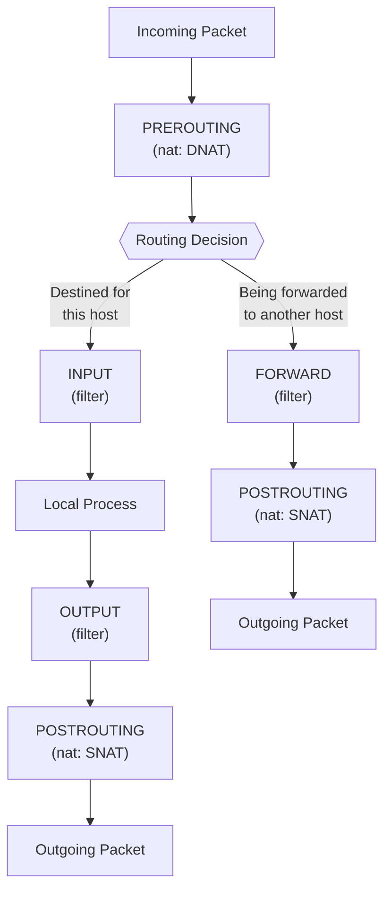

# Write iptables Firewall Rules

> A stateful firewall in ten lines of iptables — allow what you started, block everything you didn't.

**Type:** Build
**Languages:** Bash
**Prerequisites:** Phase 2, Lesson 06 — TCP/IP Packet Filtering Basics
**Time:** ~45 minutes

## Learning Objectives
- Explain the difference between stateless and stateful packet filtering
- Understand the iptables table and chain structure (filter, INPUT, OUTPUT, FORWARD)
- Write rules that allow established and related connections while blocking new inbound connections
- Test the firewall by attempting connections from a second terminal
- Persist firewall rules across reboots using `iptables-save` and `iptables-restore`

## The Problem

A server open to the Internet with no firewall is an invitation. Port scanners sweep the entire IPv4 address space in minutes. Within hours of a new server coming online, automated bots are probing every port for known vulnerabilities. An SSH server with password authentication will receive brute-force login attempts within minutes.

The simplest protection: a firewall that only allows traffic you explicitly requested. You connect outbound to a web server? Replies are allowed. Someone tries to connect inbound to a random port on your machine? Dropped. This is the principle of default-deny with stateful tracking.

`iptables` is the traditional Linux firewall tool. It has been in the kernel since 2.4 (year 2001) and is still the most widely deployed. Understanding it gives you the foundation for nftables (the modern replacement) and for reading firewall rule sets on any Linux system.

## The Concept

### Tables and Chains

iptables organises rules in tables. The main table is `filter`. Each table has chains — sequences of rules that packets traverse:



```
                          Incoming packet
                                │
                        ┌───────▼────────┐
                        │  PREROUTING    │  (nat table: DNAT)
                        └───────┬────────┘
                                │
                    ┌───────────┴───────────┐
                    │                       │
              [Destined for us?]      [Forwarded?]
                    │                       │
             ┌──────▼──────┐        ┌───────▼───────┐
             │    INPUT     │        │    FORWARD     │
             │  (filter)    │        │   (filter)     │
             └──────┬──────┘        └───────┬───────┘
                    │                       │
             [local process]        ┌───────▼───────┐
                    │               │  POSTROUTING   │
             ┌──────▼──────┐        │ (nat: SNAT)    │
             │   OUTPUT     │        └───────────────┘
             │  (filter)    │
             └─────────────┘
```

**INPUT chain**: Rules for packets destined for this machine.
**OUTPUT chain**: Rules for packets originated by this machine.
**FORWARD chain**: Rules for packets being routed through this machine.

### Stateless vs Stateful Filtering

**Stateless**: Each packet evaluated independently. You must explicitly allow both directions.

```bash
# Stateless — allow SSH (port 22) in both directions
iptables -A INPUT  -p tcp --dport 22 -j ACCEPT
iptables -A OUTPUT -p tcp --sport 22 -j ACCEPT
```

This is fragile. An attacker can craft a packet with `--sport 22` to bypass the OUTPUT rule.

**Stateful** (conntrack): The kernel tracks connection state. Rules can match:
- `NEW`: First packet of a new connection
- `ESTABLISHED`: Part of an already-accepted connection
- `RELATED`: Related to an established connection (e.g., FTP data channel, ICMP error)
- `INVALID`: Does not match any known connection

With stateful tracking, you only need to allow `NEW` connections inbound on specific ports. All reply traffic (`ESTABLISHED,RELATED`) is allowed automatically. This is correct and safe.

### The Core Policy Pattern

```
                       ┌─────────────────────────────────────┐
Inbound packet ──────► │ ESTABLISHED,RELATED?  → ACCEPT      │
                       │ Allowed NEW port?      → ACCEPT      │
                       │ (everything else)      → DROP        │
                       └─────────────────────────────────────┘
```

In iptables rules, ordering matters. Rules are evaluated top to bottom; the first match wins.

## Build It

### Step 1: Check Your Current Rules

```bash
# List current rules with line numbers
sudo iptables -L -n -v --line-numbers

# If the system is clean, you will see empty chains with ACCEPT policy:
# Chain INPUT (policy ACCEPT 0 packets, 0 bytes)
# Chain FORWARD (policy ACCEPT 0 packets, 0 bytes)
# Chain OUTPUT (policy ACCEPT 0 packets, 0 bytes)
```

### Step 2: Understand the Plan

We will implement this policy:
1. Allow all loopback traffic (lo interface)
2. Allow all traffic from established/related connections
3. Allow new inbound SSH (port 22) from anywhere
4. Allow new inbound HTTP (port 80) and HTTPS (port 443)
5. Allow all ICMP (ping) inbound
6. Drop everything else inbound
7. Allow all outbound traffic (we trust our own machine)
8. Set the default policy for INPUT to DROP (safety net)

### Step 3: Write the Firewall Script

Save as `firewall.sh`:

```bash
#!/usr/bin/env bash
# Stateful firewall policy — run as root
set -euo pipefail

# ── Flush all existing rules ──────────────────────────────────────────────
iptables -F           # flush filter rules
iptables -X           # delete user-defined chains
iptables -Z           # zero counters

# ── Set default policies ──────────────────────────────────────────────────
# IMPORTANT: Set INPUT to DROP *after* adding the ESTABLISHED rule.
# If you set INPUT to DROP first and your SSH session is broken during setup,
# you will lock yourself out. Order matters!
iptables -P INPUT   ACCEPT   # temporarily allow all — we'll tighten below
iptables -P FORWARD DROP     # we're not a router; block forwarded traffic
iptables -P OUTPUT  ACCEPT   # allow all outbound

# ── Rule 1: Allow loopback ────────────────────────────────────────────────
# Lo traffic includes local sockets (127.0.0.1). Never block this.
iptables -A INPUT -i lo -j ACCEPT
iptables -A OUTPUT -o lo -j ACCEPT

# ── Rule 2: Allow ESTABLISHED and RELATED ─────────────────────────────────
# This single rule allows all reply traffic for connections we initiated,
# and related connections (e.g., ICMP "port unreachable" replies).
iptables -A INPUT -m conntrack --ctstate ESTABLISHED,RELATED -j ACCEPT

# ── Rule 3: Drop INVALID packets ──────────────────────────────────────────
# INVALID means conntrack can't identify the connection. Usually malformed
# or spoofed packets. Drop them before any ACCEPT rules.
iptables -A INPUT -m conntrack --ctstate INVALID -j DROP

# ── Rule 4: Allow ICMP (ping) ─────────────────────────────────────────────
# Allow inbound ping so you can diagnose connectivity.
# Limit rate to 4 per second to prevent ICMP flood.
iptables -A INPUT -p icmp --icmp-type echo-request -m limit \
  --limit 4/second --limit-burst 8 -j ACCEPT

# ── Rule 5: Allow new inbound SSH ─────────────────────────────────────────
iptables -A INPUT -p tcp --dport 22 -m conntrack --ctstate NEW -j ACCEPT

# ── Rule 6: Allow new inbound HTTP and HTTPS ──────────────────────────────
iptables -A INPUT -p tcp --dport 80  -m conntrack --ctstate NEW -j ACCEPT
iptables -A INPUT -p tcp --dport 443 -m conntrack --ctstate NEW -j ACCEPT

# ── Rule 7: Log dropped packets (optional but very useful for debugging) ───
# Logs to kernel log (dmesg / /var/log/kern.log) — rate-limited.
iptables -A INPUT -m limit --limit 5/min --limit-burst 10 \
  -j LOG --log-prefix "IPT-DROP: " --log-level 4

# ── Rule 8: Drop everything else inbound ─────────────────────────────────
iptables -A INPUT -j DROP

# ── Now set the default INPUT policy to DROP (belt and suspenders) ────────
iptables -P INPUT DROP

# ── Display the final ruleset ─────────────────────────────────────────────
echo ""
echo "=== Firewall rules applied ==="
iptables -L -n -v --line-numbers
```

Run it:

```bash
sudo bash firewall.sh
```

### Step 4: Test the Firewall

Open two terminals on the same machine.

**Test 1: Loopback still works**

```bash
ping -c2 127.0.0.1    # should succeed
curl -s http://127.0.0.1  # should connect (may get "connection refused" if no web server, not "timeout")
```

**Test 2: Established connections work**

```bash
curl -s https://example.com   # outbound, then replies are ESTABLISHED — should work
ping -c3 8.8.8.8              # outbound ICMP, replies are ESTABLISHED — should work
```

**Test 3: Blocked inbound port**

From a second machine (or using the `nc` / `ncat` tool locally on a different port):

```bash
# Start a listener on port 8080 (not in our allowed list)
nc -l 8080 &

# Try to connect to it from outside
nc -w3 <your-server-ip> 8080
# Should timeout or be refused — the SYN is dropped
```

**Test 4: Watch the log**

```bash
sudo dmesg | grep IPT-DROP | tail -20
# You will see dropped packet details including source/dest IP and port
```

### Step 5: Check Connection State

```bash
# Show all tracked connections
sudo conntrack -L
# Or the older way:
cat /proc/net/nf_conntrack

# You will see entries like:
# tcp  6 86400 ESTABLISHED src=192.168.1.5 dst=140.82.121.3 sport=54321 dport=443 ...
```

### Step 6: Persist Rules

```bash
# Save current rules to a file
sudo iptables-save > /etc/iptables/rules.v4

# To restore automatically on boot (Debian/Ubuntu):
sudo apt install -y iptables-persistent
# It will ask to save current rules during install.
# Saved to /etc/iptables/rules.v4 and /etc/iptables/rules.v6

# Manual restore:
sudo iptables-restore < /etc/iptables/rules.v4
```

### Step 7: Flush the Firewall (Cleanup)

```bash
sudo iptables -F
sudo iptables -P INPUT ACCEPT
sudo iptables -P FORWARD ACCEPT
sudo iptables -P OUTPUT ACCEPT
```

## Exercises

1. **Block a specific IP**: Add a rule to block all traffic from 192.168.1.100. Where in the chain should this rule go? (Hint: before the ESTABLISHED rule? After? Why does order matter?)

2. **Allow DNS only via UDP**: Most DNS is UDP port 53. Add a rule that only allows UDP outbound to port 53, and drop all other DNS (TCP port 53, which is used for zone transfers). Test with `dig @8.8.8.8 google.com`.

3. **Limit SSH connections by rate**: Add a rule using `-m recent` or `-m hashlimit` to block IPs that attempt more than 5 new SSH connections per minute. This is a basic brute-force mitigation.

4. **Implement port forwarding**: Using the `nat` table and PREROUTING, redirect inbound traffic on port 8080 to 80 on localhost. Verify by starting a web server on port 80 and connecting to port 8080.

5. **Write a firewall flush script**: Write `flush-firewall.sh` that resets all chains to ACCEPT and removes all rules. This is your emergency "unlock" script if you lock yourself out of a test VM.

## Key Terms

| Term | What people say | What it actually means |
|------|----------------|------------------------|
| iptables | "the Linux firewall" | A user-space tool that configures the kernel's netfilter packet filtering framework |
| conntrack | "connection tracking" | Kernel module that tracks the state (NEW, ESTABLISHED, RELATED, INVALID) of network connections |
| Chain | "firewall chain" | An ordered list of rules; packets traverse the list until a rule matches or the chain ends |
| Policy | "default policy" | The action taken when a packet reaches the end of a chain without matching any rule (ACCEPT or DROP) |
| ESTABLISHED | "established state" | A connection where the initial handshake has completed; subsequent packets in both directions match this state |
| RELATED | "related connection" | A new connection spawned by an existing one (e.g., FTP data channel, ICMP error for a TCP packet) |
| -j DROP | "drop the packet" | Silently discard the packet; the sender receives no response (as opposed to REJECT which sends a reset) |
| -j REJECT | "reject the packet" | Discard the packet and send an ICMP error or TCP RST back; polite but reveals firewall presence |
