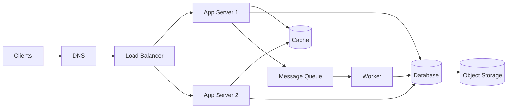

# What Is System Design

> A working program that serves 10 users and a working program that serves 10 million users are not the same program — system design is everything that happens between those two numbers.

**Type:** Learn
**Languages:** Markdown
**Prerequisites:** None
**Time:** ~30 minutes

## Learning Objectives

- Define system design and distinguish it from writing application code
- Name the five qualities every design trades off: scalability, availability, latency, consistency, and cost
- Explain why every interesting decision in distributed systems is a tradeoff, not a "best" choice
- Identify the standard building blocks that appear in almost every large system
- Read a high-level architecture diagram and explain what each box does

## The Problem

Most engineers learn to build software that works on one machine: a web server, a database, a bit of business logic. That skill takes you far. Then traffic grows, and the single machine starts to fail in ways the code never anticipated. The database can't keep up with reads. A burst of users makes every request slow. A disk dies and takes the only copy of the data with it. A deploy in one region knocks out users on the other side of the planet.

None of these are bugs in the usual sense. The code is correct. What's missing is *design at the level of the system* — decisions about how many machines there are, how they share work, what happens when one of them dies, and where the data lives. That is what system design is: the discipline of arranging components so the whole behaves well under real-world load, failure, and growth.

System design has no compiler to tell you you're wrong. There is rarely one correct answer. Instead there are tradeoffs, and the job is to make them deliberately — to know that choosing strong consistency costs you availability during a network partition, or that adding a cache buys you speed at the cost of stale data. An engineer who can name those tradeoffs and pick the right side for the situation is doing system design.

## The Concept

### Five qualities you are always trading off

Every system design decision pushes on at least one of these five dials. You can't max all of them at once.

| Quality | Question it answers | Typical lever |
|---|---|---|
| **Scalability** | Can it handle 10× the load by adding machines? | Sharding, statelessness, horizontal scaling |
| **Availability** | What fraction of the time is it up? | Redundancy, failover, replication |
| **Latency** | How fast is a single request? | Caching, CDNs, locality |
| **Consistency** | Do all clients see the same data? | Replication strategy, consensus |
| **Cost** | How much money and complexity? | Everything above has a price |

The recurring theme of this whole course: **you cannot optimize all five simultaneously.** A globally replicated, strongly consistent, always-available, sub-millisecond, cheap system does not exist. Real designs pick the two or three qualities that matter most for the use case and consciously sacrifice the rest.

### A system is boxes and arrows

At a high level every large system is the same handful of boxes wired together. Here's the shape almost everything takes:

You will spend the rest of this course learning what each of these boxes does, when to add it, and how it fails:

- **DNS** turns a name into the address of a load balancer (Phase 1).
- **Load balancer** spreads requests across many identical app servers (Phase 1).
- **App servers** run your logic; kept *stateless* so any one can serve any request (Phase 4).
- **Cache** holds hot data so reads avoid the slow database (Phase 3).
- **Database** is the source of truth; replicated and sharded to scale (Phases 2, 4).
- **Message queue** decouples slow work from the request path (Phase 6).
- **Object storage** holds big blobs like images and video (Phase 2).

### A common misconception

Beginners often think system design means "knowing the right architecture." It doesn't. There is no architecture that is correct in a vacuum. The same feature — say, a news feed — is designed completely differently for 1,000 users than for 500 million, and differently again if writes are rare versus constant. Design *follows from requirements and numbers*. That's why the next two lessons are about extracting requirements and estimating load, before you draw a single box.

### Scale changes everything

A useful instinct: when someone proposes a design, ask "what breaks at 100× the load?" Almost every technique in this course exists because something that's trivial at small scale becomes the bottleneck at large scale:

- Counting requests is trivial on one server; it needs Redis and atomic operations across a fleet (Phase 8).
- Reading a user's data is one query; at scale it needs caching, replicas, and sharding.
- Sending a message is one insert; at scale it's a queue, fan-out, and delivery guarantees.

System design is the study of what breaks at scale and the standard tools for fixing it.

## Exercises

1. **Name the tradeoff.** For each, say which of the five qualities is being traded for which: (a) adding a read replica, (b) caching API responses for 60 seconds, (c) requiring a majority of nodes to acknowledge every write. Write one sentence each.

2. **Label the diagram.** Redraw the boxes-and-arrows diagram above from memory and write one sentence per box describing its job. Check yourself against the list.

3. **Find the bottleneck.** A single-server blog suddenly gets featured and traffic 50×. List the order in which things break (CPU? database? bandwidth?) and which box from the diagram you'd add first.

4. **Spot the impossible spec.** A product manager asks for a system that is "always available, instantly consistent worldwide, and cheap." Explain which two qualities conflict and what you'd push back on.

## Key Terms

| Term | What people say | What it actually means |
|------|----------------|------------------------|
| System design | "Architecture" | Arranging components so the whole system behaves well under load, failure, and growth — a series of deliberate tradeoffs |
| Scalability | "Handles more users" | Throughput grows roughly in proportion to resources added, ideally by adding machines rather than replacing them |
| Availability | "It's up" | The fraction of time the system can serve requests, usually quoted in nines |
| Tradeoff | "Pros and cons" | Improving one quality (e.g. consistency) necessarily costs another (e.g. availability) — the central fact of distributed systems |
| Stateless | "No memory between requests" | A service that stores no client session locally, so any instance can serve any request and scaling out is trivial |
| Source of truth | "The real data" | The authoritative store whose value wins when copies (caches, replicas) disagree |
