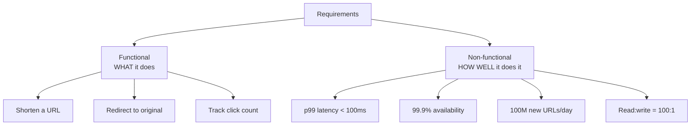

# Requirements & Tradeoffs

> "Build me a chat app" is not a spec — it's the start of a conversation. The design lives or dies on the questions you ask before you draw a single box.

**Type:** Learn
**Languages:** Markdown
**Prerequisites:** Phase 0, Lesson 01 — What Is System Design
**Time:** ~35 minutes

## Learning Objectives

- Separate functional requirements (what it does) from non-functional requirements (how well)
- Turn vague adjectives like "fast" and "reliable" into measurable targets
- Translate availability percentages into concrete downtime budgets
- Identify the read/write ratio and scale numbers that drive every later decision
- Practice scoping a problem so the design is finite and defensible

## The Problem

The single biggest mistake in system design — in interviews and in real projects — is designing the wrong system. Someone says "design a URL shortener" and an engineer immediately starts drawing databases and caches, having never asked: How many URLs per day? Do we need analytics? Custom aliases? How long do links live? Each of those answers changes the design materially. Skipping them means building something elaborate that solves the wrong problem.

Vague requirements hide in adjectives. "It should be fast." How fast — 50ms or 2 seconds? At what percentile? "It should be reliable." Reliable enough for 1 hour of downtime a year, or 5 minutes? "It should scale." To 10,000 users or 10 million? These words feel like requirements but commit to nothing. Until they become numbers, no design decision can be justified, because you can't tell whether a given choice is good enough or wildly over-engineered.

The discipline here is to refuse to design until you've pinned down two things: *what* the system must do (functional requirements) and *how well* it must do it (non-functional requirements). Everything downstream — the database choice, the caching strategy, the replication model — is a consequence of those answers.

## The Concept

### Functional vs non-functional requirements

**Functional requirements** are the features — the verbs. They define what a user can do. For a URL shortener: create a short link, follow it, optionally see analytics. List them, then aggressively scope: which are in scope for *this* design and which are explicitly out? Saying "analytics is out of scope" is a design decision, and a good one if it keeps the problem finite.

**Non-functional requirements** are the qualities — the adverbs. They define how well the features must work. These are the ones beginners skip and experts obsess over, because they determine the architecture. The key non-functionals:

- **Scale**: How many users? How many requests per second at peak? How much data, growing how fast?
- **Latency**: Target response time, stated as a percentile (p99, not average).
- **Availability**: What downtime is acceptable?
- **Consistency**: Must every read see the latest write, or is slightly stale data fine?
- **Durability**: Can we ever lose data? (For payments, no. For a "last seen" timestamp, maybe.)

### Turning "reliable" into a number

Availability is quoted in nines. Each nine is roughly a 10× reduction in allowed downtime:

| Availability | Downtime per year | Downtime per day | Feels like |
|---|---|---|---|
| 99% ("two nines") | 3.65 days | 14.4 min | A hobby project |
| 99.9% ("three nines") | 8.77 hours | 1.44 min | A typical web service |
| 99.99% ("four nines") | 52.6 min | 8.6 sec | A serious business |
| 99.999% ("five nines") | 5.26 min | 0.86 sec | Telecom / payments |

Each extra nine costs disproportionately more — it means more redundancy, more regions, more automation, more on-call. "How many nines do we actually need?" is a business question with a real price tag, not a default of "as many as possible."

### Read/write ratio: the number that shapes everything

Before designing storage, ask: is this system read-heavy or write-heavy? A URL shortener is extremely read-heavy — a link is created once and followed thousands of times (say 100:1 reads to writes). That single fact justifies heavy caching and read replicas. A logging or metrics ingestion system is write-heavy, which pushes you toward append-optimized stores and batching. The ratio dictates where you spend effort.

### A common misconception

Beginners treat "scale" as a goal in itself and over-engineer for billions of users a project will never have. Designing for 100× your real load wastes money and adds complexity that itself causes outages. The right move is the opposite: estimate the *actual* expected load (next lesson), design for that plus reasonable headroom, and note where you'd evolve if growth demands it. Under-specifying is bad; designing for imaginary scale is just as bad.

### Scoping is a skill

A good engineer makes the problem finite. Faced with "design Twitter," you can't design all of Twitter in an hour. You say: "I'll focus on posting tweets and the home timeline; I'll treat search, ads, and DMs as out of scope." That's not dodging — it's the most important design move, because it lets you go deep on what matters instead of shallow on everything.

## Exercises

1. **Classify requirements.** For a food-delivery app, list five functional and five non-functional requirements. Mark which non-functionals you'd consider critical.

2. **Compute downtime.** Your SLA promises 99.95% availability. How many minutes of downtime does that allow per month? (Hint: ~43,800 minutes in a month.)

3. **Find the ratio.** For each system, estimate read:write ratio and say what it implies: (a) a news website, (b) a bank's transaction ledger, (c) an IoT sensor data pipeline.

4. **Scope it down.** Given "design Instagram," write a two-sentence scope statement: what you'll design and what you'll explicitly exclude.

5. **De-vague a spec.** Rewrite "the search should be fast and reliable" as two measurable non-functional requirements with numbers.

## Key Terms

| Term | What people say | What it actually means |
|------|----------------|------------------------|
| Functional requirement | "What it does" | A feature the system must provide — a verb a user can perform |
| Non-functional requirement | "How well it does it" | A measurable quality: scale, latency, availability, consistency, durability |
| Nines | "Uptime" | Availability expressed as a percentage of nines; each nine cuts allowed downtime ~10× |
| Read/write ratio | "Read- or write-heavy" | The proportion of reads to writes, which dictates caching and storage strategy |
| Durability | "Don't lose data" | The guarantee that committed data survives failures; stronger and distinct from availability |
| Scoping | "What's in scope" | Deliberately bounding the problem so the design is finite and can go deep where it matters |
| SLA | "Uptime promise" | A contractual availability/latency guarantee, built from internal SLOs |
