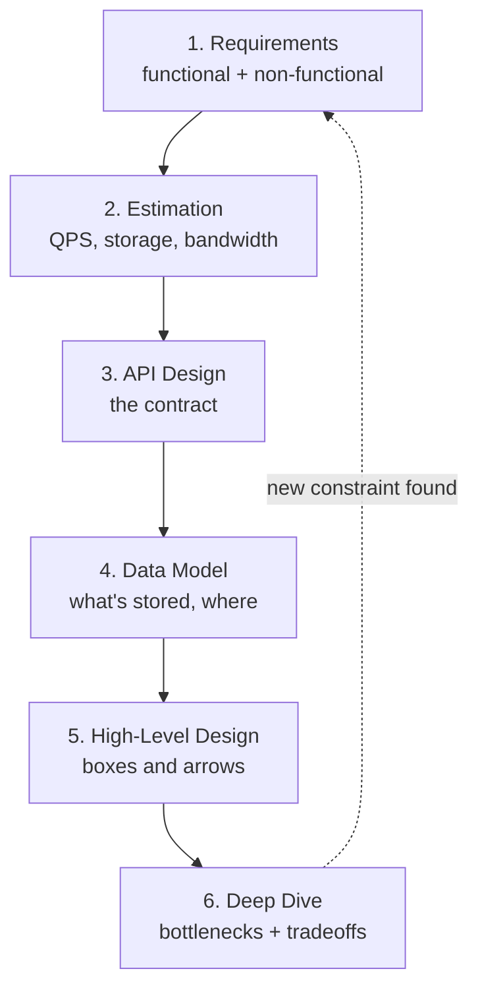

# The Design Framework

> Faced with "design YouTube," the difference between panic and a clean answer is having a script — six steps you run every time, in the same order.

**Type:** Learn
**Languages:** Markdown
**Prerequisites:** Phase 0, Lesson 03 — Back-of-the-Envelope Estimation
**Time:** ~35 minutes

## Learning Objectives

- Apply a repeatable six-step framework to any system design problem
- Sequence the steps correctly so each one feeds the next
- Sketch a high-level design as boxes and arrows before going deep
- Identify the system's bottleneck and choose where to deep-dive
- Avoid the classic failure mode of jumping to a solution before understanding the problem

## The Problem

Open-ended design problems are paralyzing without structure. "Design a ride-sharing service" could go in a hundred directions — do you start with the database? The matching algorithm? The mobile app? Engineers without a method either freeze, or worse, latch onto one component (usually the one they know best) and over-engineer it while ignoring the rest. The result is a lopsided design that's deep on databases and silent on how a rider even finds a driver.

The fix is a framework: a fixed sequence of steps you run every time, regardless of the problem. It guarantees you cover requirements, scale, data, and architecture in an order where each step informs the next. It also makes your thinking legible — to an interviewer, to a teammate in a design review, to yourself six months later reading the design doc. The framework isn't a straitjacket; it's a checklist that frees your attention for the hard parts by handling the structure automatically.

This lesson gives you that framework. Every capstone in Phase 8 follows it exactly, so internalizing it now pays off through the whole course.

## The Concept

### The six steps

The order matters. Each step constrains the next, and skipping ahead means redoing work.

**Step 1 — Requirements (5 min).** List functional requirements (the features) and scope aggressively. Then pin down non-functional requirements as numbers: scale, latency, availability, consistency. This is Lesson 02 applied. Output: a bulleted scope you and the interviewer agree on.

**Step 2 — Estimation (5 min).** Turn the scale numbers into QPS, storage, and bandwidth. This is Lesson 03 applied. The numbers tell you whether this is a single-server problem or a distributed one, which shapes everything after. Output: peak QPS, storage/year, read:write ratio.

**Step 3 — API design (5 min).** Define the contract between clients and the system — the handful of endpoints or methods. Even a rough sketch (`POST /tweets`, `GET /feed?userId=`) forces clarity about what the system actually does and what data crosses the boundary. Output: 3–6 endpoints with their inputs and outputs.

**Step 4 — Data model (5 min).** What entities exist, what fields they have, and which store holds them (relational? key-value? blob?). The read:write ratio and access patterns from steps 1–2 drive this. Output: the main tables/collections and the choice of datastore, justified.

**Step 5 — High-level design (10 min).** Draw the boxes and arrows: clients, load balancer, services, caches, databases, queues. Show the path of a write and the path of a read through the system. Don't optimize yet — just get a correct, complete picture on the board. Output: an architecture diagram where every box has a reason to exist.

**Step 6 — Deep dive (15 min).** Now find the bottleneck — the component that breaks first at the scale from step 2 — and go deep on it with the techniques from the rest of this course: caching, sharding, replication, queues, rate limiting. Discuss the tradeoffs of each choice. This is where the real engineering happens. Output: a resolved bottleneck and an explicit list of tradeoffs.

### Identifying the bottleneck

Step 6 hinges on picking the *right* thing to go deep on. The bottleneck is wherever your estimates from step 2 collide with the limits of a component:

- High write QPS that exceeds one database → deep-dive on **sharding** (Phase 4).
- Read:write ratio of 100:1 → deep-dive on **caching** (Phase 3).
- A "celebrity" user whose every action fans out to millions → deep-dive on **fan-out strategy** (Phase 8).
- Strict ordering or agreement across nodes → deep-dive on **consistency/consensus** (Phase 5).

A good design names its bottleneck explicitly: "the hard part here is X, so I'll spend my time there."

### A common misconception

The biggest mistake is solution-first thinking: hearing "design a chat app" and immediately saying "I'll use WebSockets and Cassandra." Maybe those are right — but you can't know until steps 1–2. Jumping to tools before requirements means you can't justify the choice, and you'll miss the actual hard part. Always run the framework in order. Tools are the *answer* to steps 1–2, not the starting point.

A second misconception: that the framework is linear and you never go back. In practice, the deep dive often surfaces a new constraint ("oh, we need ordered messages") that sends you back to revise the data model or even requirements. The dotted arrow in the diagram is real. The framework is a loop you mostly traverse forward.

### Why this order

Notice the dependency chain: you can't estimate without requirements, can't design an API without knowing the features, can't choose a datastore without the access patterns and scale, can't draw the architecture without the API and data model, and can't pick a bottleneck without the architecture and the numbers. The sequence isn't arbitrary — it's the only order in which each step has the inputs it needs.

## Exercises

1. **Run all six steps, lightly.** For "design a pastebin (text-sharing) service," spend two minutes per step and write one or two lines for each. Notice how step 2's numbers shape steps 4–6.

2. **Identify the bottleneck.** For each, name which component you'd deep-dive on and why: (a) a global leaderboard, (b) a photo backup service, (c) a flash-sale checkout system.

3. **Catch the anti-pattern.** A colleague opens a design with "We'll use Kafka and microservices." Which steps did they skip, and what question would you ask to redirect them?

4. **Sketch an API.** Write the 4–5 core endpoints for a URL shortener (step 3 only). What's the input and output of each?

5. **Trace a request.** For your pastebin from exercise 1, draw the path of a write (create paste) and a read (view paste) through your boxes. Where would you add a cache?

## Key Terms

| Term | What people say | What it actually means |
|------|----------------|------------------------|
| Design framework | "My approach" | A fixed sequence of steps (requirements → estimation → API → data model → high-level → deep dive) run on every problem |
| High-level design | "The architecture diagram" | The boxes-and-arrows view showing all components and the paths a read and a write take |
| Deep dive | "The hard part" | Focused analysis of the bottleneck component, applying scaling techniques and weighing tradeoffs |
| Bottleneck | "What breaks first" | The component whose limits your estimated load hits soonest; where deep-dive effort should go |
| Solution-first thinking | "Jumping to tools" | The anti-pattern of naming technologies before establishing requirements and numbers |
| Access pattern | "How data is read/written" | The shape of queries (by key? by range? read- or write-heavy?) that drives the datastore choice |
