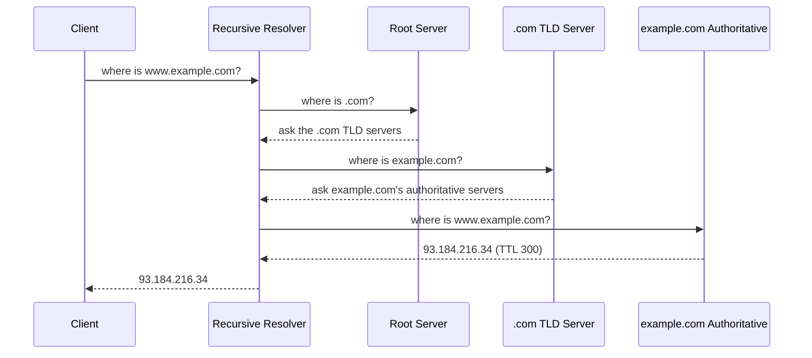

# DNS & Domain Resolution

> Before a single byte of your application runs, the network has to answer one question — "where is example.com?" — and the way it answers shapes failover, load distribution, and latency.

**Type:** Learn
**Languages:** Bash
**Prerequisites:** Phase 0 — Foundations
**Time:** ~40 minutes

## Learning Objectives

- Trace a domain name to an IP address through the DNS resolution hierarchy
- Explain the role of recursive resolvers, root, TLD, and authoritative servers
- Read the common record types: A, AAAA, CNAME, MX, NS
- Use TTL to reason about caching and propagation delay
- Use DNS as a system-design tool for routing, failover, and geo-distribution

## The Problem

Users type names; computers route to numbers. `example.com` means nothing to the network — packets need an IP like `93.184.216.34`. DNS is the distributed directory that bridges the two, and it runs before every connection your system handles. If DNS is slow, every first request is slow. If DNS is wrong, your service is unreachable even though every server is healthy. Many of the worst outages in industry history were DNS misconfigurations, not application bugs.

DNS is also a design lever, not just plumbing. Because you control what IP a name resolves to — and can return different answers to different users — DNS is the first place you distribute load and route around failures. Want users in Europe to hit your Frankfurt datacenter and users in Asia to hit Singapore? That's a DNS decision. Want to drain traffic from a failing region? Change what the name resolves to. Understanding DNS is understanding the very front of your request path.

The catch is caching. DNS answers are cached at many layers for a duration called the TTL, which makes the system fast but means changes don't take effect instantly. A design that relies on flipping DNS for failover has to account for the minutes (or longer) that stale answers linger.

## The Concept

### The resolution hierarchy

When your browser needs `www.example.com`, it doesn't ask one server — it walks a hierarchy, usually via a *recursive resolver* (run by your ISP or a public service like `8.8.8.8`) that does the walking for you:



- **Recursive resolver**: does the work of querying others and caches the result. Your machine talks only to this.
- **Root servers**: 13 logical root server addresses; they know where each TLD lives.
- **TLD servers**: handle a top-level domain like `.com` or `.org`; they know each domain's authoritative servers.
- **Authoritative servers**: the source of truth for a specific domain's records — what you configure when you own a domain.

Every step is cached. A popular name like `google.com` is almost always served from the resolver's cache in one hop, not the full walk.

### Record types you must know

```
Type    Maps                            Example
------  ------------------------------  -----------------------------------
A       name -> IPv4 address            example.com      -> 93.184.216.34
AAAA    name -> IPv6 address            example.com      -> 2606:2800:220:1:...
CNAME   name -> another name (alias)    www.example.com  -> example.com
MX      domain -> mail server           example.com      -> mail.example.com
NS      domain -> authoritative servers example.com      -> ns1.example.com
TXT     name -> arbitrary text          (SPF, domain verification)
```

A subtlety: a **CNAME** is an alias — it points one name at another, and the resolver then resolves *that* name. You can't put a CNAME at the root of a domain (the "apex"), which is why providers offer "ALIAS"/"ANAME" records or you point the apex straight at an A record.

### TTL: speed vs freshness

Every record carries a **TTL** (time to live) in seconds — how long resolvers may cache it. This is the classic caching tradeoff applied to DNS:

- **Long TTL** (e.g. 86400 = 1 day): fewer lookups, faster, less load on your authoritative servers — but changes take up to a day to propagate.
- **Short TTL** (e.g. 60): changes propagate fast, enabling quick failover — but more lookups and more dependence on your DNS being up.

A common pattern: keep a normal TTL day-to-day, but *lower it in advance* of a planned migration so the cutover is fast, then raise it again.

### DNS as a system-design tool

Because you decide what a name resolves to, DNS gives you several scaling and reliability levers:

- **Round-robin DNS**: return multiple A records; clients pick one, spreading load crudely across servers.
- **GeoDNS**: return different IPs based on the resolver's location, sending users to the nearest region.
- **DNS failover**: health-check your endpoints and stop returning the IP of a dead region (bounded by TTL).
- **CDN integration**: a CNAME to the CDN lets the CDN's own DNS pick the nearest edge node (Phase 3).

### A common misconception

People expect DNS changes to be instant. They aren't — caching at the resolver, OS, and browser means an old answer can linger for the full TTL (sometimes longer, as some resolvers ignore low TTLs). This is why DNS-based failover is "eventually" fast, not immediate, and why load balancers (next lesson) handle fast, fine-grained traffic shifting that DNS can't.

## Build It (hands-on with `dig`)

The `dig` tool queries DNS directly so you can see each layer. Run the commands in `code/dns_explore.sh`, or follow along:

### Step 1 — A basic lookup

```bash
dig example.com A +noall +answer
```

You'll see the A record and its TTL. Run it twice quickly — the second TTL is lower because it's counting down in the resolver's cache.

### Step 2 — Trace the full hierarchy

```bash
dig +trace example.com
```

This shows the walk from root → TLD → authoritative, the exact path in the diagram above.

### Step 3 — Inspect record types

```bash
dig example.com MX +short
dig example.com NS +short
dig www.github.com CNAME +short
```

### Step 4 — Query a specific resolver

```bash
dig @8.8.8.8 example.com +short   # ask Google's public DNS directly
```

## Exercises

1. **Watch a TTL count down.** Run `dig example.com +noall +answer` repeatedly and record the TTL each time. When does it reset, and why?

2. **Trace it.** Run `dig +trace` on a domain you use. Identify the root, TLD, and authoritative server lines in the output.

3. **Compare resolvers.** Query the same popular domain via `@8.8.8.8` and `@1.1.1.1`. Do you get the same IPs? Why might they differ (hint: CDNs and GeoDNS)?

4. **Reason about failover.** Your region dies and you update DNS to point at a backup, with the record's TTL set to 3600. What's the worst-case time before all users reach the backup? How would lowering the TTL beforehand help?

5. **Find the CNAME chain.** Pick a site behind a CDN and follow its CNAME chain with `dig`. How many hops before you reach an A record?

## Key Terms

| Term | What people say | What it actually means |
|------|----------------|------------------------|
| DNS | "Turns names into IPs" | A distributed hierarchical directory resolving domain names to addresses |
| Recursive resolver | "My DNS server" | The server that does the full lookup on your behalf and caches the result |
| Authoritative server | "Where the records live" | The source of truth for a domain's records, configured by the domain owner |
| A / AAAA record | "The IP" | Maps a name to an IPv4 (A) or IPv6 (AAAA) address |
| CNAME | "An alias" | Points one name at another; cannot exist at the domain apex |
| TTL | "Cache time" | Seconds a DNS answer may be cached; trades freshness for speed |
| GeoDNS | "Location routing" | Returning different IPs based on the resolver's location to route users to the nearest region |
