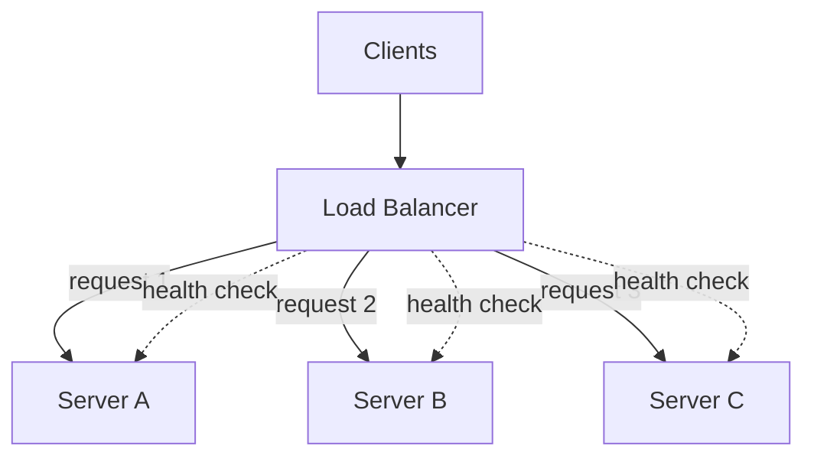

# Load Balancing

> One server can do only so much. The moment you add a second, you need something to decide which server each request goes to — and that decision is a surprisingly deep design space.

**Type:** Build
**Languages:** Python
**Prerequisites:** Phase 1, Lesson 01 — DNS & Domain Resolution
**Time:** ~50 minutes

## Learning Objectives

- Explain why a load balancer is the entry point to any horizontally scaled system
- Implement round-robin, least-connections, and weighted distribution strategies
- Distinguish Layer 4 from Layer 7 load balancing
- Use health checks to route around failed backends
- Reason about the load balancer itself as a single point of failure

## The Problem

DNS round-robin can hand out several server IPs, but it's a blunt instrument: it can't react to a server that just died (bounded by TTL), can't account for one server being busier than another, and can't inspect the request. The moment you run more than one app server seriously, you put a **load balancer** in front of them — a dedicated component whose only job is to take each incoming request and forward it to a healthy backend, fast.

The load balancer is what makes horizontal scaling work. Because your app servers are stateless (Phase 4), any of them can serve any request; the load balancer's job is to spread the work so no single server is overwhelmed while others sit idle. Get the strategy wrong and you get the worst of both worlds — some servers melting while others are bored — which is just paying for capacity you don't use.

But the strategy matters more than it first appears. "Just send each request to the next server" (round-robin) is fine when every request costs the same and every server is identical. Real systems violate both assumptions: some requests are 100× more expensive, and some servers are bigger than others. Choosing the right strategy is the difference between smooth scaling and mysterious latency spikes.

## The Concept

### Where the load balancer sits



The load balancer is the single front door. Clients see one address (from DNS); behind it, a pool of interchangeable backends. The LB continuously health-checks each backend and only routes to healthy ones.

### Distribution strategies

**Round-robin** — cycle through servers in order: A, B, C, A, B, C… Simple and fair *when requests and servers are uniform*. Breaks down when one request is far heavier than another, because it ignores how busy each server already is.

**Least-connections** — send each new request to the server currently handling the fewest active connections. Adapts to uneven request costs: a server stuck on a slow request stops receiving new ones. Better default for variable workloads.

**Weighted** — assign each server a weight reflecting its capacity (a 16-core box gets weight 4, a 4-core box gets weight 1) and distribute proportionally. Essential when your fleet is heterogeneous.

**Hash-based** (e.g. by client IP or a key) — always route a given client/key to the same server. Useful for sticky sessions or cache locality, but reintroduces some of the imbalance problems and is the seed of consistent hashing (Phase 4).

```
Strategy           Good when...                       Weakness
-----------------  ---------------------------------  -----------------------------
Round-robin        uniform requests + uniform servers ignores load and capacity
Least-connections  variable request cost              needs connection tracking
Weighted           heterogeneous servers              weights need tuning
Hash-based         need stickiness / locality         uneven distribution, hotspots
```

### Layer 4 vs Layer 7

Load balancers operate at one of two levels:

- **Layer 4 (transport)**: routes based on IP and TCP/UDP port only. It doesn't read the request content, so it's extremely fast and protocol-agnostic, but can't make decisions based on the URL, headers, or cookies.
- **Layer 7 (application)**: parses the actual HTTP request, so it can route `/api/*` to one pool and `/images/*` to another, terminate TLS, inspect cookies for stickiness, and retry failed requests. More capable, slightly more overhead.

Most modern web systems use L7 at the edge for its smarts, sometimes with L4 underneath for raw throughput.

### Health checks

A load balancer must know which backends are alive. It periodically probes each one (e.g. `GET /health` every few seconds). A server that fails N consecutive checks is marked down and removed from rotation; when it passes again it's restored. This is what makes the pool self-healing: a crashed server stops receiving traffic within seconds, far faster than DNS could react.

### The load balancer as a single point of failure

If all traffic flows through one load balancer and it dies, everything dies — you've just moved the single point of failure. Real deployments run the LB itself redundantly: a pair (active/passive) sharing a virtual IP, or multiple LBs behind DNS round-robin, or a managed cloud LB that's internally redundant. The principle (Phase 7): never let one box be the thing that takes down the system.

## Build It

You'll implement the core strategies as a simulated load balancer. Create `load_balancer.py`.

### Step 1 — Model backends

```python
# Run: python load_balancer.py
from dataclasses import dataclass, field
from itertools import count

@dataclass
class Backend:
    name: str
    weight: int = 1
    healthy: bool = True
    active_connections: int = 0
    total_handled: int = 0
```

### Step 2 — Round-robin

```python
class RoundRobin:
    def __init__(self, backends):
        self.backends = backends
        self._i = 0

    def pick(self):
        healthy = [b for b in self.backends if b.healthy]
        b = healthy[self._i % len(healthy)]
        self._i += 1
        return b
```

### Step 3 — Least-connections

```python
class LeastConnections:
    def __init__(self, backends):
        self.backends = backends

    def pick(self):
        healthy = [b for b in self.backends if b.healthy]
        return min(healthy, key=lambda b: b.active_connections)
```

### Step 4 — Weighted round-robin

```python
class Weighted:
    def __init__(self, backends):
        # expand by weight: weight 3 -> appears 3 times
        self.pool = [b for b in backends for _ in range(b.weight)]
        self._i = 0

    def pick(self):
        healthy = [b for b in self.pool if b.healthy]
        b = healthy[self._i % len(healthy)]
        self._i += 1
        return b
```

### Step 5 — Simulate traffic and print distribution

```python
def simulate(strategy_name, lb, n=1200):
    for _ in range(n):
        b = lb.pick()
        b.total_handled += 1
    print(f"\n=== {strategy_name} ({n} requests) ===")
    for b in lb.backends if hasattr(lb, 'backends') else set(lb.pool):
        pct = 100 * b.total_handled / n
        print(f"  {b.name:8} weight={b.weight}  handled={b.total_handled:5}  ({pct:4.1f}%)")

def fresh():
    return [Backend("A", weight=1), Backend("B", weight=1), Backend("C", weight=3)]

simulate("Round-robin", RoundRobin(fresh()))
simulate("Weighted", Weighted(fresh()))

# Least-connections with a "stuck" server
backends = fresh()
backends[0].active_connections = 50   # A is busy
lc = LeastConnections(backends)
for _ in range(300):
    b = lc.pick()
    b.active_connections += 1
    b.total_handled += 1
print("\n=== Least-connections (A starts busy) ===")
for b in backends:
    print(f"  {b.name:8} handled={b.total_handled:5}  final_active={b.active_connections}")
```

### Step 6 — Run it

```bash
python load_balancer.py
```

Round-robin splits evenly *ignoring* weights; weighted gives server C (weight 3) more; least-connections sends almost nothing to the server that started busy until the others catch up. Compare with `outputs/expected.md`.

## Exercises

1. **Run and read.** Confirm round-robin is ~even and weighted gives C about 60%. Why does plain round-robin "waste" C's extra capacity?

2. **Kill a backend.** Set `backends[1].healthy = False` before simulating round-robin. Confirm traffic redistributes only across healthy servers.

3. **Add health-check logic.** Add a `fail_count` to `Backend` and a method that marks it unhealthy after 3 failures and healthy after 2 successes. Simulate a flapping server.

4. **Weighted vs least-connections.** Make request costs random (some take many "connections"). Which strategy keeps the busiest server's active connections lowest?

5. **Reason about the SPOF.** The simulated LB is one object. Sketch (in comments) two ways to make the real load balancer itself redundant.

## Key Terms

| Term | What people say | What it actually means |
|------|----------------|------------------------|
| Load balancer | "Traffic spreader" | A component that forwards each request to a healthy backend by some strategy |
| Round-robin | "Take turns" | Cycle through backends in order; fair only when requests and servers are uniform |
| Least-connections | "Send to the idlest" | Route to the backend with the fewest active connections; adapts to uneven request cost |
| Weighted | "By capacity" | Distribute proportionally to each server's assigned weight |
| Layer 4 / Layer 7 | "TCP vs HTTP LB" | L4 routes by IP/port (fast, blind); L7 parses HTTP (smart, can route by URL/header) |
| Health check | "Is it alive?" | A periodic probe; failing backends are removed from rotation automatically |
| SPOF | "One point of failure" | A component whose failure kills the system; the LB must itself be made redundant |
