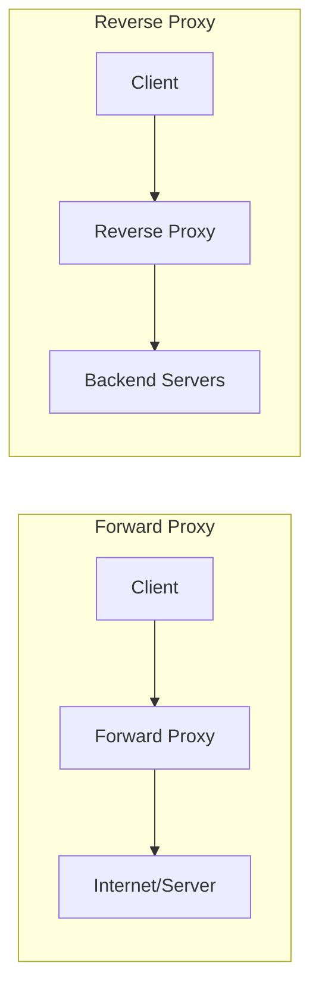
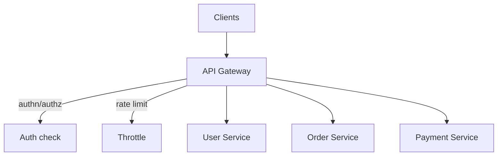

# Proxies & API Gateways

> A reverse proxy, a forward proxy, and an API gateway all sit in the middle of a connection — but which side they serve, and what they do there, are completely different.

**Type:** Learn
**Languages:** Markdown
**Prerequisites:** Phase 1, Lesson 02 — Load Balancing
**Time:** ~35 minutes

## Learning Objectives

- Distinguish forward proxies from reverse proxies by which side they represent
- Explain what a reverse proxy adds: TLS termination, caching, compression, routing
- Define an API gateway and the cross-cutting concerns it centralizes
- Place each component correctly in a request path
- Decide when a plain reverse proxy is enough and when you need a gateway

## The Problem

As a system grows past a single server, raw client-to-server connections stop being viable. Where do you terminate TLS so each backend doesn't need its own certificate? Where do you enforce rate limits so one abusive client can't hammer every service? Where do you authenticate a request once instead of in every microservice? Where do you route `/api/users` to the user service and `/api/orders` to the order service? Putting all of this logic into each backend means duplicating it everywhere, getting it subtly wrong in some places, and coupling every team to the same concerns.

The answer is an intermediary — a box in the middle that handles these cross-cutting jobs once, so the backends can focus on business logic. But "a box in the middle" comes in several flavors with confusingly similar names. A *forward proxy* and a *reverse proxy* both relay traffic, but they serve opposite sides. An *API gateway* is a specialized reverse proxy with extra responsibilities. Confusing them leads to designs that put logic in the wrong place. This lesson sorts them out.

## The Concept

### Forward proxy vs reverse proxy: who do you represent?

The single distinction that clears up everything: **a forward proxy acts on behalf of clients; a reverse proxy acts on behalf of servers.**



**Forward proxy** sits in front of *clients*. The outside world sees the proxy's IP, not the client's. Used for: corporate egress filtering, caching outbound requests, anonymizing clients, bypassing geo-restrictions. The server doesn't know (or care) that a proxy is involved.

**Reverse proxy** sits in front of *servers*. Clients think they're talking to one server; really they hit the proxy, which forwards to a pool of backends. The client doesn't know how many backends exist. This is the one that matters most for system design — the load balancer from the last lesson is a reverse proxy.

### What a reverse proxy does for you

A reverse proxy is the natural home for concerns that every backend would otherwise duplicate:

```
Concern              Why put it at the reverse proxy
-------------------  ----------------------------------------------------
Load balancing       One place decides which backend serves each request
TLS termination      Decrypt HTTPS once; backends speak plain HTTP inside
                     the trusted network (one cert to manage, not N)
Caching              Serve repeated responses without hitting backends
Compression          gzip/br responses once at the edge
Request routing      /api -> API pool, /static -> static pool
Header manipulation  Add X-Forwarded-For, strip internal headers
Buffering            Absorb slow clients so backends aren't tied up
```

Nginx, HAProxy, and Envoy are the common reverse proxies. TLS termination is worth dwelling on: the proxy holds the certificate and does the expensive encryption/decryption, so your application servers receive plain HTTP over a trusted internal network. That's one certificate to rotate instead of one per server, and backends spend no CPU on crypto.

### The API gateway: a reverse proxy that knows about APIs

An **API gateway** is a reverse proxy specialized for serving APIs, adding application-aware features:



On top of everything a reverse proxy does, a gateway centralizes:

- **Authentication & authorization**: validate the token once at the edge; backends trust the gateway.
- **Rate limiting & quotas**: enforce per-client limits in one place (Phase 7).
- **Request routing & versioning**: map `/v1/users` and `/v2/users` to the right service.
- **Request aggregation**: fan one client call out to several services and combine the responses, so mobile clients make one request instead of five.
- **Protocol translation**: accept REST from clients, speak gRPC to internal services.
- **Observability**: a single chokepoint to log, trace, and meter every API call.

The gateway pattern shines with microservices: instead of every service re-implementing auth, rate limiting, and logging, the gateway does it once, and services stay focused on their domain.

### Where each sits in the path

A realistic request path stacks these:

```
Client → DNS → [Reverse proxy / API gateway + load balancer] → backend services → data stores
```

In small systems, one Nginx instance plays reverse proxy *and* load balancer. In larger systems the API gateway is a distinct layer in front of (or merged with) the load balancer, and a service mesh may handle service-to-service traffic behind it.

### A common misconception

People assume "API gateway" and "load balancer" are interchangeable. They overlap (both are reverse proxies, both can route) but differ in altitude: a load balancer's core job is spreading traffic across identical backends; a gateway's job is applying API-level policy (auth, rate limits, aggregation) across *different* services. You often have both: the gateway handles policy, then load-balances across instances of the chosen service. Another misconception: that you always need a gateway. For a single service, a reverse proxy is plenty — a gateway's value appears when you have many services sharing cross-cutting concerns.

## Exercises

1. **Classify the proxy.** For each, say forward or reverse: (a) a company filters employee web access, (b) Nginx sits in front of three app servers, (c) a tool hides your IP when browsing, (d) Cloudflare sits in front of a website.

2. **Place the concern.** Where would you handle each — backend service, reverse proxy, or API gateway? TLS termination, business validation, per-user rate limiting, gzip compression, request aggregation.

3. **Justify a gateway.** You have one monolithic service. Argue whether an API gateway is worth adding. Now you split into eight microservices — does your answer change? Why?

4. **Design the path.** Draw the full request path for a mobile app calling a microservices backend, labeling DNS, gateway, load balancer, and services. Mark where auth happens.

5. **TLS reasoning.** Explain why terminating TLS at the reverse proxy reduces both operational burden and backend CPU. What new trust assumption does it introduce?

## Key Terms

| Term | What people say | What it actually means |
|------|----------------|------------------------|
| Forward proxy | "Client-side proxy" | An intermediary acting on behalf of clients; the server sees the proxy, not the client |
| Reverse proxy | "Server-side proxy" | An intermediary acting on behalf of servers; the client sees one address hiding a backend pool |
| API gateway | "The API front door" | A reverse proxy specialized for APIs that centralizes auth, rate limiting, routing, and aggregation |
| TLS termination | "Decrypt at the edge" | Handling HTTPS encryption at the proxy so backends speak plain HTTP internally |
| Cross-cutting concern | "Shared plumbing" | A responsibility (auth, logging, rate limits) common to many services, best handled in one place |
| Request aggregation | "Combine calls" | Having the gateway fan one client request out to several services and merge the responses |
| Service mesh | "Sidecar networking" | Infrastructure managing service-to-service traffic behind the gateway (Phase 5/7) |
