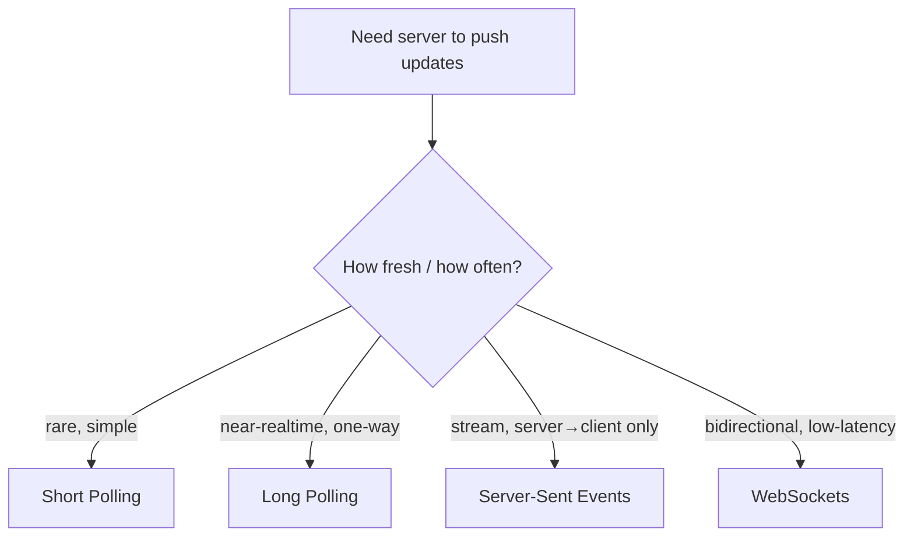

# Realtime: WebSockets & Polling

> HTTP was designed for "client asks, server answers." Getting a server to *push* an update the instant it happens takes one of four techniques — and they differ wildly in cost.

**Type:** Build
**Languages:** Python
**Prerequisites:** Phase 1, Lesson 04 — API Design: REST, gRPC, GraphQL
**Time:** ~45 minutes

## Learning Objectives

- Explain why plain request/response HTTP can't push server-initiated updates
- Compare short polling, long polling, Server-Sent Events, and WebSockets
- Quantify the request overhead each technique imposes
- Choose the right realtime mechanism for a given feature
- Reason about the connection-count cost of persistent connections at scale

## The Problem

A chat message arrives. A stock price ticks. A friend comes online. In all these cases the *server* knows something new and the *client* needs it immediately — but classic HTTP doesn't allow the server to speak first. The protocol is strictly request/response: the client asks, the server answers, the connection closes. So how does a chat app show a new message the instant it's sent, without the user hitting refresh?

The naive answer — have the client ask "anything new?" over and over — works but is wasteful. At one request per second per user, a million users generate a million requests per second of mostly-empty answers, each carrying full HTTP headers. That overhead can dwarf the actual data. The realtime techniques in this lesson exist to deliver updates promptly *without* drowning the server in polling traffic, and each strikes a different balance between latency, overhead, and complexity.

Choosing among them is a real design decision with cost consequences. WebSockets feel like the obvious "realtime" answer, but they hold a connection open per client — at scale that's millions of open sockets to manage, which is its own engineering problem. Sometimes a humbler technique is the right call.

## The Concept

### The four techniques



**Short polling** — the client asks on a fixed timer ("anything new?") every N seconds. Dead simple, works everywhere, but wastes requests: most return "nothing," and updates lag by up to N seconds. Overhead scales with poll frequency × users.

```
Client: GET /updates  → Server: [] (empty)
  ...wait 5s...
Client: GET /updates  → Server: [] (empty)
  ...wait 5s...
Client: GET /updates  → Server: [new message]   (up to 5s late)
```

**Long polling** — the client asks, and the server *holds the request open* until there's something to send (or a timeout), then responds; the client immediately re-asks. Updates arrive near-instantly, and there are no empty responses. Cost: a held-open request per waiting client and more server bookkeeping.

```
Client: GET /updates  → Server holds...  → (event!) → responds immediately
Client: GET /updates  → Server holds...
```

**Server-Sent Events (SSE)** — the client opens one long-lived HTTP connection and the server streams events down it as they happen, one-way (server→client). Built into browsers (`EventSource`), auto-reconnects, simple. Limitation: server-to-client only; the client still uses normal HTTP to send.

**WebSockets** — a single TCP connection, upgraded from HTTP, that stays open and carries messages in *both* directions with tiny framing overhead. The lowest-latency, most flexible option, and the right tool for truly bidirectional, high-frequency interaction (chat, multiplayer games, collaborative editing). Cost: you maintain a stateful open connection per client and need infrastructure to route messages to the right socket across a fleet (Phase 8's chat capstone).

### Comparison

```
                 Latency      Overhead         Direction      Complexity
---------------  -----------  ---------------  -------------  -----------
Short polling    up to N sec  high (empty reqs) c→s only      trivial
Long polling     near-instant medium           c→s (held)     low
SSE              near-instant low               s→c stream     low
WebSockets       lowest       lowest per-msg   bidirectional  higher
```

### The overhead problem, concretely

Every HTTP request carries headers — often 500–800 bytes of them (cookies, user-agent, etc.) — regardless of payload. With short polling every 1s, that's ~800 bytes/request × requests just in overhead, mostly for empty answers. A WebSocket, once established, frames a message in as few as 2–6 bytes. Over a long-lived chat session the difference is enormous, which is the quantitative case for persistent connections.

### A common misconception

"Realtime means WebSockets." Not necessarily. WebSockets are bidirectional and lowest-latency, but they're also the most expensive to operate: each client holds an open, stateful connection, and scaling to millions means managing millions of sockets and routing messages to the right one across many servers. For one-way streams (a live feed, notifications, a progress bar) **SSE** is simpler and cheaper. For occasional updates, **long polling** is fine and works through every proxy and firewall. Reach for WebSockets when you genuinely need low-latency two-way communication — not by reflex.

## Build It

You'll simulate the four techniques over a fixed time window and count the request/connection overhead each incurs. Create `realtime_overhead.py`.

### Step 1 — Scenario parameters

```python
# Run: python realtime_overhead.py
WINDOW_SECONDS = 60          # observation window
EVENTS = 4                   # actual updates the user should receive in the window
HEADER_BYTES = 700          # approx HTTP header overhead per request
WS_FRAME_BYTES = 4          # per-message framing once a WebSocket is open
```

### Step 2 — Short polling

```python
def short_polling(interval=5):
    requests = WINDOW_SECONDS // interval     # one request every `interval` seconds
    overhead = requests * HEADER_BYTES
    worst_latency = interval                  # up to a full interval late
    return requests, overhead, worst_latency
```

### Step 3 — Long polling

```python
def long_polling():
    # One held request per event, plus one currently waiting = EVENTS + 1
    requests = EVENTS + 1
    overhead = requests * HEADER_BYTES
    worst_latency = 0                          # responds the instant an event occurs
    return requests, overhead, worst_latency
```

### Step 4 — SSE and WebSockets (one connection, then cheap frames)

```python
def sse():
    requests = 1                              # one long-lived connection
    overhead = HEADER_BYTES + EVENTS * 0      # events stream in the body, no new headers
    worst_latency = 0
    return requests, overhead, worst_latency

def websockets():
    requests = 1                              # one upgrade handshake
    overhead = HEADER_BYTES + EVENTS * WS_FRAME_BYTES
    worst_latency = 0
    return requests, overhead, worst_latency
```

### Step 5 — Report

```python
rows = [
    ("Short polling (5s)", *short_polling(5)),
    ("Long polling",       *long_polling()),
    ("SSE",                *sse()),
    ("WebSockets",         *websockets()),
]
print(f"Window: {WINDOW_SECONDS}s, {EVENTS} real updates to deliver\n")
print(f"{'Technique':20} {'Requests':>9} {'Overhead(B)':>12} {'WorstLatency(s)':>16}")
for name, reqs, ovh, lat in rows:
    print(f"{name:20} {reqs:>9} {ovh:>12} {lat:>16}")
print("\nFewer requests + lower overhead + lower latency = better, but persistent")
print("connections (SSE/WS) cost an open socket per client at scale.")
```

### Step 6 — Run it

```bash
python realtime_overhead.py
```

Short polling makes many requests for only 4 real updates and can be 5s late; the persistent-connection approaches deliver instantly with a fraction of the overhead. Compare with `outputs/expected.md`.

## Exercises

1. **Run and read.** How many requests does short polling make to deliver just 4 updates? How does that compare to WebSockets?

2. **Tune the interval.** Change short polling to 1s. Overhead goes up and latency down — quantify the trade-off. When is 1s polling acceptable?

3. **Pick the technique.** Choose one for each and justify: (a) a live sports score ticker, (b) a two-player chess game, (c) a "your report is ready" notification, (d) a collaborative document editor.

4. **Scale the cost.** SSE and WebSockets use 1 connection each — but multiply by 1,000,000 concurrent users. What new problem appears, and which earlier lesson's component helps manage it?

5. **Fallback chain.** Real libraries (e.g. Socket.IO) try WebSockets and fall back to long polling. Why is having a fallback important across the messy real internet?

## Key Terms

| Term | What people say | What it actually means |
|------|----------------|------------------------|
| Short polling | "Ask on a timer" | Client requests updates at fixed intervals; simple but wasteful and laggy |
| Long polling | "Held request" | Server holds the request open until an event occurs, then responds; client re-asks immediately |
| Server-Sent Events | "SSE / EventSource" | A one-way server→client stream over a single long-lived HTTP connection |
| WebSocket | "Realtime socket" | A persistent, bidirectional connection upgraded from HTTP with minimal per-message overhead |
| Push | "Server-initiated" | Delivering data the moment the server has it, rather than waiting for the client to ask |
| Persistent connection | "Open socket" | A connection kept open over time; cheap per message but costly to maintain by the million |
| Header overhead | "Request tax" | The fixed bytes (cookies, headers) every HTTP request carries regardless of payload size |
