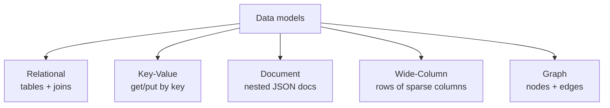

# SQL vs NoSQL

> "SQL or NoSQL?" is the wrong question. The right one is "what are my access patterns?" — and the answer to that picks the data model for you.

**Type:** Learn
**Languages:** Markdown
**Prerequisites:** Phase 0 — Foundations
**Time:** ~40 minutes

## Learning Objectives

- Describe the five major data models: relational, key-value, document, wide-column, graph
- Match a workload to a data model using its access patterns
- Explain what relational databases give you and what they cost at scale
- Recognize when denormalized NoSQL models win and when they hurt
- Justify a storage choice with concrete reasoning, not hype

## The Problem

The database is often the hardest part of a system to change later — data outlives code. Choose wrong and you're either fighting the database forever or doing a painful migration under load. Yet the choice is frequently made by reflex: "we always use Postgres" or "NoSQL scales, so NoSQL." Both reflexes produce broken systems. A relational schema forced onto a firehose of writes falls over; a key-value store forced to do complex joins turns into a slow, buggy reimplementation of SQL in application code.

The trap is treating "SQL vs NoSQL" as a single binary, as if NoSQL were one thing. It isn't — "NoSQL" lumps together at least four very different models (key-value, document, wide-column, graph), each suited to different access patterns and useless for others. Picking a database means picking a *data model*, and the data model should follow from how you actually read and write the data: by primary key? by range? with joins across entities? by graph traversal? Answer that and the field narrows to one or two real candidates.

This lesson gives you the models and the decision process, so your storage choice is something you can defend in a design review.

## The Concept

### The five data models



**Relational (SQL)** — data in tables of rows and columns, with relationships expressed by foreign keys and resolved at query time with **joins**. Enforces a schema and offers ACID transactions (next lesson) and a rich query language. Examples: PostgreSQL, MySQL. Best when data is highly structured and you query it in flexible, ad-hoc ways across related entities.

**Key-value** — a giant dictionary: `put(key, value)`, `get(key)`. No queries beyond the key, but blisteringly fast and trivially shardable. Examples: Redis, DynamoDB (in KV mode). Best for caches, sessions, and any "look up by ID" workload.

**Document** — stores self-contained documents (usually JSON), each holding nested data. Flexible schema; you fetch a whole document by key and can index inner fields. Examples: MongoDB, Couchbase. Best when each entity is read and written as a unit (a product, a user profile) and the shape varies.

**Wide-column** — rows keyed by a partition key, each row holding many (possibly sparse) columns; optimized for huge write volumes and queries by key/range. Examples: Cassandra, HBase, Bigtable. Best for time-series, event logs, and write-heavy workloads at massive scale.

**Graph** — data as nodes and edges, optimized for traversing relationships ("friends of friends of friends"). Examples: Neo4j, Neptune. Best when the *connections* are the primary thing you query.

### What relational databases buy you — and cost

Relational databases are the default for good reason: a flexible query language (SQL), enforced schema (data integrity), and ACID transactions. You can ask questions you didn't anticipate when you designed the schema, and the database guarantees correctness across multi-row updates.

The cost shows up at scale. Joins across large tables are expensive, and a single relational instance is hard to scale horizontally — sharding a relational database (Phase 4) breaks joins across shards and is operationally painful. This is precisely the wall that drove the NoSQL movement: web-scale companies needed to spread writes across hundreds of machines, and the relational model fought them.

### How NoSQL trades away to scale

Most NoSQL stores win scalability by **giving up things relational databases provide**: flexible joins, rigid schema, and sometimes strong consistency (Phase 5). The classic move is **denormalization** — instead of normalizing data across tables and joining at read time, you store it pre-joined in the shape you'll read it. A document database might embed a user's recent posts *inside* the user document, so one key lookup returns the whole profile with no join.

```
Relational (normalized)          Document (denormalized)
-----------------------          ------------------------
users(id, name)                  {
posts(id, user_id, title)   →      "id": 42, "name": "Ada",
-- JOIN to assemble a profile      "posts": [{"title": "..."}, ...]
                                 }   -- one read, no join
```

The win: reads are one fast key lookup, trivially shardable. The cost: writes get harder (update a user's name and you may touch many embedded copies), and you lose the ability to query flexibly across entities. You're trading write complexity and query flexibility for read speed and scale — a deliberate bet that pays off only when reads dominate and access patterns are known in advance.

### A common misconception

"NoSQL scales, SQL doesn't." Misleading on both counts. Modern relational databases (with read replicas, partitioning, and managed services like Spanner or Aurora) scale enormously, and most applications never outgrow a well-tuned Postgres. Meanwhile NoSQL "scales" only for the access patterns it was designed for — ask a key-value store to do an ad-hoc cross-entity report and you're stuck. The honest framing: relational gives you flexibility and integrity by default and takes effort to scale writes; NoSQL gives you scale and speed for *specific* patterns and takes away flexibility. Choose based on which you need.

### The decision process

1. **List your access patterns.** How do you read (by key? range? join? traversal?) and write the data?
2. **Find the dominant pattern.** Reads or writes? Known queries or ad-hoc?
3. **Match to a model** using the table below.
4. **Default to relational** unless a specific pattern clearly demands otherwise — flexibility is valuable and you rarely regret it early.

```
Access pattern                          Model
--------------------------------------  ------------------
Flexible, ad-hoc queries across entities Relational
Look up / store by a single key          Key-value
Fetch whole self-contained entities      Document
Massive write volume, query by key/range Wide-column
Traverse relationships (social graph)    Graph
```

## Exercises

1. **Map workloads to models.** Choose a model for each and justify with the access pattern: (a) user sessions, (b) a bank's accounts and transfers, (c) IoT sensor readings at 1M/sec, (d) a friend-recommendation feature, (e) a product catalog with varying attributes.

2. **Spot the denormalization.** Given normalized `users` and `orders` tables, write (in pseudo-JSON) how a document store would embed them for fast profile reads. What write problem did you create?

3. **Defend the default.** A teammate wants DynamoDB for a new app with unknown, evolving queries. Argue for starting relational. When would you change your mind?

4. **Find the NoSQL win.** Describe a workload where a relational database genuinely struggles and a wide-column store shines. Be specific about the numbers.

5. **Multi-store reality.** Large systems use several databases at once (polyglot persistence). Sketch a system using two different models and say why each is there.

## Key Terms

| Term | What people say | What it actually means |
|------|----------------|------------------------|
| Relational / SQL | "Tables" | Data in tables with foreign keys, joins, schema, and ACID; flexible querying |
| Key-value store | "A big dictionary" | get/put by key only; extremely fast and shardable, no rich queries |
| Document store | "JSON database" | Stores nested self-contained documents; fetch by key, index inner fields |
| Wide-column | "Cassandra-style" | Sparse columns per row keyed by partition; built for write-heavy scale |
| Graph database | "Nodes and edges" | Optimized for traversing relationships between entities |
| Denormalization | "Pre-joining data" | Storing data in read-shaped form to avoid joins; trades write complexity for read speed |
| Access pattern | "How you query" | The shape of reads and writes; the real driver of the storage choice |
| Polyglot persistence | "Many databases" | Using different stores for different parts of one system, each matched to its pattern |
