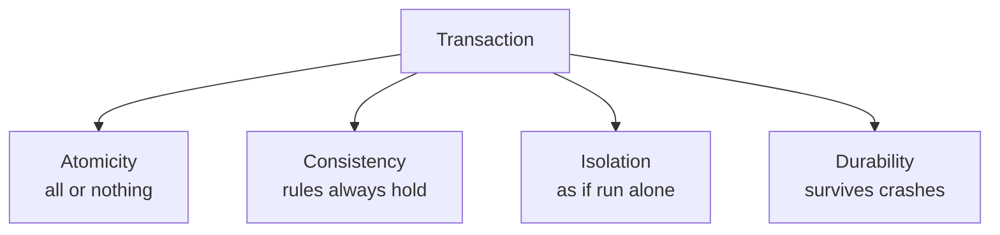

# ACID & Transactions

> Transfer $100 between accounts and the system crashes halfway. Did the money vanish, double, or move correctly? ACID is the set of guarantees that makes the answer always "correctly."

**Type:** Learn
**Languages:** SQL
**Prerequisites:** Phase 2, Lesson 02 — Indexing & Query Performance
**Time:** ~45 minutes

## Learning Objectives

- Define each ACID property: atomicity, consistency, isolation, durability
- Explain why partial updates corrupt data and how transactions prevent it
- Identify the classic concurrency anomalies: dirty read, lost update, phantom
- Choose an isolation level by trading correctness against concurrency
- Reproduce a transaction commit and rollback in SQL

## The Problem

Real operations touch more than one row. Moving money debits one account and credits another. Placing an order decrements inventory, creates an order record, and charges a card. Each of these is logically *one* action, but physically several writes — and the gap between them is where disaster lives. If the system crashes after the debit but before the credit, money disappears. If two people buy the last item at the same time, inventory can go negative. If one transaction reads data another is midway through changing, it acts on a value that never officially existed.

Without protection, concurrent access and partial failure quietly corrupt data, and corrupted data is far worse than a crash — a crash you notice, but silently wrong balances can go undetected for months. **Transactions** are the mechanism that bundles multiple operations into one all-or-nothing unit, and **ACID** is the set of four guarantees a transactional database makes about them. ACID is the reason you can trust a relational database with money.

The catch is that the strongest guarantees cost concurrency. Perfect isolation — making every transaction behave as if it ran completely alone — requires locking that serializes work and limits throughput. So databases offer *isolation levels*: a dial trading correctness for performance, where you pick the weakest level that's still correct for your use case.

## The Concept

### The four ACID properties



**Atomicity** — a transaction is all-or-nothing. Either every operation in it commits, or none does. The money transfer either fully completes (debit *and* credit) or fully rolls back (neither), never half. If anything fails mid-way, the database undoes everything back to the start.

**Consistency** — a transaction moves the database from one valid state to another, never violating its declared rules (constraints, foreign keys, checks). If a rule says balances can't go negative, no transaction can commit a negative balance. (Note: this "C" is about integrity constraints, and is different from the "consistency" in CAP — Phase 5 — which is about replicas agreeing.)

**Isolation** — concurrent transactions don't step on each other; each behaves as if it ran alone, in some serial order. Two simultaneous transfers from the same account won't both read the old balance and overwrite each other.

**Durability** — once a transaction commits, it survives crashes, power loss, and restarts. The database writes to durable storage (typically a write-ahead log) before confirming the commit, so an acknowledged commit is never lost.

### A transaction in SQL

```sql
BEGIN;
  UPDATE accounts SET balance = balance - 100 WHERE id = 1;  -- debit
  UPDATE accounts SET balance = balance + 100 WHERE id = 2;  -- credit
COMMIT;   -- both happen, or with ROLLBACK, neither
```

Everything between `BEGIN` and `COMMIT` is one atomic unit. If you issue `ROLLBACK` (or the connection dies) before `COMMIT`, both updates are discarded as if they never ran.

### The concurrency anomalies

Isolation exists to prevent specific bugs that arise when transactions interleave:

```
Anomaly          What happens
---------------  ----------------------------------------------------------
Dirty read       T2 reads a value T1 wrote but hasn't committed; T1 then
                 rolls back, so T2 acted on data that never existed.
Non-repeatable   T1 reads a row twice and gets different values because T2
  read           committed a change in between.
Lost update      T1 and T2 both read X=10, both compute X+1, both write 11.
                 One update is lost; the result should have been 12.
Phantom read     T1 runs a range query twice; T2 inserts a new matching row
                 in between, so the second read sees an extra "phantom" row.
```

### Isolation levels: the correctness/concurrency dial

The SQL standard defines four isolation levels, each preventing more anomalies at the cost of more locking and less concurrency:

```
Level              Dirty read  Non-repeatable  Phantom   Concurrency
-----------------  ----------  --------------  --------  -----------
Read Uncommitted   possible    possible        possible  highest
Read Committed     prevented   possible        possible    |
Repeatable Read    prevented   prevented       possible*   |
Serializable       prevented   prevented       prevented  lowest
```

(*Some databases also prevent phantoms at Repeatable Read.) **Serializable** is the gold standard — transactions behave exactly as if run one at a time — but it's the slowest. **Read Committed** is the common default (PostgreSQL): it prevents dirty reads while allowing high concurrency. The skill is choosing the *weakest* level that still keeps your specific operation correct: a financial transfer may need Serializable; displaying a dashboard count is fine at Read Committed.

### How databases enforce isolation

Two main mechanisms:

- **Locking** — a transaction locks the rows it touches so others must wait. Simple, but contention hurts throughput and can deadlock.
- **MVCC (Multi-Version Concurrency Control)** — the database keeps multiple versions of a row, so readers see a consistent snapshot without blocking writers. Used by PostgreSQL and others; readers don't block writers and vice versa, giving better concurrency.

### A common misconception

People assume the database always protects them automatically. It does enforce atomicity and durability per transaction — but **lost updates** can still bite you if you use a read-modify-write pattern at a weak isolation level. Reading a balance into the application, adding to it, and writing it back is unsafe under concurrency unless you use a higher isolation level, an atomic `SET balance = balance + 100` (which the database serializes), or explicit locking (`SELECT ... FOR UPDATE`). ACID gives you the tools; using them correctly is still your job.

## Build It (hands-on with SQLite)

Run `code/transactions_demo.sql` to see atomicity in action.

### Step 1 — Set up accounts

```sql
-- Run: sqlite3 bank.db < transactions_demo.sql
DROP TABLE IF EXISTS accounts;
CREATE TABLE accounts (id INTEGER PRIMARY KEY, name TEXT, balance INTEGER);
INSERT INTO accounts VALUES (1, 'Alice', 500), (2, 'Bob', 100);
```

### Step 2 — A successful atomic transfer

```sql
BEGIN;
  UPDATE accounts SET balance = balance - 100 WHERE id = 1;
  UPDATE accounts SET balance = balance + 100 WHERE id = 2;
COMMIT;
-- Alice 400, Bob 200
```

### Step 3 — A rollback undoes everything

```sql
BEGIN;
  UPDATE accounts SET balance = balance - 1000 WHERE id = 1;  -- oops, too much
ROLLBACK;   -- the debit is discarded; Alice still 400
```

### Step 4 — Atomic increment avoids lost updates

```sql
-- Safe under concurrency: the database serializes this single statement
UPDATE accounts SET balance = balance + 50 WHERE id = 2;
```

### Step 5 — Run it

```bash
sqlite3 bank.db < transactions_demo.sql
```

Compare to `outputs/expected.md`. Watch the committed transfer stick and the rolled-back one vanish.

## Exercises

1. **Run it.** Confirm the committed transfer changes balances and the rolled-back one leaves them unchanged. That's atomicity.

2. **Force a constraint.** Add `CHECK (balance >= 0)` to the table and try a transfer that would overdraw. What happens to the whole transaction? Which ACID letter is this?

3. **Simulate a lost update.** In two `sqlite3` sessions, both read Alice's balance, both compute +100 in your head, both write the literal result. Show the lost update, then redo it with `SET balance = balance + 100`.

4. **Reason about levels.** For each, pick an isolation level and justify: (a) transferring money, (b) counting page views, (c) generating an invoice that must not double-count.

5. **MVCC vs locking.** Explain in two sentences how MVCC lets a long read run without blocking writers, and why that improves concurrency over pure locking.

## Key Terms

| Term | What people say | What it actually means |
|------|----------------|------------------------|
| Transaction | "All-or-nothing block" | A group of operations executed as one unit between BEGIN and COMMIT/ROLLBACK |
| Atomicity | "All or nothing" | Either every operation in a transaction commits or none does |
| Consistency (ACID) | "Rules hold" | Every transaction leaves the database satisfying its constraints |
| Isolation | "As if alone" | Concurrent transactions don't interfere; each appears to run serially |
| Durability | "Survives crashes" | A committed transaction persists through power loss and restarts |
| Isolation level | "Strictness dial" | A setting trading anomaly prevention for concurrency (Read Committed → Serializable) |
| Lost update | "Overwrite bug" | Two transactions read-modify-write the same value and one update is silently lost |
| MVCC | "Versioned rows" | Keeping multiple row versions so readers see a snapshot without blocking writers |
