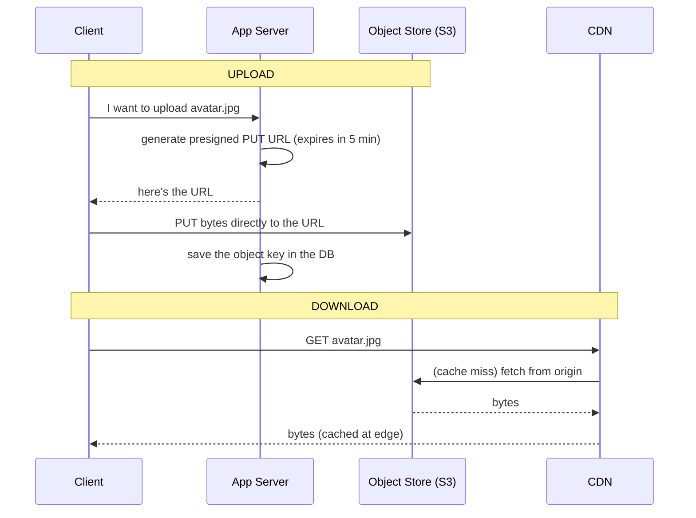

# Object & Blob Storage

> A 4K video does not belong in a database row. Large unstructured files need their own kind of store — one built for cheap, durable, near-infinite capacity addressed by key.

**Type:** Learn
**Languages:** Markdown
**Prerequisites:** Phase 2, Lesson 04 — Data Modeling & Schema Design
**Time:** ~35 minutes

## Learning Objectives

- Explain why large binary files don't belong in a relational database
- Describe the object storage model: buckets, keys, and flat namespace
- Design upload and download paths using presigned URLs
- Connect object storage to CDNs as the origin for static content
- Compare object, block, and file storage at a high level

## The Problem

Applications store two very different kinds of data. There's structured data — users, orders, balances — that fits in rows and needs queries, joins, and transactions. And there are **blobs**: profile pictures, video uploads, PDFs, backups, ML model files. These are large (megabytes to gigabytes), unstructured, and you almost never query *inside* them — you just store one and fetch it whole later. Trying to keep blobs in your relational database is a classic mistake that quietly wrecks performance.

Why is it a mistake? A database is tuned for many small, structured rows with indexes and transactions. Stuff a 50 MB video into a `BLOB` column and you bloat the table, blow up backup sizes, thrash the buffer cache (one row evicts thousands of useful ones), and saturate your precious database connections streaming bytes that need no querying. The database's expensive capabilities — indexing, joins, ACID — are wasted on data that needs none of them, while its scarce resources get consumed.

The right tool is **object storage** (Amazon S3 and equivalents): a service purpose-built to store unlimited large files cheaply and durably, fetch them by key, and serve them at scale — typically through a CDN. Your database then stores only a *pointer* (the object's key/URL) alongside the structured metadata. This split — small structured data in the database, big blobs in object storage — is one of the most common and important patterns in system design.

## The Concept

### The object storage model

Object storage is conceptually a giant key-value store for files:

```
Bucket: "user-uploads"
  ├── avatars/42.jpg        → [bytes] + metadata
  ├── avatars/43.png        → [bytes] + metadata
  └── videos/abc123.mp4     → [bytes] + metadata
```

- **Bucket**: a top-level container (like a namespace) you create.
- **Key**: the unique name of an object within the bucket (e.g. `avatars/42.jpg`). The "folders" are just key prefixes — the namespace is actually flat.
- **Object**: the file's bytes plus metadata (content type, size, custom tags).
- **Operations**: `PUT` (upload), `GET` (download), `DELETE`, `LIST` — no in-place edits and no queries inside the content.

Object stores provide enormous durability (S3 advertises "eleven nines," 99.999999999%, by replicating each object across multiple devices and facilities) and effectively unlimited capacity, at a fraction of database storage cost. You pay per GB stored and per request/bandwidth.

### Why not just store the path on a local disk?

Storing files on the app server's local disk breaks as soon as you have more than one server (Phase 4): a file uploaded to server A isn't on server B. You'd need shared storage anyway. Object storage *is* that shared, durable, scalable store — accessible from every server and every region — without you managing disks, replication, or capacity.

### The upload/download path with presigned URLs

The naive design routes file bytes through your app servers: client → app server → object store, and back. That wastes your servers' bandwidth and CPU proxying huge files. The standard pattern is **presigned URLs**: your app server generates a temporary, signed URL granting permission to upload or download a specific object directly to/from the object store, and the client uses it — bytes never touch your servers.



Benefits: your servers only handle a tiny authorization step; the heavy byte transfer goes straight to the store; permissions are scoped and time-limited.

### Object storage as a CDN origin

Object storage pairs naturally with a CDN (Phase 3). The object store is the **origin** — the source of truth for the file — and the CDN caches copies at edge locations close to users. The first request for an image fetches it from the bucket and caches it at the edge; subsequent requests are served from the edge with low latency, offloading both your database and your object store. This is how virtually every site serves images, video, JS, and CSS at scale.

### Object vs block vs file storage

Three storage abstractions, often confused:

```
Type    Unit          Access                  Use case
------  ------------  ----------------------  --------------------------
Object  whole object  by key over HTTP        blobs: media, backups, static assets
Block   raw blocks    like a virtual disk     databases, VM disks (low-level)
File    files + dirs  filesystem (NFS/SMB)    shared filesystems, legacy apps
```

Object storage is what you want for application blobs. Block storage (e.g. EBS) is the disk *under* a database. File storage (e.g. NFS) is a shared filesystem — useful but harder to scale than object storage.

### A common misconception

People think object storage is "just a hard drive in the cloud." It's not a filesystem: there are no real directories (just key prefixes), no in-place edits (you replace whole objects), and no low-latency random access within a file the way a disk offers. It's optimized for *whole-object* operations at massive scale and durability, not for being a mounted disk. Treating it like a POSIX filesystem leads to bad designs (e.g. trying to append to an object on every write). Match the access pattern: whole files in and out, addressed by key.

## Exercises

1. **Spot the misuse.** A team stores user-uploaded videos as `BLOB` columns in Postgres and wonders why backups take hours and queries got slow. Explain each symptom and the fix.

2. **Design the path.** Sketch the upload flow for profile pictures using presigned URLs. What does the database store, and what never touches your app servers?

3. **Origin + CDN.** Explain what happens on the first vs the second request for the same image when the object store sits behind a CDN. Which systems does the second request avoid?

4. **Pick the storage type.** For each, choose object/block/file: (a) the disk for a Postgres instance, (b) ten million user avatars, (c) a shared folder several legacy app servers mount.

5. **Durability reasoning.** S3 claims eleven nines of durability by replicating objects across facilities. In your own words, what does "eleven nines" mean for the chance of losing a given object in a year?

## Key Terms

| Term | What people say | What it actually means |
|------|----------------|------------------------|
| Object storage | "S3" | A service storing large files as objects addressed by key, durable and near-infinite |
| Blob | "Big file" | Binary Large Object — unstructured data (image, video, backup) stored and fetched whole |
| Bucket | "Top-level container" | A named namespace holding objects |
| Key | "Object name" | The unique identifier of an object within a bucket; prefixes look like folders but the namespace is flat |
| Presigned URL | "Temporary upload/download link" | A time-limited signed URL letting a client transfer bytes directly to/from the store |
| Origin | "Source of truth for files" | The store a CDN pulls from on a cache miss |
| Block storage | "Virtual disk" | Raw block device used under databases and VMs |
| File storage | "Network filesystem" | Shared files-and-directories storage (NFS/SMB) |
