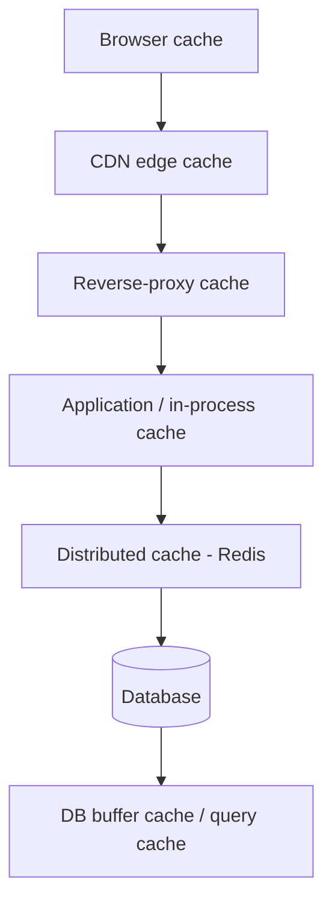

# Why Cache

> The fastest query is the one you never run. Caching is the art of not doing work twice — and at scale, it's often the difference between a system that survives and one that melts.

**Type:** Learn
**Languages:** Markdown
**Prerequisites:** Phase 2 — Data Storage
**Time:** ~35 minutes

## Learning Objectives

- Quantify how a cache reduces latency and backend load
- Compute the effect of hit ratio on origin traffic
- Identify every layer of a stack where a cache can live
- Explain locality — why caching works at all
- Recognize the cost: staleness and the consistency burden

## The Problem

Reading the same data from a database over and over is wasteful. If a million users load the homepage and each load runs the same "fetch trending posts" query, the database does identical work a million times — and databases are the expensive, hard-to-scale part of the system (Phase 4). The query that's fine at 100 requests per second becomes the bottleneck at 100,000. You can buy a bigger database, but that's costly and has a ceiling. Or you can stop asking the same question repeatedly.

That's caching: keep a copy of the answer somewhere fast and cheap, so repeated reads skip the expensive source. A cache turns a 50ms database query into a 1ms memory lookup, and — more importantly at scale — it absorbs the read load so your database only sees the rare cache miss. The economics are stark: serving a read from an in-memory cache can be orders of magnitude cheaper and faster than serving it from a database, and caches scale out far more easily.

Caching is so effective that it's tempting to cache everything. But a cache is a *second copy* of data, and the moment data exists in two places, they can disagree. A cached value is a bet that the underlying data hasn't changed since you stored it — and when that bet is wrong, users see stale information. The entire discipline of caching is managing this freshness-versus-speed tradeoff, which the next lessons formalize.

## The Concept

### What a cache buys you, quantitatively

The key metric is the **cache hit ratio** — the fraction of reads served from cache rather than the origin. Its effect on backend load is dramatic and nonlinear:

```
Hit ratio   Reads hitting the origin (per 1,000,000 reads)
---------   ----------------------------------------------
0%          1,000,000   (no cache)
50%           500,000
90%           100,000
95%            50,000
99%            10,000
99.9%           1,000
```

Going from no cache to 90% cuts origin load 10×; from 90% to 99% cuts it another 10×. A high hit ratio doesn't just speed up reads — it can shrink the database tier from "many shards" to "a few replicas," a huge cost and complexity win. This is why caching is usually the *first* lever pulled when a read-heavy system strains.

Latency improves too. A rough picture:

```
Source                 Typical latency
---------------------  ---------------
In-process cache       ~0.1 µs  (RAM, same process)
Redis (network cache)  ~0.5 ms  (one datacenter round trip)
Database query         ~5–50 ms (parse, plan, disk, return)
```

### Why caching works: locality

Caching only helps because access isn't uniform — some data is requested far more than the rest. This is **locality**:

- **Temporal locality**: data accessed once is likely accessed again soon (a trending post, a logged-in user's profile).
- **Spatial locality**: data near recently-accessed data is likely accessed too (the next page of results).

Real workloads are heavily skewed — often a small fraction of items accounts for most requests (a "power law" or "hot set"). A cache big enough to hold the hot set captures most reads with little memory. If access were perfectly uniform with no repeats, caching wouldn't help at all — there'd be nothing to reuse.

### Where caches live (every layer)

Caches appear up and down the stack; a request can be satisfied at the first layer that has the answer:



- **Browser cache**: the client stores responses (images, CSS) so repeat visits skip the network entirely.
- **CDN edge cache**: static content cached near users (Lesson 05).
- **Reverse-proxy cache**: Nginx/Varnish caches responses in front of app servers.
- **Application / in-process cache**: data held in the app's own memory — fastest, but per-instance and lost on restart.
- **Distributed cache (Redis/Memcached)**: a shared cache tier all app servers query (Lesson 04).
- **Database caches**: the DB's own buffer pool keeps hot pages in memory.

Each layer that catches a request shields everything below it. The closer to the user the cache, the bigger the win.

### A common misconception

"Caching is free performance." It isn't. A cache introduces a second copy of data, and keeping copies consistent with the source is genuinely hard — Phil Karlton's famous line is "there are only two hard things in computer science: cache invalidation and naming things." Cache the wrong thing, or invalidate it wrong, and users see stale prices, deleted posts, or another user's data. Caching also adds a component that can fail, and a cache that goes down can unleash a flood of traffic on an unprepared database (the "thundering herd," Lesson 04). Caching is a powerful tool with real operational cost — used deliberately, not sprinkled everywhere.

## Exercises

1. **Compute origin load.** A service gets 2,000,000 reads/hour. At a 92% hit ratio, how many reach the database per hour? At 99%? What does that imply for how many DB replicas you need?

2. **Find the break-even.** If a DB query costs 20ms and a cache hit costs 1ms, what's the average read latency at 90% hit ratio? At 99%?

3. **Identify locality.** For each, say whether caching will help and why: (a) a trending-topics list, (b) a query for a random unique UUID each time, (c) a user's own profile during a session.

4. **Map the layers.** Trace a request for a product image and a request for a personalized feed through the cache layers. Which layers can serve each, and why does the feed cache differently?

5. **Name the risk.** Give a concrete example where a stale cache value causes a user-visible bug, and one way to bound how stale it can get.

## Key Terms

| Term | What people say | What it actually means |
|------|----------------|------------------------|
| Cache | "Fast copy" | A fast store holding copies of data so repeated reads skip the slower origin |
| Hit ratio | "How often the cache works" | Fraction of reads served from cache; small increases yield large origin-load reductions |
| Cache miss | "Not in cache" | A read the cache can't serve, which falls through to the origin |
| Origin | "The real source" | The authoritative store behind the cache (database, object store) |
| Locality | "Hot data" | The skew that makes some data far more requested than the rest; why caching works |
| Staleness | "Out of date" | A cached value no longer matching the origin; the core risk of caching |
| In-process cache | "Local memory" | Data cached in the app instance's own memory; fastest but per-instance |
| Distributed cache | "Shared cache (Redis)" | A separate cache tier shared by all app servers |
