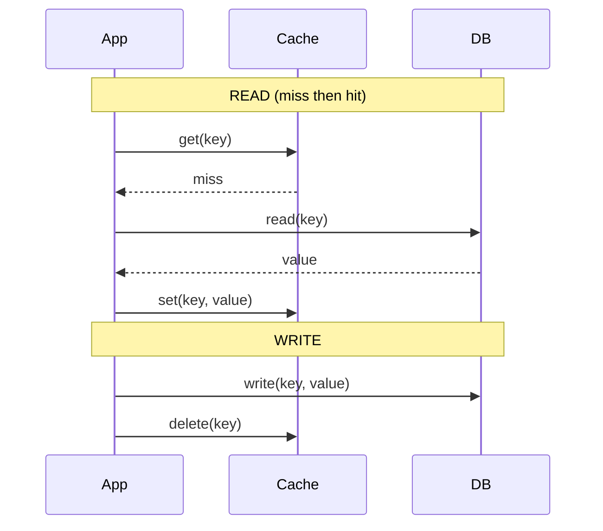

# Caching Strategies

> Putting data in a cache is easy. Keeping it correct as the underlying data changes is the whole game — and there are a handful of named patterns for it, each with a different consistency story.

**Type:** Build
**Languages:** Python
**Prerequisites:** Phase 3, Lesson 01 — Why Cache
**Time:** ~50 minutes

## Learning Objectives

- Implement cache-aside (lazy loading), write-through, and write-back
- Reason about the staleness and consistency each strategy produces
- Use TTL to bound how stale a cached value can become
- Choose an invalidation approach for a given read/write balance
- Recognize the failure modes: stale reads, lost writes, cold caches

## The Problem

A cache holds a copy of data. The instant the source changes, that copy is potentially wrong. So the real question of caching isn't "how do I store it?" — it's "how do reads and writes interact with the cache so users see correct data?" Get this wrong and you ship subtle, infuriating bugs: a user updates their profile photo but keeps seeing the old one; a deleted item still appears; a price shows stale after a sale ends. These aren't crashes — they're silent correctness failures that erode trust.

There are a few standard strategies, and they aren't interchangeable. They differ in *who* writes to the cache and *when*, which determines how fresh reads are, how durable writes are, and how the system behaves when the cache or database fails. Cache-aside is the workhorse default. Write-through trades write latency for consistency. Write-back trades durability for write speed. Knowing the trade-offs lets you pick deliberately instead of discovering the failure mode in production.

This lesson implements each strategy against a simulated database so you can see exactly when the cache and origin agree, when they drift, and what each pattern costs.

## The Concept

### Cache-aside (lazy loading)

The application manages the cache explicitly. On a read: check the cache; on a miss, load from the database and populate the cache. On a write: update the database and *invalidate* (delete) the cache entry, so the next read re-populates it.



Pros: only requested data is cached (memory-efficient); the cache can fail and the system still works (reads fall through to the DB). Cons: the first read of any key is always a miss (cold cache penalty); there's a brief window between the DB write and the cache delete where a concurrent read can re-cache the old value. This is the most common strategy because its failure mode (an occasional miss) is benign.

### Write-through

Every write goes through the cache: the application writes to the cache, which (synchronously) writes to the database, before acknowledging. Reads are always served from the cache, which is guaranteed populated for written keys.

```
write → cache → DB (both updated before ack) → reads always fresh from cache
```

Pros: the cache is always consistent with the DB for written data; reads never serve stale written values. Cons: every write pays the latency of writing both cache and DB; data that's written but never read still occupies cache (wasteful). Often paired with cache-aside reads.

### Write-back (write-behind)

The application writes only to the cache and acknowledges immediately; the cache flushes to the database asynchronously later (batched). Fast writes, but the database lags the cache.

```
write → cache (ack now) → ...later, async... → DB
```

Pros: very fast writes, absorbs write bursts, can batch many writes into fewer DB operations. Cons: **risk of data loss** — if the cache dies before flushing, those writes are gone; the DB is temporarily stale. Used where write throughput matters more than durability (metrics, counters, view counts), rarely for critical data.

### TTL: bounding staleness

Independent of strategy, you attach a **TTL** (time to live) to cache entries: after N seconds, the entry expires and the next read re-fetches. TTL is the safety net that bounds how stale any value can get even if invalidation is missed. A short TTL means fresher data but more misses; a long TTL means fewer misses but staler data. For data that can tolerate brief staleness (a follower count, a trending list), a TTL alone — with no explicit invalidation — is often enough and far simpler.

### Comparison

```
Strategy       Read freshness     Write latency  Durability risk  Best for
-------------  -----------------  -------------  ---------------  --------------------
Cache-aside    stale window       fast (DB only)  none            general read-heavy
Write-through  always fresh       slow (both)     none            read-after-write needs
Write-back     fresh in cache     very fast       HIGH (if cache  high write throughput,
                                                  dies pre-flush)  tolerant of loss
```

### A common misconception

"Just update the cache when you update the database" sounds obviously correct but is a classic source of bugs. The naive "write to DB, then write the new value to cache" has a race: two concurrent writers can interleave so the cache ends up with the older value permanently. That's why cache-aside *deletes* the entry on write (forcing a fresh read) rather than updating it. Invalidation (delete) is safer than update for exactly this reason. And no strategy makes the cache perfectly consistent without cost — there's always a window, a latency price, or a durability risk. Pick the one whose cost you can live with.

## Build It

You'll implement all three strategies against a simulated slow database and observe their behavior. Create `caching_strategies.py`.

### Step 1 — A simulated database and cache

```python
# Run: python caching_strategies.py
import time

class Database:
    def __init__(self):
        self.store = {"user:1": "Ada"}
        self.reads = 0
        self.writes = 0
    def read(self, k):
        self.reads += 1
        return self.store.get(k)
    def write(self, k, v):
        self.writes += 1
        self.store[k] = v

class Cache:
    def __init__(self):
        self.store = {}
    def get(self, k): return self.store.get(k)
    def set(self, k, v): self.store[k] = v
    def delete(self, k): self.store.pop(k, None)
```

### Step 2 — Cache-aside

```python
class CacheAside:
    def __init__(self, db, cache):
        self.db, self.cache = db, cache
    def read(self, k):
        v = self.cache.get(k)
        if v is not None:
            return v, "HIT"
        v = self.db.read(k)              # miss -> load from DB
        if v is not None:
            self.cache.set(k, v)         # populate
        return v, "MISS"
    def write(self, k, v):
        self.db.write(k, v)             # write DB
        self.cache.delete(k)            # invalidate (NOT update)
```

### Step 3 — Write-through

```python
class WriteThrough:
    def __init__(self, db, cache):
        self.db, self.cache = db, cache
    def read(self, k):
        v = self.cache.get(k)
        return (v, "HIT") if v is not None else (self.db.read(k), "MISS")
    def write(self, k, v):
        self.cache.set(k, v)            # cache first
        self.db.write(k, v)             # then DB, synchronously
```

### Step 4 — Write-back

```python
class WriteBack:
    def __init__(self, db, cache):
        self.db, self.cache = db, cache
        self.dirty = {}                 # pending flushes
    def read(self, k):
        v = self.cache.get(k)
        return (v, "HIT") if v is not None else (self.db.read(k), "MISS")
    def write(self, k, v):
        self.cache.set(k, v)            # ack immediately
        self.dirty[k] = v               # DB not updated yet!
    def flush(self):
        for k, v in self.dirty.items():
            self.db.write(k, v)
        self.dirty.clear()
```

### Step 5 — Exercise each strategy

```python
def demo():
    # Cache-aside: first read miss, second hit, write invalidates
    db, cache = Database(), Cache()
    ca = CacheAside(db, cache)
    print("Cache-aside:")
    print("  read1:", ca.read("user:1"))   # MISS -> loads
    print("  read2:", ca.read("user:1"))   # HIT
    ca.write("user:1", "Ada Lovelace")
    print("  read3:", ca.read("user:1"))   # MISS again (invalidated)
    print(f"  DB reads={db.reads} writes={db.writes}")

    # Write-back: DB stays stale until flush
    db2, cache2 = Database(), Cache()
    wb = WriteBack(db2, cache2)
    wb.write("user:1", "Grace")
    print("\nWrite-back:")
    print("  cache value:", cache2.get("user:1"))   # Grace
    print("  DB value (pre-flush):", db2.store["user:1"])  # still Ada!
    wb.flush()
    print("  DB value (post-flush):", db2.store["user:1"]) # Grace
    print("  >> if the cache died before flush, 'Grace' would be LOST")

demo()
```

### Step 6 — Run it

```bash
python caching_strategies.py
```

Watch cache-aside re-miss after a write (because it invalidated), and write-back leave the DB stale until `flush()`. Compare with `outputs/expected.md`.

## Exercises

1. **Run and trace.** Confirm cache-aside's read3 is a MISS (the write invalidated the entry) and that write-back's DB is stale before flush. Explain both.

2. **Add TTL.** Extend `Cache` to store an expiry timestamp per key and treat expired entries as misses. Show a value going stale then refreshing after the TTL.

3. **Expose the race.** Describe the interleaving where "write DB then *set* cache to new value" (instead of delete) leaves the cache permanently stale. Why does deleting avoid it?

4. **Pick a strategy.** Choose one for each and justify: (a) user profile data, (b) a real-time view counter, (c) account balance that must never read stale after a write.

5. **Measure durability risk.** In write-back, simulate the cache "dying" (discard `dirty` without flushing). Show the write is lost. What class of data makes this acceptable?

## Key Terms

| Term | What people say | What it actually means |
|------|----------------|------------------------|
| Cache-aside | "Lazy loading" | App checks cache, loads from DB on miss, invalidates on write; the common default |
| Write-through | "Write to cache + DB" | Writes go through the cache to the DB synchronously; cache always consistent |
| Write-back | "Write-behind" | Writes hit only the cache, flushed to DB asynchronously; fast but risks loss |
| Invalidation | "Bust the cache" | Removing a stale entry (usually by delete) so the next read refreshes it |
| TTL | "Expiry time" | Seconds before an entry expires; bounds maximum staleness regardless of strategy |
| Cold cache | "Empty cache" | A cache with no entries yet, so early reads all miss |
| Stale read | "Old data" | Returning a cached value that no longer matches the origin |
