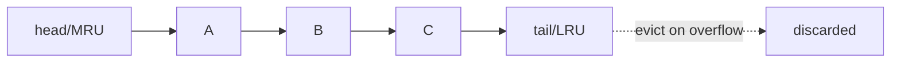

# Eviction Policies & LRU

> A cache has finite memory, so it's always answering one question: when I'm full and need room, which entry do I throw away? Get that wrong and your cache is just slow memory.

**Type:** Build
**Languages:** Python
**Prerequisites:** Phase 3, Lesson 02 — Caching Strategies
**Time:** ~50 minutes

## Learning Objectives

- Explain why a cache needs an eviction policy
- Compare LRU, LFU, and FIFO and predict which keeps the right data
- Implement an O(1) LRU cache with a hash map and doubly linked list
- Reason about hit ratio as a function of policy and cache size
- Recognize where each policy wins and its pathological cases

## The Problem

Memory is finite; the dataset isn't. A cache that could hold everything wouldn't need to evict — but real caches hold a small fraction of the data and rely on locality (Lesson 01) to capture the hot set. The moment the cache fills, every new entry forces an old one out. *Which* one you evict decides everything: evict a hot item and you'll immediately miss on it and have to reload it (a self-inflicted wound), while evicting truly cold data costs nothing. A good eviction policy keeps the hot set resident and sheds the cold; a bad one thrashes — constantly evicting things it's about to need.

This isn't a minor tuning knob. The difference between a 95% and a 70% hit ratio — often just a matter of eviction policy and size — can be the difference between a database that's comfortable and one that's on fire. And the policy has to be *cheap*: a cache that takes O(n) to decide what to evict on every access defeats its own purpose. The classic answer, LRU, achieves the decision in O(1) using a clever pairing of two data structures, which is exactly what you'll build.

## The Concept

### The policies

```
Policy  Evicts...                          Bet it makes
------  ---------------------------------  ----------------------------------
LRU     least recently used entry          recently used → used again soon
LFU     least frequently used entry        often used → keep regardless of recency
FIFO    oldest inserted entry              age = irrelevance (usually wrong)
Random  a random entry                     cheap; surprisingly OK as a baseline
```

**LRU (Least Recently Used)** evicts whatever hasn't been touched for the longest time. It bets on *temporal locality*: if you used something recently, you'll probably use it again. This matches most real workloads, which is why LRU (and approximations of it) is the default in most caches.

**LFU (Least Frequently Used)** evicts the entry with the fewest accesses. It bets on popularity over recency — good when some items are durably hot (a perennially popular product) and you don't want a brief burst of new items to evict them. Downside: an item that was hot long ago can linger forever, and tracking frequencies costs more.

**FIFO (First In First Out)** evicts the oldest-inserted entry regardless of use. Simple, but usually wrong — a frequently used item gets evicted just for being old, even if it was accessed a millisecond ago.

### Why LRU usually wins

Consider this access sequence with a cache of size 3:

```
Access: A B C A B D A
LRU cache (size 3), evicting least-recently-used:
  A      -> [A]
  B      -> [A B]
  C      -> [A B C]
  A      -> [B C A]        (A moved to most-recent)
  B      -> [C B A]        (B moved to most-recent)
  D      -> [B A D]        (C evicted: it was least recently used) -- correct!
  A      -> [B D A]        (A still resident, HIT)
```

LRU correctly evicted C, the genuinely cold item, and kept A and B which were being reused. FIFO would have evicted A (oldest inserted) on the D access — and then immediately missed on the next A. That's the difference a policy makes.

### Implementing LRU in O(1)

The challenge: on every access you must (a) find the entry fast and (b) mark it as most-recently-used fast, and on eviction (c) find and remove the least-recently-used entry fast. A naive list gives O(n) for the "move to front" step. The classic solution pairs two structures:

```
Hash map:          key -> node        (O(1) lookup)
Doubly linked list: order of use      (O(1) move and remove)

   MRU end                          LRU end
   [head] <-> [A] <-> [B] <-> [C] <-> [tail]
                ^                  ^
          most recent        evict from here
```

- **Hash map** gives O(1) lookup from key to its list node.
- **Doubly linked list** maintains usage order: most-recently-used at the head, least at the tail. Because each node has prev/next pointers, you can unlink it and move it to the head in O(1).

On `get(key)`: look up the node in the map, move it to the head (mark MRU), return its value. On `put(key, value)`: insert at head; if over capacity, remove the tail node (LRU) and delete it from the map. Every operation is O(1).



### A common misconception

"LRU is always best." No — LRU has a famous failure case: a **scan** larger than the cache. Reading a million distinct keys once each (a full-table sweep) evicts your entire hot set to cache data you'll never read again — LRU pollution. LFU resists this (one-time accesses never build up frequency), and real systems use hybrids (e.g. "segmented LRU," ARC, or admission policies like TinyLFU) to get the best of both. The other misconception is that the policy matters more than the size: often simply making the cache big enough to hold the hot set matters more than which policy you pick. Measure hit ratio against both.

## Build It

You'll implement an O(1) LRU cache and compare it to FIFO on a workload. Create `lru_cache.py`.

### Step 1 — The node and structure

```python
# Run: python lru_cache.py
class Node:
    __slots__ = ("key", "val", "prev", "next")
    def __init__(self, key=None, val=None):
        self.key, self.val = key, val
        self.prev = self.next = None

class LRUCache:
    def __init__(self, capacity):
        self.cap = capacity
        self.map = {}                      # key -> Node
        # sentinel head (MRU side) and tail (LRU side)
        self.head, self.tail = Node(), Node()
        self.head.next, self.tail.prev = self.tail, self.head
        self.hits = self.misses = self.evictions = 0
```

### Step 2 — Linked-list helpers (all O(1))

```python
    def _remove(self, node):
        node.prev.next, node.next.prev = node.next, node.prev

    def _add_front(self, node):            # insert right after head (MRU)
        node.next = self.head.next
        node.prev = self.head
        self.head.next.prev = node
        self.head.next = node
```

### Step 3 — get and put

```python
    def get(self, key):
        if key in self.map:
            node = self.map[key]
            self._remove(node)
            self._add_front(node)          # mark most-recently-used
            self.hits += 1
            return node.val
        self.misses += 1
        return None

    def put(self, key, val):
        if key in self.map:
            node = self.map[key]
            node.val = val
            self._remove(node)
            self._add_front(node)
            return
        node = Node(key, val)
        self.map[key] = node
        self._add_front(node)
        if len(self.map) > self.cap:       # over capacity -> evict LRU
            lru = self.tail.prev
            self._remove(lru)
            del self.map[lru.key]
            self.evictions += 1
```

### Step 4 — A FIFO cache to compare

```python
from collections import OrderedDict
class FIFOCache:
    def __init__(self, capacity):
        self.cap = capacity
        self.store = OrderedDict()
        self.hits = self.misses = self.evictions = 0
    def get(self, key):
        if key in self.store:
            self.hits += 1
            return self.store[key]          # note: does NOT reorder
        self.misses += 1
        return None
    def put(self, key, val):
        if key not in self.store and len(self.store) >= self.cap:
            self.store.popitem(last=False)  # evict oldest inserted
            self.evictions += 1
        self.store[key] = val
```

### Step 5 — Run a workload through both

```python
def run(cache, accesses):
    for k in accesses:
        if cache.get(k) is None:
            cache.put(k, f"val{k}")
    return cache

# Skewed workload: keys 1-3 are hot, reused often; 4-8 appear once each
workload = [1,2,3,1,2,4,1,2,3,5,1,2,3,6,1,2,7,1,2,3,8,1,2,3]

lru = run(LRUCache(3), workload)
fifo = run(FIFOCache(3), workload)
print(f"Workload length: {len(workload)}, cache size: 3, hot keys: 1,2,3\n")
print(f"LRU : hits={lru.hits:2}  misses={lru.misses:2}  evictions={lru.evictions:2}")
print(f"FIFO: hits={fifo.hits:2}  misses={fifo.misses:2}  evictions={fifo.evictions:2}")
print("\nLRU keeps the reused hot keys resident; FIFO evicts them by age.")
```

### Step 6 — Run it

```bash
python lru_cache.py
```

LRU should land more hits because it keeps the frequently-reused keys 1–3, while FIFO evicts them simply for being old. Compare with `outputs/expected.md`.

## Exercises

1. **Run and compare.** How many more hits does LRU get than FIFO on this workload? Explain which keys each policy keeps.

2. **Trace by hand.** For `A B C A D` with size 3, write the cache contents after each access under LRU, and identify what gets evicted on `D`.

3. **Break LRU with a scan.** Append `range(100, 200)` (100 unique keys) to the workload, then access the hot keys again. Show how the scan evicts the hot set under LRU. Would LFU survive better?

4. **Vary the size.** Run the workload with sizes 2, 3, 4, 5. Plot (or print) hit ratio vs size. At what size does LRU capture the whole hot set?

5. **Verify O(1).** Argue why every `get` and `put` is constant time. Which structure provides the O(1) lookup, and which provides the O(1) reorder/evict?

## Key Terms

| Term | What people say | What it actually means |
|------|----------------|------------------------|
| Eviction policy | "What to drop" | The rule deciding which entry to remove when the cache is full |
| LRU | "Drop the stalest" | Evicts the least-recently-used entry; bets on temporal locality |
| LFU | "Drop the rarest" | Evicts the least-frequently-used entry; bets on long-term popularity |
| FIFO | "Drop the oldest" | Evicts the oldest-inserted entry regardless of use |
| Doubly linked list | "List with prev/next" | Lets LRU move and remove nodes in O(1) to track usage order |
| Cache pollution | "Scan trashing" | A large one-time scan evicting the useful hot set; LRU's classic weakness |
| Hot set | "The reused data" | The small subset of data responsible for most accesses |
