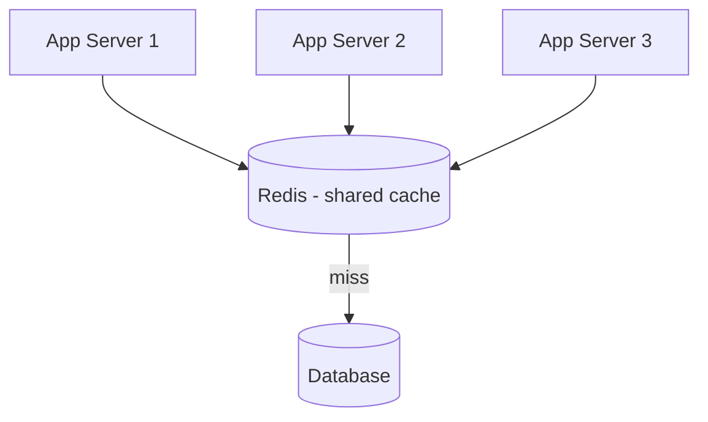

# Distributed Caching with Redis

> An in-process cache dies with its server and isn't shared. Once you run many app servers, you need one cache they all see — and that shared cache brings its own failure modes, like the stampede.

**Type:** Build
**Languages:** Python
**Prerequisites:** Phase 3, Lesson 03 — Eviction Policies & LRU
**Time:** ~50 minutes

## Learning Objectives

- Explain why a shared distributed cache beats per-instance in-process caches at scale
- Describe what Redis provides: in-memory key-value store, TTL, atomic ops
- Diagnose and fix the thundering-herd / cache-stampede problem
- Apply locking and request coalescing to prevent stampedes
- Reason about distributed cache topology and what happens when it fails

## The Problem

In-process caching (Lesson 01) is the fastest possible cache — data in your app's own memory — but it has two fatal limits at scale. First, it's **per-instance**: with ten app servers you have ten separate caches, each cold for data the others have warmed, and each holding its own (possibly inconsistent) copy. A value invalidated on server A is still stale on servers B through J. Second, it **dies with the process**: a deploy or crash wipes the cache, and the cold restart hammers the database. As soon as you scale horizontally (Phase 4), per-instance caching stops being enough.

The fix is a **distributed cache** — a separate, shared cache tier (typically Redis or Memcached) that all app servers query over the network. Now there's one cache, one copy of each value, one place to invalidate, and it survives app restarts. You trade the ~0.1µs of an in-process hit for the ~0.5ms of a network round trip — still ~100× faster than a database query, and worth it for consistency and shared warmth.

But a shared cache concentrates risk. When a popular key expires or the cache restarts cold, *every* app server misses simultaneously and slams the database with the same query at once — the **thundering herd** or **cache stampede**. A cache meant to protect the database can, at the worst moment, become the trigger that takes it down. Understanding and preventing stampedes is the core skill of running a distributed cache, and it's what you'll build.

## The Concept

### What Redis is

Redis is an in-memory data store most commonly used as a distributed cache. Key properties relevant here:

- **In-memory**: data lives in RAM, so reads and writes are sub-millisecond.
- **Key-value with rich types**: strings, hashes, lists, sets, sorted sets — more than a plain cache.
- **TTL built in**: `SET key value EX 300` expires automatically in 300s.
- **Atomic operations**: `INCR`, `SETNX` (set-if-not-exists), and Lua scripts run atomically, which is exactly what you need for distributed counters and locks (Phase 8's rate limiter relies on this).
- **Single-threaded command execution**: commands are serialized, so individual operations don't race with each other.

A typical deployment puts Redis between the app tier and the database:



### The thundering herd / cache stampede

Here's the failure. A hot key (say the trending list) has a TTL. It expires. In the next few milliseconds, hundreds of concurrent requests all check the cache, all miss, and all run the expensive database query *simultaneously* — because none of them has finished and re-populated the cache yet.

```
t=0   key expires
t=0   req1 miss -> querying DB...
t=0   req2 miss -> querying DB...   (same expensive query)
t=0   req3 miss -> querying DB...
...   500 requests, 500 identical DB queries at once -> DB overload
t=50  first query returns, finally re-populates cache
```

One expired key just generated 500 identical database queries. At worst, the DB can't keep up, queries pile up, latency spikes, more requests miss, and the system spirals. This is a real and common outage cause.

### Fixes

**1. Locking / request coalescing.** Only let *one* request recompute a missed key; the rest wait for it (or briefly serve stale). Implemented with an atomic "set if not exists" lock: the first misser acquires the lock and queries the DB; concurrent missers see the lock and wait or back off, then read the freshly-cached value.

```mermaid
sequenceDiagram
  participant R1 as Req 1
  participant R2 as Req 2..N
  participant C as Cache
  participant DB
  R1->>C: miss; acquire lock (SETNX)
  R2->>C: miss; lock held -> wait
  R1->>DB: query (only one!)
  DB-->>R1: value
  R1->>C: set value + release lock
  R2->>C: read fresh value (HIT)
```

**2. Stale-while-revalidate.** Keep serving the old value past expiry while one background task refreshes it — readers never block, the DB sees one refresh.

**3. TTL jitter.** Add randomness to TTLs (e.g. 300s ± 30s) so many keys don't expire at the same instant, spreading recomputation over time rather than synchronizing it.

**4. Cache warming.** Pre-populate hot keys before traffic hits (e.g. after a deploy) so a cold cache never faces full load.

### What happens when the cache fails

A distributed cache is itself a component that can fail. If Redis goes down and every read falls through to the database, you get a stampede on a massive scale. Mitigations: run Redis with replication and failover (a replica promotes if the primary dies), shard the cache so one node's failure loses only part of it, and design the app to degrade gracefully (rate-limit DB fallback, serve stale, or shed load) rather than letting an unbounded flood hit the database. Never assume the cache is always there.

### A common misconception

"Add Redis and the database is safe." Only if you handle the stampede and the cache-failure cases. A naive cache-aside with shared Redis and synchronized TTLs can make things *worse* than no cache — because all instances now miss in lockstep, whereas independent in-process caches at least miss at different times. The cache reduces *steady-state* load enormously, but the dangerous moments are the transitions (expiry, cold start, failover), and those need explicit handling. A distributed cache is infrastructure to operate, not a magic shield.

## Build It

You'll simulate a shared cache and demonstrate a stampede, then fix it with a lock. Create `stampede.py`.

### Step 1 — A shared cache with TTL and an expensive DB

```python
# Run: python stampede.py
import threading, time

class SharedCache:
    def __init__(self):
        self.store = {}         # key -> (value, expires_at)
        self.lock = threading.Lock()
    def get(self, k):
        item = self.store.get(k)
        if item and item[1] > time.time():
            return item[0]
        return None
    def set(self, k, v, ttl):
        self.store[k] = (v, time.time() + ttl)

db_queries = 0
db_lock = threading.Lock()

def expensive_db_query():
    global db_queries
    with db_lock:
        db_queries += 1
    time.sleep(0.05)            # simulate a slow query
    return "trending-data"
```

### Step 2 — Naive cache-aside (stampedes)

```python
def naive_read(cache, key):
    v = cache.get(key)
    if v is not None:
        return v
    v = expensive_db_query()   # every concurrent misser does this!
    cache.set(key, v, ttl=1)
    return v
```

### Step 3 — Protected read with a lock (coalesces)

```python
recompute_locks = {}
guard = threading.Lock()

def protected_read(cache, key):
    v = cache.get(key)
    if v is not None:
        return v
    # get-or-create a per-key lock
    with guard:
        lock = recompute_locks.setdefault(key, threading.Lock())
    with lock:                      # only ONE thread recomputes at a time
        v = cache.get(key)          # double-check: someone may have filled it
        if v is not None:
            return v
        v = expensive_db_query()
        cache.set(key, v, ttl=1)
        return v
```

### Step 4 — Fire many concurrent requests at an expired key

```python
def hammer(read_fn, label):
    global db_queries
    db_queries = 0
    cache = SharedCache()          # cold cache -> key missing
    threads = [threading.Thread(target=read_fn, args=(cache, "trending"))
               for _ in range(100)]
    for t in threads: t.start()
    for t in threads: t.join()
    print(f"{label:18} 100 concurrent requests -> {db_queries} DB queries")

hammer(naive_read, "Naive cache-aside")
hammer(protected_read, "Lock-protected")
```

### Step 5 — Run it

```bash
python stampede.py
```

The naive version sends many DB queries for one missing key (the stampede); the lock-protected version collapses them to a single query. Compare with `outputs/expected.md`.

## Exercises

1. **Observe the stampede.** Run it. How many DB queries does the naive version make for one cold key? How many does the protected version make? Explain the difference.

2. **Add jitter.** Modify `set` to apply a random TTL within ±20%. Argue how this helps when many *different* keys would otherwise expire together.

3. **Stale-while-revalidate.** Change `protected_read` so waiting threads return the *previous* stale value (if any) instead of blocking. What does this trade away?

4. **Simulate cache failure.** Make `cache.get` always return `None` (Redis is down) and run the naive version. What happens to DB query count? Which mitigation from the lesson would you add?

5. **In-process vs distributed.** Explain one scenario where independent in-process caches accidentally avoid a stampede that a shared cache with synchronized TTLs would suffer.

## Key Terms

| Term | What people say | What it actually means |
|------|----------------|------------------------|
| Distributed cache | "Shared cache (Redis)" | A separate cache tier all app servers query, giving one shared, restart-surviving copy |
| Redis | "In-memory store" | A fast in-memory key-value store with TTL and atomic ops, common as a distributed cache |
| Thundering herd | "Stampede" | Many concurrent requests missing the same key at once and all hitting the DB simultaneously |
| Request coalescing | "Single-flight" | Letting only one request recompute a missed key while others wait for its result |
| TTL jitter | "Randomized expiry" | Adding randomness to TTLs so keys don't all expire at the same instant |
| Stale-while-revalidate | "Serve old, refresh behind" | Returning the expired value while one background task refreshes it |
| SETNX | "Set if not exists" | An atomic Redis op used to implement distributed locks |
