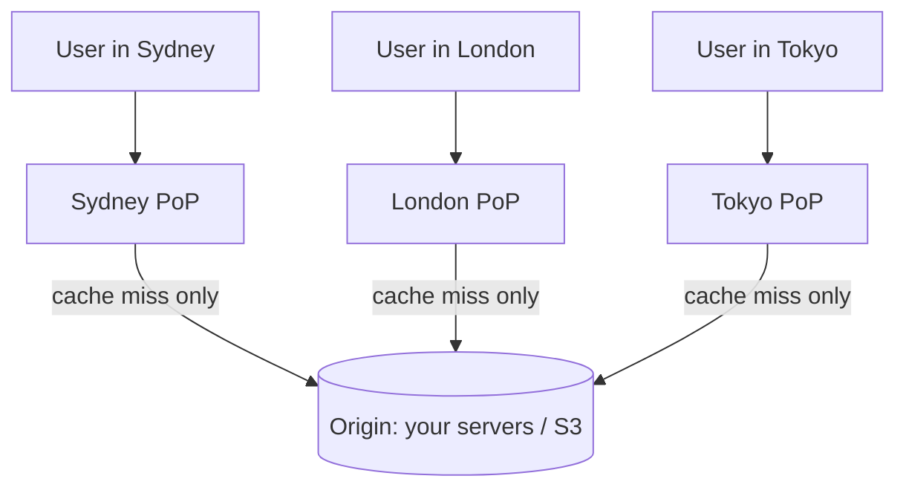

# CDNs & Edge Caching

> A round trip to a server on another continent costs ~150ms no matter how fast your code is. A CDN's whole job is to put the answer a few milliseconds away instead.

**Type:** Learn
**Languages:** Markdown
**Prerequisites:** Phase 3, Lesson 04 — Distributed Caching with Redis
**Time:** ~35 minutes

## Learning Objectives

- Explain how a CDN reduces latency by caching content near users
- Describe edge PoPs and anycast routing
- Design cache-control headers for correct caching and invalidation
- Distinguish caching static from dynamic content at the edge
- Connect the CDN to its origin (your servers / object store)

## The Problem

Physics sets a floor on latency. Data travels through fiber at roughly two-thirds the speed of light, so a request from Sydney to a server in Virginia and back takes ~150–200ms *before any processing* — just transit time. For a page that loads dozens of images, scripts, and stylesheets, that round-trip cost, paid repeatedly, makes a site feel sluggish for distant users no matter how optimized your backend is. You can't make light faster; you can only move the content closer.

That's the entire premise of a **Content Delivery Network**: a globally distributed fleet of caching servers (edge locations) that store copies of your content near users, so a request from Sydney is served from a Sydney edge node in a few milliseconds instead of crossing an ocean. CDNs also absorb enormous load — serving cached static assets from hundreds of edges means your origin servers and object store (Phase 2) handle only the rare cache miss, even under a traffic spike or attack. For static, cacheable content, a CDN is one of the highest-leverage components in a large system.

The catch, as with all caching, is freshness and control. The CDN holds copies you don't directly manage, scattered across hundreds of locations. When you update a file, how do all those edges learn it changed? When should an edge cache something versus always ask the origin? Getting the caching rules right — via cache-control headers and invalidation — is what separates a fast, correct CDN setup from one serving users last week's content.

## The Concept

### Edge PoPs and how requests reach the nearest one

A CDN runs **Points of Presence (PoPs)** — clusters of caching servers — in data centers around the world. The trick that routes each user to their nearest PoP is **anycast**: the CDN advertises the same IP address from every PoP, and internet routing naturally delivers each user's packets to the topologically closest one.



Each PoP caches content. On a **hit**, it serves the user directly — fast, and the origin never knows. On a **miss**, the PoP fetches from the **origin** (your servers or object store), caches the result per your rules, and serves it; the next user in that region gets a hit. So the first request to a region pays the long trip; everyone after rides the cache.

### Cache-control: telling the CDN what to do

You control caching behavior with HTTP response headers, primarily `Cache-Control`:

```
Cache-Control: public, max-age=31536000, immutable    ← cache hard (1 year)
Cache-Control: public, max-age=300                     ← cache 5 minutes
Cache-Control: no-store                                ← never cache (e.g. personal data)
Cache-Control: private                                 ← browser may cache, CDN must not
```

- **`max-age`** — how long (seconds) the content may be served from cache before revalidating. Long for things that don't change; short for things that do.
- **`no-store`** — never cache (sensitive or per-user responses).
- **`private`** — cacheable by the user's browser but not by shared caches like the CDN.
- **`ETag` / `Last-Modified`** — validators letting a cache ask the origin "has this changed?" and get a cheap `304 Not Modified` if not.

### The invalidation problem and cache busting

Once an edge caches a file for `max-age=31536000` (a year), how do you push an update? Two approaches:

1. **Purge / invalidation**: tell the CDN to drop a URL from all edges. Works, but can be slow to propagate and is rate-limited by providers.
2. **Cache busting (the standard trick)**: never overwrite a URL; instead give each version a new URL. Build tools fingerprint asset filenames with a content hash — `app.3f9a2c.js` — so a new build produces `app.7b1e4d.js`, a brand-new URL the CDN has never seen. The HTML referencing it changes to point at the new name. Old caches are simply never requested again.

This is why you can safely set `immutable, max-age=1year` on hashed assets: the content at a given URL truly never changes, because changes get a new URL. Cache busting sidesteps invalidation entirely — the highest-leverage CDN pattern.

```
index.html              -> Cache-Control: max-age=60   (short; points to hashed assets)
app.3f9a2c.js           -> Cache-Control: immutable, max-age=31536000
logo.8c1d.png           -> Cache-Control: immutable, max-age=31536000
```

### Static vs dynamic content

CDNs naturally cache **static** content — images, video, CSS, JS, fonts — identical for all users. **Dynamic**, personalized content (your logged-in feed) generally can't be cached at the edge because it differs per user and changes constantly. Modern CDNs blur this line: they can cache dynamic content briefly (micro-caching), run logic at the edge (edge functions/workers) to personalize close to the user, and accelerate uncacheable requests by terminating TLS and keeping warm connections to the origin. But the bread-and-butter win is still static assets.

### A common misconception

"A CDN makes everything faster." It speeds up *cacheable* content; it can't cache a unique, personalized, constantly-changing response, and forcing it to (or misconfiguring headers) can serve one user's private data to another — a serious bug. The other misconception is that a CDN replaces your caching strategy. It's the outermost layer (Lesson 01's diagram), complementing — not replacing — your Redis tier and database. And a CDN with wrong cache headers is worse than none: it can pin stale content across the globe with no easy fix beyond a purge. Set headers deliberately; prefer cache busting for assets and short TTLs (or `no-store`) for anything personal.

## Exercises

1. **Trace a request.** Walk a user in Tokyo loading `logo.png` for the first time, then a second Tokyo user loading it. Which hits the origin, and why is the second fast?

2. **Write the headers.** Give the `Cache-Control` you'd set for: (a) a content-hashed `app.a1b2.js`, (b) `index.html`, (c) an API response with the user's account balance, (d) a public blog post that updates occasionally.

3. **Bust the cache.** Explain why fingerprinting filenames (`app.<hash>.js`) lets you set a one-year `max-age` and still ship updates instantly. What changes to trigger the new URL?

4. **Anycast reasoning.** In one or two sentences, explain how advertising the same IP from many PoPs sends each user to a nearby one.

5. **Spot the bug.** A team sets `Cache-Control: public, max-age=600` on an endpoint returning the logged-in user's profile. What goes wrong, and what header should they use?

## Key Terms

| Term | What people say | What it actually means |
|------|----------------|------------------------|
| CDN | "Makes sites load fast" | A globally distributed cache fleet serving content from locations near users |
| Edge / PoP | "A CDN location" | A Point of Presence — a cluster of caching servers in a region |
| Anycast | "Same IP everywhere" | Advertising one IP from many PoPs so routing delivers users to the nearest |
| Origin | "The source" | Your servers or object store that the CDN pulls from on a miss |
| Cache-Control | "Caching header" | The HTTP header dictating whether/how long a response may be cached |
| max-age | "Cache duration" | Seconds a response may be served from cache before revalidating |
| Cache busting | "Versioned URLs" | Fingerprinting asset filenames so updates get new URLs, sidestepping invalidation |
| Edge function | "Code at the edge" | Logic run at the PoP to personalize or transform responses near the user |
