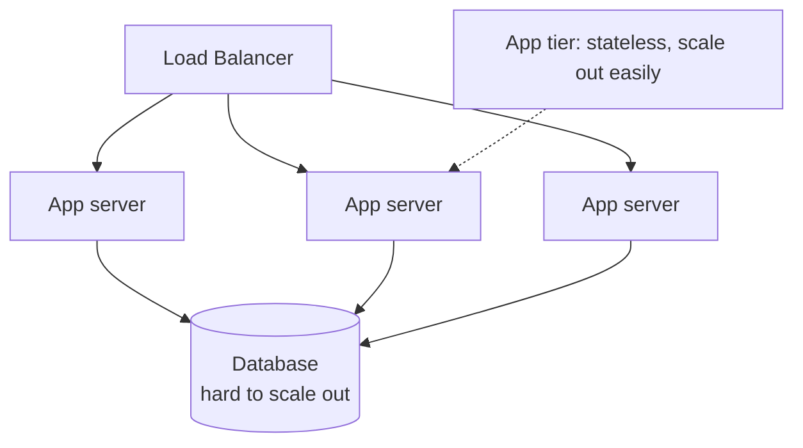

# Vertical vs Horizontal Scaling

> You can buy a bigger machine, or buy more machines. The first is easy until it isn't; the second is hard until it's the only thing that works.

**Type:** Learn
**Languages:** Markdown
**Prerequisites:** Phase 0 — Foundations
**Time:** ~35 minutes

## Learning Objectives

- Distinguish vertical scaling (scale up) from horizontal scaling (scale out)
- Identify the ceiling and single-point-of-failure problem of scaling up
- Explain why scaling out enables availability and near-unlimited growth
- Recognize what makes a component easy or hard to scale horizontally
- Choose a scaling approach based on the component and its constraints

## The Problem

A system under growing load eventually runs out of headroom on its current hardware. The CPU pins at 100%, memory fills, the disk can't keep up. There are exactly two ways out, and they lead to very different architectures. You can **scale vertically** — replace the machine with a more powerful one (more cores, more RAM, faster disks). Or you can **scale horizontally** — add more machines and spread the load across them. The choice shapes everything downstream: your availability story, your cost curve, and how much complexity you take on.

Scaling up is seductive because it requires no code changes — a bigger box runs the same software, faster. But it has a hard ceiling (the biggest machine money can buy is finite), the cost grows non-linearly (top-end hardware is exponentially pricier), and crucially, one machine is one **single point of failure**: when it dies, everything dies. Scaling out removes the ceiling and the single point of failure, but demands that your software be *designed* to run across many machines — which, for some components (stateless app servers), is easy, and for others (a database), is one of the hardest problems in the field.

Real systems use both, applied where each fits. The art is knowing which components can scale out cheaply and which are stuck scaling up until you do the hard work of distributing them.

## The Concept

### The two directions

```
Vertical scaling (scale UP)            Horizontal scaling (scale OUT)
---------------------------            ------------------------------
   [ small server ]                       [server] [server] [server]
          |                                   \       |       /
          v                                    \      |      /
   [ BIGGER server ]                          [ load balancer ]
   more CPU/RAM/disk                          add more boxes as needed

one machine, made bigger                many machines, sharing the load
```

**Vertical scaling** keeps one machine and makes it more powerful. Simple — no architectural change, no distribution problems, no network between components. It's the right first move: a single beefy server handles a surprising amount, and you avoid distributed-systems complexity entirely.

**Horizontal scaling** keeps machines modest but adds more of them behind a load balancer (Phase 1). Each handles a share of the load; to grow, you add boxes. This is how web-scale systems are built, because it's the only approach without a ceiling.

### Why scaling up hits a wall

```
Limit of scaling up      Consequence
---------------------    ----------------------------------------
Hardware ceiling         The largest machine is finite; you can't
                         grow past it no matter the budget.
Non-linear cost          Doubling a machine's power costs far more
                         than 2x; top-end hardware is exponentially
                         priced.
Single point of failure  One machine = one thing that, when it
                         dies, takes the whole system down.
Downtime to upgrade      Swapping to a bigger box often means taking
                         the service offline.
```

That third row is the deepest problem. No matter how powerful, one machine can't give you high availability — there's no redundancy. A system that must stay up *needs* more than one machine, which means horizontal scaling, period.

### Why scaling out is powerful — and demanding

Horizontal scaling solves both the ceiling and availability:

- **No ceiling**: need more capacity? Add machines. Growth is (in principle) unbounded.
- **High availability**: if one machine dies, the others carry on; the load balancer routes around it. Redundancy is built in (Phase 7).
- **Elasticity**: add machines during peaks and remove them when idle — pay for what you use (cloud auto-scaling).

The cost is complexity. The instant you have many machines, you face distributed-systems problems: How is load split? How do they share state? What happens when one fails mid-request? How do you keep data consistent across them (Phase 5)? These are the subjects of the rest of this course. Horizontal scaling isn't free — it trades hardware cost for engineering complexity.

### What's easy vs hard to scale out

The single biggest factor is **state**:

- **Stateless components scale out trivially.** App servers that hold no per-client state (Lesson 05) are interchangeable — add ten more behind the load balancer and you're done. This is why the app tier is almost always horizontally scaled.
- **Stateful components are hard.** A database holds the data; you can't just add a copy and split traffic, because the copies must agree. Scaling a database out means replication (Lesson 02), sharding (Lesson 03), and confronting consistency tradeoffs (Phase 5) — genuinely hard work.



The common pattern: scale the stateless app tier out freely, and push the hard scaling work onto the data tier only when you must — which is exactly why the next lessons are about scaling databases.

### A common misconception

"Always scale horizontally; vertical scaling is obsolete." Wrong for most systems. Vertical scaling is the correct *first* move — a single well-provisioned database server handles the load of the vast majority of applications, and going distributed prematurely buys you consensus, replication lag, and sharding pain you didn't need. Modern hardware is enormous (terabytes of RAM, dozens of cores). The right sequence is usually: scale up until it's no longer cost-effective or you need availability, *then* take on horizontal scaling where it's required. The opposite error — scaling up forever — eventually hits the wall and the availability problem. Match the approach to where you actually are.

## Exercises

1. **Pick the direction.** For each, say scale up or out first and why: (a) a stateless API tier at 5× growth, (b) a primary database at 80% CPU, (c) a service that must hit 99.99% availability.

2. **Compute the SPOF cost.** A single server gives 99.9% availability. Two independent servers behind a load balancer (either can serve) — roughly what availability results, and why is it higher?

3. **Find the ceiling.** Give a concrete reason scaling up a database eventually fails even with an unlimited budget.

4. **State audit.** List three things an app server might store locally that would block horizontal scaling, and where each should live instead.

5. **Sequence it.** Describe the scaling path for a startup from one server to a globally distributed system, naming when each transition becomes necessary.

## Key Terms

| Term | What people say | What it actually means |
|------|----------------|------------------------|
| Vertical scaling | "Scale up" | Replacing a machine with a more powerful one; simple but ceilinged |
| Horizontal scaling | "Scale out" | Adding more machines behind a load balancer; unbounded but complex |
| Single point of failure | "One thing kills it" | A component whose failure takes down the system; inherent to one machine |
| Elasticity | "Auto-scaling" | Adding/removing machines with demand to pay only for what's used |
| Stateless | "No local state" | A component holding no per-client state, so instances are interchangeable and scale out trivially |
| Stateful | "Holds data" | A component (like a database) whose data makes scaling out hard |
| Redundancy | "Backups running" | Having more than one machine so failure of one doesn't cause an outage |
