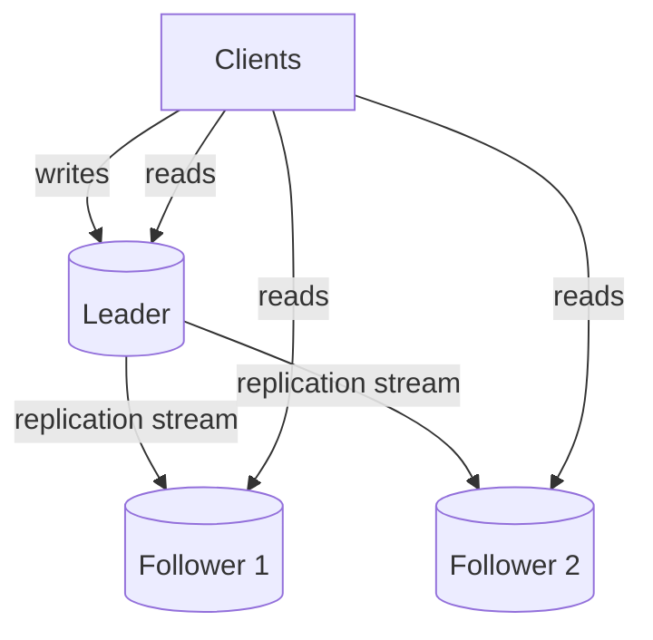

# Database Replication

> Copy your database onto several machines and reads scale, failures stop being fatal — but now the copies can disagree, and the moment a user reads their own write from a lagging replica, the bug appears.

**Type:** Learn
**Languages:** Markdown
**Prerequisites:** Phase 4, Lesson 01 — Vertical vs Horizontal Scaling
**Time:** ~40 minutes

## Learning Objectives

- Explain why replication scales reads and improves availability
- Compare single-leader, multi-leader, and leaderless replication
- Describe replication lag and the read-after-write problem
- Reason about synchronous vs asynchronous replication
- Design a failover plan and recognize its hazards

## The Problem

A single database is both a bottleneck and a liability. It's a bottleneck because every read and write funnels through one machine, and reads usually vastly outnumber writes (Phase 0) — that one machine spends most of its effort answering the same kinds of queries. It's a liability because if it dies, you've lost your data's only home and the whole system is down until you recover it. Vertical scaling (Lesson 01) postpones both problems but can't solve them: one machine is still one machine.

**Replication** — keeping copies of the data on multiple machines — addresses both. With several replicas, you can send reads to any of them, multiplying read capacity. And if one replica fails, another holds the same data, so you stay up. Replication is the first and most common step in scaling the data tier, and it's relatively gentle: unlike sharding (next lesson), every replica holds the *full* dataset, so queries don't change.

The catch is the defining problem of distributed data: **the copies can disagree.** A write lands on one machine and takes time to propagate to the others. In that window, different replicas hold different values, and a client reading from a lagging replica sees stale data — including, maddeningly, its own just-submitted write vanishing. Replication trades the simplicity of one source of truth for scale and availability, and managing the resulting inconsistency is what this lesson is about.

## The Concept

### Single-leader replication (the common case)

One replica is the **leader** (primary); it accepts all writes. The others are **followers** (replicas/standbys); they receive a stream of the leader's changes and apply them, and they serve reads.



This is the default model in PostgreSQL, MySQL, and most relational systems. It cleanly scales **reads** (add followers, spread read traffic) and gives you availability (a follower can be promoted if the leader dies). It does *not* scale writes — every write still goes through the single leader. When writes become the bottleneck, you need sharding (Lesson 03).

### Synchronous vs asynchronous

How long does the leader wait for followers before confirming a write?

- **Synchronous**: the leader waits until a follower has the write before acking. Guarantees the follower is up to date (no data loss if the leader then dies) — but the write is as slow as the slowest follower, and if the follower is down, writes stall.
- **Asynchronous**: the leader acks immediately and propagates in the background. Fast, and a slow follower doesn't block writes — but if the leader crashes before a write reaches any follower, that write is **lost**, and followers lag behind.

Most systems use asynchronous (or semi-synchronous: wait for *one* follower) because full synchronous replication is too slow and fragile. Asynchronous is why replication lag exists.

### Replication lag and the read-after-write problem

With async replication, a follower is always slightly behind the leader — **replication lag**, usually milliseconds but seconds or more under load. This produces user-visible anomalies:

```
1. User updates their profile name  -> write goes to LEADER (now "Ada Lovelace")
2. Page reloads, read goes to a FOLLOWER that hasn't caught up yet
3. User sees their OLD name "Ada" -> "did my save not work?!"
```

This is the **read-after-write** (read-your-own-writes) problem, the most common replication bug. Fixes:

- **Read from the leader** for data the user just wrote (e.g. read your own profile from the leader for a few seconds after writing).
- **Track a timestamp/version** and route the read to a replica that's caught up to it.
- **Stick the user to the leader** briefly after a write.

Other anomalies: **monotonic reads** (two reads from different replicas can go *backwards* in time if the second replica lags more) — fixed by pinning a user to one replica.

### Multi-leader and leaderless

Two other models, briefly:

- **Multi-leader**: multiple leaders accept writes (often one per region). Scales writes and tolerates region failure, but introduces **write conflicts** — two leaders accepting conflicting writes to the same key must be reconciled (last-write-wins, CRDTs, etc.). Used for multi-datacenter and offline-capable apps.
- **Leaderless** (Dynamo-style, e.g. Cassandra): any replica accepts writes; the client (or a coordinator) writes to several and reads from several, using **quorums** (W + R > N) to ensure overlap and eventual consistency. Highly available and partition-tolerant, at the cost of weaker consistency (Phase 5).

```
Model         Writes go to    Scales writes  Conflict risk  Typical use
------------  --------------  -------------  -------------  ----------------------
Single-leader one leader      no             none           default relational
Multi-leader  many leaders    yes            yes            multi-region, offline
Leaderless    any replica     yes            handled by      Cassandra, DynamoDB
                                             quorum/versions
```

### Failover and its hazards

When the leader dies, a follower must be **promoted** to leader — automatically or manually. This is dangerous:

- **Lost writes**: with async replication, writes that reached the old leader but no follower are gone when a follower is promoted.
- **Split-brain**: if the old leader comes back and thinks it's still leader while the new one is active, you have two leaders accepting conflicting writes — data corruption. Prevented with fencing and quorum-based promotion (Phase 5).
- **Detecting failure**: deciding the leader is *really* dead (vs a slow network) is itself hard; too-eager failover causes unnecessary churn.

### A common misconception

"Add replicas and the database scales." It scales *reads*, not writes — every write still hits the single leader in the common model, so a write-heavy workload gets no relief from followers (that's what sharding is for). Another trap: assuming replicas are always consistent with the leader. They lag, and code that reads from a replica right after writing to the leader will see stale data unless you specifically handle read-after-write. Replication is powerful but it changes the consistency model; you must design reads with lag in mind, not assume a single coherent database.

## Exercises

1. **Read vs write scaling.** Your DB is at 90% CPU, 95% from reads. Does adding followers help? Now it's 90% from writes — does it help? Explain.

2. **Reproduce the bug.** Describe the exact sequence where a user updates a setting and immediately sees the old value. Which replication property causes it, and give two fixes.

3. **Sync vs async tradeoff.** For a banking ledger vs a social media "like" count, choose synchronous or asynchronous replication and justify the data-loss tolerance.

4. **Pick the model.** Choose single-leader, multi-leader, or leaderless for: (a) a single-region relational app, (b) a globally-distributed collaborative notes app, (c) a write-heavy, always-available metrics store.

5. **Failover risk.** Explain split-brain in your own words and one mechanism that prevents it.

## Key Terms

| Term | What people say | What it actually means |
|------|----------------|------------------------|
| Replication | "Copies of the DB" | Maintaining the full dataset on multiple machines for read scaling and availability |
| Leader / follower | "Primary / replica" | The node that accepts writes vs nodes that copy from it and serve reads |
| Replication lag | "Followers behind" | The delay before a write on the leader appears on a follower; cause of stale reads |
| Read-after-write | "Read your own writes" | The guarantee (and common bug) that a user sees their own just-made write |
| Synchronous replication | "Wait for the copy" | Leader waits for a follower before acking; no loss but slower |
| Asynchronous replication | "Ack first, copy later" | Leader acks immediately; fast but risks lost writes and causes lag |
| Failover | "Promote a replica" | Promoting a follower to leader when the leader fails |
| Split-brain | "Two leaders" | Two nodes both acting as leader, accepting conflicting writes — data corruption |
