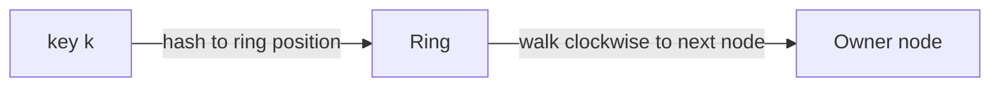

# Consistent Hashing

> With `hash(key) % N`, adding one server reshuffles almost every key. Consistent hashing is the trick that moves only ~1/N of them — and it's why distributed caches and databases can grow without a meltdown.

**Type:** Build
**Languages:** Python
**Prerequisites:** Phase 4, Lesson 03 — Sharding & Partitioning
**Time:** ~55 minutes

## Learning Objectives

- Explain why modulo hashing breaks catastrophically when the node count changes
- Describe the consistent hashing ring and how keys map to nodes
- Implement a consistent hashing ring with virtual nodes
- Measure how few keys move when a node is added or removed
- Explain how virtual nodes smooth out uneven distribution

## The Problem

Hash partitioning (Lesson 03) spreads keys evenly with `shard = hash(key) % N`. It works beautifully — until you change `N`. The moment you add or remove a node, `N` changes, and since the modulo of nearly every key changes too, *almost every key remaps to a different node*. For a cache, that means a near-total cache miss storm: practically every entry is now "on the wrong node," so every lookup misses and stampedes the database (Phase 3). For a sharded datastore, it means moving nearly all your data across the network just to add one machine. Scaling — the whole point of sharding — becomes a catastrophe.

Concretely: with 4 nodes, `key 100 → 100 % 4 = node 0`. Add a 5th node and `100 % 5 = node 0`... but `key 101 → 101 % 4 = 1` becomes `101 % 5 = 1`, `key 102 → 2` becomes `2`, `key 103 → 3` becomes `3`, `key 104 → 0` becomes `4`. Across all keys, roughly **(N-1)/N of them move** — about 80% when going from 4 to 5 nodes. That's almost everything, for the sake of one node.

**Consistent hashing** solves this. It's a different way of mapping keys to nodes such that adding or removing a node remaps only about **1/N** of the keys — just the share that the changed node should gain or give up. It's the foundation of distributed caches (Memcached clients, Redis Cluster), Dynamo-style databases (Cassandra, DynamoDB), and load balancers that need sticky routing. This lesson builds it and measures the difference.

## The Concept

### The ring

Imagine the entire hash space — say 0 to 2³²−1 — bent into a **ring**. You hash each *node* to a position on the ring, and you hash each *key* to a position too. A key belongs to the **first node found going clockwise** from the key's position.

```
            0 / 2^32
               |
       nodeC   |   nodeA
          \    |    /
           \   |   /
    --------- RING ---------
           /   |   \
          /    |    \
              nodeB
       key k -> walk clockwise -> first node = its owner
```



The crucial property: when you **add a node**, it lands at one position on the ring and takes over only the keys between it and the previous node (counterclockwise) — every other key keeps its owner. When you **remove a node**, only its keys move, to the next node clockwise. So a change touches only a slice of the ring, not the whole keyspace. That's the ~1/N movement.

### Why modulo can't do this

`hash(key) % N` ties every key's destination to the *total count* N. There's no notion of position or neighborhood — change N and the arithmetic changes for everyone. The ring decouples a key's owner from the node count: ownership depends on *relative position* on the ring, which barely changes when one node joins or leaves.

### Virtual nodes: fixing uneven distribution

With few nodes placed randomly on the ring, the slices between them are uneven — one node might own a huge arc and get overloaded, another a tiny arc. And when a node leaves, *all* its keys dump onto a single neighbor. The fix is **virtual nodes** (vnodes): place each physical node at *many* positions on the ring (e.g. 150 virtual points per node), all mapping back to the same physical machine.

```
Without vnodes (3 nodes, uneven arcs):
   A owns 50%, B owns 30%, C owns 20%   <- imbalanced

With vnodes (each node = many small arcs scattered around the ring):
   A ~33%, B ~33%, C ~33%               <- smooth
   and removing a node spreads its keys across MANY neighbors
```

Virtual nodes give two wins: (1) load evens out because each node owns many small scattered arcs that average out, and (2) when a node is removed, its many small arcs are absorbed by *many* different neighbors rather than dumping everything on one. More vnodes = smoother distribution (at a small memory/lookup cost).

### Where it's used

```
System              Uses consistent hashing for...
------------------  ------------------------------------------
Memcached clients   deciding which cache node holds a key
Redis Cluster       hash slots (a fixed-slot variant of the idea)
Cassandra/Dynamo    assigning data ranges to nodes (the "token ring")
CDNs / LBs          sticky routing of a key/session to a backend
```

### A common misconception

"Consistent hashing makes distribution perfectly even." Not by itself — with few real nodes and no virtual nodes, the ring can be quite lopsided; virtual nodes are what make it even, and you need enough of them. The other misconception is that it eliminates *all* data movement — it doesn't; adding a node still moves that node's fair share (~1/N) of keys, which is the *minimum* necessary and the whole improvement over modulo's near-100%. Consistent hashing minimizes movement; it can't make it zero, because a new node must take on *some* data to be useful.

## Build It

You'll build a consistent hashing ring with virtual nodes and measure key movement versus modulo hashing. Create `consistent_hashing.py`.

### Step 1 — The ring

```python
# Run: python consistent_hashing.py
import hashlib
import bisect

class ConsistentHashRing:
    def __init__(self, nodes=None, vnodes=150):
        self.vnodes = vnodes
        self.ring = {}            # ring position -> physical node
        self.sorted_keys = []     # sorted ring positions
        for n in (nodes or []):
            self.add_node(n)

    def _hash(self, key):
        return int(hashlib.md5(str(key).encode()).hexdigest(), 16)

    def add_node(self, node):
        for v in range(self.vnodes):
            pos = self._hash(f"{node}#{v}")
            self.ring[pos] = node
            bisect.insort(self.sorted_keys, pos)

    def remove_node(self, node):
        for v in range(self.vnodes):
            pos = self._hash(f"{node}#{v}")
            del self.ring[pos]
            self.sorted_keys.remove(pos)

    def get_node(self, key):
        if not self.ring:
            return None
        h = self._hash(key)
        idx = bisect.bisect(self.sorted_keys, h) % len(self.sorted_keys)
        return self.ring[self.sorted_keys[idx]]   # first node clockwise
```

### Step 2 — Modulo hashing for comparison

```python
def modulo_node(key, nodes):
    h = int(hashlib.md5(str(key).encode()).hexdigest(), 16)
    return nodes[h % len(nodes)]
```

### Step 3 — Measure movement when adding a node (modulo)

```python
keys = [f"key{i}" for i in range(10000)]

nodes4 = ["A", "B", "C", "D"]
nodes5 = ["A", "B", "C", "D", "E"]

before = {k: modulo_node(k, nodes4) for k in keys}
after  = {k: modulo_node(k, nodes5) for k in keys}
moved_mod = sum(1 for k in keys if before[k] != after[k])
```

### Step 4 — Measure movement when adding a node (consistent)

```python
ring = ConsistentHashRing(nodes4)
before_c = {k: ring.get_node(k) for k in keys}
ring.add_node("E")
after_c = {k: ring.get_node(k) for k in keys}
moved_con = sum(1 for k in keys if before_c[k] != after_c[k])
```

### Step 5 — Report movement and distribution

```python
print(f"Adding a 5th node to 4 ({len(keys)} keys):")
print(f"  Modulo hashing:     {moved_mod:5} keys moved ({100*moved_mod/len(keys):.1f}%)")
print(f"  Consistent hashing: {moved_con:5} keys moved ({100*moved_con/len(keys):.1f}%)")
print(f"  (ideal minimum is about 1/5 = 20%)\n")

# Distribution across the 5 nodes with consistent hashing
from collections import Counter
dist = Counter(after_c.values())
print("Consistent hashing distribution over 5 nodes:")
for node in sorted(dist):
    n = dist[node]
    print(f"  node {node}: {n:5}  ({100*n/len(keys):.1f}%)")
```

### Step 6 — Run it

```bash
python consistent_hashing.py
```

Modulo moves ~80% of keys to add one node; consistent hashing moves ~20% (the minimum), and the load stays roughly even across nodes thanks to virtual nodes. Compare with `outputs/expected.md`.

## Exercises

1. **Run and compare.** What percentage of keys does modulo move vs consistent hashing when going from 4 to 5 nodes? Why is ~20% the ideal?

2. **Remove a node.** Remove node "C" from the ring and measure how many keys move. Confirm only C's keys relocate, and check they spread across multiple nodes (not all to one).

3. **Vary virtual nodes.** Run with `vnodes=1`, `10`, `150`. How does the evenness of the distribution change? What does this tell you about why vnodes matter?

4. **The cache-miss connection.** Explain why, for a distributed cache, modulo's 80% key movement on a node addition causes a near-total cache miss storm, and why consistent hashing avoids it.

5. **Scale up.** Measure key movement going from 10 nodes to 11 with consistent hashing. Does it match the ~1/11 prediction?

## Key Terms

| Term | What people say | What it actually means |
|------|----------------|------------------------|
| Consistent hashing | "Hashing that survives resizing" | Mapping keys and nodes onto a ring so a node change moves only ~1/N of keys |
| Hash ring | "The circle" | The hash space treated as a ring; a key belongs to the first node clockwise |
| Virtual node | "Vnode" | One physical node placed at many ring positions to even out load and spread movement |
| Modulo hashing | "hash % N" | Simple partitioning that remaps almost all keys when N changes |
| Key movement | "Rebalancing churn" | The fraction of keys that change owner when nodes are added/removed; minimized by consistent hashing |
| Token ring | "Cassandra's ring" | The consistent-hashing ring used to assign data ranges to nodes |
| Rebalancing | "Moving data" | Relocating keys/data when the node set changes |
