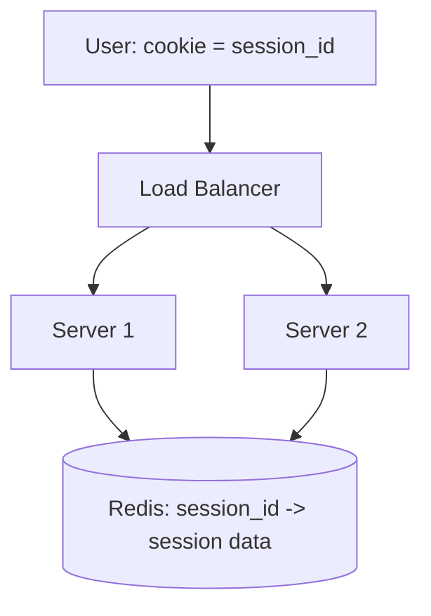

# Stateless Services & Sessions

> Horizontal scaling only works if any server can handle any request. The thing that breaks that promise is state stored on the server — so the whole game is getting state off the box.

**Type:** Learn
**Languages:** Markdown
**Prerequisites:** Phase 4, Lesson 01 — Vertical vs Horizontal Scaling
**Time:** ~35 minutes

## Learning Objectives

- Explain why server-local state blocks horizontal scaling
- Distinguish stateless from stateful services
- Compare sticky sessions, a shared session store, and stateless tokens (JWT)
- Choose where session state should live
- Recognize the tradeoffs of each approach

## The Problem

Horizontal scaling (Lesson 01) rests on one assumption: that your app servers are interchangeable, so the load balancer can send any request to any server. The instant a server stores something *locally* that a later request needs — a logged-in user's session, an uploaded file, an in-memory shopping cart — that assumption breaks. Now the user's next request must go back to the *same* server, or it fails. You've turned a fleet of interchangeable machines into a set of special snowflakes, and most of the benefits of scaling out evaporate.

This is one of the most common scaling mistakes: building a service that quietly depends on server-local state, then discovering it can't be load-balanced cleanly. The fix is the principle of **statelessness**: app servers should hold no per-client state between requests. Any state that must persist lives *outside* the app server — in a database, a distributed cache, or carried by the client itself. Then every server truly is interchangeable, and you can add, remove, or restart them freely.

The most common form of this state is the **session** — the data identifying a logged-in user across their requests. Where you put session state is a classic design decision with three standard answers, each with real tradeoffs. Getting it right is what makes the rest of your horizontal scaling actually work.

## The Concept

### Stateless vs stateful, concretely

```
Stateful server (BAD for scaling):        Stateless server (GOOD):
  request 1 -> Server A                      request 1 -> any server
    stores cart in A's memory                  cart stored in shared store
  request 2 -> Server B                      request 2 -> any server
    cart is gone! (it's in A)                  reads cart from shared store -> OK
```

A **stateless** service computes its response purely from the request plus shared external stores — it remembers nothing locally between requests. A **stateful** service keeps per-client data in its own memory or disk. Statelessness is what lets the load balancer treat servers as a pool.

Note: "stateless" doesn't mean "no state anywhere" — the system absolutely has state (users, carts, sessions). It means the *app server* doesn't hold it. The state moves to a tier designed to be shared and scaled (database, Redis) or to the client.

### The session problem and three solutions

When a user logs in, the server needs to remember who they are on subsequent requests. Three approaches:

**1. Sticky sessions (session affinity).** The load balancer pins each user to one server (by cookie or IP) so their session in that server's memory is always available.

```
User -> LB -> always Server B (sticky) -> session in B's memory
```

Simple, requires no shared store. But it undermines statelessness: if Server B dies, every user pinned to it loses their session (logged out); load can become uneven (one server gets all the "heavy" users); and you can't freely move users during a deploy. A stopgap, not a real solution at scale.

**2. Shared session store.** Session data lives in an external store (usually Redis) that all servers read. The client holds only a session *ID* (in a cookie); each server looks up the session by ID in the shared store.



Now any server can serve any request — fully stateless app tier. This is the most common production approach. Cost: every request does a lookup to the session store (fast, but a dependency), and the store must be highly available (it becomes critical infrastructure).

**3. Stateless tokens (JWT).** Instead of storing the session server-side, put the session data *in the token* the client carries. A **JSON Web Token (JWT)** contains the user's identity and claims, cryptographically signed by the server. Each request includes the token; the server verifies the signature and trusts the contents — no lookup, no server-side session at all.

```
User -> presents signed JWT (contains user id, roles, expiry)
Server -> verifies signature -> trusts claims -> no store needed
```

Pros: truly stateless, no session store, no per-request lookup — scales and works across services easily. Cons: **revocation is hard** — a signed token is valid until it expires, so you can't instantly "log someone out" without extra machinery (a denylist, short expiries + refresh tokens); tokens can grow large; and you must protect the signing key.

### Comparison

```
Approach          App tier stateless?  Revocation  Extra infra        Best for
----------------  -------------------  ----------  -----------------  -------------------
Sticky sessions   no (state in server) easy (it's  none               quick/legacy, small
                                       in memory)                      scale
Shared store      yes                  easy         session store      most web apps
(Redis)                                            (must be HA)
Stateless JWT     yes                  hard         signing key mgmt   APIs, microservices,
                                                                       cross-service auth
```

### Where other state goes

Sessions aren't the only local state to banish:

- **Uploaded files** → object storage (Phase 2), not the local disk.
- **Cached computations** → distributed cache (Phase 3), not in-process only.
- **Long-running job state** → a database or queue (Phase 6), not server memory.
- **WebSocket connections** → inherently stateful (the open socket lives on one server); handled with a pub/sub layer to route messages to the right server (Phase 8's chat capstone).

### A common misconception

"Stateless means my app keeps no data." No — it means the *server instance* keeps no per-client data between requests; the data lives in shared tiers. People also assume JWTs are strictly better because they're "stateless" — but the inability to instantly revoke them is a real security tradeoff, which is why many systems still use server-side sessions for sensitive apps, or pair short-lived JWTs with refresh tokens. There's no universally best answer; choose based on whether you need easy revocation (shared store) or zero-lookup cross-service auth (JWT). The non-negotiable part is only this: keep the app server itself stateless.

## Exercises

1. **Spot the blocker.** A service stores the shopping cart in app-server memory. Describe exactly what breaks when it's put behind a load balancer with two servers.

2. **Pick the session strategy.** Choose sticky/shared-store/JWT and justify: (a) a banking app needing instant logout on suspicious activity, (b) a microservices API where many services check auth, (c) a small internal tool with one backup server.

3. **Revocation problem.** Explain why you can't instantly invalidate a standard JWT, and describe two mechanisms to work around it.

4. **Move the state.** For each piece of local state — uploaded avatar, in-memory rate-limit counter, session — say where it should live so the app tier stays stateless.

5. **HA the store.** If session state lives in Redis and Redis goes down, what happens to users? What does this imply about how you must run the session store?

## Key Terms

| Term | What people say | What it actually means |
|------|----------------|------------------------|
| Stateless service | "No local state" | An app server holding no per-client state between requests, so instances are interchangeable |
| Stateful service | "Remembers per client" | A server keeping client data in its own memory/disk, which blocks clean load balancing |
| Session | "Login state" | Data identifying a user across their requests |
| Sticky session | "Session affinity" | Pinning a user to one server so their in-memory session is available; undermines statelessness |
| Shared session store | "Sessions in Redis" | Keeping session data in an external store all servers read; the common production approach |
| JWT | "Signed token" | A cryptographically signed token carrying session data, verified without a server-side lookup |
| Revocation | "Force logout" | Invalidating a session/token before it naturally expires; easy server-side, hard with plain JWTs |
