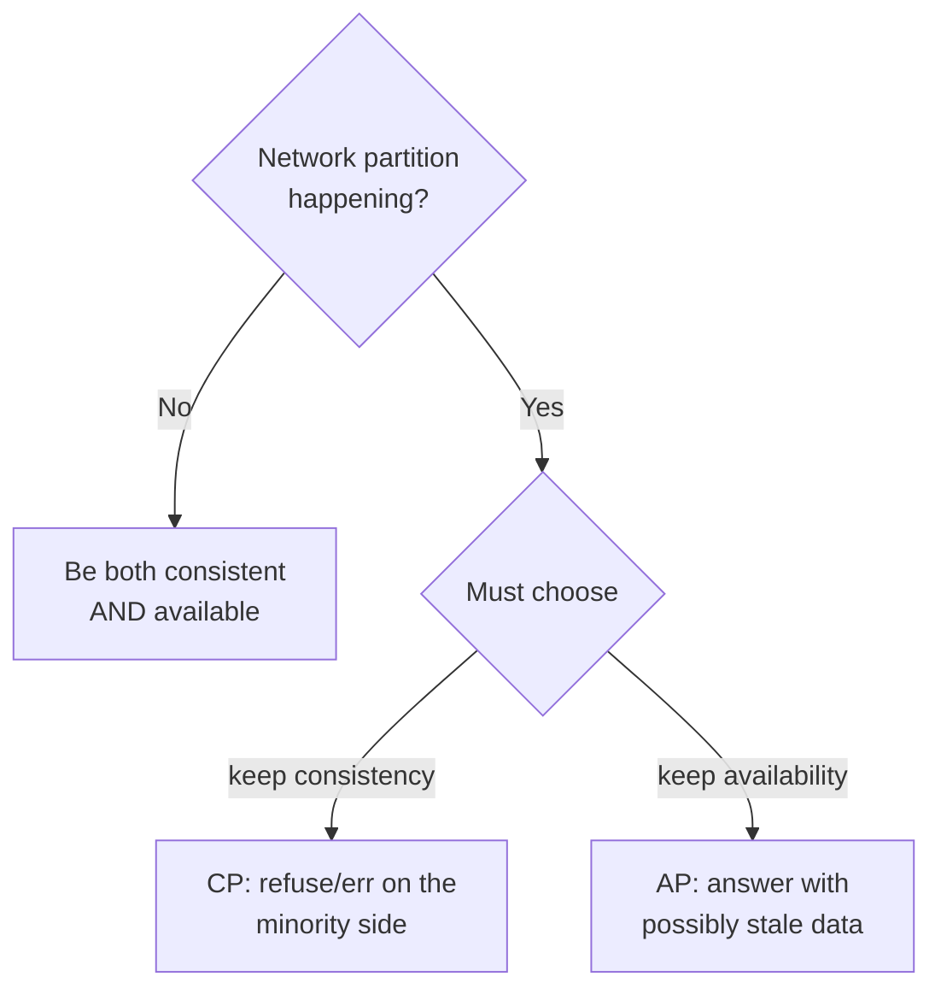

# The CAP Theorem

> "Pick two of three" is the famous slogan and it's misleading. The real statement is sharper: when the network splits, you must choose between staying consistent and staying available. There is no third option.

**Type:** Learn
**Languages:** Markdown
**Prerequisites:** Phase 4 — Scaling & Partitioning
**Time:** ~35 minutes

## Learning Objectives

- State the CAP theorem precisely and correct the "pick two" oversimplification
- Explain why partition tolerance is non-negotiable in a distributed system
- Classify systems as CP or AP by how they behave during a partition
- Apply CAP to real datastore choices
- Recognize what CAP does and does not say (it's only about partitions)

## The Problem

The moment your data lives on more than one machine (Phase 4 — replicas, shards), a hard truth appears: the network between those machines is unreliable. Cables get cut, switches fail, packets drop, a data center loses connectivity. When that happens, your nodes are split into groups that can't talk to each other — a **network partition**. And during a partition, a distributed system faces an impossible choice that no amount of clever engineering can dodge.

Suppose a write lands on one side of the partition. The other side can't see it. Now a read arrives on the far side. You have exactly two options: refuse to answer (so you never serve stale data, but you're now *unavailable*), or answer with the data you have (so you stay *available*, but you might serve a stale value — *inconsistent*). You cannot both stay available *and* guarantee consistency while the partition holds, because the two sides literally cannot coordinate. This is the CAP theorem, and it's not a limitation of current technology — it's a logical impossibility.

CAP matters because it forces an explicit, business-level decision that's easy to ignore until a partition happens in production. Should your shopping cart accept additions even if it might briefly show stale contents (available)? Or should your bank refuse a transaction it can't confirm globally (consistent)? Different answers for different data — and CAP is the framework that makes you choose on purpose rather than discover your system's behavior during an outage.

## The Concept

### The three properties

CAP concerns three properties of a distributed data system:

- **Consistency (C)**: every read sees the most recent write (or an error). All nodes agree on the current value. (Note: this is *linearizability*, stricter than the "C" in ACID — see Lesson 02.)
- **Availability (A)**: every request to a non-failing node gets a (non-error) response — the system keeps serving.
- **Partition tolerance (P)**: the system keeps operating despite the network dropping or delaying messages between nodes.

### Why "pick two" is wrong

The slogan says choose two of C, A, P. But **partition tolerance is not optional** for a distributed system. Networks *will* partition — it's a physical reality, not a design choice. A system that isn't partition-tolerant simply breaks (or corrupts data) when a partition happens, which is unacceptable. So P is mandatory, and the real choice is only between **C and A** *during a partition*:



So CAP really says: **when partitioned, choose Consistency or Availability.** When there's no partition (the normal case), you get both — CAP says nothing about steady-state operation.

### CP vs AP, concretely

```
            Partition occurs. A read arrives on the side without the latest write.

CP system:  "I can't guarantee this is current -> I'll return an error / block."
            Sacrifices availability to never serve stale data.
            Examples: traditional RDBMS with sync replication, ZooKeeper,
            etcd, HBase, MongoDB (default), Spanner.

AP system:  "Here's the value I have; it might be slightly stale."
            Sacrifices consistency to keep answering.
            Examples: Cassandra, DynamoDB, Riak, CouchDB (eventually consistent).
```

Neither is "better" — they suit different data. A configuration service that hands out the cluster leader must be **CP** (a wrong answer is catastrophic). A shopping cart or social feed can be **AP** (briefly stale is fine; being down loses sales). The skill is matching the choice to the cost of staleness versus the cost of unavailability *for that specific data*.

### PACELC: the part CAP omits

CAP only addresses behavior *during a partition*. But there's a tradeoff even when the network is healthy: stronger consistency requires coordination, which adds latency. **PACELC** extends CAP: *if Partition, choose Availability or Consistency; Else, choose Latency or Consistency.* In other words, even with no partition, a system that insists on strong consistency pays in latency (waiting for nodes to agree), while one that relaxes consistency answers faster. This is why "consistency costs latency" is a recurring theme — it applies in the normal case too, not just during failures.

### A common misconception

The biggest misconception is the "pick two" framing itself — that you could build a "CA" system by sacrificing partition tolerance. You can't meaningfully drop P in a distributed system; partitions happen whether you "chose" them or not. A single-node database is trivially CA (no network to partition), but the instant you distribute it, P is forced and you're choosing C or A. The second misconception is that a system is *globally* CP or AP — in reality, modern systems are tunable *per operation* (e.g. Cassandra lets you pick consistency level per query), so the same database can behave CP for one request and AP for another. CAP is a lens for a decision, not a permanent label.

## Exercises

1. **State it correctly.** Rewrite "CAP means pick two of three" as a precise one-sentence statement about partitions.

2. **Classify the data.** For each, choose CP or AP and justify by the cost of staleness vs downtime: (a) account balance, (b) "likes" count, (c) which node is the cluster leader, (d) a product's stock level at checkout.

3. **Trace a partition.** Two replicas, a partition forms, a write hits side 1, a read hits side 2. Describe exactly what a CP system does and what an AP system does for that read.

4. **Why is P mandatory?** Explain in your own words why you can't simply choose not to tolerate partitions in a distributed system.

5. **Apply PACELC.** Pick a system you classified as CP. In the no-partition case, what does it trade away for its consistency, and when would that matter?

## Key Terms

| Term | What people say | What it actually means |
|------|----------------|------------------------|
| CAP theorem | "Pick two" | During a network partition you must choose consistency or availability; P is mandatory |
| Consistency (CAP) | "Everyone sees the latest" | Every read returns the most recent write or an error (linearizability) |
| Availability (CAP) | "Always answers" | Every request to a live node gets a non-error response |
| Partition tolerance | "Survives a network split" | The system keeps operating when nodes can't communicate; unavoidable, so mandatory |
| Network partition | "The split" | A failure where nodes are divided into groups that can't reach each other |
| CP system | "Consistency first" | During a partition, sacrifices availability to avoid stale data |
| AP system | "Availability first" | During a partition, sacrifices consistency to keep answering |
| PACELC | "CAP plus latency" | Extends CAP: even without a partition, choose latency or consistency |
