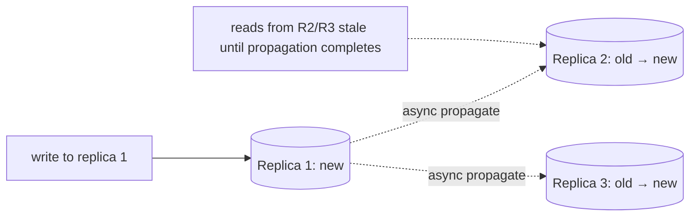

# Consistency Models

> "Consistency" isn't one thing — it's a spectrum from "every read sees the latest write everywhere" to "reads catch up eventually." Picking the right point on that spectrum is a core design decision.

**Type:** Learn
**Languages:** Markdown
**Prerequisites:** Phase 5, Lesson 01 — The CAP Theorem
**Time:** ~40 minutes

## Learning Objectives

- Order the main consistency models from strongest to weakest
- Define linearizability, sequential, causal, and eventual consistency
- Explain the client-centric guarantees: read-your-writes and monotonic reads
- Trade consistency strength against latency and availability
- Choose the weakest model that still satisfies the requirements

## The Problem

CAP (Lesson 01) said that during a partition you trade consistency for availability — but it treated "consistency" as a single binary. In reality it's a *spectrum*, and most of the interesting engineering happens in the middle. At one extreme, the system behaves as if there's a single copy of the data that every client sees identically and instantly (strong consistency). At the other, replicas are allowed to disagree temporarily and merely promise to converge eventually. Between them sit several useful models that give *some* guarantees without the full cost of the strongest.

Why does this gradient matter? Because stronger consistency is expensive — it requires coordination between replicas (often a round trip to agree before answering), which costs latency and reduces availability under partitions (PACELC). Weaker consistency is cheap and highly available but exposes anomalies: stale reads, reads that appear to go backward in time, a user not seeing their own write. The art is choosing the *weakest* model that still makes your application correct, so you don't pay for guarantees you don't need. Demanding strong consistency everywhere is a common, expensive mistake; so is using eventual consistency where the application actually needs read-your-writes.

This lesson maps the spectrum so you can name what you need and recognize what a given datastore provides.

## The Concept

### The spectrum, strongest to weakest

```
STRONGER (more coordination, more latency, less available under partition)
  |
  |  Linearizability (strong)  -- acts like one copy; reads see the latest write
  |  Sequential consistency    -- one global order, not necessarily real-time
  |  Causal consistency        -- causally-related ops seen in order by everyone
  |  Read-your-writes / monotonic (client-centric guarantees)
  |  Eventual consistency      -- replicas converge eventually; reads may be stale
  v
WEAKER (less coordination, lower latency, highly available)
```

### Linearizability (strong consistency)

The strongest single-object model. The system behaves as if there is **one copy** of the data and every operation takes effect atomically at some instant between its start and end, consistent with real time. Once a write completes, every subsequent read (by anyone) sees it or a later value — never an older one.

```
Client A: write x=5 ----[completes]----
Client B:                    read x -> MUST be 5 (or newer), never the old value
```

This is what people usually mean by "strongly consistent." It's the most intuitive (it's just "how a single machine works") and the most expensive — it requires consensus/coordination so all replicas agree before a read can be answered. Used for things that must be correct: account balances, locks, leader election (via consensus, Lesson 03).

### Sequential and causal consistency

- **Sequential consistency**: all clients see operations in *the same single order*, and each client's own operations appear in the order it issued them — but that global order need not match real time. Slightly weaker than linearizability (no real-time requirement).
- **Causal consistency**: operations that are *causally related* (one could have influenced another — Lesson 04's happens-before) are seen in the same order by all nodes, but *concurrent* (unrelated) operations may be seen in different orders on different nodes. This is often the sweet spot: it prevents the confusing anomalies (you never see a reply before the message it answers) while staying far cheaper and more available than linearizability.

### Client-centric guarantees

These are weaker, practical promises about what a *single client* sees, even if the global system is only eventually consistent:

- **Read-your-writes**: after you write, your own subsequent reads see that write (no "did my save work?" — Phase 4's replication-lag bug). Implemented by routing your reads to a replica that has your write.
- **Monotonic reads**: your successive reads never go *backwards* in time — once you've seen a value, you won't later see an older one. Implemented by pinning you to one replica (or one that's at least as fresh).

These guarantees are cheap and fix the most jarring user-visible anomalies without full strong consistency.

### Eventual consistency

The weakest common model: if writes stop, all replicas will *eventually* converge to the same value — but there's no bound on when, and reads can return stale data in the meantime. Highly available and low-latency (a replica answers immediately from its local copy). The system needs a rule to resolve conflicting writes (last-write-wins by timestamp, or merge structures like CRDTs). Perfect for data where temporary disagreement is harmless: view counts, "who's online," DNS, shopping-cart contents (where merging is acceptable).



### A common misconception

"Eventual consistency means data is unreliable / wrong." No — it means *temporarily* divergent but *guaranteed to converge*; for the right data it's perfectly correct and buys huge availability and speed. The opposite misconception is that you should always want strong consistency "to be safe" — but it costs latency on every operation and availability during partitions, and most data (feeds, counts, presence) genuinely doesn't need it. Also, people conflate the ACID "C" (Phase 2 — constraints hold within a transaction) with the distributed "C" (replicas agree); they're different concerns. The professional move is to identify, per piece of data, the *weakest* model that keeps the app correct — often causal or read-your-writes, not full linearizability.

## Exercises

1. **Order them.** From strongest to weakest: causal, eventual, linearizable, sequential. Then give a one-line distinction between linearizable and sequential.

2. **Name the model needed.** For each, pick the weakest sufficient model: (a) a bank balance, (b) seeing your own newly-posted comment, (c) a global "users online" counter, (d) comments where replies must never appear before the comment they answer.

3. **Spot the anomaly.** A user sees a tweet count of 100, refreshes, and sees 98. Which client-centric guarantee is violated, and how is it fixed?

4. **Cost reasoning.** Explain why linearizability necessarily adds latency to reads, referencing coordination between replicas.

5. **Conflict resolution.** Under eventual consistency, two replicas accept different writes to the same key during a partition. Name two strategies to reconcile them when they reconnect.

## Key Terms

| Term | What people say | What it actually means |
|------|----------------|------------------------|
| Consistency model | "How fresh reads are" | The contract for what values reads may return given concurrent writes across replicas |
| Linearizability | "Strong consistency" | Behaves like one copy; every read sees the latest completed write, in real-time order |
| Sequential consistency | "One global order" | All clients see the same operation order; not required to match real time |
| Causal consistency | "Cause before effect" | Causally-related operations seen in order everywhere; concurrent ones may differ |
| Read-your-writes | "See my own changes" | A client always sees its own prior writes |
| Monotonic reads | "No going backward" | A client's successive reads never return an older value than one already seen |
| Eventual consistency | "Converges later" | Replicas agree eventually if writes stop; reads may be stale meanwhile |
| CRDT | "Auto-merging type" | A data structure whose concurrent updates merge without conflict |
