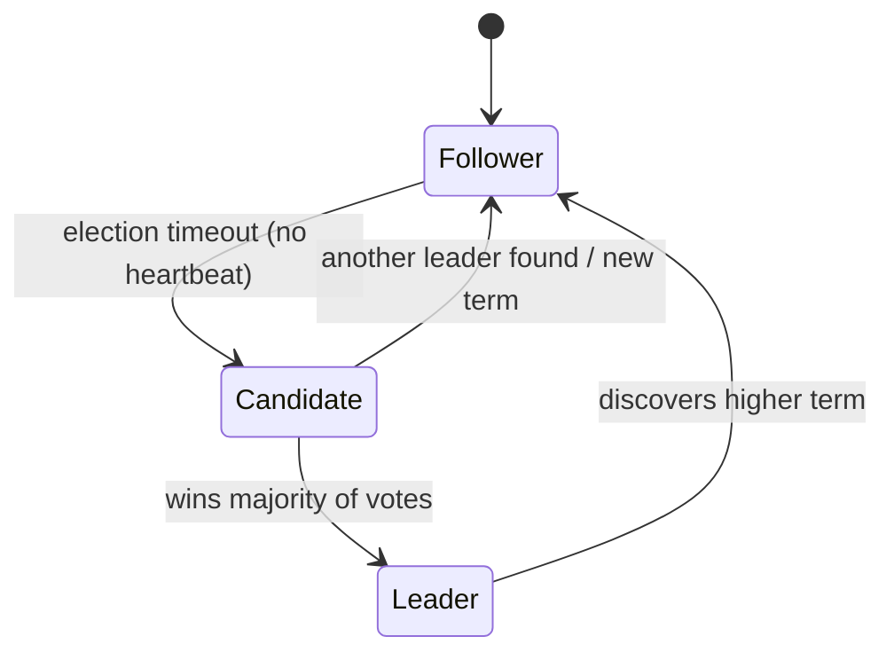
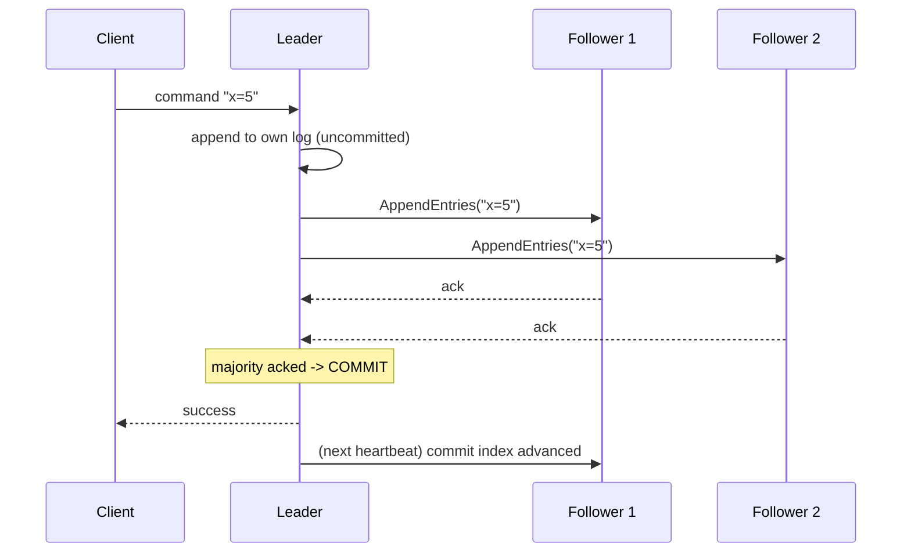

# Consensus & Raft

> How do five machines that can crash and miss messages agree on a single value? Consensus is the hardest core problem in distributed systems, and Raft is the algorithm that made it teachable.

**Type:** Build
**Languages:** Python
**Prerequisites:** Phase 5, Lesson 02 — Consistency Models
**Time:** ~55 minutes

## Learning Objectives

- Explain what consensus is and why strong consistency depends on it
- Describe Raft's leader election and the role of terms and quorums
- Trace how a leader replicates a log entry and commits it via majority
- Reason about how Raft tolerates failures (minority can fail)
- Simulate leader election and log replication in Python

## The Problem

Strong consistency (Lesson 02) requires that all replicas agree on the current value and the order of operations. But the replicas are separate machines connected by an unreliable network: messages are delayed, dropped, or reordered, and any node can crash at any moment. Getting these independent, failure-prone machines to agree on a single value — and keep agreeing as some of them die and recover — is the **consensus problem**. It underpins everything that needs to be correct in a cluster: electing a single leader, committing a transaction, holding a distributed lock, storing configuration that all nodes trust.

Consensus is famously hard. The first widely-used solution, Paxos, is correct but notoriously difficult to understand and implement. **Raft** was designed explicitly for *understandability* — same guarantees as Paxos, but structured so humans can reason about it. It's now the consensus algorithm behind etcd, Consul, CockroachDB, and many others, so understanding Raft is understanding how real systems achieve agreement.

The key insight that makes consensus tractable: **majority (quorum) voting**. If every decision requires agreement from more than half the nodes, then any two decisions must share at least one node — so they can't contradict each other. This single idea — overlapping majorities — is what lets a cluster stay consistent even as a minority of nodes fail. This lesson builds a simplified Raft to make the mechanism concrete.

## The Concept

### What consensus guarantees

A consensus algorithm lets a group of nodes agree on a value such that:

- **Agreement**: all non-faulty nodes decide the same value.
- **Validity**: the agreed value was actually proposed by some node (no made-up values).
- **Termination**: the nodes eventually decide (as long as a majority is alive).

The price: it needs a **majority** of nodes available. With 5 nodes, 3 must be reachable; the system tolerates 2 failures. With 3 nodes, it tolerates 1. (This is why clusters are sized odd: 5 nodes tolerate 2 failures, same as 6 but cheaper.)

### Raft: one leader, replicated log

Raft elects a single **leader** that handles all changes; followers replicate the leader's **log** (an ordered list of commands). Every node is in one of three states:



- **Follower**: passive; responds to the leader and candidates. Resets a random *election timeout* on each heartbeat.
- **Candidate**: if a follower's election timeout fires (no heartbeat from a leader), it becomes a candidate, increments the **term**, votes for itself, and requests votes from others.
- **Leader**: a candidate that wins a majority of votes. It sends periodic **heartbeats** to keep followers from starting elections, and it appends/replicates log entries.

### Terms: logical time for elections

Raft divides time into **terms**, numbered increasing. Each term has at most one leader. A term is like a logical clock for the cluster: every message carries a term, and a node seeing a higher term immediately steps down to follower and updates its term. This prevents two leaders from coexisting — an old leader that was partitioned away will discover a higher term when it reconnects and step down. Terms plus majority voting are how Raft avoids split-brain (Phase 4).

### Leader election

When the election timeout fires, a candidate requests votes. Each node votes for at most one candidate per term (first-come, and only if the candidate's log is at least as up-to-date). A candidate that collects votes from a **majority** becomes leader. Randomized timeouts make it unlikely two candidates start simultaneously; if they split the vote, the term ends with no leader and a new election starts with fresh random timeouts.

### Log replication and commit

Once elected, the leader accepts commands and replicates them:



The leader appends the command to its log, sends it to followers, and once a **majority** (including itself) has stored it, the entry is **committed** — durably agreed and safe to apply. Because commit requires a majority, and any future leader must also have a majority's votes, a committed entry is guaranteed to survive in any future leader's log. That's the safety guarantee.

### A common misconception

"Consensus means all nodes must agree." It means a *majority* must agree — the system deliberately proceeds without the minority so it can tolerate failures. Requiring *all* nodes would mean one slow or dead node halts everything (no fault tolerance). The other misconception is that consensus is needed for *everything* in a distributed system — it's expensive (every committed entry needs a round trip to a majority), so you use it only for the things that truly need strong agreement (leadership, config, critical metadata) and keep high-volume data on cheaper replication/eventual consistency. Consensus is the strong, costly tool you apply sparingly.

## Build It

You'll simulate Raft's leader election and majority-commit logic in a single process (no real network). Create `raft_sim.py`.

### Step 1 — Nodes with term and state

```python
# Run: python raft_sim.py
import random
random.seed(7)

class Node:
    def __init__(self, node_id):
        self.id = node_id
        self.term = 0
        self.state = "follower"
        self.voted_for = None
        self.log = []          # list of (term, command)
        self.alive = True
```

### Step 2 — An election among a cluster

```python
class Cluster:
    def __init__(self, n):
        self.nodes = [Node(i) for i in range(n)]

    def majority(self):
        return len([x for x in self.nodes]) // 2 + 1

    def elect(self, candidate_id):
        cand = self.nodes[candidate_id]
        if not cand.alive:
            return None
        cand.term += 1
        cand.state = "candidate"
        cand.voted_for = cand.id
        votes = 1                          # votes for itself
        for node in self.nodes:
            if node.id == cand.id or not node.alive:
                continue
            # grant vote if candidate's term is newer and node hasn't voted this term
            if cand.term > node.term:
                node.term = cand.term
                node.voted_for = cand.id
                node.state = "follower"
                votes += 1
        if votes >= self.majority():
            cand.state = "leader"
            for node in self.nodes:        # others become followers
                if node.id != cand.id and node.alive:
                    node.state = "follower"
            return cand
        cand.state = "follower"
        return None
```

### Step 3 — Replicate a command and commit on majority

```python
    def replicate(self, leader, command):
        if leader.state != "leader":
            return False
        entry = (leader.term, command)
        leader.log.append(entry)
        acks = 1                           # leader stores it
        for node in self.nodes:
            if node.id == leader.id or not node.alive:
                continue
            node.log.append(entry)         # follower stores it
            acks += 1
        committed = acks >= self.majority()
        return committed, acks
```

### Step 4 — Run a normal scenario

```python
cluster = Cluster(5)
print(f"5-node cluster, majority = {cluster.majority()}")

leader = cluster.elect(0)
print(f"Election: node {leader.id} became LEADER (term {leader.term})")

committed, acks = cluster.replicate(leader, "x=5")
print(f"Replicate 'x=5': acks={acks}/5 -> committed={committed}")
```

### Step 5 — Kill a minority and show it still works; kill a majority and show it fails

```python
# Kill 2 of 5 (a minority) -> still have majority -> still works
cluster.nodes[3].alive = False
cluster.nodes[4].alive = False
committed, acks = cluster.replicate(leader, "y=9")
print(f"\n2 nodes down (minority): acks={acks}/5 -> committed={committed}")

# Kill one more (now 3 of 5 down = majority gone) -> cannot commit
cluster.nodes[2].alive = False
committed, acks = cluster.replicate(leader, "z=1")
print(f"3 nodes down (no majority): acks={acks}/5 -> committed={committed}")
print("Consensus needs a MAJORITY: 5 nodes tolerate 2 failures, not 3.")
```

### Step 6 — Run it

```bash
python raft_sim.py
```

A minority failure still commits (majority alive); a majority failure cannot commit (safety over availability — a CP system). Compare with `outputs/expected.md`.

## Exercises

1. **Run and read.** Confirm 'x=5' commits with 5/5 acks, 'y=9' commits with 3/5 (2 down), and 'z=1' fails with 2/5 (3 down). Why is 3 the magic number for 5 nodes?

2. **Size the cluster.** How many failures does a 3-node cluster tolerate? A 7-node? Write the general formula for N nodes.

3. **Why odd?** Explain why a 5-node cluster tolerates the same failures as a 6-node cluster. What's the downside of even sizing?

4. **Split vote.** Modify `elect` so two candidates run in the same term and split votes. Show neither reaches majority, then re-elect with one candidate.

5. **Terms prevent split-brain.** Describe how an old leader that was partitioned away steps down when it reconnects and sees a higher term.

## Key Terms

| Term | What people say | What it actually means |
|------|----------------|------------------------|
| Consensus | "Nodes agree" | Getting failure-prone nodes to agree on one value/order despite an unreliable network |
| Raft | "Understandable consensus" | A leader-based consensus algorithm using terms, elections, and a replicated log |
| Quorum / majority | "More than half" | The minimum nodes needed to decide; overlapping majorities prevent contradictions |
| Leader | "The one in charge" | The single node that accepts changes and replicates the log to followers |
| Term | "Election epoch" | An increasing number; at most one leader per term, used to detect stale leaders |
| Log entry | "A command" | An ordered, replicated command; committed once a majority has stored it |
| Committed | "Durably agreed" | An entry stored on a majority, guaranteed to survive in future leaders |
| Heartbeat | "I'm alive" | Periodic leader message that stops followers from starting elections |
