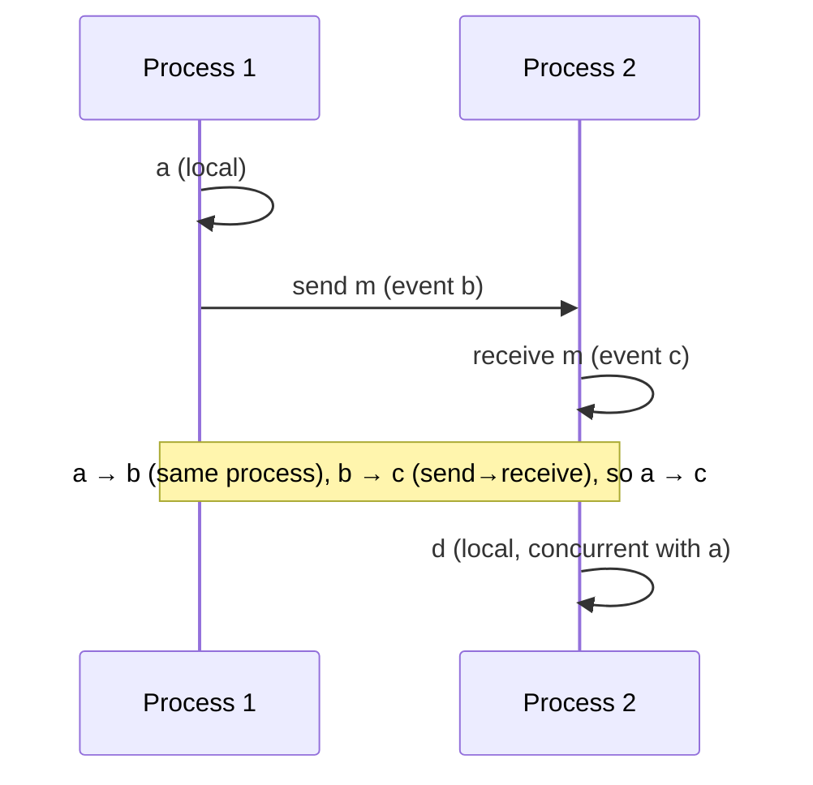

# Time, Clocks & Ordering

> You cannot trust wall-clock time across machines — two servers' clocks always disagree a little. So how do you know which event happened first? With logical clocks that track causality instead of time.

**Type:** Build
**Languages:** Python
**Prerequisites:** Phase 5, Lesson 03 — Consensus & Raft
**Time:** ~50 minutes

## Learning Objectives

- Explain why physical clocks are unreliable for ordering distributed events
- Define the happens-before relation and concurrency
- Implement Lamport clocks for a total order consistent with causality
- Implement vector clocks to detect causality vs concurrency
- Choose the right clock for the ordering problem at hand

## The Problem

Ordering events is trivial on one machine — there's a single clock, and `t1 < t2` tells you the order. Across machines it falls apart. Every computer's clock drifts; even with NTP synchronization they differ by milliseconds, and one can jump backward when corrected. So if server A timestamps an event at `10:00:00.005` and server B timestamps another at `10:00:00.003`, you *cannot* conclude B's event happened first — B's clock might simply be ahead. Relying on wall-clock time to order distributed events produces subtle, data-corrupting bugs: a "last write wins" conflict resolution can discard the actually-newer write because the loser's clock ran fast.

This matters constantly. Which of two concurrent updates to the same key is newer? In what order did messages in a chat actually get sent? Did the "delete" happen before or after the "edit"? When events originate on different machines, physical time can't answer reliably. What you actually care about is usually not *when* in absolute time, but *causality* — did event X potentially influence event Y? If a reply was written after the message it answers, the reply causally depends on the message, and any correct ordering must put the message first.

**Logical clocks** capture exactly this. Instead of measuring time, they count events and track the flow of information between machines, producing an ordering that respects causality even though no machine trusts another's clock. This lesson builds the two foundational ones: Lamport clocks and vector clocks.

## The Concept

### Happens-before

Define a relation **→** ("happens-before") capturing potential causality:

1. If events `a` and `b` are on the *same process* and `a` comes first, then `a → b`.
2. If `a` is *sending* a message and `b` is *receiving* it, then `a → b` (the send must precede the receive).
3. Transitivity: if `a → b` and `b → c`, then `a → c`.

If neither `a → b` nor `b → a`, the events are **concurrent** (written `a ∥ b`) — they happened independently with no information flowing between them, so there's no "correct" order between them. Crucially, happens-before is about *potential causality*, not wall-clock time: `a → b` means `a` *could have influenced* `b`.



### Lamport clocks: a total order consistent with causality

A **Lamport clock** is a single integer counter per process, updated by simple rules:

1. Increment your counter before each local event.
2. When sending a message, increment and attach your counter.
3. When receiving a message, set your counter to `max(local, received) + 1`.

```
Rule: on receive, counter = max(mine, theirs) + 1
```

This guarantees: if `a → b` then `L(a) < L(b)`. So Lamport timestamps never contradict causality — a cause always has a smaller timestamp than its effect. Ties (equal timestamps, which happen for concurrent events) are broken by process ID to get a **total order**. The limitation: the converse doesn't hold — `L(a) < L(b)` does **not** imply `a → b`. From Lamport timestamps alone you can't tell whether two events are causally related or merely concurrent. For that you need vector clocks.

### Vector clocks: detecting causality vs concurrency

A **vector clock** is an array of counters, one per process. Each process knows its own count and its latest knowledge of every other process's count.

1. Increment your own entry before each local event.
2. When sending, attach your whole vector.
3. When receiving, take the element-wise `max` of your vector and the received one, then increment your own entry.

```
Compare two vectors V(a) and V(b):
  a → b   if V(a) ≤ V(b) elementwise AND V(a) ≠ V(b)
  b → a   if V(b) ≤ V(a) elementwise AND V(a) ≠ V(b)
  a ∥ b   (concurrent) if neither ≤ the other  (e.g. [2,1] vs [1,2])
```

Now you can *detect concurrency*: if neither vector dominates the other, the events are concurrent and you have a genuine conflict to resolve (e.g. with application logic or CRDTs). This is exactly what Dynamo-style databases (Cassandra, DynamoDB, Riak) use to detect conflicting writes. The cost: a vector is O(number of processes) in size, versus Lamport's single integer.

```
Lamport:  one int   -> total order, but can't distinguish causal from concurrent
Vector:   one array -> can detect causal vs concurrent, but O(N) size
```

### A common misconception

"Just use timestamps / NTP — clocks are accurate enough now." NTP keeps clocks within milliseconds, but distributed events happen microseconds apart and clocks still jump and drift; trusting them for ordering causes real conflict-resolution bugs. (Google's Spanner famously needed atomic clocks and GPS — *TrueTime* — plus deliberate waiting to use physical time safely, which shows how hard it is.) The second misconception is that Lamport clocks let you detect concurrency — they don't; a smaller Lamport timestamp doesn't mean "happened before," only that "if it happened before, the timestamp is smaller." To know whether two events are concurrent you need vector clocks. Pick the clock to the question: Lamport for a cheap total order, vector when you must detect conflicts.

## Build It

You'll implement both clocks and run a scenario that exposes concurrency. Create `logical_clocks.py`.

### Step 1 — Lamport clock

```python
# Run: python logical_clocks.py
class LamportProcess:
    def __init__(self, pid):
        self.pid = pid
        self.clock = 0
    def local_event(self):
        self.clock += 1
        return self.clock
    def send(self):
        self.clock += 1
        return self.clock              # timestamp attached to message
    def receive(self, ts):
        self.clock = max(self.clock, ts) + 1
        return self.clock
```

### Step 2 — A Lamport scenario

```python
def lamport_demo():
    p1, p2 = LamportProcess(1), LamportProcess(2)
    print("Lamport clocks:")
    a = p1.local_event();           print(f"  P1 local event a -> L={a}")
    m = p1.send();                  print(f"  P1 sends m       -> L={m}")
    c = p2.receive(m);              print(f"  P2 receives m    -> L={c} (max(0,{m})+1)")
    d = p2.local_event();           print(f"  P2 local event d -> L={d}")
    print(f"  a→...→c holds: L(a)={a} < L(c)={c}  (causality respected)")
lamport_demo()
```

### Step 3 — Vector clock

```python
class VectorProcess:
    def __init__(self, pid, n):
        self.pid = pid
        self.vec = [0] * n
    def local_event(self):
        self.vec[self.pid] += 1
        return list(self.vec)
    def send(self):
        self.vec[self.pid] += 1
        return list(self.vec)
    def receive(self, other):
        self.vec = [max(a, b) for a, b in zip(self.vec, other)]
        self.vec[self.pid] += 1
        return list(self.vec)
```

### Step 4 — Compare vectors to classify ordering

```python
def relation(v1, v2):
    le = all(a <= b for a, b in zip(v1, v2))
    ge = all(a >= b for a, b in zip(v1, v2))
    if le and not ge: return "a → b (a before b)"
    if ge and not le: return "b → a (b before a)"
    if le and ge:     return "a == b"
    return "a ∥ b (CONCURRENT — conflict!)"
```

### Step 5 — Expose a concurrent conflict

```python
def vector_demo():
    print("\nVector clocks (3 processes):")
    p0, p1, p2 = VectorProcess(0,3), VectorProcess(1,3), VectorProcess(2,3)
    a = p0.local_event(); print(f"  P0 event a: {a}")
    msg = p0.send();      print(f"  P0 sends:   {msg}")
    b = p1.receive(msg);  print(f"  P1 recv->b: {b}  (knows of P0's event)")
    # Meanwhile P2 acts independently, never hearing from P0 or P1
    c = p2.local_event(); print(f"  P2 event c: {c}  (independent)")
    print(f"\n  b vs c: {relation(b, c)}")
    print(f"  a vs b: {relation(a, b)}")
vector_demo()
```

### Step 6 — Run it

```bash
python logical_clocks.py
```

Lamport timestamps stay consistent with causality; vector clocks reveal that `b` and `c` are *concurrent* (a real conflict), which Lamport alone could never tell you. Compare with `outputs/expected.md`.

## Exercises

1. **Run and read.** Confirm `a → b` (causal) and `b ∥ c` (concurrent). Why can vector clocks distinguish these when Lamport can't?

2. **Lamport's blind spot.** Find two events in the vector demo with `L(a) < L(b)` that are actually concurrent. Show that Lamport order would wrongly imply causality.

3. **Add a message.** Have P2 send to P1 after event c. Recompute P1's vector on receive and show its knowledge of all three processes grows.

4. **Conflict resolution.** Two replicas hold `[2,1]` and `[1,2]` for the same key. They're concurrent — name two ways a real system resolves this (recall Lesson 02).

5. **Why not wall clocks?** Give a concrete two-machine scenario where ordering by NTP timestamp discards the genuinely newer write.

## Key Terms

| Term | What people say | What it actually means |
|------|----------------|------------------------|
| Happens-before (→) | "Causality" | a → b means a could have influenced b (same process, or send→receive, transitive) |
| Concurrent (∥) | "No order" | Two events with no causal link either way; no correct ordering between them |
| Lamport clock | "Counter timestamp" | A single integer per process giving a total order consistent with causality |
| Vector clock | "Per-process counters" | An array of counters that can detect whether events are causal or concurrent |
| Clock drift | "Clocks disagree" | Physical clocks diverging over time, making wall-clock ordering unreliable |
| Logical clock | "Event counter" | A clock that counts events/causality rather than measuring physical time |
| TrueTime | "Spanner's clock" | Google's tightly-synchronized physical clock (atomic + GPS) used to order globally |
