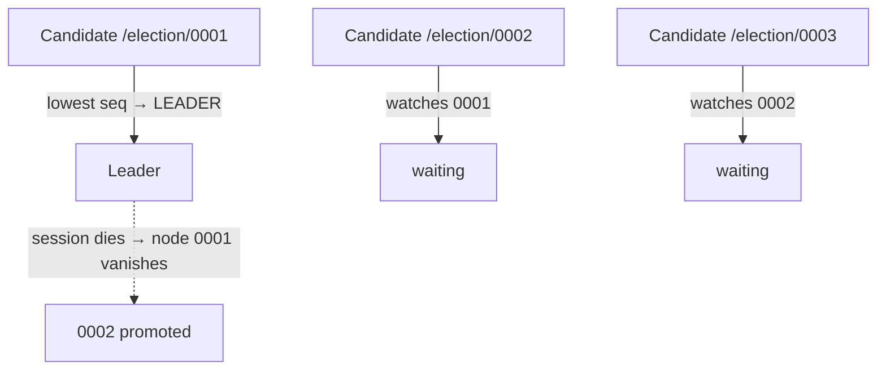

# Leader Election & Coordination

> Most distributed problems get simpler if exactly one node is "in charge." Electing that node, and agreeing on shared facts like locks and config, is a job specialized coordination services exist to do.

**Type:** Learn
**Languages:** Markdown
**Prerequisites:** Phase 5, Lesson 03 — Consensus & Raft
**Time:** ~35 minutes

## Learning Objectives

- Explain why many systems designate a single leader and how one is elected
- Describe coordination services (ZooKeeper, etcd) and what they provide
- Use distributed locks and leases for mutual exclusion across machines
- Recognize split-brain and how fencing prevents it
- Decide when to use a coordination service versus building your own

## The Problem

A surprising number of distributed problems collapse into simplicity if you can guarantee that *exactly one* node is responsible for a thing at a time. Which replica accepts writes? The leader (Phase 4). Which worker processes a given partition? Its assigned owner. Which scheduler triggers the nightly job, so it doesn't run five times? The elected one. Designating a single coordinator avoids conflicting actions — but it creates two hard sub-problems: how do the nodes *agree* on who the leader is, and what happens when that leader dies or is merely unreachable?

Getting this wrong produces the nightmare scenario of distributed systems: **split-brain**, where two nodes both believe they're the leader and both act on it — two replicas accepting conflicting writes, two schedulers double-charging customers, two workers corrupting the same file. The naive approaches ("whoever has the lowest ID," "whoever grabs the lock first") fail under partitions and clock skew exactly when you need them most.

The mature answer is to not build this yourself. **Coordination services** like ZooKeeper and etcd solve consensus (Lesson 03) once, correctly, and expose it as simple primitives: leader election, distributed locks, and a consistent place to store small critical data (configuration, membership, leadership). Almost every large distributed system leans on one of these for its coordination, rather than reinventing consensus and getting it subtly wrong.

## The Concept

### Why a single leader simplifies things

```
Without a leader (peers coordinate):     With a leader:
  every node negotiates with every         followers just do what the
  other on every decision -> conflicts,    leader says -> one decision
  ordering problems, complexity            maker, clean ordering
```

A leader gives you a single point where ordering and decisions happen, which sidesteps a whole class of conflict and consistency problems. The cost is that the leader is special — it must be elected, monitored, and replaced on failure — and it can be a bottleneck. The tradeoff is usually worth it; that's why single-leader replication, Raft, Kafka partitions, and countless schedulers are all leader-based.

### Coordination services: consensus as a service

ZooKeeper and etcd are small, highly-available, strongly-consistent (CP) datastores built on consensus (ZAB and Raft respectively). You don't store your application's bulk data in them — they're for small, critical, must-be-consistent facts that the whole cluster relies on:

```
Use a coordination service for...     NOT for...
-----------------------------------   ---------------------------
Leader election                       user records / bulk data
Distributed locks                     high-volume writes
Cluster membership (who's alive)      large blobs
Configuration that must be consistent  anything that can be eventual
Service discovery
```

They expose a tiny key-value/tree API with powerful extras: **watches** (be notified when a key changes), **ephemeral nodes** (keys that vanish when the client's session ends — perfect for "who's alive"), and **atomic compare-and-set**. From these primitives you build election and locking.

### Leader election with ephemeral nodes

A common pattern: each candidate creates an **ephemeral, sequenced** node under a known path; the one with the lowest sequence number is leader; everyone watches the node just ahead of them. If the leader's session dies, its ephemeral node disappears automatically, the next-lowest node is notified and becomes leader. Because the coordination service is consensus-backed, all nodes agree on who won — no split-brain.



### Distributed locks and leases

A **distributed lock** provides mutual exclusion across machines: only the holder may do X. Implemented by atomically creating a lock key (only one client can); the holder deletes it (or its ephemeral node vanishes) to release. Crucially, locks are usually **leases** — they expire after a timeout — so a crashed holder doesn't keep the lock forever. This introduces a subtle danger: a holder might be paused (GC, slow network) past its lease, lose the lock to someone else, then "wake up" still believing it holds the lock.

### Fencing: preventing the zombie holder

The fix is a **fencing token**: each time the lock is granted, the service hands out a monotonically increasing number. The protected resource (e.g. the storage) rejects any operation carrying a token lower than the highest it has seen. So if an old holder wakes up with token 33 after a new holder already used token 34, its writes are refused — the resource fences off the zombie. This is how you safely use locks despite pauses and partitions, and it's the rigorous answer to split-brain at the resource level.

```
Client A gets lock, token=33 ... pauses (GC)
Lease expires; Client B gets lock, token=34, writes (resource records 34)
Client A wakes, tries to write with token 33 -> resource: "33 < 34, REJECTED"
```

### A common misconception

"I'll just use a database row or a Redis key as a lock." This works until a partition or a paused process, at which point a naive lock allows two holders (split-brain) and silent corruption — the exact failure locks are supposed to prevent. Correct distributed locking needs consensus-backed grants *and* fencing tokens; rolling your own usually misses the fencing and the edge cases. The other misconception is putting too much in a coordination service — they're deliberately small and consensus-bound (every write needs a majority), so they're slow for bulk data and will become a bottleneck. Use them for the few critical, low-volume facts that must be globally consistent, and keep everything else in your regular datastores.

## Exercises

1. **Justify a leader.** Give two concrete tasks that become much simpler with a single elected leader, and the bug that occurs if two nodes both act as leader.

2. **Right tool?** For each, say whether a coordination service (ZooKeeper/etcd) is appropriate: (a) which node runs the cron job, (b) storing 10M user profiles, (c) the current set of live workers, (d) a feature-flag config read by all services.

3. **Trace an election.** Using ephemeral sequenced nodes, describe what happens to the waiting candidates when the current leader's process crashes.

4. **The zombie holder.** Walk through how a paused lock holder can cause two writers, and show exactly how a fencing token stops the corruption.

5. **Lease tuning.** A lock lease is 10s. What's the risk if it's too short? Too long? What does this tell you about choosing lease durations?

## Key Terms

| Term | What people say | What it actually means |
|------|----------------|------------------------|
| Leader election | "Pick the boss" | Agreeing on a single node responsible for a task, re-run when it fails |
| Coordination service | "ZooKeeper/etcd" | A small, CP, consensus-backed store providing election, locks, and config |
| Distributed lock | "Cross-machine mutex" | Mutual exclusion across nodes so only one holder may act on a resource |
| Lease | "Expiring lock" | A lock that auto-expires after a timeout so a crashed holder can't keep it forever |
| Fencing token | "Monotonic guard" | An increasing number per grant; the resource rejects lower tokens to stop zombie holders |
| Ephemeral node | "Auto-deleting key" | A coordination-service key that vanishes when the client session ends; used for liveness |
| Watch | "Change notification" | A subscription to be notified when a coordination key changes |
| Split-brain | "Two leaders" | Two nodes both acting as leader, causing conflicting actions and corruption |
