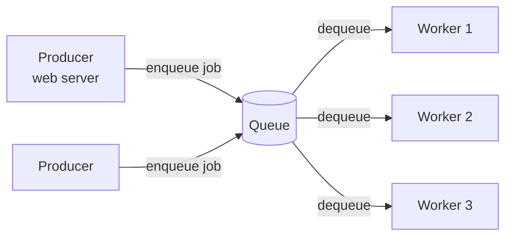

# Message Queues

> Not every task needs to finish before you reply to the user. A message queue lets you say "got it" instantly and do the slow work later — and absorb a traffic spike without falling over.

**Type:** Build
**Languages:** Python
**Prerequisites:** Phase 0 — Foundations
**Time:** ~50 minutes

## Learning Objectives

- Explain why asynchronous processing decouples producers from consumers
- Describe the producer/queue/consumer model and a worker pool
- Use a queue to absorb load spikes via buffering and backpressure
- Reason about queue depth as a health signal
- Build a producer/consumer queue with workers in Python

## The Problem

Some work is slow: resizing an uploaded video, sending an email, charging a card, generating a report. If you do it *synchronously* — inside the request, while the user waits — two things go wrong. First, the user stares at a spinner for seconds while your server is tied up. Second, and worse, your capacity is capped by the slowest step: if each request holds a server for 3 seconds doing video work, a modest burst of uploads exhausts your servers and everything grinds to a halt. The synchronous model couples the user's request rate directly to your slowest operation.

The fix is to **decouple** the fast part (accept the request, acknowledge it) from the slow part (actually do the work). A **message queue** sits between them: the web server (the **producer**) drops a message describing the work onto the queue and immediately returns "accepted" to the user; separate **consumer** processes (workers) pull messages off the queue and do the slow work at their own pace. The user gets an instant response, and the heavy lifting happens in the background.

This does more than improve latency — it makes the system resilient to bursts. When 10,000 uploads arrive in a second but your workers can only process 1,000/second, the queue *buffers* the excess. Work isn't dropped; it waits its turn and drains over the next ten seconds. The queue acts as a shock absorber between a spiky, unpredictable arrival rate and a steady processing rate. This single pattern — async work via a queue — is everywhere in large systems, and you'll build it from scratch.

## The Concept

### The model



- **Producer**: creates work and puts a message on the queue, then moves on (doesn't wait for the result). The user's request returns immediately.
- **Queue**: an ordered buffer holding pending messages (RabbitMQ, AWS SQS, Redis lists, etc.). It persists messages so nothing is lost if a worker crashes.
- **Consumer (worker)**: pulls a message, does the work, and acknowledges it. Multiple workers pull from the same queue, so you scale processing by adding workers.

The producer and consumer are **decoupled**: they run independently, can be scaled independently, and don't even have to be up at the same time — a producer can enqueue work while all workers are down, and the work waits.

### Why this absorbs spikes

The key property is that **arrival rate and processing rate are now independent**. Picture a sudden burst:

```
Arrivals:  ████████████████   (10,000 in 1 second — a spike)
Queue:     [buffers the excess]
Workers:   ▓▓▓▓ ▓▓▓▓ ▓▓▓▓ ...  (steady 1,000/sec, drains over 10s)
```

Without a queue, that spike would overwhelm your servers and drop requests. With a queue, the work is accepted instantly and processed steadily as capacity allows. The queue trades *latency for the buffered work* (some jobs wait longer) in exchange for *not falling over*. This is almost always the right trade for background work.

### Backpressure and queue depth

The number of messages waiting — **queue depth** — is a vital health signal:

- **Depth near zero**: workers keep up; the system is healthy.
- **Depth growing steadily**: arrivals exceed processing capacity — you're falling behind and need more workers (or the work is too slow). Left unchecked, the queue grows unbounded and eventually runs out of memory/disk.

**Backpressure** is the mechanism for handling sustained overload: when the queue gets too deep, the producer is signaled to slow down or reject new work (e.g. return "try later") rather than let the queue grow forever. A queue is a shock absorber for *bursts*, not a fix for *sustained* under-capacity — if arrivals permanently exceed processing, no queue can save you; you must add workers or shed load.

### Delivery and failure handling

Real queues handle the messy cases:

- **Acknowledgement**: a worker acks a message only after successfully processing it. If the worker crashes mid-job, the unacked message is redelivered to another worker (so work isn't lost) — at the cost of possible duplicate processing (Lesson 05).
- **Dead-letter queue**: a message that repeatedly fails (poison message) is moved to a separate queue after N attempts, so one bad message doesn't block the line or retry forever.
- **Visibility timeout**: while a worker holds a message, it's hidden from others; if not acked within the timeout, it reappears for redelivery.

### A common misconception

"A queue makes everything faster." It makes the *response* faster but the *work itself* isn't faster — it's just moved off the critical path, and it actually completes a bit later (after waiting in line). So queues fit work that can be done asynchronously (the user doesn't need the result *right now*): emails, thumbnails, analytics. They don't fit work whose result the user needs in the response (you can't queue "compute the page they're looking at"). The other misconception is that a queue solves capacity problems — it smooths bursts, but if your average arrival rate exceeds your average processing rate, the queue just grows until it bursts. Sizing workers to the *sustained* load is still required.

## Build It

You'll build a thread-based producer/consumer queue and watch workers drain a burst. Create `message_queue.py`.

### Step 1 — A queue, a producer, and a slow task

```python
# Run: python message_queue.py
import queue, threading, time

work_queue = queue.Queue()
processed = []
processed_lock = threading.Lock()

def slow_task(job):
    time.sleep(0.01)               # simulate slow work (e.g. send email)
    with processed_lock:
        processed.append(job)
```

### Step 2 — The worker (consumer)

```python
def worker(worker_id):
    while True:
        job = work_queue.get()     # blocks until a job is available
        if job is None:            # sentinel to stop
            work_queue.task_done()
            break
        slow_task(job)
        work_queue.task_done()     # acknowledge completion
```

### Step 3 — Produce a burst instantly

```python
def producer(n):
    start = time.time()
    for i in range(n):
        work_queue.put(f"job-{i}")     # enqueue and move on immediately
    return time.time() - start
```

### Step 4 — Run with a worker pool and measure

```python
NUM_JOBS = 1000
NUM_WORKERS = 8

# Start workers
threads = [threading.Thread(target=worker, args=(i,), daemon=True)
           for i in range(NUM_WORKERS)]
for t in threads:
    t.start()

# Producer enqueues 1000 jobs almost instantly
enqueue_time = producer(NUM_JOBS)
print(f"Enqueued {NUM_JOBS} jobs in {enqueue_time*1000:.1f} ms "
      f"(producer returns immediately)")
print(f"Queue depth right after enqueue: ~{work_queue.qsize()}")

# Wait for all jobs to be processed
process_start = time.time()
work_queue.join()                       # blocks until every task_done()
process_time = time.time() - process_start
print(f"Drained {NUM_JOBS} jobs with {NUM_WORKERS} workers in {process_time:.2f} s")
print(f"Processed count: {len(processed)}")
```

### Step 5 — Show that more workers drain faster

```python
print(f"\nThroughput: ~{NUM_JOBS/process_time:.0f} jobs/sec with {NUM_WORKERS} workers")
print("Producer latency stayed ~0; the slow work moved off the request path.")

# Stop workers
for _ in range(NUM_WORKERS):
    work_queue.put(None)
```

### Step 6 — Run it

```bash
python message_queue.py
```

The producer enqueues 1000 jobs in milliseconds (instant response), while 8 workers drain them steadily in the background. Compare with `outputs/expected.md`, then try changing `NUM_WORKERS` to see throughput scale.

## Exercises

1. **Run and read.** How long does enqueuing take vs draining? This gap is exactly the latency the user is *saved* from waiting.

2. **Scale workers.** Run with 1, 4, 8, 16 workers. How does drain time and throughput change? Is it linear? Why might it plateau?

3. **Watch the depth.** Print `work_queue.qsize()` periodically from a monitor thread during draining. Describe the curve — when is it highest?

4. **Simulate a poison message.** Make `slow_task` raise on `job-500`. What happens without handling? Add a try/except that routes failures to a `dead_letter` list (a basic DLQ).

5. **Sustained overload.** Have the producer enqueue faster than workers can process, forever. Show the queue depth growing without bound and explain why adding workers (or backpressure) is the only fix.

## Key Terms

| Term | What people say | What it actually means |
|------|----------------|------------------------|
| Message queue | "Background job buffer" | An ordered buffer holding work between producers and consumers |
| Producer | "Job creator" | The component that enqueues work and returns immediately |
| Consumer / worker | "Job processor" | A process that pulls messages and does the work; scaled by adding more |
| Decoupling | "Independent parts" | Producers and consumers run, scale, and fail independently |
| Queue depth | "Backlog size" | Number of waiting messages; a key health signal |
| Backpressure | "Slow down" | Signaling producers to slow/reject work when the queue is too deep |
| Dead-letter queue | "Failure bin" | Where repeatedly-failing messages go so they don't block the line |
| Acknowledgement | "Confirm done" | A worker confirming success; unacked messages are redelivered |
