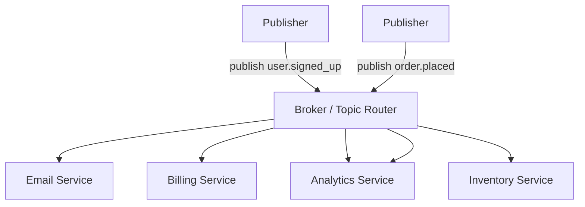

# Pub/Sub & Event-Driven Design

> A queue delivers each message to *one* worker. But what if a single event — "user signed up" — should trigger five independent things at once? That's the job of publish/subscribe.

**Type:** Build
**Languages:** Python
**Prerequisites:** Phase 6, Lesson 01 — Message Queues
**Time:** ~50 minutes

## Learning Objectives

- Distinguish point-to-point queues from publish/subscribe (fan-out)
- Describe topic-based pub/sub and multiple independent subscribers
- Explain event-driven architecture and the decoupling it provides
- Recognize the tradeoffs: loose coupling vs harder debugging
- Build a topic-based pub/sub broker in Python

## The Problem

A message queue (Lesson 01) is **point-to-point**: each message is consumed by exactly one worker. That's perfect for "do this unit of work once." But many real situations need the opposite — *one event, many reactions*. When a user signs up, you want to: send a welcome email, create their billing profile, add them to the analytics pipeline, notify the sales team, and warm their recommendation cache. With a plain queue, you'd have to either cram all five actions into one consumer (tightly coupled, fragile — one slow step blocks the rest) or have the producer explicitly call five services (the producer now knows about every downstream consumer, and adding a sixth means changing the producer).

**Publish/subscribe (pub/sub)** solves this. The producer **publishes** an event to a **topic** ("user.signed_up") without knowing or caring who listens. Any number of **subscribers** independently subscribe to that topic and each receives its own copy of the event. The email service, billing service, and analytics service each get the event and react on their own. The publisher is completely **decoupled** from the subscribers — it doesn't know they exist. Adding a new reaction means adding a subscriber; the publisher never changes.

This is the foundation of **event-driven architecture**, where services communicate by emitting and reacting to events rather than calling each other directly. It's how large systems stay loosely coupled enough that teams can build and deploy independently — and it brings its own challenges in debugging and reasoning about flow, which you need to understand to use it well.

## The Concept

### Queue (point-to-point) vs pub/sub (fan-out)

```
Message Queue (one message -> one consumer):
   producer -> [Q] -> worker A   (B and C get OTHER messages)
                  \-> worker B
                  \-> worker C
   (consumers share the load; each message handled once)

Pub/Sub (one event -> ALL subscribers):
   publisher -> (topic) -> subscriber A  (gets a copy)
                        -> subscriber B  (gets a copy)
                        -> subscriber C  (gets a copy)
   (each subscriber gets every message; independent reactions)
```

The crucial difference: a queue *distributes* work (load-balancing — each item done once); pub/sub *broadcasts* events (fan-out — each subscriber sees everything). They solve different problems and are often combined (each subscriber may itself be a queue feeding a worker pool).

### Topics and the broker



- **Topic**: a named channel events are published to (e.g. `user.signed_up`, `order.placed`).
- **Broker**: the infrastructure (Kafka, RabbitMQ, Redis Pub/Sub, cloud Pub/Sub) that routes each published event to all subscribers of its topic.
- **Publisher**: emits events to topics, unaware of subscribers.
- **Subscriber**: registers interest in a topic and receives every event published to it.

A service can be both — subscribing to `order.placed` and publishing `inventory.reserved` in reaction, forming chains of events.

### Event-driven architecture

In an event-driven system, the source of truth is a stream of **events** (facts about things that happened: "OrderPlaced", "PaymentReceived"). Services react to events and emit new ones, rather than calling each other's APIs directly. Benefits:

- **Loose coupling**: the order service emits `order.placed` and doesn't know or care that inventory, email, and analytics react. You add or remove reactions without touching the producer.
- **Independent scaling and deployment**: each subscriber scales and ships on its own schedule.
- **Resilience**: if the email service is down, the event waits (in a durable broker) and is processed when it recovers — the order still succeeded.
- **Auditability**: the event stream is a record of everything that happened (especially with log-based brokers, Lesson 03).

### The tradeoffs

Event-driven design isn't free:

```
Benefit                    Cost
-------------------------  -------------------------------------------
Loose coupling             Harder to see the end-to-end flow — no single
                           call stack; logic is spread across reactions
Independent services       Eventual consistency — reactions happen async,
                           so the system is briefly in an in-between state
Easy to add reactions      Hard to debug — "why did X happen?" means
                           tracing events across many services
Resilient to outages       Need careful handling of duplicates/ordering
                           (Lesson 05)
```

The loss of a single, linear call flow is the big one: with direct calls you can read the code top to bottom; with events, the "flow" is emergent across many independently-deployed subscribers, which is powerful but genuinely harder to reason about and trace.

### A common misconception

"Pub/sub is just a better queue." They're different tools: a queue load-balances work (each message once), pub/sub fans out events (each subscriber gets everything). Using pub/sub where you wanted exactly-once work processing means every subscriber redundantly does the same job; using a queue where you wanted fan-out means only one consumer reacts and the others never hear about it. The second misconception is that event-driven architecture is strictly superior to direct calls — it trades synchronous simplicity and easy debugging for decoupling and scalability. For a small system, direct calls are clearer; event-driven shines when many independent services must react to the same facts and evolve separately.

## Build It

You'll build a topic-based pub/sub broker and show one event fanning out to several subscribers. Create `pubsub.py`.

### Step 1 — The broker

```python
# Run: python pubsub.py
from collections import defaultdict

class Broker:
    def __init__(self):
        self.subscribers = defaultdict(list)   # topic -> [callbacks]

    def subscribe(self, topic, callback):
        self.subscribers[topic].append(callback)

    def publish(self, topic, event):
        # deliver a copy to EVERY subscriber of this topic (fan-out)
        for callback in self.subscribers[topic]:
            callback(event)
```

### Step 2 — Independent subscriber services

```python
delivered = {"email": [], "billing": [], "analytics": [], "inventory": []}

def email_service(event):
    delivered["email"].append(event)
    print(f"  [email]     welcome email for {event['user']}")

def billing_service(event):
    delivered["billing"].append(event)
    print(f"  [billing]   created billing profile for {event['user']}")

def analytics_service(event):
    delivered["analytics"].append(event)
    print(f"  [analytics] recorded event {event.get('type','?')}")

def inventory_service(event):
    delivered["inventory"].append(event)
    print(f"  [inventory] reserved stock for order {event.get('order')}")
```

### Step 3 — Wire up subscriptions

```python
broker = Broker()
# user.signed_up fans out to THREE services
broker.subscribe("user.signed_up", email_service)
broker.subscribe("user.signed_up", billing_service)
broker.subscribe("user.signed_up", analytics_service)
# order.placed fans out to TWO services (analytics listens to both topics)
broker.subscribe("order.placed", inventory_service)
broker.subscribe("order.placed", analytics_service)
```

### Step 4 — Publish events (publisher knows nothing about subscribers)

```python
print("Publish user.signed_up (fans out to 3 services):")
broker.publish("user.signed_up", {"type": "user.signed_up", "user": "ada"})

print("\nPublish order.placed (fans out to 2 services):")
broker.publish("order.placed", {"type": "order.placed", "order": 1001})
```

### Step 5 — Show fan-out counts and decoupling

```python
print("\nDelivery counts:")
for svc, events in delivered.items():
    print(f"  {svc:10}: {len(events)} event(s)")
print("\nThe publisher never named a single subscriber — adding a new one")
print("means calling broker.subscribe(), with zero changes to the publisher.")

# Demonstrate adding a subscriber later, no publisher change:
broker.subscribe("user.signed_up", lambda e: print("  [sales]     notified about", e["user"]))
print("\nAfter adding a 4th subscriber and publishing again:")
broker.publish("user.signed_up", {"type": "user.signed_up", "user": "grace"})
```

### Step 6 — Run it

```bash
python pubsub.py
```

One `user.signed_up` publish triggers three services; adding a fourth subscriber requires no change to the publisher. Compare with `outputs/expected.md`.

## Exercises

1. **Run and read.** How many services react to one `user.signed_up`? To one `order.placed`? Why does `analytics` get both?

2. **Add a reaction.** Subscribe a new `recommendation_service` to `user.signed_up` and publish again. Confirm the publisher code is untouched — that's the decoupling payoff.

3. **Queue vs pub/sub.** Rewrite `email_service`, `billing_service`, `analytics_service` as three workers on a single *queue* instead. Show that now only one of them handles each event — and why that's wrong for this use case.

4. **Event chain.** Make `inventory_service` publish an `inventory.reserved` event when it handles `order.placed`, and subscribe a `shipping_service` to it. Trace the chain.

5. **Debugging cost.** With five subscribers reacting to one event, describe why answering "why did the user get two emails?" is harder than in a direct-call system, and one tool that helps (recall Phase 7 tracing).

## Key Terms

| Term | What people say | What it actually means |
|------|----------------|------------------------|
| Pub/Sub | "Broadcast messaging" | A pattern where publishers send to topics and every subscriber gets a copy |
| Topic | "Channel" | A named stream events are published to and subscribers listen on |
| Broker | "The router" | Infrastructure that delivers each published event to all subscribers of its topic |
| Fan-out | "One to many" | Delivering a single event to multiple independent consumers |
| Point-to-point | "Queue delivery" | Each message consumed by exactly one consumer (load-balancing) |
| Event-driven architecture | "Services react to events" | Design where services communicate by emitting/reacting to events, not direct calls |
| Loose coupling | "Independent services" | Components that don't depend on each other's internals; the publisher doesn't know subscribers |
| Event | "A thing that happened" | An immutable fact (OrderPlaced) that subscribers react to |
