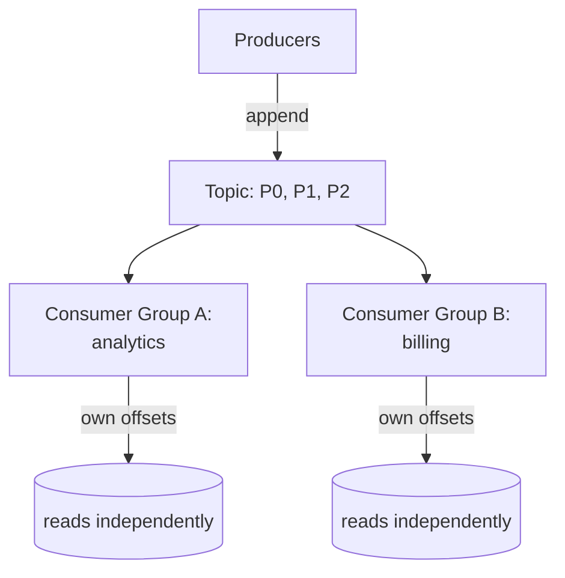

# Kafka & Log-Based Streaming

> A traditional queue deletes a message once it's consumed. Kafka does the opposite — it keeps everything in an append-only log and lets each consumer track its own position. That one change reshapes architectures.

**Type:** Learn
**Languages:** Markdown
**Prerequisites:** Phase 6, Lesson 02 — Pub/Sub & Event-Driven Design
**Time:** ~40 minutes

## Learning Objectives

- Describe the append-only commit log model behind Kafka
- Explain partitions, offsets, and consumer groups
- Distinguish log-based streaming from traditional message queues
- Explain why retained, replayable logs enable new architectures
- Reason about ordering guarantees and their limits

## The Problem

Traditional message brokers (Lesson 01–02) treat a message as transient: it's delivered, acknowledged, and deleted. That works for "do this task once," but it throws away the message the moment it's consumed — so you can't replay history, you can't add a new consumer that needs the past events, and if a consumer processes a message wrongly, the original is gone. As systems became more data- and event-centric, a different model proved more powerful: keep the events.

**Kafka** (and the log-based streaming model it popularized) stores events in a durable, append-only **log** that is *not* deleted on consumption. Producers append events to the end; consumers read forward and remember their own position. Events stick around for a configured retention (days, weeks, or forever). This sounds like a small change, but it's profound: the message broker becomes a *source of truth* — a replayable record of everything that happened — rather than a transient pipe. New consumers can read from the beginning, a buggy consumer can rewind and reprocess, and multiple independent systems can read the same stream at their own pace.

This model underpins modern event-driven and streaming architectures, real-time analytics, and event sourcing. Kafka routinely handles millions of events per second by combining the log model with partitioning (Phase 4's idea applied to streams). Understanding the log abstraction is understanding why systems are increasingly built around streams of events.

## The Concept

### The append-only log

At its core, a Kafka topic is a **log**: an ordered, immutable sequence of records, only ever appended to.

```
Topic "orders" (a partition's log):
  offset:  0      1      2      3      4      5   <- next append here
           [evt] [evt] [evt] [evt] [evt]
            ^                          ^
            oldest                     newest
  Producers append to the right. Consumers read left-to-right at their own pace.
```

The log is durable and retained — reading a record does *not* remove it. This is the fundamental departure from a queue. Each record has an **offset**: its position in the log. A consumer's only state is "which offset have I read up to," which it commits periodically. To replay, a consumer just resets its offset backward.

### Partitions: scaling the log

A single log on one machine caps throughput. Kafka splits a topic into **partitions**, each an independent log on (potentially) different brokers — this is sharding (Phase 4) applied to a stream.

```
Topic "orders" with 3 partitions:
  P0: [evt][evt][evt]...
  P1: [evt][evt][evt]...
  P2: [evt][evt]...
  Producers distribute records across partitions (by key or round-robin).
```

Partitioning multiplies throughput (write/read in parallel across partitions) and is the unit of parallelism for consumers. The crucial consequence for ordering: **Kafka guarantees order only within a partition, not across partitions.** Records with the same key go to the same partition (so all events for one order stay ordered), but two events on different partitions have no guaranteed relative order — the same tradeoff hash sharding made in Phase 4.

### Offsets and consumer groups



- **Consumer group**: a set of consumers that cooperate to read a topic, with each *partition* assigned to exactly one consumer in the group. So a group with 3 consumers can read a 3-partition topic in parallel (load-balancing *within* the group, like a queue).
- **Independent groups**: different groups each get the *full* stream and track their own offsets (fan-out, like pub/sub). The analytics group and the billing group both read every event, independently.

So Kafka unifies the two patterns: **within a group** it behaves like a queue (work split across consumers); **across groups** it behaves like pub/sub (each group sees everything). And because offsets are per-group, each group can be at a different position — billing might be real-time while a new analytics group replays from offset 0.

### Why retained, replayable logs change architecture

```
Capability the log enables          Why it matters
----------------------------------  -------------------------------------------
Replay                              Reprocess history after a bug fix or to
                                    build a new view; the events are still there
Add consumers later                 A new service can read from the beginning,
                                    no need to have been subscribed at the time
Event sourcing                      The log of events IS the source of truth;
                                    current state is derived by replaying it
Decoupling in time                  Fast and slow consumers read the same stream
                                    at independent speeds
Multiple materialized views         Many systems build their own view (SQL,
                                    search index, cache) from one event stream
```

This is the heart of it: when the broker retains an ordered, replayable history, it stops being a pipe and becomes the system's backbone — the authoritative stream from which databases, caches, search indexes, and analytics are all derived.

### A common misconception

"Kafka is just a faster message queue." The retention-and-replay model makes it categorically different: a queue forgets messages on consumption; Kafka remembers them, which is what enables replay, late-joining consumers, and event sourcing. Conversely, people assume Kafka guarantees total ordering — it only orders *within a partition*. If you need global ordering you must use a single partition (sacrificing parallelism) or design keys so that things which must be ordered share a partition. The third misconception is reaching for Kafka by default — it's powerful but operationally heavy; for simple "do this task async," a regular queue (Lesson 01) is simpler and sufficient. Use the log model when you need retention, replay, high throughput, or multiple independent consumers of the same stream.

## Exercises

1. **Log vs queue.** List three things you can do with a Kafka log that a traditional queue can't, and tie each to the "retained, not deleted on read" property.

2. **Ordering reasoning.** You need all events for a given user processed in order. How do you achieve that with partitions, and what do you give up?

3. **Group behavior.** A topic has 4 partitions. Consumer group A has 4 consumers; group B has 2. How are partitions assigned in each group, and which group reads the full stream?

4. **Replay scenario.** A billing consumer had a bug for 2 hours and miscomputed charges. With Kafka, how do you fix the data? Why is this impossible with a delete-on-consume queue?

5. **When NOT to use Kafka.** Describe a use case where a simple queue is the better choice than Kafka, and justify it on operational simplicity.

## Key Terms

| Term | What people say | What it actually means |
|------|----------------|------------------------|
| Kafka | "Streaming platform" | A distributed, partitioned, append-only log used for event streaming |
| Commit log | "Append-only log" | An ordered, immutable, retained sequence of records; the core abstraction |
| Offset | "Read position" | A record's position in a partition; a consumer's only state is its offset |
| Partition | "Stream shard" | An independent log within a topic; the unit of parallelism and ordering |
| Consumer group | "Cooperating readers" | Consumers that split a topic's partitions among themselves (queue-like within the group) |
| Retention | "How long events live" | The configured duration records are kept, independent of consumption |
| Replay | "Re-read history" | Resetting an offset to reprocess past events |
| Event sourcing | "Log as source of truth" | Storing the event log as authoritative and deriving current state by replaying it |
