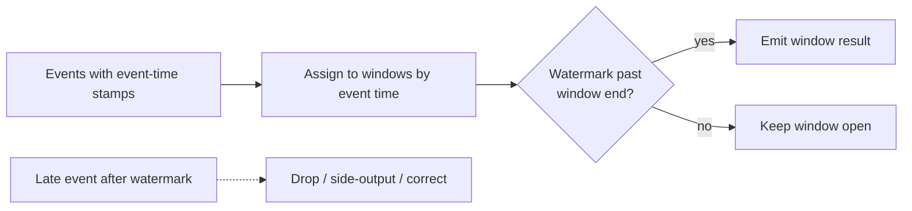

# Stream Processing

> Batch processing asks "what happened yesterday?" Stream processing asks "what is happening right now?" — computing results continuously over an endless flow of events.

**Type:** Learn
**Languages:** Markdown
**Prerequisites:** Phase 6, Lesson 03 — Kafka & Log-Based Streaming
**Time:** ~35 minutes

## Learning Objectives

- Contrast batch processing with stream processing
- Explain windowing over an unbounded stream
- Distinguish event time from processing time
- Describe watermarks and handling late data
- Choose batch vs stream for a given problem

## The Problem

For decades, data processing meant **batch**: collect data into a big pile (a day's logs, a month's transactions), then run a job over the whole pile at once to produce results. Batch is simple and efficient, but it has a fundamental latency: you can't know today's numbers until today is over and the batch runs. For a growing class of needs — fraud detection, live dashboards, real-time recommendations, alerting, trending topics — waiting hours is unacceptable. You need the answer *as the data arrives*.

**Stream processing** computes results continuously over an *unbounded* stream of events (typically from a log like Kafka, Lesson 03). Instead of "run once over a fixed dataset," it's "keep running forever, updating results as each event flows in." A fraud model scores transactions the instant they happen; a dashboard updates per second; an alert fires within moments of a threshold breach. The stream never ends, so the processing never ends.

This shift from bounded to unbounded data creates genuinely new problems that batch never had to face. If the data never ends, when do you emit a result for "the count in the last minute"? What does "the last minute" even mean when events arrive out of order and late? These questions — windowing, event time, and watermarks — are the core of stream processing, and getting them wrong produces subtly incorrect results that are hard to notice.

## The Concept

### Batch vs stream

```
Batch processing                    Stream processing
----------------------------------  ----------------------------------
bounded data (a fixed dataset)      unbounded data (a never-ending stream)
run once, produce a result          run continuously, update results
high latency (wait for the batch)   low latency (results as events arrive)
simple: all data available at once  hard: data arrives over time, out of order
e.g. nightly report, ETL job        e.g. live fraud scoring, real-time dash
Tools: Spark, MapReduce, SQL jobs   Tools: Flink, Kafka Streams, Spark Streaming
```

Neither is obsolete — many systems use both (the "Lambda" and "Kappa" architectures combine batch accuracy with stream freshness). The choice is about *how fresh* the result must be versus how *simple* you want the processing.

### Windowing: making the infinite finite

You can't compute "the average" of an infinite stream — there's no end. So stream processing chops the stream into **windows**: finite slices over which you compute. The common types:

```
Tumbling windows (fixed, non-overlapping):
  |--0-60s--|--60-120s--|--120-180s--|   each event in exactly one window

Sliding/hopping windows (overlapping):
  |--0-60s--|
       |--30-90s--|
            |--60-120s--|               an event can be in several windows

Session windows (gap-based):
  [activity]...gap...[activity]          a window per burst of activity,
                                         closed after an inactivity gap
```

"Count events per minute" is a tumbling window; "average over the last 5 minutes, updated every minute" is a sliding window; "group a user's clicks into a browsing session" is a session window. Windowing is how an unbounded stream yields finite, emittable results.

### Event time vs processing time

A subtle but critical distinction:

- **Event time**: when the event actually *happened* (a timestamp in the event — e.g. when the user clicked).
- **Processing time**: when your system *received and processed* it.

These differ because of network delays, retries, mobile devices that were offline, and buffering. An event that happened at 11:59:58 might arrive at 12:00:03 — its event time is in the previous minute but it shows up in the next. **Almost always you want to window by event time** (you care when things happened, not when you happened to see them), but that forces you to handle events arriving *late*, out of order.

```
Event time:      e1(00s)  e2(05s)  e3(58s) ... e3 actually arrives AFTER the
Arrival order:   e1       e2       e4(62s)  e3   <- e3 is late & out of order
```

### Watermarks: deciding when a window is "done"

If events can arrive late, when can you finalize the result for "the 0–60s window" and emit it? Wait forever and you never produce output; close too early and you miss late events. A **watermark** is the stream processor's estimate that "I've probably seen all events up to time T." When the watermark passes a window's end, the window is considered complete and its result emitted. Late events arriving after the watermark are handled by policy: dropped, sent to a side output, or used to issue a correction. Watermarks are the pragmatic answer to the impossibility of knowing the future — a tunable tradeoff between latency (emit sooner) and completeness (wait for stragglers).



### A common misconception

"Stream processing is just fast batch processing." The unbounded, out-of-order nature makes it fundamentally different — batch has all the data at once and never worries about windows, event time, or late arrivals; streaming must reason about all three continuously. The second misconception is using *processing time* for windows because it's easier — it gives wrong, non-reproducible results (the same events processed at a different speed land in different windows). Production systems window by event time with watermarks. The third: assuming you always need streaming. If hourly or daily freshness is fine, batch is simpler, cheaper, and easier to get correct — reach for streaming only when low latency genuinely matters.

## Exercises

1. **Batch or stream?** For each, choose and justify: (a) monthly payroll, (b) credit-card fraud alerts, (c) a "top trending now" list, (d) a quarterly financial report, (e) a live ops dashboard.

2. **Pick the window.** Choose tumbling, sliding, or session for: (a) requests per minute, (b) a 5-minute moving average updated every 30s, (c) grouping a user's activity into visits.

3. **Event vs processing time.** A mobile app was offline and uploads events with old timestamps. Explain how windowing by processing time vs event time gives different counts, and which is correct.

4. **Tune the watermark.** Explain the tradeoff if your watermark waits 1 second for late events vs 5 minutes. What does each cost?

5. **Late data policy.** A revenue dashboard windows by event time with a watermark. A payment event arrives 10 minutes late, after its window emitted. Name two reasonable ways to handle it.

## Key Terms

| Term | What people say | What it actually means |
|------|----------------|------------------------|
| Batch processing | "Run over a pile" | Processing a bounded dataset all at once; simple, high-latency |
| Stream processing | "Real-time processing" | Continuously processing an unbounded event stream, updating results as data arrives |
| Window | "Time slice" | A finite chunk of an unbounded stream over which a result is computed |
| Tumbling window | "Fixed buckets" | Non-overlapping fixed windows; each event in exactly one |
| Sliding window | "Overlapping buckets" | Overlapping windows; an event can belong to several |
| Event time | "When it happened" | The timestamp of when the event actually occurred |
| Processing time | "When we saw it" | When the system received/processed the event |
| Watermark | "All-seen estimate" | The processor's estimate that all events up to time T have arrived, triggering window emission |
