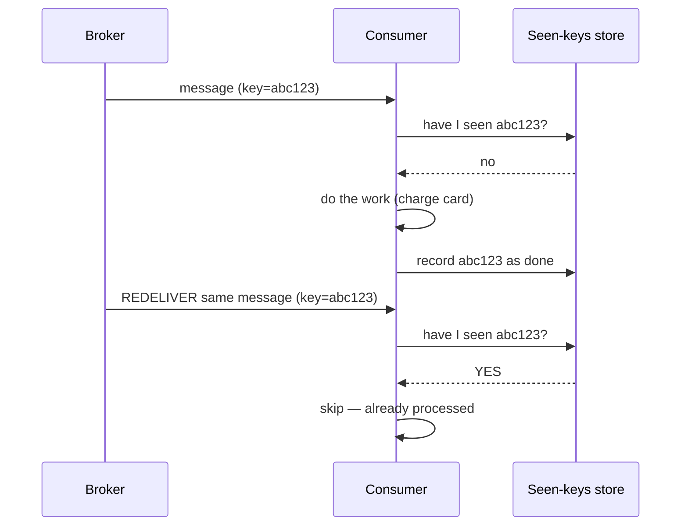

# Idempotency & Delivery Guarantees

> In a distributed system, "send this message exactly once" is nearly impossible. The practical trick is to deliver it *at least* once and make processing it twice harmless.

**Type:** Build
**Languages:** Python
**Prerequisites:** Phase 6, Lesson 01 — Message Queues
**Time:** ~50 minutes

## Learning Objectives

- Define at-most-once, at-least-once, and exactly-once delivery
- Explain why true exactly-once delivery is effectively impossible
- Implement idempotent consumers using deduplication keys
- Achieve effective exactly-once with at-least-once + idempotency
- Recognize where idempotency matters (payments, side effects)

## The Problem

Messaging systems promise to deliver messages, but networks are unreliable, so there's an unavoidable ambiguity. A worker processes a message, then crashes *before* it can acknowledge it. Did the work finish? The broker can't tell — it only knows the ack never came. It has two choices, and they correspond to opposite failure modes. If it *doesn't* redeliver, the message might be lost (the work never happened) — **at-most-once**. If it *does* redeliver, the message might be processed twice (once by the crashed worker, once by the next) — **at-least-once**. There is no third option that's free, because you can never be certain whether the ambiguous message succeeded.

This matters enormously when processing has **side effects**. Charging a credit card twice because the message was redelivered is a real, costly bug. Sending a duplicate shipping order, double-incrementing a counter, sending two "welcome" emails — all stem from at-least-once delivery doing its job (not losing the message) at the cost of duplicates. You can't just "turn on exactly-once" to fix it, because true end-to-end exactly-once delivery across an unreliable network is, in the general case, impossible.

The professional solution is a reframe: accept **at-least-once delivery** (never lose a message) and make your processing **idempotent** — designed so that handling the same message twice has the same effect as handling it once. Then duplicates are harmless, and you get the *effect* of exactly-once without the impossible guarantee. This lesson builds idempotent consumers and shows how dedup keys turn a duplicate-prone system into a correct one.

## The Concept

### The three delivery semantics

```
At-most-once:   deliver 0 or 1 times. Never duplicates, but may LOSE messages.
                (don't redeliver on uncertainty)  → fine for tolerant data
                Example: best-effort metrics where a lost sample doesn't matter.

At-least-once:  deliver 1 or more times. Never loses, but may DUPLICATE.
                (redeliver on uncertainty)  → the common, safe default
                Example: anything where losing the message is unacceptable.

Exactly-once:   deliver and process precisely once. The ideal — but true
                end-to-end exactly-once DELIVERY is effectively impossible
                across an unreliable network.
```

### Why exactly-once delivery is (effectively) impossible

The crash-before-ack scenario is the proof sketch: when an ack is lost, the sender genuinely cannot distinguish "succeeded but ack lost" from "failed." Any choice it makes risks either loss or duplication. No protocol eliminates this, because the network can drop the very message that would resolve the ambiguity. So "exactly-once delivery" as a network guarantee doesn't exist in general.

What *does* exist is **exactly-once *processing*** (or "effectively-once"): deliver at-least-once, and make the consumer deduplicate so repeated deliveries don't cause repeated effects. The duplication still happens at the delivery layer; the consumer absorbs it. This is the model real systems use, including Kafka's "exactly-once" features under the hood.

### Idempotency: the key idea

An operation is **idempotent** if doing it multiple times has the same effect as doing it once.

```
Idempotent (safe to repeat):          NOT idempotent (repeating changes result):
  SET balance = 100                     balance = balance + 100   (adds each time!)
  DELETE user 42                        append to a list
  PUT /users/42 {whole object}          POST /users (creates a new one each call)
  mark order 'shipped'                  increment a counter
```

Some operations are naturally idempotent (setting an absolute value, deleting by id). Others (increments, appends, "create") are not, and you must *make* them idempotent — usually with a deduplication key.

### Deduplication keys

The standard technique: every message carries a unique **idempotency key** (an ID the producer assigns). The consumer records which keys it has already processed; before acting, it checks whether the key is seen, and if so, skips the work (it was a duplicate).



The "seen keys" store must be durable and shared (Redis, a database table with a unique constraint) so it survives restarts and works across all consumers. The atomic check-and-set is critical: checking and recording must be one atomic step, or two concurrent duplicates can both pass the check (the same concurrency lesson as Phase 2's lost update). With this, at-least-once + dedup = effectively exactly-once.

### A common misconception

"Just use a system with exactly-once delivery." Even systems that advertise "exactly-once" achieve it via at-least-once plus deduplication/idempotency under the hood, often within bounded scopes — they don't repeal the network's fundamental ambiguity. Relying on the label without making your own operations idempotent leads to duplicate-charge bugs the moment a retry crosses a boundary the vendor's guarantee doesn't cover. The robust mindset is: assume duplicates *will* happen, and make processing idempotent so they're harmless. The other misconception is that idempotency only matters for payments — any operation with a side effect (emails, notifications, inventory, counters) needs it; pure reads are naturally idempotent and need nothing.

## Build It

You'll build a consumer that's broken under duplicates, then fix it with dedup keys. Create `idempotency.py`.

### Step 1 — A payment processor and a duplicating broker

```python
# Run: python idempotency.py

class Account:
    def __init__(self, balance=0):
        self.balance = balance

# Simulate at-least-once delivery: some messages get delivered twice
def deliver_with_duplicates(messages):
    out = []
    for m in messages:
        out.append(m)
        if m.get("dup"):           # mark certain messages to be redelivered
            out.append(m)          # duplicate delivery
    return out
```

### Step 2 — A NON-idempotent consumer (buggy)

```python
def naive_consumer(messages):
    acct = Account(0)
    for m in deliver_with_duplicates(messages):
        acct.balance += m["amount"]      # NOT idempotent: adds every time
    return acct.balance
```

### Step 3 — An idempotent consumer (dedup keys)

```python
def idempotent_consumer(messages):
    acct = Account(0)
    seen = set()                         # durable/shared in production (Redis/DB)
    for m in deliver_with_duplicates(messages):
        key = m["id"]
        if key in seen:                  # already processed -> skip (atomic in prod)
            continue
        acct.balance += m["amount"]
        seen.add(key)
    return acct.balance
```

### Step 4 — Compare on the same delivery stream

```python
# Three deposits of 100 each; the second is delivered twice (at-least-once)
messages = [
    {"id": "tx1", "amount": 100},
    {"id": "tx2", "amount": 100, "dup": True},   # will be delivered twice
    {"id": "tx3", "amount": 100},
]

expected = 300
naive = naive_consumer(messages)
idem = idempotent_consumer(messages)

print("Three deposits of 100; tx2 is delivered twice (at-least-once).")
print(f"  Expected balance:            {expected}")
print(f"  Naive consumer (buggy):      {naive}   <- duplicate charge!")
print(f"  Idempotent consumer (dedup): {idem}   <- correct")
```

### Step 5 — Show idempotency makes redelivery safe in general

```python
# Even if EVERY message is delivered 3x, the idempotent consumer is correct
heavy = []
for m in messages:
    heavy += [m, m, m]                   # triple delivery
acct = Account(0)
seen = set()
for m in heavy:
    if m["id"] in seen:
        continue
    acct.balance += m["amount"]
    seen.add(m["id"])
print(f"\nWith every message delivered 3x: idempotent balance = {acct.balance} (still 300)")
```

### Step 6 — Run it

```bash
python idempotency.py
```

The naive consumer over-charges on the duplicate; the idempotent one stays correct no matter how many times messages are redelivered. Compare with `outputs/expected.md`.

## Exercises

1. **Run and read.** What balance does each consumer report? By how much does the naive one over-count, and why?

2. **Atomicity gap.** The `seen` check-then-add isn't atomic. Describe how two concurrent duplicates could both pass the check, and how a DB unique constraint or atomic SETNX fixes it.

3. **Make an op idempotent.** "Add 100 to balance" isn't idempotent. Rewrite the message to carry the resulting absolute balance, or use a dedup key — show both approaches.

4. **At-most vs at-least.** For each, pick the delivery semantic: (a) a fire-and-forget metric sample, (b) a payment, (c) a password-reset email. Justify the loss-vs-duplicate tradeoff.

5. **Producer-side keys.** Explain why the *producer* should assign the idempotency key (e.g. a client-generated UUID per payment attempt) rather than the consumer generating one on receipt.

## Key Terms

| Term | What people say | What it actually means |
|------|----------------|------------------------|
| At-most-once | "Maybe lost" | Deliver 0 or 1 times; no duplicates but may lose messages |
| At-least-once | "Maybe duplicated" | Deliver 1+ times; never loses but may duplicate; the safe default |
| Exactly-once (delivery) | "The ideal" | Deliver/process precisely once; true end-to-end delivery is effectively impossible |
| Exactly-once processing | "Effectively once" | At-least-once delivery plus dedup so repeats have no extra effect |
| Idempotency | "Safe to repeat" | An operation whose repeated application has the same effect as one application |
| Idempotency key | "Dedup token" | A unique ID per operation used to detect and skip duplicates |
| Deduplication | "Drop repeats" | Recording processed keys and skipping already-seen messages |
| Side effect | "It changes the world" | An action (charge, email, write) whose duplication causes real harm |
