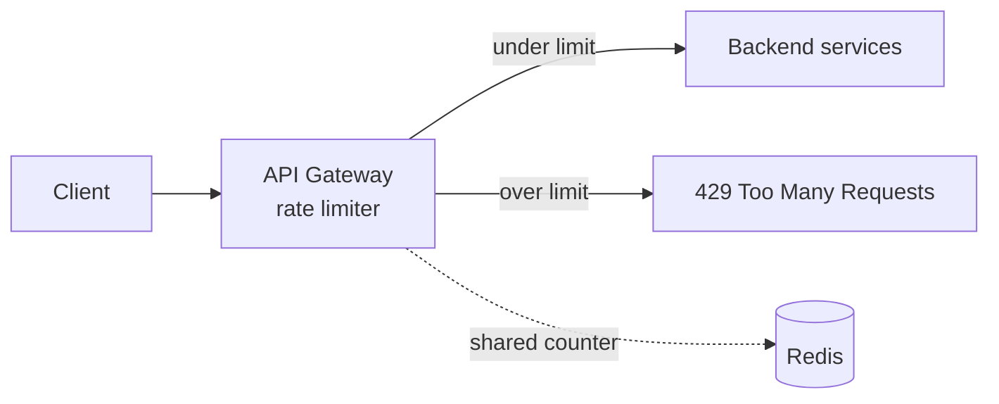

# Rate Limiting

> Without a limit, one misbehaving client — or one bug in a loop — can consume all your capacity and take everyone down. A rate limiter is the bouncer that keeps any single caller from monopolizing the system.

**Type:** Build
**Languages:** Python
**Prerequisites:** Phase 0 — Foundations
**Time:** ~50 minutes

## Learning Objectives

- Explain why rate limiting protects availability and fairness
- Implement the token-bucket algorithm and reason about bursts
- Implement a sliding-window counter and compare accuracy
- Choose limits and respond correctly (HTTP 429)
- Recognize where rate limiting belongs in the request path

## The Problem

A service has finite capacity. If nothing caps how fast clients can call it, a single caller can consume all of it — whether maliciously (a denial-of-service attack, credential-stuffing), accidentally (a buggy client retrying in a tight loop), or just greedily (one heavy customer drowning out everyone else). The result is the same: the service is overwhelmed, latency spikes, and *all* users suffer because of *one* caller. Capacity that should be shared fairly gets monopolized.

**Rate limiting** caps how many requests a client may make in a window of time. Exceed the limit and further requests are rejected (typically with HTTP 429 "Too Many Requests") until the window refreshes. This does three jobs at once: it **protects availability** (no single caller can exhaust the system), enforces **fairness** (each client gets a bounded share), and supports **cost control / monetization** (API tiers with different limits). It's a small component with outsized importance — it's the thing standing between your service and a self-inflicted or malicious overload.

The interesting part is *how* you count. "100 requests per minute" sounds simple, but naive implementations have edge cases: a fixed window lets a client send 100 requests at 11:59:59 and another 100 at 12:00:00 — 200 in two seconds, double the intended rate. Different algorithms (token bucket, sliding window, leaky bucket) make different tradeoffs between allowing bursts, accuracy at window edges, and memory cost. This lesson builds the two most important ones.

## The Concept

### Token bucket

Picture a bucket that holds up to **capacity** tokens and refills at a steady **rate** (e.g. 10 tokens/second, max 10). Each request consumes one token; if the bucket has a token, the request is allowed and a token is removed; if it's empty, the request is rejected.

```
  refill: +10 tokens/sec (up to capacity 10)
        |
        v
   [ ●●●●●●●●●● ]  bucket (capacity 10)
        |
   request takes one ● ; empty bucket -> reject (429)
```

The elegance: it naturally allows **bursts** up to the bucket size (a client that's been quiet has a full bucket and can fire 10 quickly), while enforcing the steady refill rate over time. This matches real traffic, which is bursty, and is why token bucket is the most widely used algorithm (it's what cloud APIs and many libraries use). Parameters: `capacity` (max burst) and `refill_rate` (sustained rate).

### Sliding-window counter

A **fixed window** counter ("max 100 per minute, reset at each minute boundary") is simple but has the edge problem: 100 at 11:59:59 + 100 at 12:00:00 = 200 in ~1 second. The **sliding window** fixes this by counting requests over the *trailing* N seconds from *now*, not a fixed clock boundary.

```
Fixed window (buggy at edges):
  |---minute 1: 100---|---minute 2: 100---|
                   ^^ 200 requests in 2 seconds straddling the boundary

Sliding window (counts the last 60s from NOW):
  now-60s |=================| now
          count requests in this moving window; always ≤ limit per any 60s
```

A precise sliding-window log keeps timestamps of recent requests and counts how many fall within the trailing window; it's accurate but uses memory proportional to the request count. (A common approximation blends the current and previous fixed-window counts to get most of the accuracy with O(1) memory.)

### Comparison

```
Algorithm           Allows bursts?  Accuracy        Memory      Notes
------------------  --------------  --------------  ----------  ------------------
Fixed window        yes (at edges)  poor at edges   O(1)        simple, edge bug
Token bucket        yes (to bucket) good            O(1)        burst-friendly, common
Sliding window log  no (smooth)     excellent       O(requests) precise, heavier
Leaky bucket        no (smooths)    good            O(1)        outputs at constant rate
```

### Responding correctly

When a request is limited, return **HTTP 429 Too Many Requests**, ideally with a `Retry-After` header telling the client when to try again. Good clients back off (Lesson 02); the limiter protects you from the rest. Limits are usually keyed per client — by API key, user ID, or IP — so one client's limit doesn't affect others.

### Where it lives

Rate limiting belongs early in the request path, typically at the **API gateway** (Phase 1) so abusive traffic is rejected before consuming any backend resources. At scale across many gateway instances, the counter must be *shared* (e.g. in Redis with atomic operations) so the limit is enforced globally, not per-instance — which is exactly the distributed rate limiter you'll design in Phase 8.



### A common misconception

"A fixed-window counter is good enough." It's the easiest to write and the buggiest — the boundary burst can let through up to 2× your intended rate at exactly the wrong moment (the start of a new window, when load is often highest). The token bucket or sliding window avoids this for little extra complexity. The second misconception is enforcing the limit *per server*: with N gateway instances each allowing 100/min, a client gets 100N/min total — the limit must use a shared counter to be global. Finally, rate limiting isn't a substitute for capacity planning (Lesson 05) — it protects you from abuse and bursts, but if your *legitimate* sustained load exceeds capacity, you need more servers, not a tighter limit.

## Build It

You'll implement token-bucket and sliding-window limiters and test them against a burst. Create `rate_limiter.py`.

### Step 1 — Token bucket

```python
# Run: python rate_limiter.py
import time

class TokenBucket:
    def __init__(self, capacity, refill_rate):
        self.capacity = capacity
        self.refill_rate = refill_rate      # tokens per second
        self.tokens = capacity
        self.last = time.monotonic()

    def allow(self):
        now = time.monotonic()
        # refill based on elapsed time
        self.tokens = min(self.capacity,
                          self.tokens + (now - self.last) * self.refill_rate)
        self.last = now
        if self.tokens >= 1:
            self.tokens -= 1
            return True
        return False
```

### Step 2 — Sliding-window log

```python
from collections import deque

class SlidingWindow:
    def __init__(self, limit, window_seconds):
        self.limit = limit
        self.window = window_seconds
        self.timestamps = deque()

    def allow(self):
        now = time.monotonic()
        # drop timestamps older than the window
        while self.timestamps and self.timestamps[0] <= now - self.window:
            self.timestamps.popleft()
        if len(self.timestamps) < self.limit:
            self.timestamps.append(now)
            return True
        return False
```

### Step 3 — Hammer the token bucket with a burst

```python
def test_token_bucket():
    tb = TokenBucket(capacity=5, refill_rate=2)   # burst 5, then 2/sec
    print("Token bucket (capacity=5, refill=2/sec):")
    allowed = sum(tb.allow() for _ in range(10))   # 10 instant requests
    print(f"  10 instant requests -> {allowed} allowed (burst of 5)")
    time.sleep(1.0)                                # 1 second passes -> +2 tokens
    allowed = sum(tb.allow() for _ in range(10))
    print(f"  after 1s, 10 more    -> {allowed} allowed (~2 refilled)")
```

### Step 4 — Show the sliding window enforcing a steady cap

```python
def test_sliding_window():
    sw = SlidingWindow(limit=5, window_seconds=1)
    print("\nSliding window (limit=5 per 1s):")
    allowed = sum(sw.allow() for _ in range(10))
    print(f"  10 instant requests -> {allowed} allowed")
    time.sleep(1.0)                                # window slides past them
    allowed = sum(sw.allow() for _ in range(10))
    print(f"  after 1s, 10 more    -> {allowed} allowed (window cleared)")
```

### Step 5 — Run both

```python
test_token_bucket()
test_sliding_window()
print("\nBoth cap sustained rate; token bucket permits an initial burst.")
```

### Step 6 — Run it

```bash
python rate_limiter.py
```

The token bucket lets an initial burst of 5 through then throttles to the refill rate; the sliding window enforces a flat 5 per second. Compare with `outputs/expected.md`.

## Exercises

1. **Run and read.** How many requests does each limiter allow in the first burst? After waiting 1 second? Explain the token bucket's burst behavior.

2. **Edge-case the fixed window.** Implement a fixed-window counter and show the 2× boundary burst (100 just before and just after a boundary). Then confirm the sliding window doesn't have it.

3. **Tune for an API tier.** Design token-bucket parameters for a "free" tier (10/min, small burst) and a "pro" tier (1000/min, larger burst). What do `capacity` and `refill_rate` become?

4. **Per-client keys.** Extend either limiter to track separate buckets per client ID so one client hitting its limit doesn't affect another.

5. **Distributed problem.** Explain why running this limiter on 4 gateway instances independently lets a client exceed the global limit, and what you'd change (preview of Phase 8).

## Key Terms

| Term | What people say | What it actually means |
|------|----------------|------------------------|
| Rate limiting | "Throttling" | Capping how many requests a client may make per time window |
| Token bucket | "Refilling allowance" | Tokens refill at a fixed rate up to a capacity; each request spends one; allows bursts |
| Sliding window | "Rolling count" | Counting requests over the trailing N seconds from now; smooth, no edge burst |
| Fixed window | "Per-minute reset" | Counting per fixed clock interval; simple but allows a 2× burst at boundaries |
| Leaky bucket | "Constant drain" | Smooths output to a constant rate regardless of input burstiness |
| 429 | "Too Many Requests" | The HTTP status returned when a client exceeds its limit |
| Retry-After | "Try again in N" | A header telling the client when it may retry |
| Burst | "Spike allowance" | A short surge above the steady rate, permitted up to the bucket size |
