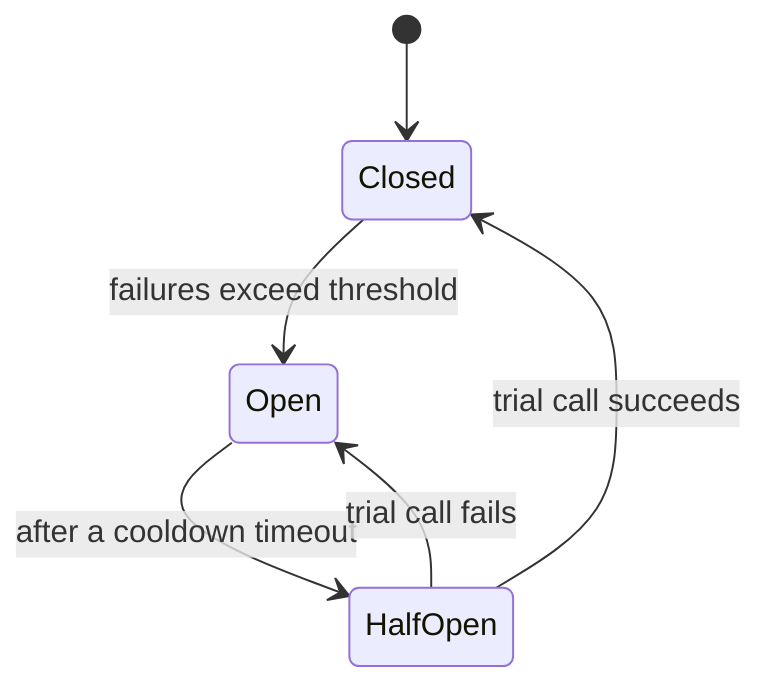

# Circuit Breakers & Retries

> When a dependency fails, retrying seems helpful — until thousands of clients retry at once and turn a small outage into a total collapse. Circuit breakers and smart retries are how you fail gracefully instead.

**Type:** Build
**Languages:** Python
**Prerequisites:** Phase 7, Lesson 01 — Rate Limiting
**Time:** ~50 minutes

## Learning Objectives

- Explain how naive retries amplify failures into a retry storm
- Implement exponential backoff with jitter
- Implement a circuit breaker with closed/open/half-open states
- Reason about failing fast versus retrying
- Combine breakers and retries for graceful degradation

## The Problem

Services depend on other services, and dependencies fail — a database gets slow, a downstream API times out, a network blips. The instinctive response is to **retry**: try the call again, maybe it works this time. For a transient glitch, that's reasonable. But naive retries are dangerous at scale because they *amplify* load exactly when the system can least handle it. Picture a downstream service struggling under load. Every caller's request times out. Every caller immediately retries. Now the struggling service gets *double* the traffic. More timeouts, more retries — a **retry storm** that turns a recoverable slowdown into a full outage. The retries become the attack.

Worse, retries waste resources on a dependency that's clearly down. If a service has failed its last 50 calls, the 51st will almost certainly fail too — but you still pay the timeout (often seconds) waiting for it, tying up a thread or connection. Pile up enough of these and the *caller* runs out of resources and fails too, cascading the outage upstream. A single failing dependency can take down everything that depends on it, and everything that depends on them.

The two tools that prevent this are **smart retries** (back off exponentially, add randomness, cap attempts) and the **circuit breaker** (stop calling a dependency that's clearly down, failing fast instead of waiting). Together they let a system *degrade gracefully* — absorbing a dependency failure without amplifying it or cascading — which is the heart of reliability engineering.

## The Concept

### Why naive retries cause storms

```
Dependency slows down
  -> caller A times out, retries immediately
  -> caller B times out, retries immediately
  -> ... thousands retry at the same instant
  -> dependency now gets 2x+ load -> slower -> more timeouts -> MORE retries
  -> collapse
```

Two things make this worse: retrying *immediately* (no pause to let the dependency recover) and retrying *in sync* (everyone times out and retries at the same moment, creating coordinated spikes). The fixes address both.

### Exponential backoff with jitter

**Exponential backoff**: wait longer between each retry — 1s, 2s, 4s, 8s — so a struggling dependency gets breathing room instead of an immediate second hit. **Jitter**: add randomness to each wait so retries *spread out* instead of synchronizing.

```
No backoff:        retry, retry, retry  (immediate hammering)
Exponential:       wait 1s, 2s, 4s, 8s  (gives time to recover)
+ Jitter:          wait 1s±, 2s±, 4s±   (de-synchronizes the herd)
```

Without jitter, all clients that failed at the same time also retry at the same backed-off time — you've just moved the synchronized spike later. Jitter is what actually breaks the thundering herd. The standard recipe: `wait = random_between(0, base * 2^attempt)`, capped at a maximum, with a hard limit on attempts.

### The circuit breaker

A circuit breaker wraps calls to a dependency and tracks failures. Like an electrical breaker, it "trips" to stop the flow when things go wrong. It has three states:



- **Closed** (normal): calls pass through. The breaker counts failures; if they exceed a threshold (e.g. 5 failures in a row), it trips to Open.
- **Open** (tripped): calls are rejected *immediately* without even trying the dependency — **failing fast**. No waiting on timeouts, no piling load on the dead dependency. After a cooldown period, it moves to Half-Open.
- **Half-Open** (testing): it lets *one* trial call through. If it succeeds, the dependency has recovered → back to Closed. If it fails → back to Open for another cooldown.

The crucial behavior is **failing fast** in the Open state. Instead of every caller waiting seconds for a timeout on a dead dependency (and exhausting their own resources), the breaker returns an error instantly, freeing the caller to do something sensible — return a cached value, a default, a degraded response — rather than hanging.

### Graceful degradation

Failing fast is only useful if you do something good with the fast failure. **Graceful degradation** means a dependency failure degrades the experience instead of breaking it: show stale cached data, hide a non-essential widget, return a sensible default, queue the work for later. A recommendations service is down? Show generic popular items instead of a broken page. The circuit breaker gives you the fast signal; degradation logic decides the fallback.

### A common misconception

"Always retry on failure." Retries are only safe for *transient* failures and *idempotent* operations (Phase 6) — retrying a non-idempotent payment can double-charge, and retrying a deterministic failure (bad input, a real bug) just wastes resources. And retries without backoff+jitter+a cap actively cause the storms they're meant to survive. The second misconception is that a circuit breaker "fixes" the dependency — it doesn't; it protects the *caller* from a broken dependency by failing fast, buying time for the dependency to recover and preventing the failure from cascading. The goal isn't to make the failed call succeed; it's to stop one failure from becoming many.

## Build It

You'll build exponential backoff with jitter and a circuit breaker, then show the breaker failing fast. Create `resilience.py`.

### Step 1 — A flaky dependency

```python
# Run: python resilience.py
import random, time
random.seed(1)

class FlakyService:
    def __init__(self, fail_until):
        self.calls = 0
        self.fail_until = fail_until      # fails for the first N calls
    def call(self):
        self.calls += 1
        if self.calls <= self.fail_until:
            raise ConnectionError("dependency down")
        return "ok"
```

### Step 2 — Exponential backoff with jitter

```python
def retry_with_backoff(fn, max_attempts=5, base=0.01, cap=0.5):
    for attempt in range(max_attempts):
        try:
            return fn(), attempt + 1
        except Exception:
            if attempt == max_attempts - 1:
                raise
            # exponential backoff with full jitter
            delay = min(cap, random.uniform(0, base * (2 ** attempt)))
            time.sleep(delay)
    raise RuntimeError("unreachable")
```

### Step 3 — A circuit breaker

```python
class CircuitBreaker:
    def __init__(self, threshold=3, cooldown=0.2):
        self.threshold = threshold
        self.cooldown = cooldown
        self.failures = 0
        self.state = "closed"
        self.opened_at = 0
        self.rejected = 0

    def call(self, fn):
        if self.state == "open":
            if time.monotonic() - self.opened_at >= self.cooldown:
                self.state = "half-open"        # time to test
            else:
                self.rejected += 1
                raise RuntimeError("circuit OPEN - failing fast")
        try:
            result = fn()
        except Exception:
            self.failures += 1
            if self.failures >= self.threshold:
                self.state = "open"
                self.opened_at = time.monotonic()
            raise
        # success
        self.failures = 0
        self.state = "closed"
        return result
```

### Step 4 — Show backoff recovering from a transient failure

```python
svc = FlakyService(fail_until=2)              # fails twice, then works
result, attempts = retry_with_backoff(svc.call)
print(f"Retry with backoff: '{result}' after {attempts} attempts "
      f"(failed {svc.fail_until}x, then recovered)")
```

### Step 5 — Show the breaker tripping and failing fast

```python
print("\nCircuit breaker (threshold=3):")
dead = FlakyService(fail_until=999)           # permanently down
cb = CircuitBreaker(threshold=3, cooldown=10)
outcomes = []
for i in range(8):
    try:
        cb.call(dead.call)
        outcomes.append("ok")
    except RuntimeError:
        outcomes.append("FAST-FAIL")          # rejected without calling dependency
    except ConnectionError:
        outcomes.append("fail")               # actually tried and failed
print(f"  outcomes: {outcomes}")
print(f"  dependency was actually called {dead.calls} times out of 8 requests")
print(f"  ({cb.rejected} requests fast-failed without touching the dead dependency)")
```

### Step 6 — Run it

```bash
python resilience.py
```

Backoff recovers from a transient failure; the breaker trips after 3 real failures and fast-fails the rest, so the dead dependency is called far fewer than 8 times. Compare with `outputs/expected.md`.

## Exercises

1. **Run and read.** After how many failures does the breaker trip? How many of the 8 requests actually reached the dead dependency vs fast-failed? Why does fast-failing protect the caller?

2. **Remove jitter.** Change the backoff to a fixed `base * 2**attempt` with no randomness. Explain why, with many clients, this re-creates a synchronized retry spike.

3. **Half-open recovery.** Set the cooldown small and make the dependency recover after a while. Show the breaker going open → half-open → closed when the trial call succeeds.

4. **Non-idempotent danger.** Give an operation where blind retries cause a serious bug, and explain how you'd make retrying safe (recall Phase 6).

5. **Add degradation.** When the breaker is open, instead of raising, return a cached/default value. Show the caller getting a degraded-but-working response.

## Key Terms

| Term | What people say | What it actually means |
|------|----------------|------------------------|
| Retry storm | "Retry amplification" | Synchronized retries multiplying load on a struggling dependency into a collapse |
| Exponential backoff | "Wait longer each time" | Increasing the delay between retries (1s, 2s, 4s) to give a dependency time to recover |
| Jitter | "Randomized delay" | Random variation in backoff to de-synchronize retries across clients |
| Circuit breaker | "Trip switch" | A wrapper that stops calling a failing dependency, failing fast instead |
| Closed / Open / Half-open | "Breaker states" | Normal / tripped (fast-fail) / testing-for-recovery |
| Fail fast | "Quick error" | Returning an error immediately instead of waiting on a doomed call |
| Graceful degradation | "Degrade, don't break" | Serving a reduced experience (stale/default) when a dependency is down |
| Cascading failure | "Domino outage" | One failure exhausting callers and propagating the outage upstream |
