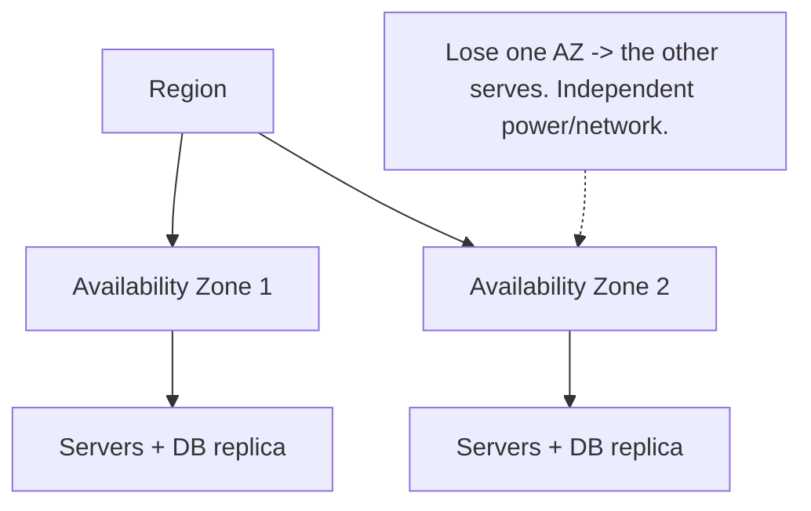

# Fault Tolerance & Redundancy

> Every component fails eventually. Fault tolerance is the design choice that one failure shouldn't become an outage — and the math of redundancy shows exactly how much it buys you.

**Type:** Learn
**Languages:** Markdown
**Prerequisites:** Phase 7, Lesson 02 — Circuit Breakers & Retries
**Time:** ~35 minutes

## Learning Objectives

- Explain why every component must be assumed to fail
- Eliminate single points of failure with redundancy and failover
- Compute system availability from component availabilities
- Distinguish active-active from active-passive redundancy
- Reason about failure domains and multi-AZ/region deployment

## The Problem

At small scale you can pretend hardware is reliable. At large scale you can't: with thousands of servers, disks, switches, and power supplies, *something is always failing*. A server crashes, a disk dies, a rack loses power, a network link drops, an entire data center goes dark in a storm. These aren't rare edge cases to handle "later" — at scale they're a constant, daily reality. A system designed assuming components don't fail will, with certainty, have outages.

**Fault tolerance** is the design principle that the system keeps working despite component failures — that no single failure causes a user-visible outage. The core technique is **redundancy**: run more than one of everything that matters, so when one instance fails, another takes over. We've already applied this piecemeal — multiple app servers behind a load balancer (Phase 1), database replicas (Phase 4), a redundant load balancer (Phase 1). This lesson makes the principle systematic and quantitative: how to find single points of failure, how much availability redundancy actually buys, and how to spread redundancy across independent **failure domains** so one event can't take out all your copies.

The quantitative part matters because redundancy has a counterintuitive property: components in series *multiply* their failure rates (the chain is weaker than any link), while redundant components in parallel *multiply* their tiny failure probabilities into an even tinier combined one (the cluster is far stronger than any node). Understanding this math tells you where to spend your reliability budget.

## The Concept

### Assume everything fails

The mindset shift: design for failure as the normal case, not the exception. Netflix famously runs "Chaos Monkey," which randomly kills production servers to *prove* the system tolerates it. Every component — server, disk, network, data center — has a failure rate, and your job is to ensure each one's failure is absorbed, not propagated.

### Single points of failure

A **single point of failure (SPOF)** is any component whose failure alone takes down the system. Finding and eliminating SPOFs is the first task of fault-tolerant design:

```
SPOF                      Redundancy that removes it
------------------------  ----------------------------------------
one app server            multiple servers behind a load balancer
one load balancer         redundant LB pair (active/passive)
one database              replicas with failover (Phase 4)
one data center           multi-AZ / multi-region deployment
one network path          multiple network links
```

The trap: you can fix every obvious SPOF and still have a hidden one — the single load balancer in front of your redundant servers, the single database behind your redundant app tier. Trace every request path and ask "what one thing, if it died, kills this?"

### The availability math

Availability composes differently for series vs parallel components.

**In series (a dependency chain)** — the request needs *all* components up — availabilities **multiply**, so the whole is *less* available than any part:

```
App (99.9%) → Database (99.9%) → Cache (99.9%)
Combined = 0.999 × 0.999 × 0.999 ≈ 0.997 = 99.7%
(three reliable parts in series -> a less reliable whole)
```

This is why long dependency chains are fragile: each added dependency drags availability down.

**In parallel (redundant copies)** — you need *only one* of N to be up — the *failure* probabilities multiply, so the whole is *far more* available than any part:

```
Two servers, each 99% available (1% failure):
Both down = 0.01 × 0.01 = 0.0001 = 0.01% -> available 99.99%
Three servers: 0.01^3 = 0.000001 -> 99.9999%
(redundancy turns two "two nines" into "four nines")
```

This is the whole case for redundancy in one calculation: putting two cheap, independently-failing components in parallel can give you more availability than one expensive component. *Independence* is the key assumption — which is what failure domains protect.

### Active-active vs active-passive

Two ways to run redundant components:

- **Active-passive (failover)**: one instance serves; a standby waits idle and takes over if the primary fails. Simpler; the standby is "wasted" capacity until needed; there's a brief failover gap. Common for databases (a replica promoted on failure).
- **Active-active**: all instances serve traffic simultaneously (behind a load balancer). No wasted capacity, no failover gap (survivors just absorb the load), but requires the instances to be stateless or coordinated. Common for app servers.

### Failure domains and blast radius

Redundancy only helps if the copies fail *independently*. Two servers in the same rack share a power supply and a switch — one rack failure takes both. So you spread redundancy across **failure domains**: separate racks, separate **Availability Zones** (isolated data centers within a region), separate **regions** (different geographies). The larger the domain you tolerate losing, the bigger the disaster you survive — at higher cost and complexity.



The **blast radius** of a failure is how much it takes down. Good design keeps blast radius small: a bad deploy hits one zone, not all; a corrupt shard affects one partition, not the whole dataset.

### A common misconception

"We have backups, so we're fault-tolerant." Backups protect against *data loss*, not *downtime* — restoring from backup can take hours, during which you're down. Fault tolerance requires *live* redundancy that takes over in seconds, which is different from (and complementary to) backups. The second misconception is that redundancy works regardless of placement — two replicas in the same failure domain (same rack/AZ) give little protection, because the common cause (power, network, a bad deploy) takes both. Independence is everything; the availability math assumes failures are uncorrelated, and correlated failures (shared dependencies, simultaneous bad deploys) are how "redundant" systems still go down.

## Exercises

1. **Find the SPOF.** Given: 3 app servers, 1 load balancer, 2 database replicas. Identify the remaining single point of failure and how to fix it.

2. **Series math.** A request flows through 5 services, each 99.9% available, in series. What's the end-to-end availability? What does this say about microservice chains?

3. **Parallel math.** You have a component at 95% availability. How many parallel redundant copies do you need to reach 99.99% (assuming independent failures)?

4. **Active-active vs passive.** For each, choose and justify: (a) stateless web servers, (b) a primary SQL database, (c) a global DNS service.

5. **Blast radius.** A company deploys a bad config to all regions simultaneously and goes fully down despite multi-region redundancy. What principle was violated, and how would staged rollout help?

## Key Terms

| Term | What people say | What it actually means |
|------|----------------|------------------------|
| Fault tolerance | "Survives failures" | Designing so component failures don't cause user-visible outages |
| Redundancy | "Run more than one" | Multiple instances so a survivor takes over when one fails |
| Single point of failure | "One thing kills it" | A component whose sole failure takes down the system |
| Failover | "Switch to backup" | Promoting a standby when the primary fails |
| Active-active | "All serving" | All redundant instances handle traffic simultaneously |
| Active-passive | "Standby waits" | One instance serves; a standby takes over on failure |
| Availability Zone | "Isolated datacenter" | An independent failure domain within a region (separate power/network) |
| Blast radius | "How much it takes down" | The scope of impact of a single failure; kept small by good design |
