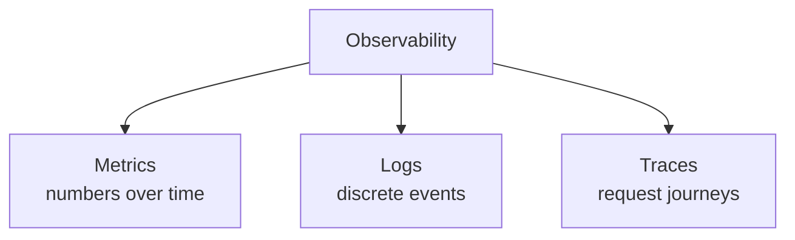

# Monitoring & Observability

> You can't fix what you can't see. In a distributed system spread across hundreds of machines, the difference between a five-minute incident and a five-hour one is whether you instrumented it before it broke.

**Type:** Learn
**Languages:** Markdown
**Prerequisites:** Phase 7, Lesson 03 — Fault Tolerance & Redundancy
**Time:** ~35 minutes

## Learning Objectives

- Distinguish monitoring from observability
- Describe the three pillars: metrics, logs, and traces
- Explain why distributed tracing is essential for microservices
- Design alerts that catch problems without causing fatigue
- Choose what to measure (the golden signals)

## The Problem

A single-process app is easy to debug: attach a debugger, read the stack trace, find the bug. A system of dozens of services across hundreds of machines is not. A user reports "checkout is slow." Which of the twelve services in the request path is slow? Is it one machine or all of them? Did it start after the last deploy? Is the database the cause or a symptom? Without instrumentation, you're guessing — SSHing into random boxes, grepping logs by hand, while the outage drags on. The system is a black box, and black boxes are debugged slowly and painfully.

**Observability** is the property of being able to understand a system's internal state from its external outputs — to ask arbitrary questions about what's happening *without* shipping new code to investigate. It's built from three kinds of telemetry — metrics, logs, and traces — that you emit continuously so that when something breaks, you already have the data to diagnose it. The investment is made *before* the incident; you can't add observability mid-outage. This is why instrumenting a system is part of designing it, not an afterthought.

There's a subtle but important distinction. **Monitoring** is watching *known* failure modes — "alert me if CPU > 90% or error rate > 1%." **Observability** is the broader ability to investigate *unknown* problems — the novel failure you didn't predict. Monitoring answers "is the thing I worried about happening?"; observability answers "why is this weird thing I never imagined happening?" You need both, and good observability is what lets you handle the failures you didn't foresee — which, in complex systems, are most of them.

## The Concept

### The three pillars



**Metrics** — numeric measurements aggregated over time: request rate, error rate, latency percentiles, CPU, queue depth, cache hit ratio. They're cheap to store (just numbers), great for dashboards and alerts, and answer "how much / how many / how fast." They tell you *that* something is wrong (error rate spiked) but rarely *why*.

**Logs** — timestamped records of discrete events: "user 42 logged in," "payment failed: card declined," a stack trace. Rich detail for a specific event, essential for understanding *what happened* in a particular case. The challenge at scale is volume (terabytes/day) and finding the relevant lines — solved with centralized, searchable log aggregation and **structured logging** (logs as queryable key-value/JSON, not freeform text).

**Traces** — the end-to-end journey of a *single request* as it hops across services, showing how long it spent in each. This is the pillar that makes microservices debuggable: a trace shows that the slow checkout spent 2ms in the gateway, 5ms in the order service, and 1800ms waiting on the inventory service — instantly pinpointing the culprit.

### Distributed tracing

In a microservices system, one user request fans out into many service calls. **Distributed tracing** stitches these into one view by propagating a **trace ID** through every call:

```
Request (trace_id=abc) enters gateway
  ├─ span: gateway          [2ms]
  ├─ span: order-service    [5ms]
  │    └─ span: db query    [3ms]
  └─ span: inventory-service [1800ms]  <-- the bottleneck, instantly visible
       └─ span: external API [1790ms]
```

Each service records a **span** (its slice of the work) tagged with the shared trace ID; a tracing system (Jaeger, Zipkin, OpenTelemetry) assembles them into a timeline. Without tracing, finding which of a dozen services caused the latency means correlating timestamps across separate logs by hand — slow and error-prone. With it, the waterfall view shows the answer at a glance. This is why tracing is non-negotiable for distributed systems.

### The golden signals

You can measure infinitely many things; the high-value defaults (Google SRE's "four golden signals") for any service are:

```
Signal       What it tells you                     Example metric
-----------  -----------------------------------   ------------------
Latency      how fast (watch percentiles!)         p50, p99 response time
Traffic      how much demand                       requests/sec (QPS)
Errors       how often it fails                    5xx rate, error %
Saturation   how full / close to a limit          CPU, memory, queue depth
```

Measuring latency, watch *percentiles* (p99), not averages — an average hides the slow tail that affects real users (Phase 0). These four signals catch the vast majority of problems and are the right starting point for any service's dashboard.

### Alerting without fatigue

Telemetry is only useful if someone acts on problems. **Alerts** notify humans when something needs attention — but bad alerting is worse than none. Too many alerts (especially noisy, non-actionable ones) cause **alert fatigue**: engineers start ignoring alerts, and the real one gets missed in the noise. Good alerting principles:

- **Alert on symptoms, not causes**: page on "users are seeing errors" (the SLO breach), not on every CPU blip that might be harmless.
- **Make every alert actionable**: if there's nothing to do, it shouldn't page.
- **Tie alerts to user impact** (Lesson 05's SLOs/error budgets): page when the error budget is burning, not on arbitrary thresholds.

### A common misconception

"We have logs, so we're observable." Logs alone aren't enough — without metrics you can't see trends or alert efficiently, and without traces you can't follow a request across services. The three pillars are complementary: metrics tell you *something's wrong*, traces tell you *where*, logs tell you *what exactly*. The second misconception is that you can bolt on observability during an incident — you can't; the telemetry has to already be flowing, which is why instrumentation is a design-time decision. Finally, more alerts ≠ more safety: an avalanche of noisy alerts trains people to ignore them, so disciplined, symptom-based, actionable alerting is part of the design, not an afterthought.

## Exercises

1. **Match the pillar.** For each question, which pillar answers it best: (a) "is error rate climbing over the last hour?", (b) "exactly what error did user 42's request hit?", (c) "which service made checkout slow?"

2. **Define the golden signals.** For a payment API, write a concrete metric for each of latency, traffic, errors, and saturation.

3. **Percentiles vs average.** Average latency is 50ms but p99 is 4s. Explain what's happening and why the average is misleading.

4. **Fix the alert.** "Alert when any server's CPU > 80%." Critique it (false pages?) and rewrite it as a symptom-based, actionable alert.

5. **Trace it.** A request touches 6 services and takes 2.3s. Describe how a trace ID and spans let you find the slow one without reading six separate logs.

## Key Terms

| Term | What people say | What it actually means |
|------|----------------|------------------------|
| Monitoring | "Watching known issues" | Tracking predefined metrics/conditions and alerting on known failure modes |
| Observability | "Understanding the system" | Being able to investigate arbitrary/unknown problems from emitted telemetry |
| Metrics | "Numbers over time" | Aggregated numeric measurements (rate, latency, errors); cheap, good for alerts |
| Logs | "Event records" | Timestamped records of discrete events; rich detail for a specific case |
| Trace | "Request journey" | The end-to-end path of one request across services, with timing per hop |
| Span | "One trace segment" | One service's slice of work within a trace, sharing the trace ID |
| Golden signals | "What to measure" | Latency, traffic, errors, saturation — the high-value defaults |
| Alert fatigue | "Too many alerts" | Desensitization from noisy alerts, causing real ones to be missed |
