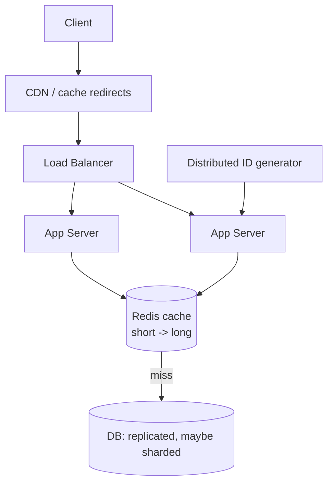

# Design a URL Shortener

> The classic warm-up design problem. It looks trivial — map a long URL to a short one — but doing it at billions of links and a read-heavy 100:1 ratio touches every idea in this course.

**Type:** Capstone
**Languages:** Python
**Prerequisites:** Phases 0–7
**Time:** ~70 minutes

## Learning Objectives

- Apply the six-step design framework end to end
- Design a short-key generation scheme (base62) and reason about its space
- Architect a read-heavy system with caching and replication
- Build a working URL shortener prototype with base62 encoding
- Identify and resolve the system's real bottleneck

## The Problem

A URL shortener takes a long URL (`https://example.com/very/long/path?with=params`) and returns a short one (`https://sho.rt/aB3xK`) that redirects to the original. TinyURL, Bitly, and the link-shorteners inside every social platform do this. It's the canonical first system-design problem because it's small enough to design completely in one sitting yet exercises the whole stack: estimation, key generation, a data model, caching, replication, and a clear bottleneck. We'll run the Phase 0 framework on it and build a working core.

## The Concept — applying the framework

### Step 1 — Requirements

**Functional:** shorten a long URL to a unique short code; redirect a short code to the original; (optional) custom aliases; (optional) click analytics; (optional) expiration.
**Out of scope (deliberately):** user accounts, editing links, ad/spam detection.
**Non-functional:** very **read-heavy** (links created once, followed many times); redirects must be **fast** (p99 < 50ms — a redirect should feel instant); **highly available** (a dead shortener breaks every link); links effectively permanent.

### Step 2 — Estimation

```
Assume 100M new URLs/month -> ~40 writes/sec average, ~120/sec peak (Phase 0)
Read:write ratio ~100:1     -> ~4,000 reads/sec average, much higher at peak
Storage: 100M/mo x 12 mo x ~500 bytes/record ≈ 600 GB/year
5-year keyspace: ~6 billion links
```

The headline: this is a **read-heavy, modest-write** system with a growing but bounded keyspace. Reads dominate by 100×, which (Phase 3) screams *cache*.

### Step 3 — API design

```
POST /shorten      body: {"url": "https://..."}   -> {"short": "aB3xK"}
GET  /{short}                                      -> 301 redirect to original
GET  /{short}/stats   (optional)                   -> {"clicks": 42}
```

A redirect returns HTTP **301** (permanent) or **302** (temporary). 301 is cacheable by browsers/CDNs (fewer hits to you) but means you can't easily count clicks or change the target; 302 routes every click through you (enables analytics) at higher load. A common choice: **302** if you need analytics, **301** if raw speed/offload matters.

### Step 4 — Data model

One tiny table — a key-value mapping, the simplest possible store:

```
short_code (PK) | long_url                    | created    | clicks
aB3xK           | https://example.com/...      | 2026-01-01 | 42
```

Access is purely *by primary key* (`short_code`), with no joins or range queries — so a **key-value store** or a simple indexed relational table both fit (Phase 2). The PK lookup is what must be blisteringly fast.

### Step 5 — Key generation: the heart of the design

How do you produce a short, unique code? The standard approach is **base62 encoding** of a unique integer ID. Base62 uses `[0-9a-zA-Z]` = 62 characters; with 7 characters you get 62⁷ ≈ **3.5 trillion** combinations — plenty.

```
Counter/ID -> base62 -> short code
125         -> "21"      (125 = 2*62 + 1)
999999      -> "4c91"
unique ID guarantees a unique short code, no collision check needed
```

Two ways to get the unique ID:
- **Counter-based**: an auto-incrementing ID (or a distributed ID generator like Snowflake to avoid a single counter bottleneck across shards — Phase 4). Sequential, no collisions, but the codes are guessable/enumerable.
- **Random / hash-based**: hash the URL or generate random codes; must check for collisions (rare with a big space) and retry. Codes are unguessable.

Base62-of-a-counter is the clean default: guaranteed-unique, no collision checks. You'll build exactly this.

### Step 6 — High-level design and the bottleneck



**The bottleneck is reads** — 4,000+ redirects/sec, 100× the writes. The deep dive is therefore caching (Phase 3): a Redis cache of `short_code → long_url` serves the overwhelming majority of redirects in ~1ms, so the database (read-replicated, Phase 4) sees only cache misses. Hot links live in cache near-permanently; a CDN can even cache 301 redirects at the edge so many never reach you. Writes are easy by comparison: a single ID generator + write to the DB. As storage grows past one machine, **shard by short_code** (Phase 4) and use a distributed ID generator so the write path scales too.

```
Read path:  GET /aB3xK -> CDN? -> Redis? -> DB replica -> redirect   (cache absorbs ~99%)
Write path: POST /shorten -> next unique ID -> base62 -> store -> return code
```

### A common misconception

People over-focus on key generation (it's the fun part) and under-design the read path — but the *bottleneck is reads*, so caching and replication are where the system lives or dies. Another trap: checking for collisions with random codes when a counter+base62 needs no collision check at all (uniqueness is guaranteed by the unique ID). And don't put the long URL blob logic in an exotic store — the access pattern is dead-simple key lookup, so the sophistication belongs in the cache/replication layer, not the data model.

## Build It

You'll build the core: base62 encoding and an in-memory shortener with a cache, then verify the round-trip. Create `url_shortener.py`.

### Step 1 — Base62 encoding

```python
# Run: python url_shortener.py
ALPHABET = "0123456789abcdefghijklmnopqrstuvwxyzABCDEFGHIJKLMNOPQRSTUVWXYZ"
BASE = len(ALPHABET)   # 62

def encode(num):
    if num == 0:
        return ALPHABET[0]
    s = []
    while num > 0:
        num, rem = divmod(num, BASE)
        s.append(ALPHABET[rem])
    return "".join(reversed(s))

def decode(code):
    num = 0
    for ch in code:
        num = num * BASE + ALPHABET.index(ch)
    return num
```

### Step 2 — The shortener service (with cache + "DB")

```python
class URLShortener:
    def __init__(self):
        self.db = {}                 # short_code -> long_url  (the "database")
        self.cache = {}              # short_code -> long_url  (the "Redis cache")
        self.counter = 1000          # unique ID source (Snowflake in production)
        self.db_hits = 0
        self.cache_hits = 0

    def shorten(self, long_url):
        code = encode(self.counter)  # base62 of a guaranteed-unique ID
        self.counter += 1
        self.db[code] = long_url
        return code

    def resolve(self, code):
        if code in self.cache:       # read path: cache first (Phase 3)
            self.cache_hits += 1
            return self.cache[code]
        url = self.db.get(code)      # cache miss -> DB replica
        if url:
            self.db_hits += 1
            self.cache[code] = url   # populate cache (cache-aside)
        return url
```

### Step 3 — Demonstrate base62 and the round-trip

```python
print("Base62 encoding of IDs:")
for n in (0, 61, 62, 125, 999999, 3_521_614_606_207):  # last = 62^7 - 1
    print(f"  {n:>15} -> '{encode(n)}'  (decode -> {decode(encode(n))})")
```

### Step 4 — Shorten and resolve, showing the cache at work

```python
s = URLShortener()
codes = {}
for url in ["https://example.com/a", "https://example.com/b", "https://python.org"]:
    code = s.shorten(url)
    codes[code] = url
    print(f"\nshorten {url} -> sho.rt/{code}")

print("\nResolving (first time = DB miss, then cached):")
for code in codes:
    print(f"  {code} -> {s.resolve(code)}   [1st: DB]")
for code in codes:                       # second round: all cache hits
    s.resolve(code)
```

### Step 5 — Show the read-heavy cache payoff

```python
# Simulate read-heavy traffic: each link resolved many times
for _ in range(100):
    for code in codes:
        s.resolve(code)

total = s.db_hits + s.cache_hits
print(f"\nAfter read-heavy traffic:")
print(f"  DB hits:    {s.db_hits}")
print(f"  cache hits: {s.cache_hits}")
print(f"  cache hit ratio: {100*s.cache_hits/total:.1f}%  <- DB shielded from reads")
```

### Step 6 — Run it

```bash
python url_shortener.py
```

Base62 round-trips correctly, and under read-heavy traffic the cache serves the overwhelming majority of redirects — exactly the design conclusion. Compare with `outputs/expected.md`.

## Exercises

1. **Run and read.** What's the cache hit ratio under read-heavy traffic? Tie this back to why caching is the deep-dive for this system.

2. **Keyspace math.** How many unique links fit in 6-character base62 codes? In 7? When would you need to add a character?

3. **301 vs 302.** Implement a flag choosing 301 (cacheable, no per-click count) vs 302 (counts clicks). Explain the load/analytics tradeoff for each.

4. **Custom alias.** Add `shorten(url, alias="mylink")` that uses a chosen code, checking it's not taken. Why does this reintroduce a collision check that the counter approach avoided?

5. **Shard it.** Sketch how you'd shard by `short_code` and why a single auto-increment counter becomes a bottleneck — name the Phase 4 tool that fixes it.

## Key Terms

| Term | What people say | What it actually means |
|------|----------------|------------------------|
| Base62 | "Short code encoding" | Encoding a number in [0-9a-zA-Z]; 7 chars ≈ 3.5 trillion codes |
| Short code | "The tiny key" | The unique identifier in the short URL, mapping to the long URL |
| Read-heavy | "Mostly reads" | Reads vastly outnumber writes (here ~100:1); drives the caching design |
| 301 vs 302 | "Permanent vs temporary redirect" | 301 is cacheable (offloads you, no click count); 302 routes each click through you |
| Distributed ID generator | "Snowflake" | Generates unique IDs across shards without a single-counter bottleneck |
| Cache-aside | "Lazy cache" | Check cache, load from DB on miss, populate; the read path here |
| Collision | "Duplicate code" | Two URLs mapping to the same code; impossible with counter+base62, possible with random |
