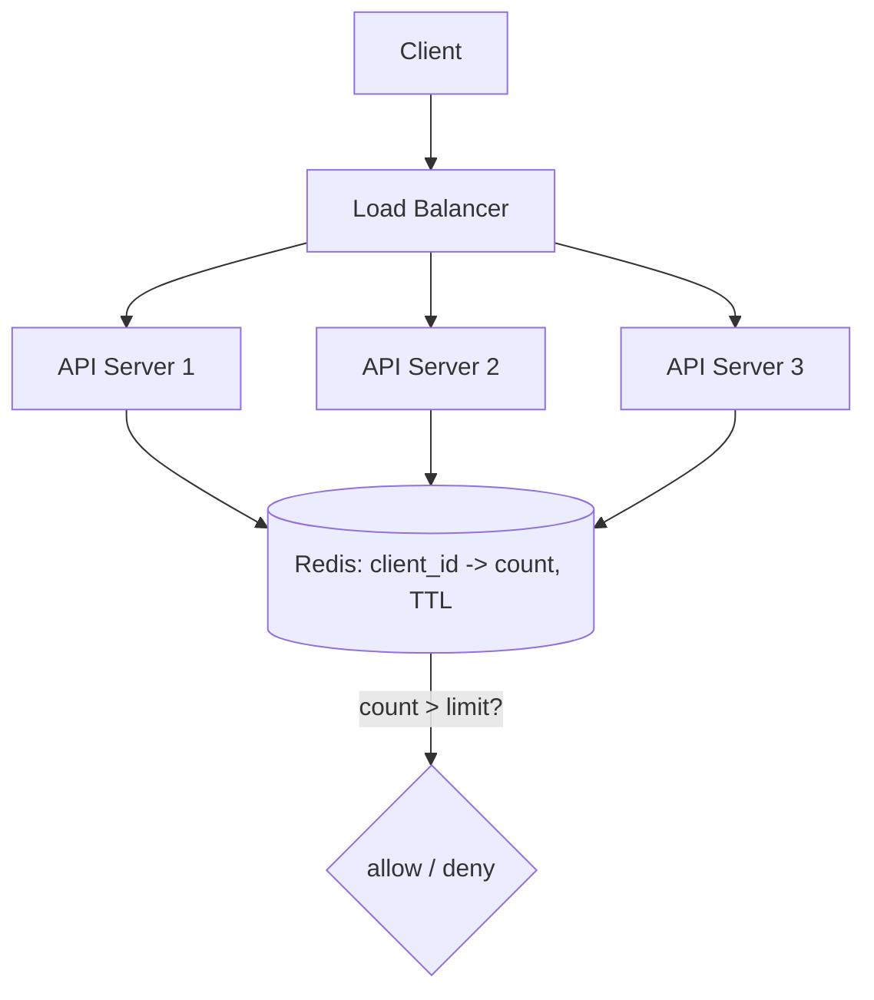

# Design a Rate Limiter Service

> A single-server rate limiter is easy (Phase 7). The real problem is enforcing one *global* limit across a fleet of servers — where the naive answer lets clients cheat by N×.

**Type:** Capstone
**Languages:** Python
**Prerequisites:** Phases 0–7 (esp. Phase 7 Lesson 01, Phase 3)
**Time:** ~70 minutes

## Learning Objectives

- Apply the design framework to a distributed rate limiter
- Explain why per-instance limiting fails to enforce a global limit
- Use a shared store with atomic operations for correct counting
- Reason about the consistency/latency tradeoff of a central counter
- Build a distributed sliding-window rate limiter prototype

## The Problem

You built a rate limiter in Phase 7 — token bucket and sliding window — and it works perfectly on one machine. But production runs your API behind a load balancer across many servers (Phase 4), and the load balancer spreads each client's requests across all of them. If each server keeps its *own* counter, a client limited to 100/min gets 100/min *per server* — with 10 servers, 1,000/min. The limit is silently 10× too loose, exactly defeating its purpose. Designing a rate limiter as a *distributed service* — one global limit honored no matter which server handles a request — is the real problem, and it's a sharp lesson in shared state.

## The Concept — applying the framework

### Step 1 — Requirements

**Functional:** allow or reject a request based on a per-client limit (e.g. 100 requests / 60s); return 429 with `Retry-After` when over (Phase 7); limits configurable per client/tier.
**Out of scope:** billing, the API logic itself.
**Non-functional:** the limit must be **global** (enforced across all servers, not per-instance); the check must be **fast** (it's on every request — adding 50ms to every call is unacceptable); **highly available** (if the limiter is down, decide: fail-open = allow, or fail-closed = block); **accurate enough** (occasional tiny over-count under race is usually tolerable; a 10× leak is not).

### Step 2 — Estimation

```
Say 10,000 API servers... no — say a fleet of ~50 servers, 50,000 req/sec peak.
The limiter is consulted on EVERY request -> 50,000 limiter ops/sec.
Per-client state: a counter/timestamp set, tiny (bytes) x millions of clients.
```

The key number: the limiter is on the **hot path of every request**, so its latency and throughput are critical — it must add well under a millisecond and handle the full request rate.

### Step 3 — API design

```
check(client_id) -> ALLOW | DENY(retry_after)
```

Conceptually one call. In practice it's a function the API gateway (Phase 1) calls before forwarding, or a sidecar/library that talks to a shared store.

### Step 4 — Data model

Per client, you store just enough to count requests in the window:

```
Fixed/sliding counter:   client_id -> count (with a TTL = window)
Sliding-window log:      client_id -> sorted set of request timestamps
Token bucket:            client_id -> {tokens, last_refill}
```

All tiny, all keyed by `client_id` — a perfect fit for **Redis** (Phase 3): in-memory (fast), TTL built in, and — crucially — **atomic operations**.

### Step 5 — The core problem: shared, atomic counting

The naive distributed design — each server keeps a local counter — fails as shown above. The fix is a **shared counter in Redis** that every server reads and updates, so there's *one* count per client regardless of which server handles the request.



But a shared counter introduces a **race condition** (the Phase 2 lost-update problem at scale): two servers both read count=99, both think "under 100," both allow, both write 100 — the client got 101 through. The fix is **atomicity**: the read-check-increment must be a single atomic operation. Redis provides this via `INCR` (atomic increment) or a **Lua script** that runs the whole check-and-update atomically on the server. With atomic ops, concurrent requests are correctly serialized and the global count is exact.

```
Naive (race):   read 99 -> "ok" -> write 100   (two of these interleave -> overshoot)
Atomic (Redis): INCR returns the new value atomically -> compare to limit -> no race
```

### Step 6 — Bottleneck and tradeoffs

The bottleneck is the **shared store on the hot path**. Every request now does a network round trip to Redis (~0.5ms, Phase 3) — acceptable, but it makes Redis critical infrastructure:

- **Availability**: if Redis dies, what do you do? **Fail-open** (allow all — protects user experience, risks overload) or **fail-closed** (deny all — protects the backend, harms users). Most choose fail-open for rate limiting (it's a protection, not a gate), often with a local fallback limiter.
- **Latency**: the extra round trip is the cost of correctness. To reduce it, some designs do *approximate* local limiting (each server allows up to `limit/N`) syncing periodically — trading exactness for speed.
- **Scale**: Redis itself is sharded (Phase 4) by `client_id` so the limiter store scales with the fleet.

The central tradeoff mirrors CAP (Phase 5): a single shared counter is **consistent but adds latency and a dependency**; local counters are **fast and available but inaccurate**. The right point depends on how strict the limit must be.

### A common misconception

The headline mistake is **per-instance counting** — it feels fine until you realize a client gets `limit × num_servers`. The fix is shared state, and the *non-obvious* part is that shared state alone isn't enough: without **atomic** read-modify-write, concurrent requests race and overshoot the limit (the lost-update bug from Phase 2, now distributed). Atomicity — `INCR` or a Lua script — is the real key. The second misconception is treating the limiter as needing perfect consistency: a rare off-by-one under extreme concurrency is usually fine; a 10× leak from per-instance counting is not. Get the order of magnitude right (shared + atomic), then tune.

## Build It

You'll show per-instance counting leaking, then a shared atomic counter fixing it. Create `dist_rate_limiter.py` (simulates Redis in-process; the logic mirrors real `INCR`).

### Step 1 — A shared store with an atomic increment

```python
# Run: python dist_rate_limiter.py
import threading, time

class RedisLike:
    """Simulates Redis: atomic INCR with TTL, shared across 'servers'."""
    def __init__(self):
        self.store = {}                  # key -> (count, expires_at)
        self.lock = threading.Lock()     # stands in for Redis's atomicity

    def incr_with_ttl(self, key, ttl):
        with self.lock:                  # ATOMIC: the whole op is serialized
            now = time.time()
            count, exp = self.store.get(key, (0, now + ttl))
            if now > exp:                # window expired -> reset
                count, exp = 0, now + ttl
            count += 1
            self.store[key] = (count, exp)
            return count
```

### Step 2 — A naive per-instance limiter (leaks)

```python
class PerInstanceLimiter:
    def __init__(self, limit):
        self.limit = limit
        self.count = 0                   # LOCAL to this "server"
        self.lock = threading.Lock()
    def allow(self):
        with self.lock:
            self.count += 1
            return self.count <= self.limit
```

### Step 3 — A shared-counter limiter (correct)

```python
class SharedLimiter:
    def __init__(self, redis, limit, window):
        self.redis, self.limit, self.window = redis, limit, window
    def allow(self, client_id):
        count = self.redis.incr_with_ttl(client_id, self.window)
        return count <= self.limit       # atomic INCR -> no race
```

### Step 4 — Simulate a fleet of servers handling one client

```python
LIMIT = 100
NUM_SERVERS = 5
REQUESTS = 500

# Per-instance: each server has its own limiter (the BUG)
servers = [PerInstanceLimiter(LIMIT) for _ in range(NUM_SERVERS)]
allowed_naive = 0
for i in range(REQUESTS):
    srv = servers[i % NUM_SERVERS]       # load balancer spreads across servers
    if srv.allow():
        allowed_naive += 1
```

### Step 5 — Shared counter across the same fleet

```python
redis = RedisLike()
shared = SharedLimiter(redis, LIMIT, window=60)
allowed_shared = 0
for i in range(REQUESTS):
    # whichever server handles it, they all hit the SAME shared counter
    if shared.allow("client:42"):
        allowed_shared += 1

print(f"Limit = {LIMIT} per window, {NUM_SERVERS} servers, {REQUESTS} requests\n")
print(f"Per-instance limiter: {allowed_naive} allowed "
      f"(~{NUM_SERVERS}x the limit -- LEAK!)")
print(f"Shared atomic limiter: {allowed_shared} allowed (exactly the limit)")
```

### Step 6 — Run it

```bash
python dist_rate_limiter.py
```

The per-instance limiter lets ~5× the limit through (one limit per server); the shared atomic limiter enforces exactly the global limit. Compare with `outputs/expected.md`.

## Exercises

1. **Run and read.** How many requests does each limiter allow? Why is the per-instance number ~5× the limit?

2. **Prove the race.** Remove the `lock` from `incr_with_ttl` and run many threads; show the count can exceed the limit. Explain why this is the Phase 2 lost-update bug.

3. **Fail-open vs fail-closed.** Add a "Redis is down" mode. Implement both policies and argue which is right for a rate limiter and why.

4. **Sliding window.** Replace the fixed counter with a sliding-window log in the shared store (timestamps per client). What does it fix from Phase 7's fixed-window edge bug?

5. **Reduce the round trip.** Describe an approximate local-limiting scheme (each server allows limit/N) and the accuracy you trade for lower latency.

## Key Terms

| Term | What people say | What it actually means |
|------|----------------|------------------------|
| Distributed rate limiter | "Global limit" | A limiter enforcing one limit across a fleet, not per server |
| Per-instance counting | "Local counters" | The bug where each server limits independently, leaking limit × N |
| Shared counter | "Central count" | One counter (in Redis) all servers read/update for a true global count |
| Atomic operation | "INCR / Lua" | A read-modify-write that can't be interleaved, preventing race overshoot |
| Fail-open / fail-closed | "Allow vs block on failure" | Policy when the limiter store is down: allow all, or deny all |
| Hot path | "Every request" | Code run on every request, where latency must be minimal |
| Lost update | "Race overshoot" | Concurrent read-check-write letting the count exceed the limit (Phase 2) |
