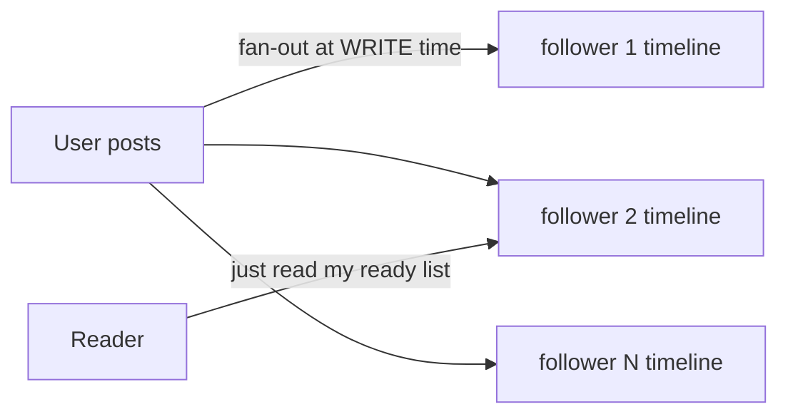
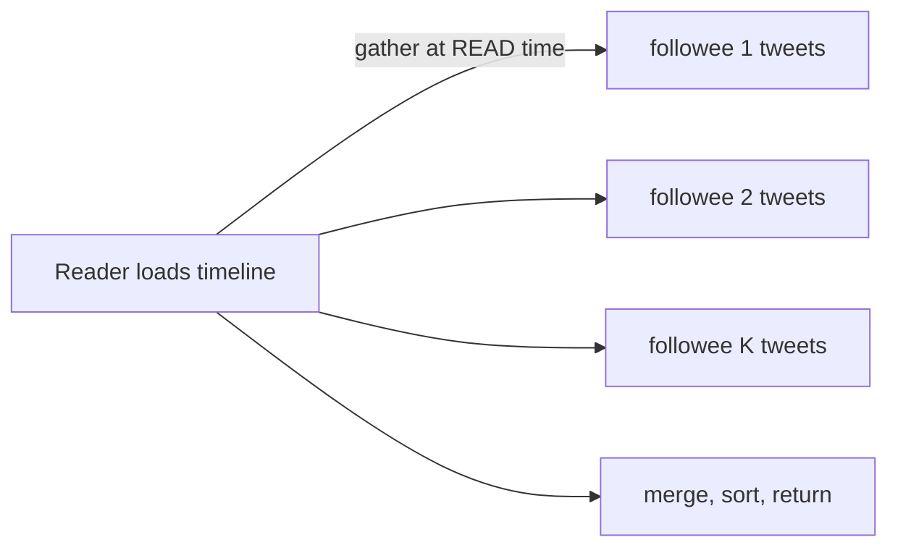

# Design a Twitter News Feed

> The home timeline looks simple — show recent posts from people you follow — but at scale it hides one of the most famous tradeoffs in system design: fan-out on write versus fan-out on read.

**Type:** Capstone
**Languages:** Markdown
**Prerequisites:** Phases 0–7
**Time:** ~60 minutes

## Learning Objectives

- Apply the design framework to a social news feed
- Compare fan-out-on-write vs fan-out-on-read
- Resolve the celebrity / hot-key problem with a hybrid approach
- Design the feed read path with caching and precomputation
- Reason about consistency and freshness for a feed

## The Problem

A social feed shows a user the recent posts of everyone they follow, newest first. Generating it sounds like one query — "posts WHERE author IN (my follows) ORDER BY time" — and at small scale it is. At Twitter/X scale (hundreds of millions of users, some followed by 100M+ others, billions of posts), that query is impossible to run per page-load. The feed is *extremely* read-heavy (people scroll constantly) and the follow graph is wildly skewed (most users have few followers; a few have hundreds of millions). How you generate the timeline — and especially how you handle those celebrities — is the entire design.

## The Concept — applying the framework

### Step 1 — Requirements

**Functional:** post a tweet; follow/unfollow users; view a home timeline (recent posts from people you follow, reverse-chronological).
**Out of scope:** search, ads, DMs, trending, ranking ML (we'll do reverse-chron, not "relevance").
**Non-functional:** **read-heavy** (timeline views ≫ posts); timeline must load **fast** (p99 < 200ms — scrolling must feel instant); **highly available** (eventual consistency is fine — a tweet appearing a few seconds late is acceptable); huge **fan-out skew** (celebrity followers).

### Step 2 — Estimation

```
~300M daily active users, each loads the timeline ~10x/day
  -> ~3B timeline reads/day -> ~35,000 reads/sec average, far higher at peak
Posts: ~400M tweets/day -> ~5,000 writes/sec
Read:write ≈ 100:1 (read-heavy, again)
One celebrity post may need delivery to 100M+ followers (the fan-out bomb)
```

The two headline numbers: reads dominate ~100:1 (cache + precompute), and a single celebrity write can fan out to 100M+ feeds (the core problem).

### Step 3 — API design

```
POST /tweet           {"text": "..."}            -> tweet_id
POST /follow          {"target": user_id}
GET  /timeline?cursor=...                          -> [tweets], next_cursor
```

The timeline read is the hot path; it's paginated with a cursor for infinite scroll.

### Step 4 — Data model

```
tweets:    tweet_id (PK) | author_id | text | created
follows:   follower_id | followee_id            (the social graph)
timeline:  user_id -> [tweet_ids ...]            (precomputed feed cache, per user)
```

`tweets` and `follows` are the source of truth; `timeline` is a **precomputed** per-user list (in Redis) — the thing that makes reads fast. Whether and when you populate `timeline` is the fan-out decision.

### Step 5 — The core decision: fan-out on write vs read

**Fan-out on write (push)** — when a user posts, immediately push the tweet ID into the precomputed timeline of *every follower*. Reading the timeline is then a trivial, instant lookup of a ready-made list.



- ✅ Reads are extremely fast (the feed is precomputed).
- ❌ Writes are expensive and skewed: a celebrity post triggers 100M timeline inserts — a write-amplification bomb that can take minutes and overwhelm the system.

**Fan-out on read (pull)** — store each tweet once; when a user loads their timeline, gather recent tweets from everyone they follow and merge them on the fly.



- ✅ Writes are trivial (store once, no fan-out).
- ❌ Reads are expensive: merging recent tweets from thousands of followees on every page-load is slow — bad for the read-heavy workload.

```
            Write cost          Read cost         Celebrity problem
----------  ------------------  ----------------  ----------------------
Push        high (1 -> N feeds) very low          BAD (100M inserts/post)
Pull        very low            high (merge many) fine on write, slow read
```

### Step 6 — The hybrid (the real answer) and the bottleneck

Pure push dies on celebrities; pure pull is too slow for normal reads. Production systems use a **hybrid**:

- For **normal users** (few followers): **fan-out on write** — push their posts into followers' precomputed timelines. Cheap fan-out, instant reads.
- For **celebrities** (huge follower counts): **do NOT fan out on write** — store their tweets once. When any user loads their timeline, take their precomputed feed (from normal-user pushes) and **merge in** the recent tweets of the few celebrities they follow at read time.

So a user's timeline = (precomputed list from normal followees) ⊕ (pulled recent tweets from their celebrity followees), merged and sorted. This caps the write fan-out (celebrities don't explode) *and* keeps reads fast (only a handful of celebrities to merge, not thousands of followees).

The **bottleneck** is the celebrity fan-out, and the hybrid is the deep-dive resolution. Supporting choices: timelines live in **Redis** (Phase 3) capped to the recent N entries; the feed is **eventually consistent** (Phase 5) — a tweet may take seconds to appear, which is fine; tweets themselves are stored once and **cached/​CDN'd** for the read-heavy load; and the system **shards** tweets and timelines by user (Phase 4).

### A common misconception

Beginners pick one strategy globally — but pure fan-out-on-write is what makes the celebrity problem infamous (one post = 100M writes), and pure fan-out-on-read makes the common case (a normal user's timeline) needlessly slow. The insight is that *the right strategy depends on the follower count*, so you split: push for the many normal users, pull for the few celebrities. The second misconception is demanding strong consistency for a feed — it's a perfect place for eventual consistency; nobody is harmed if a tweet appears two seconds later, and insisting on strong consistency would wreck availability and latency for no benefit.

## Exercises

1. **Trace both paths.** For a user with 200 followees (all normal) and 3 celebrity followees, describe exactly how their timeline is assembled under the hybrid.

2. **The fan-out bomb.** A celebrity with 100M followers posts under pure fan-out-on-write. Estimate the write amplification and why it's untenable; then show how the hybrid avoids it.

3. **Pick the threshold.** Where do you draw the "celebrity" line (follower count) for switching from push to pull? What happens if it's too low? Too high?

4. **Consistency call.** Justify eventual consistency for the feed. Give one part of Twitter where you'd want stronger guarantees and why.

5. **Read path.** Design the timeline read: what's in Redis, what's a cache miss, and how pagination/cursor works for infinite scroll.

## Key Terms

| Term | What people say | What it actually means |
|------|----------------|------------------------|
| Home timeline | "The feed" | A user's reverse-chronological view of posts from those they follow |
| Fan-out on write | "Push" | Pushing a new post into every follower's precomputed timeline at write time |
| Fan-out on read | "Pull" | Gathering and merging followees' posts at read time |
| Hybrid fan-out | "Push + pull" | Push for normal users, pull for celebrities — the production answer |
| Celebrity problem | "Hot key" | A user with massive followers whose fan-out-on-write explodes |
| Write amplification | "1 write -> N writes" | One logical post causing many physical writes (one per follower) |
| Precomputed timeline | "Materialized feed" | A ready-made per-user list (in Redis) making reads instant |
| Eventual consistency | "Appears soon" | The feed may lag a few seconds; acceptable here (Phase 5) |
